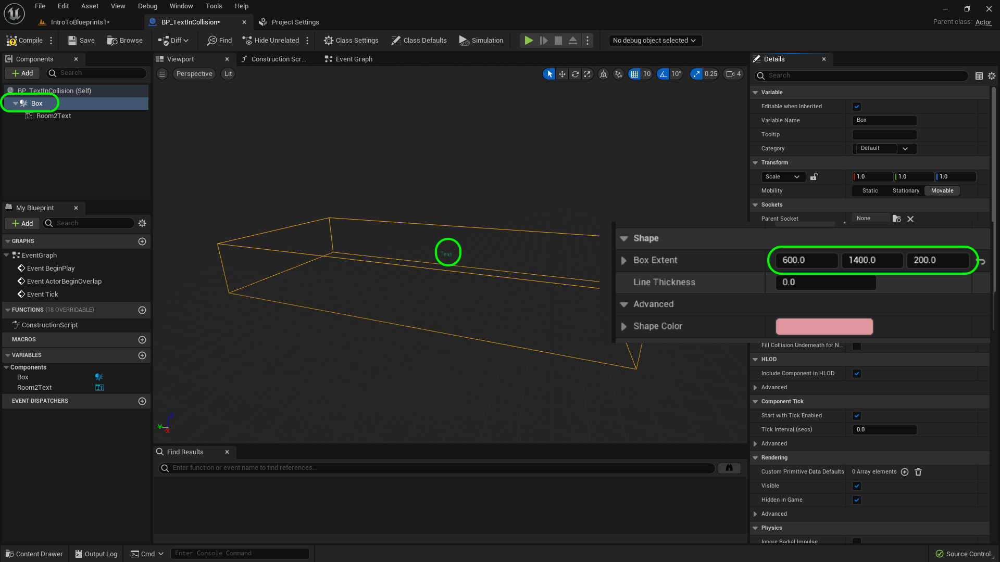
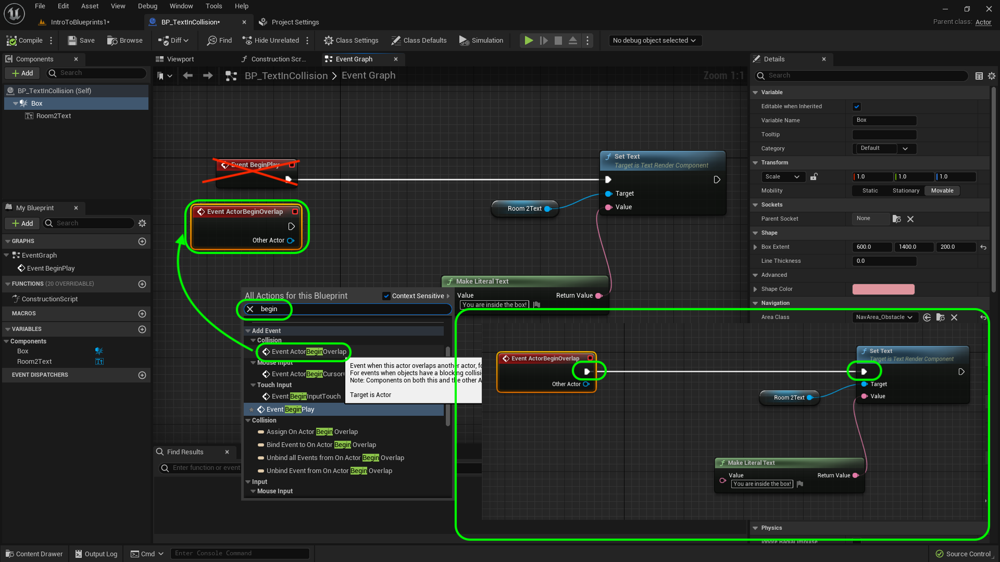
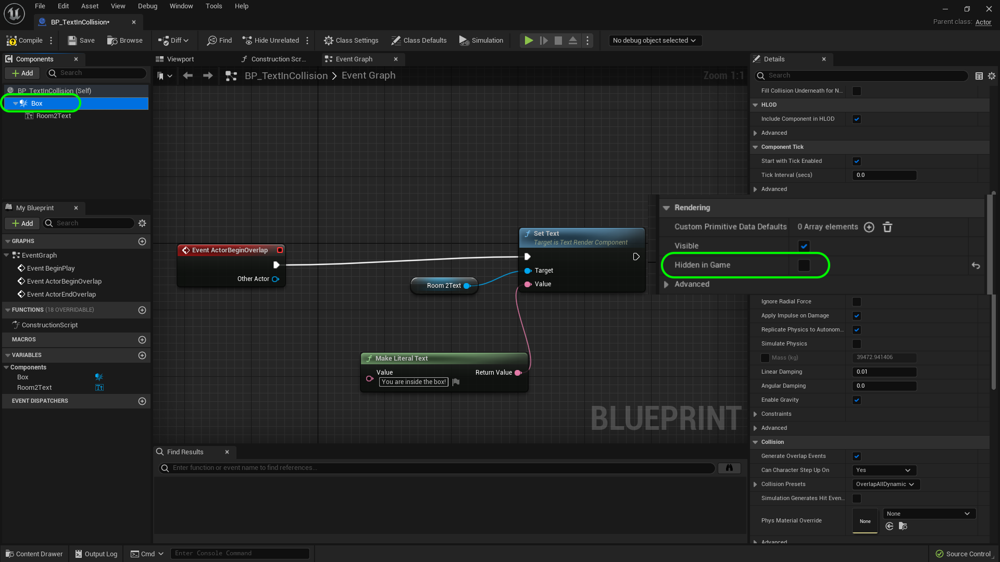
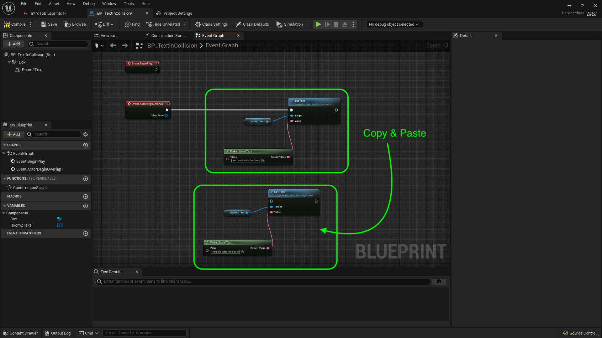
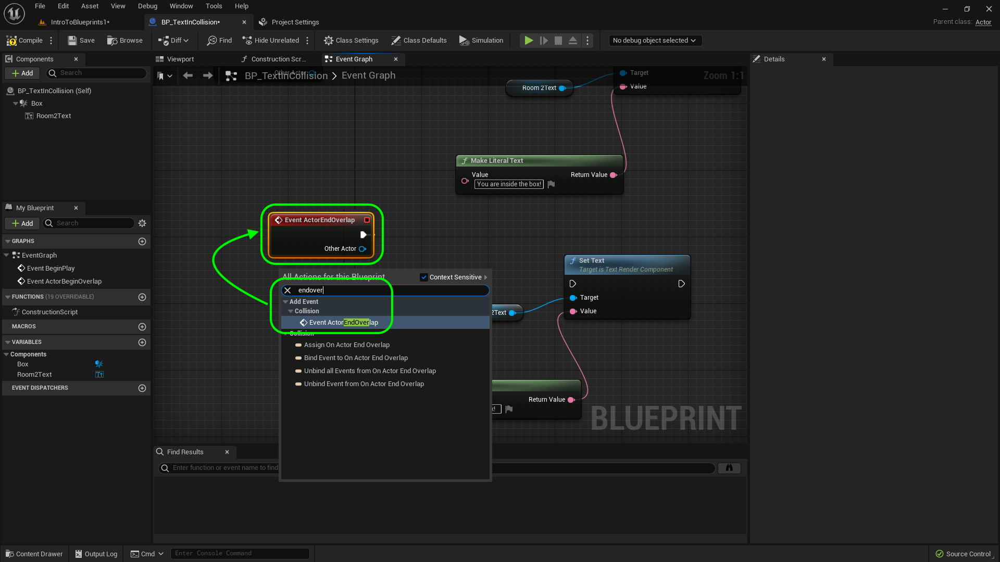
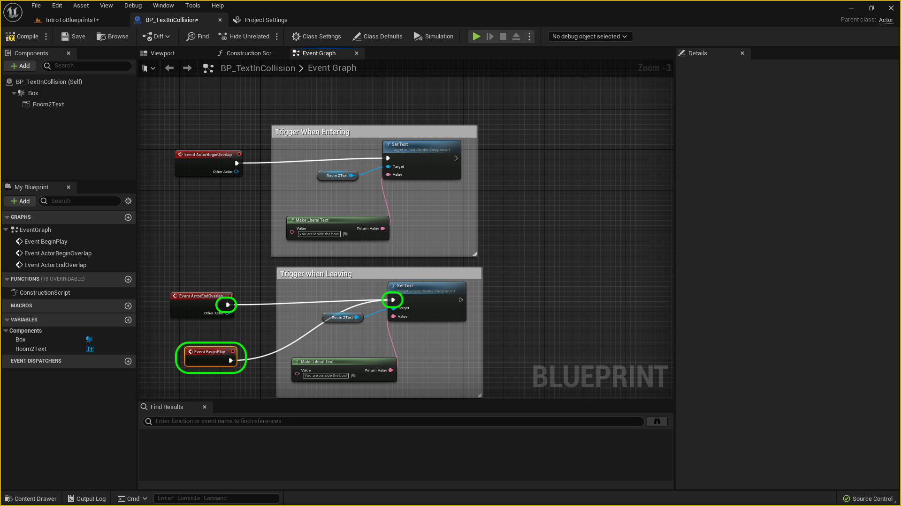
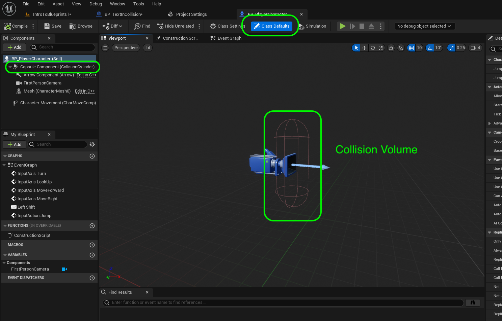
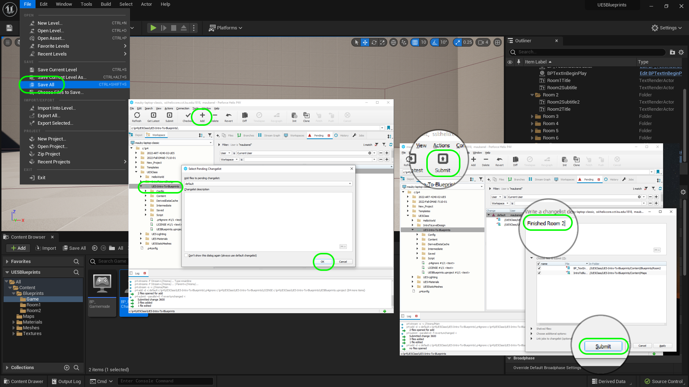

### Collision Events

[previous](../constructor-begin-ii/README.md#user-content-constructor--begin-play-ii) • [home](../README.md#user-content-ue4-blueprints) • [next](../grouping-meshes/README.md#user-content-grouping-meshes)

Now we can have a few types of collisions in **Unreal**. We can have a blocking collision that will stop two volumes from penetrating each other. Imagine a ball hitting a wall. We can also have a trigger collision where you can enter the collision volume and it will trigger a script. This is often when the player enters an invisible volume that they can't see. This is how we can access functionality in a script when a player is in a specific location in the level. This is the first type we will look at:

 

---

##### `Step 1.`\|`ITB`|:small_blue_diamond:

Create a new folder called `Room2` and put it in the **Blueprints** folder. Move the camera over to **Room 2** and press the <kbd>+ Add</kbd> button and select **Blueprint Class**.

##### `Step 2.`\|`FHIU`|:small_blue_diamond: :small_blue_diamond: 

We will be using this blueprint in a level so we will make it the base class of **Actor**.

##### `Step 3.`\|`ITB`|:small_blue_diamond: :small_blue_diamond: :small_blue_diamond:

Call it `BP_TextOnCollision`. *Drag* it into the room. In the **World Outliner** *drag* this newly created game object into the **Room 2** folder.

##### `Step 4.`\|`ITB`|:small_blue_diamond: :small_blue_diamond: :small_blue_diamond: :small_blue_diamond:

Double click the **blueprint**. Press the <kbd>+ Add</kbd> component button and select a **Text Render** component.

##### `Step 5.`\|`ITB`| :small_orange_diamond:

Now press **Add Component** again and this time we want a collision box. We can add multiple components to the same blueprints. If you type `collision` into the menu you will see three shapes: **Box**, **Sphere** and **Cylinder.** We will pick the **Box Collision**.

##### `Step 6.`\|`ITB`| :small_orange_diamond: :small_blue_diamond:

Rename the text component to `TextInRoom2`. Drag and drop this on top of the **DefaultSceneRoot** component. This will make the text box the root (parent) component. Make the **Text Render Color** more visible on a white background and change the **World Size** to `74` and make the text color **Green**.

##### `Step 7.`\|`ITB`| :small_orange_diamond: :small_blue_diamond: :small_blue_diamond:

With the **Box** component selected go to the **Details** panel and change the **Box Extent** to `600` on the **X**, `1400` on the **Y** and `200` on the **Z**. Also make sure the text element is at the rear of the collision box. Press the <kbd>Compile</kbd> button.

##### `Step 8.`\|`ITB`| :small_orange_diamond: :small_blue_diamond: :small_blue_diamond: :small_blue_diamond:

Now go into the game and reposition so the collision box is above the floor and centered in the room.

##### `Step 9.`\|`ITB`| :small_orange_diamond: :small_blue_diamond: :small_blue_diamond: :small_blue_diamond: :small_blue_diamond:

Go back to the **blueprint**. Make sure you are in the **Event Graph** tab. *Drag and drop* the **TextInRoom2** component into the scene graph. Left click the blue pin from this node and let go. This will now make sure that the context sensitive search will be items that are compatible with this reference. Start typing in **Text Render | Set Text** to get the **Set Text** node. COnnect the **Event Begin Play** execution pin to **Set Text**.

##### `Step 10.`\|`ITB`| :large_blue_diamond:

Left click and drag off the **Value** node from **Set Text**. Let go and start typing **Make Literal Text**. Select the **Make Literal Text** node and add the text: `You are inside the box!` to this node. Make sure the **Return Value** pin is connected to the **Value** pin on the **Set Text** node.

##### `Step 11.`\|`ITB`| :large_blue_diamond: :small_blue_diamond: 

Now the messages stays the same regardless as we have it connected to the **Begin Play**.  So it displays the message whether we are in or outside the collision volume.

https://user-images.githubusercontent.com/5504953/192165730-18fe4d05-aad9-480e-a5cf-b3be5580f7e9.mp4

##### `Step 12.`\|`ITB`| :large_blue_diamond: :small_blue_diamond: :small_blue_diamond: 

We want to trigger this change when you enter and leave the collision volume.  Delete the **Event Begin Play** node. Since we added a **Collision** component the event graph we can right click on the open graph and choose a **Event Actor Begin Overlap**. This will trigger only one time when two objects overlap. In our case it will be the player's collision volume with this blueprint. It will only trigger a second time if the object leaves the collision volume then re-enters. Connect the execution pin from the **EventActorBeginOverlap** greyed out node to the **Set Text** node you just created.

##### `Step 13.`\|`ITB`| :large_blue_diamond: :small_blue_diamond: :small_blue_diamond:  :small_blue_diamond: 

Go back to the blueprintand select the **Box** component and make sure the **Hidden In Game** box is `deselected`. Normally in a game we would hide our collision volumes, but for debug purposes lets set it so that we can see it for testing our work.

##### `Step 14.`\|`ITB`| :large_blue_diamond: :small_blue_diamond: :small_blue_diamond: :small_blue_diamond:  :small_blue_diamond: 

Run the game and move towards where the box is. You should see the text appear. It doesn't dissapear when you leave the box. Lets make some changes and improve this. Lets change the message when the player leaves the box.

https://user-images.githubusercontent.com/5504953/192166015-35f5768d-96de-44b1-9c8a-031744ac7ef3.mp4

##### `Step 15.`\|`ITB`| :large_blue_diamond: :small_orange_diamond: 

*Copy and paste* the three nodes in the blueprint at the bottom.

##### `Step 16.`\|`ITB`| :large_blue_diamond: :small_orange_diamond:   :small_blue_diamond: 

Right click on a blank section of the scene graph. Type in and select **EventActorEndOverlap** node. This will only run once when a collision volume exits this blueprint collision volume. In this case it will be the players collision.

##### `Step 17.`\|`ITB`| :large_blue_diamond: :small_orange_diamond: :small_blue_diamond: :small_blue_diamond:

Connect the execution pins from the **End Overlap** to the **Set Text**. Also change the **Value** to say `You are outside the box!`. Add back the **Envent Begin Play** and attach it to the second set of text as you do start outside the box. Clean up the node chart and select both groups of nodes and press the <kbd>C</kbd> button to add comment boxes. Press the <kbd>Compile<kbd> button.

##### `Step 18.`\|`ITB`| :large_blue_diamond: :small_orange_diamond: :small_blue_diamond: :small_blue_diamond: :small_blue_diamond:

Run the game and move inside and outside the collision volume and look at your blueprints being triggered when entering and leaving the box.

https://user-images.githubusercontent.com/5504953/192166564-7a6886dc-d010-4851-9ef4-d53976d42ee1.mp4
  

##### `Step 19.`\|`ITB`| :large_blue_diamond: :small_orange_diamond: :small_blue_diamond: :small_blue_diamond: :small_blue_diamond: :small_blue_diamond:

Lets look at the player blueprint quickly. Go to the **Blueprints** folder and double click **BP_PlayerCharacter**. Look at the components. It root component is a Capsule Collision component. This acts the same as the box component but is the shape of a capsule (a pill on its end). This is roughly the shape of a bipedal upright human. It also has a FirstPersonCamera where the head would be. Notice the collision volume goes above the player's virtual head. This is a first person controller so the Mesh is empty. It is just a collision volume with a camera that moves around. When this capsule overlaps the box collider in the blueprint it triggers the overlap events.

##### `Step 20.`\|`ITB`| :large_blue_diamond: :large_blue_diamond:

Select the **File | Save All** then quit UE5.   Go to **P4V** and go the top project folder (the one that holds the `.uproject` file and **Content** folder) and press the <kbd>+Add</kbd> then <kbd>OK</kbd> button.  This makes sure any files that Unreal didn't add get added to source control. Press the <kbd>Submit</kbd> button and enter a message explaining the work done.  Press <kbd>Submit</kbd>.

<!--  -->

| [previous](../constructor-begin-ii/README.md#user-content-constructor--begin-play-ii)| [home](../README.md#user-content-ue4-blueprints) | [next](../grouping-meshes/README.md#user-content-grouping-meshes)|
|---|---|---|
