### Components

[previous](../private-variables/README.md#user-content-private-variables) • [home](../README.md#user-content-ue4-blueprints) • [next](../tick-event/README.md#user-content-tick-event)

Up until this point we have hard coded [Components](https://docs.unrealengine.com/4.26/en-US/ProgrammingAndScripting/ProgrammingWithCPP/UnrealArchitecture/Actors/Components/) into our blueprint object classes. What if we want to dynamically spawn a component in code maybe even gameplay? In this exercise we will spawn a component dynamically and use a trick to force a recompile so that it takes effect through the constructor.

> Components are a special type of Object that Actors can attach to themselves as sub-objects. Components are useful for sharing common behaviors, such as the ability to display a visual representation, play sounds. They can also represent project-specific concepts, such as the way a vehicle interprets input and changes its own velocity and orientation. For example, a project with user-controllable cars, aircraft, and boats could implement the differences in vehicle control and movement by changing which Component a vehicle Actor uses. - UE4 Manual

 

---

##### `Step 1.`\|`ITB`|:small_blue_diamond:

Go to the **Blueprints** folder and add a `Room6` folder. Press the <kbd>Add New</kbd> button. Select **Blueprint Class**:

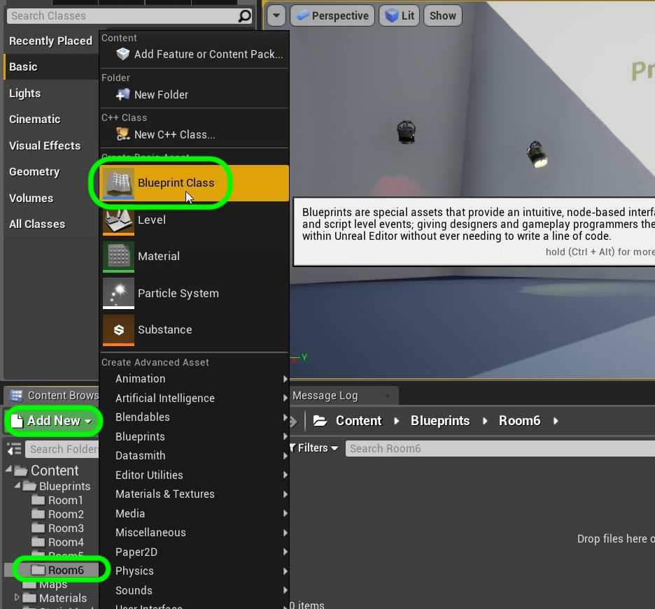

##### `Step 2.`\|`FHIU`|:small_blue_diamond: :small_blue_diamond: 

Since this is going into the level select the base **Actor** as the inherited blueprint class:

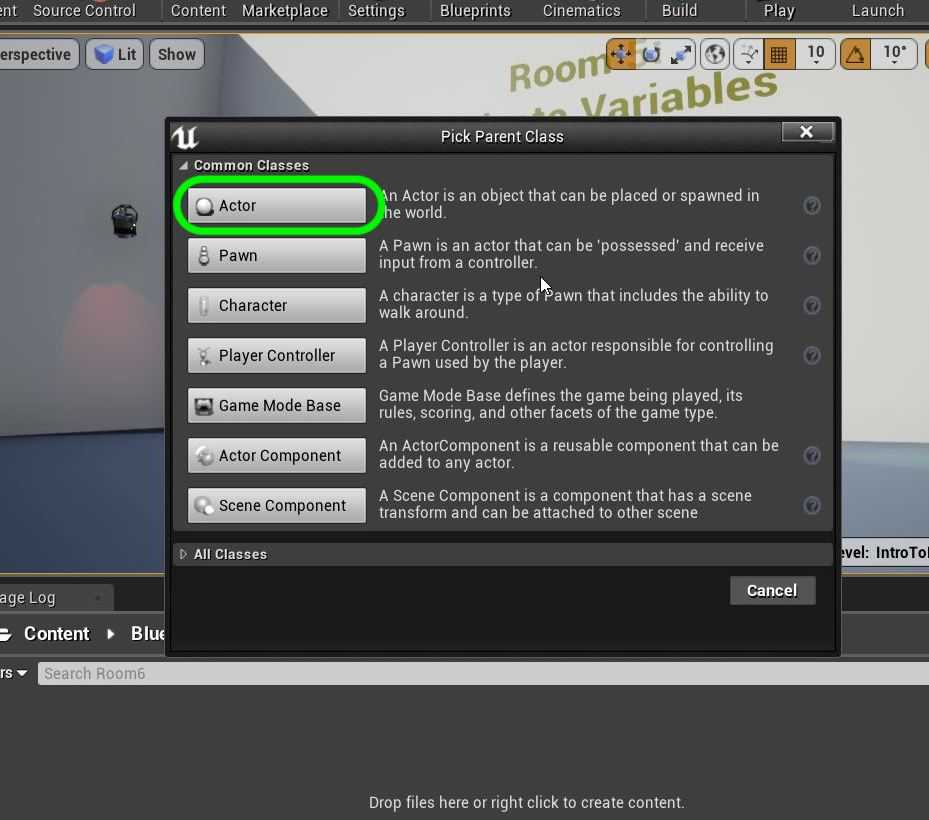

##### `Step 3.`\|`ITB`|:small_blue_diamond: :small_blue_diamond: :small_blue_diamond:

Name the new blueprint `BP_DynamicComponent`.

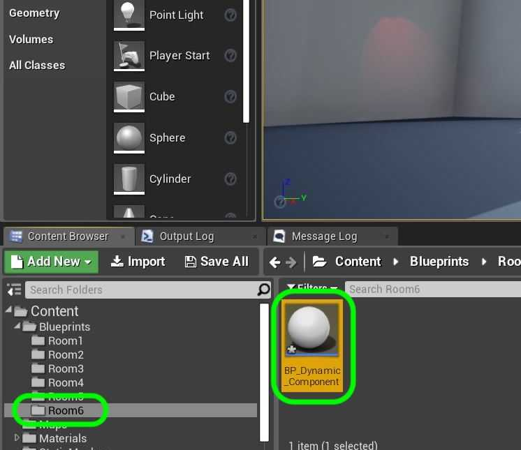

##### `Step 4.`\|`ITB`|:small_blue_diamond: :small_blue_diamond: :small_blue_diamond: :small_blue_diamond:

Open the new blueprint and press the **Add Component** button. Select **Static Mesh**.

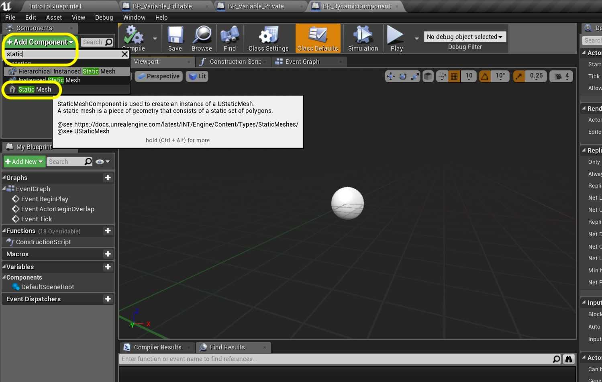

##### `Step 5.`\|`ITB`| :small_orange_diamond:

Rename the component to `Sphere` and drag and drop it on top of **DefaultSceneRoot** to make this the root component:

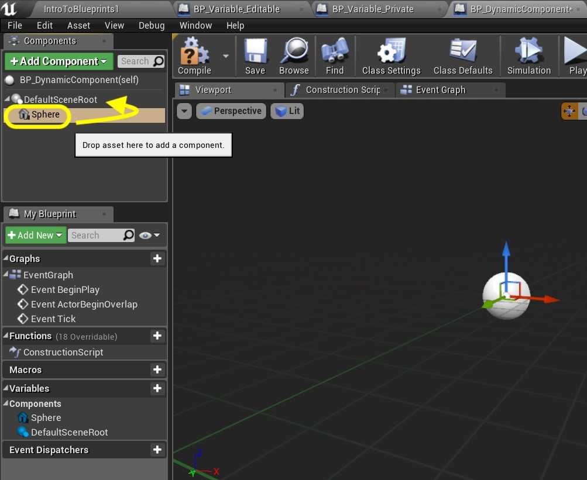

##### `Step 6.`\|`ITB`| :small_orange_diamond: :small_blue_diamond:

Now click on the **Static Mesh** in the **Details Panel** and we want to find the default sphere that we can get from the brush menu in game. It doesn't show up though. We need to click on the **View Options** eyeball at the bottom:

##### `Step 7.`\|`ITB`| :small_orange_diamond: :small_blue_diamond: :small_blue_diamond:

Click on Show **Engine Content** as this is hidden by default:

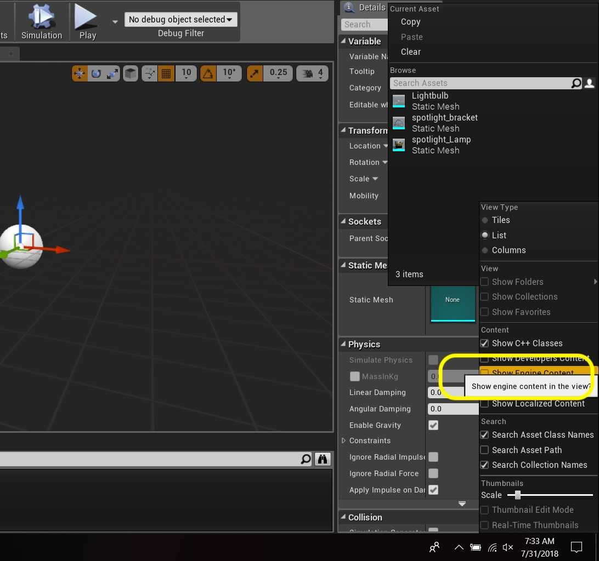

##### `Step 8.`\|`ITB`| :small_orange_diamond: :small_blue_diamond: :small_blue_diamond: :small_blue_diamond:

*Type* in **Sphere** and *select* the static mesh that *just* says **Sphere**.

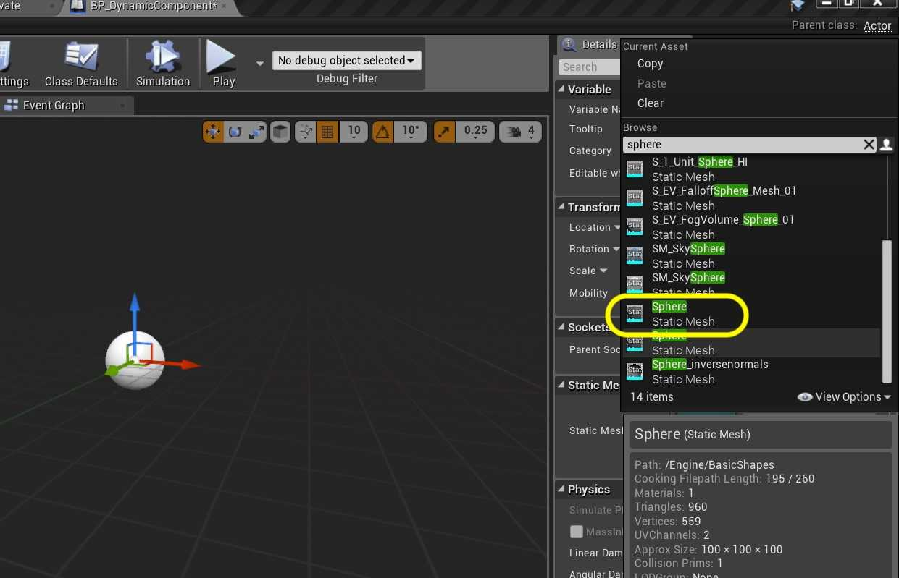

##### `Step 9.`\|`ITB`| :small_orange_diamond: :small_blue_diamond: :small_blue_diamond: :small_blue_diamond: :small_blue_diamond:

Go to *select* a **Material** in the details panel. *Select* it and you will see a lot of engine materials. Press the **View** eyeball and turn **Show Engine Content** `off`:

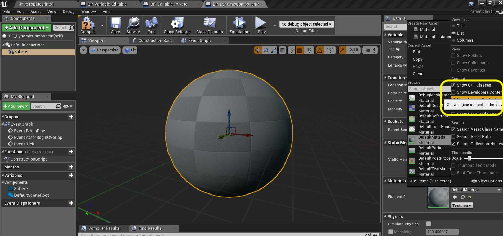

##### `Step 10.`\|`ITB`| :large_blue_diamond:

*Select* the **M_Metal_Burnished_Steel** material. Now we do not see this material updating. There must be something wrong with it.

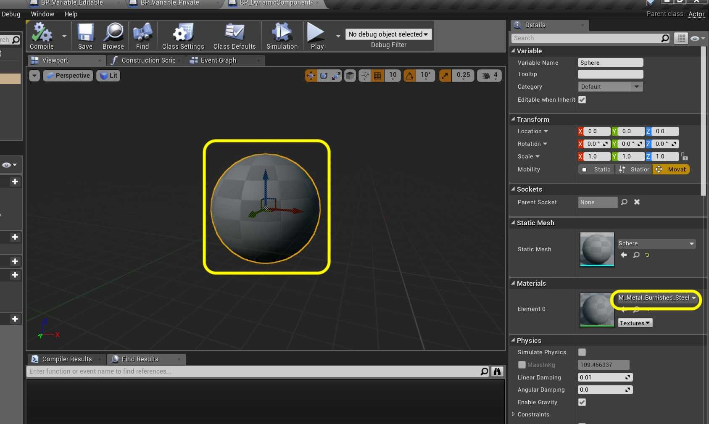

##### `Step 11.`\|`ITB`| :large_blue_diamond: :small_blue_diamond: 

Go to the **Materials** folder and double click on **M_Metal_Burnished_Steel**. Go to the Macro Varation textures. Notice there is a red error. Go to assign in the **Details** panel the texture and again turn on the **Show Engine Content**.

##### `Step 12.`\|`ITB`| :large_blue_diamond: :small_blue_diamond: :small_blue_diamond: 

Now you will be able to find the texture **T_Default_MacroVariation**.

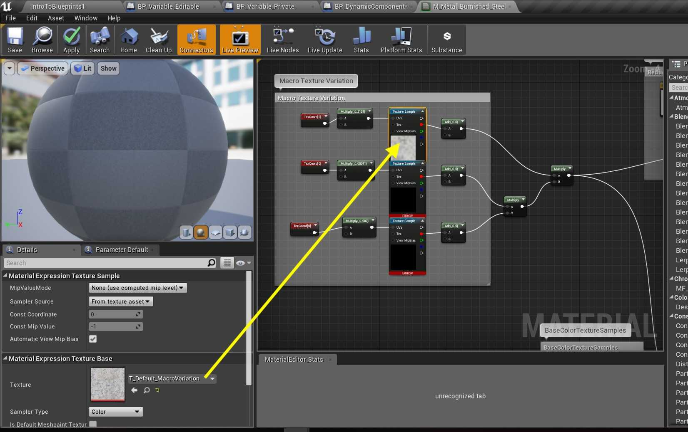

##### `Step 13.`\|`ITB`| :large_blue_diamond: :small_blue_diamond: :small_blue_diamond:  :small_blue_diamond: 

*Assign* the same material to the other two **Macro** textures:

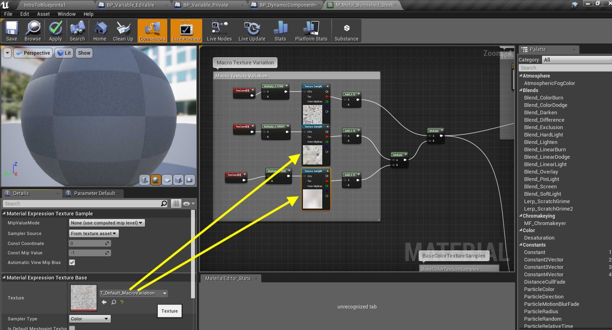

##### `Step 14.`\|`ITB`| :large_blue_diamond: :small_blue_diamond: :small_blue_diamond: :small_blue_diamond:  :small_blue_diamond: 

*Press* the <kbd>Apply</kbd> button. Oh, we are still getting errors. Go to the **Base Color Texture Sample** and *assign* `T_Metal_Aluminim_D` texture.

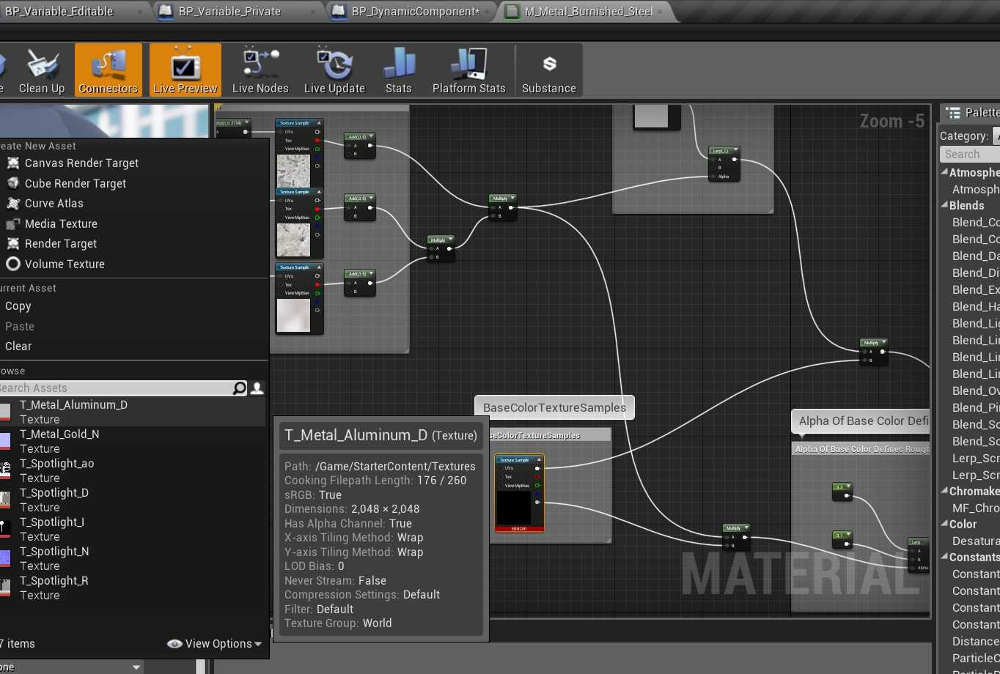

##### `Step 15.`\|`ITB`| :large_blue_diamond: :small_orange_diamond: 

*Press* <kbd>Apply</kbd> again. Still more errors. Go to the **Normal** texture and assign `T_Metal_Gold_N`.

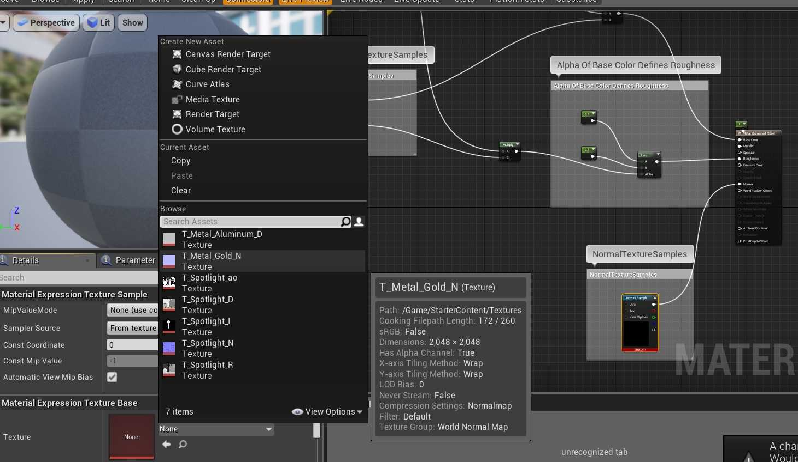

##### `Step 16.`\|`ITB`| :large_blue_diamond: :small_orange_diamond:   :small_blue_diamond: 

*Press* the <kbd>Apply</kbd> button. Now it compiles and voila, the material appears as we want it!

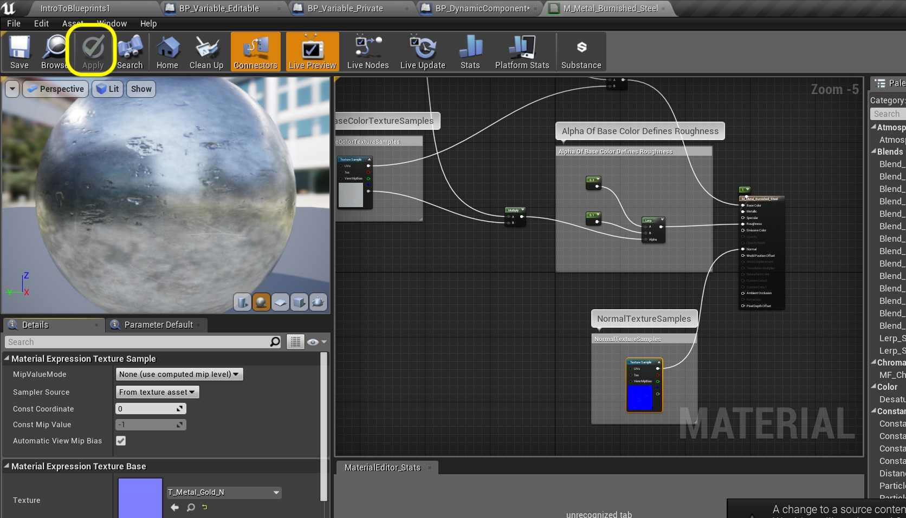

##### `Step 17.`\|`ITB`| :large_blue_diamond: :small_orange_diamond: :small_blue_diamond: :small_blue_diamond:

Go back to the blueprint and now you should see the mesh with a proper material:

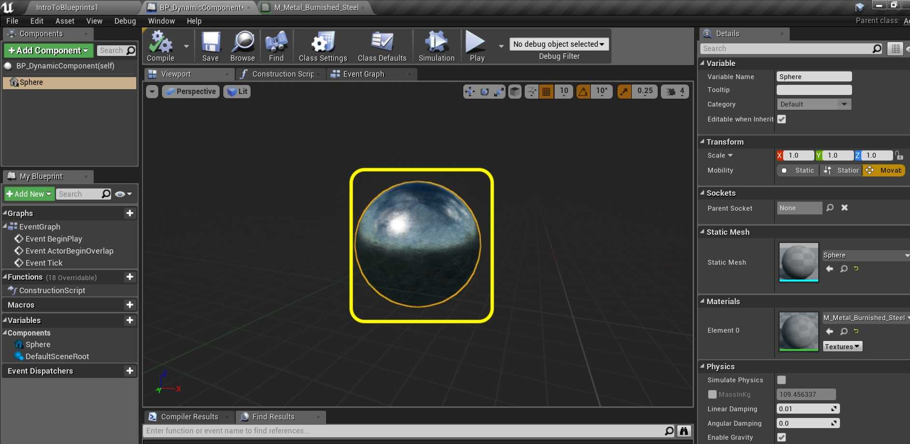

##### `Step 18.`\|`ITB`| :large_blue_diamond: :small_orange_diamond: :small_blue_diamond: :small_blue_diamond: :small_blue_diamond:

We will now be going to the **Construction Script** tab. We want to *add* a variable by pressing the **+** button next to **Variable** in the **MyBlueprint** panel. We want to keep it as the default variable type **boolean**. This type of variable has two values, true or false. It shows up in unreal as a check box (checked is true and unchecked is false). Call this variable `bAdd Light Component`. Make sure it's Type is `Boolean`. *Set* the **Instance Editable** to `true`. *Add* a **Tooltip** `If true, a light is turned on above the sphere`. Make sure **Private** is set to `true`.

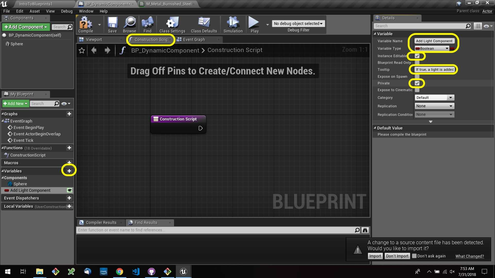

##### `Step 19.`\|`ITB`| :large_blue_diamond: :small_orange_diamond: :small_blue_diamond: :small_blue_diamond: :small_blue_diamond: :small_blue_diamond:

Now drag the variable from the **MyBlueprint** tab into the scene graph. It gives us the option to write (set) to the variable or read (get) it. We want to read it so we will be selecting **Get Add Light Component**.

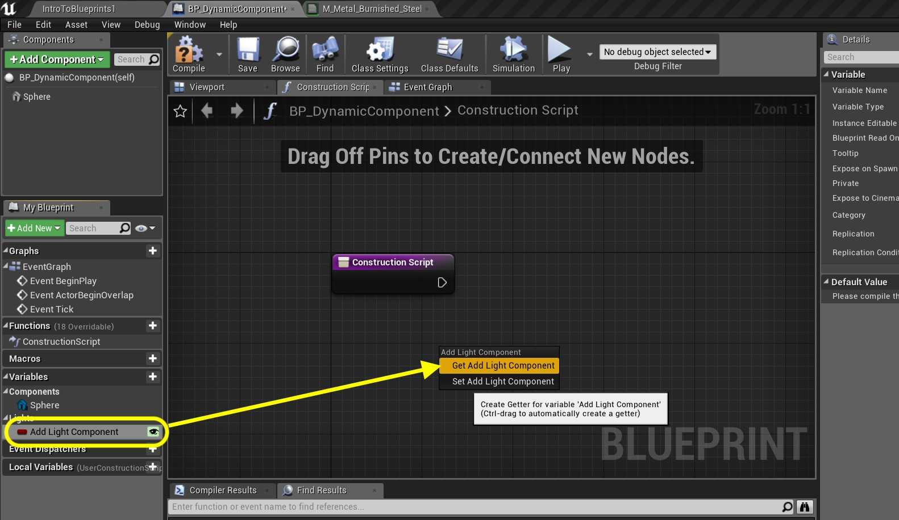

##### `Step 20.`\|`ITB`| :large_blue_diamond: :large_blue_diamond:

Drag off of the boolean's pin and type **Branch**.

##### `Step 21.`\|`ITB`| :large_blue_diamond: :large_blue_diamond: :small_blue_diamond:

This is the equivalent of an if() and else() statement in most programming languages. If the condition is **true** ( if() ) then the **True** execution pin runs. If the condition is **false** ( else() ) then the **False** execution pin runs. *Drag off* of the **true** pin and we will add a light component.

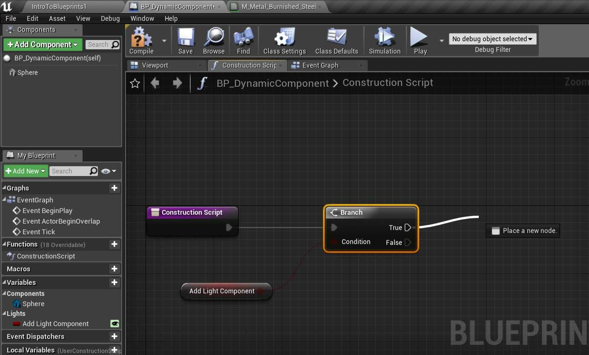

##### `Step 22.`\|`ITB`| :large_blue_diamond: :large_blue_diamond: :small_blue_diamond: :small_blue_diamond:

So start typing `Point Light` and *select* the **Add Point Light Component**.

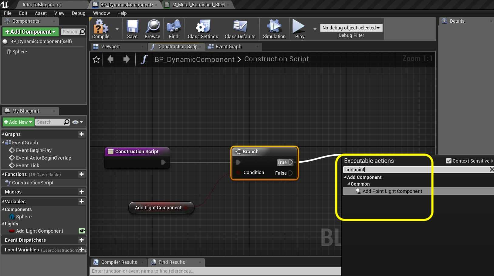

##### `Step 23.`\|`ITB`| :large_blue_diamond: :large_blue_diamond: :small_blue_diamond: :small_blue_diamond: :small_blue_diamond:

Now look at the input pins. It asks for relative transform. Relative is in relation to this actor and is in local space. World position would be where in the level that actor is located. So we are looking at it as relative position to the Sphere mesh root component. *Right click* on **Relative Transform** and select **Split Struct Pin**. Remember a **Transform** consists of a **Location**, **Rotation** and **Scale** (3 x Vector 3 which each contain 3 floating point values).

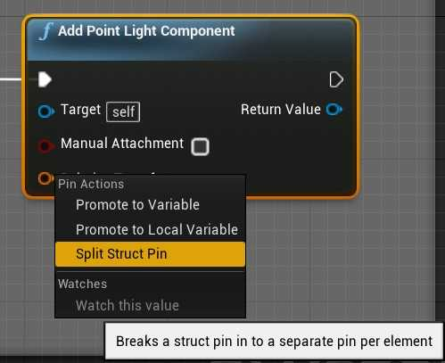

##### `Step 24.`\|`ITB`| :large_blue_diamond: :large_blue_diamond: :small_blue_diamond: :small_blue_diamond: :small_blue_diamond: :small_blue_diamond:

Lets have it light the top of the ball so move it by `100` on the **Z** in **Location**.

##### `Step 25.`\|`ITB`| :large_blue_diamond: :large_blue_diamond: :small_orange_diamond:

*Add* two comments. Select the **Branch** and the comment `Every time a change is made this is run`. *Select* the light component and add the comment: `Adds point light to the same location and rotation and scale as the sphere`.

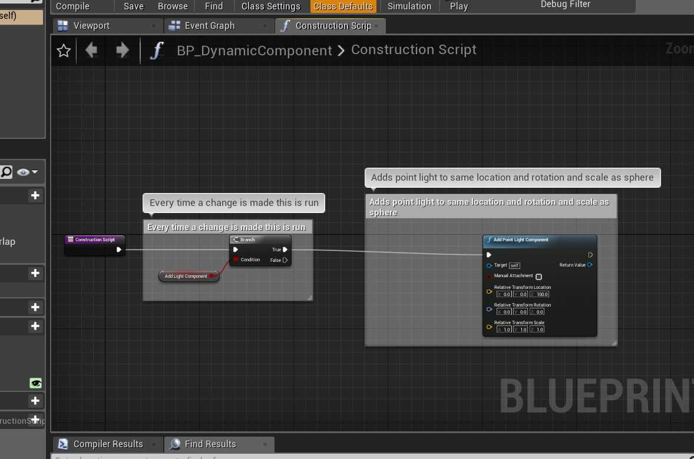

##### `Step 26.`\|`ITB`| :large_blue_diamond: :large_blue_diamond: :small_orange_diamond: :small_blue_diamond:

Now go to the game. Add this blueprint to **Room6**. You can switch the boolean on and off and see the light turn on and off. Now if you play the game you can no longer switch the light. The constructor DOES NOT run during gameplay. This is a way to cheat the constructor to run in the editor so that you can add a component, but it will not be changable through this interface in game.

##### `Step 27.`\|`ITB`| :large_blue_diamond: :large_blue_diamond: :small_orange_diamond: :small_blue_diamond: :small_blue_diamond:

That's it for **Room 6**. **Press Save All** and update **Github** by committing and pushing all the changes made. 

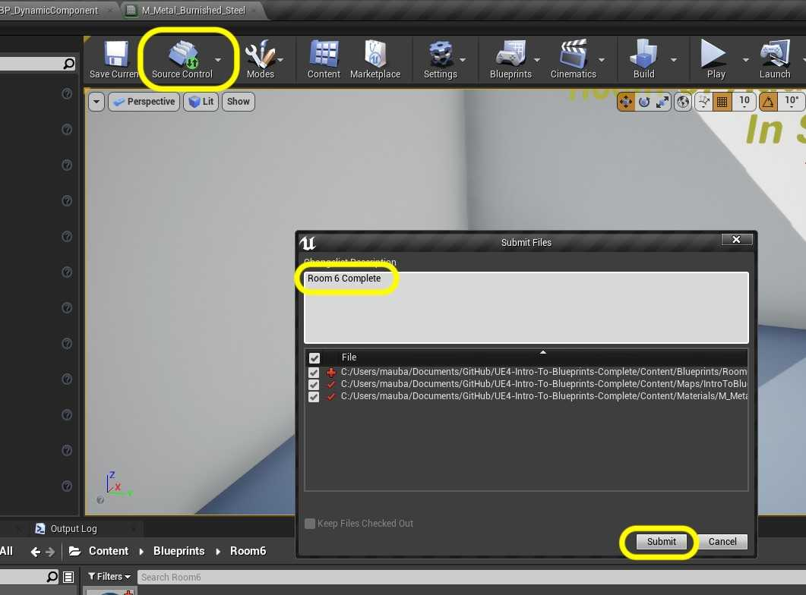

___

| [previous](../private-variables/README.md#user-content-private-variables)| [home](../README.md#user-content-ue4-blueprints) | [next](../tick-event/README.md#user-content-tick-event)|
|---|---|---|
