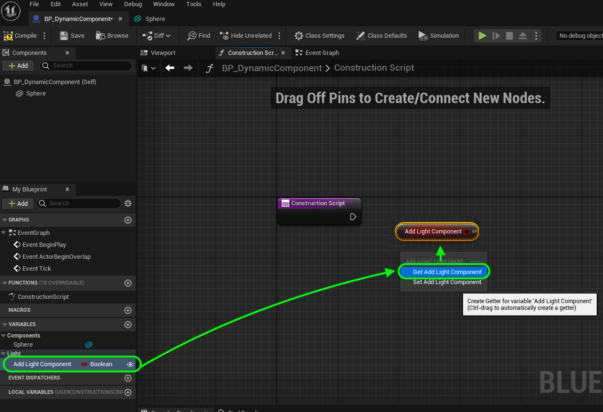

### Components

[previous](../private-variables/README.md#user-content-private-variables) • [home](../README.md#user-content-ue4-blueprints) • [next](../tick-event/README.md#user-content-tick-event)

Up until this point we have hard coded [Components](https://docs.unrealengine.com/4.26/en-US/ProgrammingAndScripting/ProgrammingWithCPP/UnrealArchitecture/Actors/Components/) into our blueprint object classes. What if we want to dynamically spawn a component in code maybe even gameplay? In this exercise we will spawn a component dynamically and use a trick to force a recompile so that it takes effect through the constructor.

> Components are a special type of Object that Actors can attach to themselves as sub-objects. Components are useful for sharing common behaviors, such as the ability to display a visual representation, play sounds. They can also represent project-specific concepts, such as the way a vehicle interprets input and changes its own velocity and orientation. For example, a project with user-controllable cars, aircraft, and boats could implement the differences in vehicle control and movement by changing which Component a vehicle Actor uses. - UE4 Manual

 

---

##### `Step 1.`\|`ITB`|:small_blue_diamond:

Go to the **Blueprints** folder and add a `Room6` folder. Press the <kbd>Add/Import</kbd> button. Select **Blueprint Class**:

##### `Step 2.`\|`FHIU`|:small_blue_diamond: :small_blue_diamond: 

Since this is going into the level select the base **Actor** as the inherited blueprint class:

##### `Step 3.`\|`ITB`|:small_blue_diamond: :small_blue_diamond: :small_blue_diamond:

Name the new blueprint `BP_DynamicComponent`.

##### `Step 4.`\|`ITB`|:small_blue_diamond: :small_blue_diamond: :small_blue_diamond: :small_blue_diamond:

Open the new blueprint and press the **+ Add** component button. Select **Static Mesh**.

##### `Step 5.`\|`ITB`| :small_orange_diamond:

Rename the component to `Sphere` and drag and drop it on top of **DefaultSceneRoot** to make this the root component:

##### `Step 6.`\|`ITB`| :small_orange_diamond: :small_blue_diamond:

Now click on the **Static Mesh** in the **Details Panel** and we want to find the default sphere that we can get from the brush menu in game.  Click on the drop down and select the **Gear** inside the menu and choose **Engine Content**.

##### `Step 7.`\|`ITB`| :small_orange_diamond: :small_blue_diamond: :small_blue_diamond:

*Type* in **Sphere** and *select* the static mesh that *just* says **Sphere**. Look at the path in the editor and select the first one. Now please note we never want to edit this static mesh as it will change it for every other game.  Be careful when using **Engine Content** that you really shoul NOT be altering it in any way.

##### `Step 8.`\|`ITB`| :small_orange_diamond: :small_blue_diamond: :small_blue_diamond: :small_blue_diamond:

Go to *select* a **Material** in the details panel. *Select* it and you will see a lot of engine materials. Press the **View** eyeball and turn **Show Engine Content** `off`:

##### `Step 9.`\|`ITB`| :small_orange_diamond: :small_blue_diamond: :small_blue_diamond: :small_blue_diamond: :small_blue_diamond:

*Select* the **M_Metal_Burnished_Steel** material. The ball should look like it is a steel ball with a burnished finish.

##### `Step 10.`\|`ITB`| :large_blue_diamond:

Go back to the blueprint **BP_Dynamic_Component** and now you should see the mesh with a proper material:

##### `Step 11.`\|`ITB`| :large_blue_diamond: :small_blue_diamond: 

We will now be going to the **Construction Script** tab. We want to *add* a variable by pressing the **+** button next to **Variable** in the **MyBlueprint** panel. We want to keep it as the default variable type **boolean**. Call this variable `Add Light Component`. This type of variable has two values, true or false. It shows up in unreal as a check box (checked is true and unchecked is false). Make sure it's **Type** is `Boolean`. . *Add* a **Tooltip** `If true, a light is added to the scene`. *Set* the **Instance Editable** to `true`. Make sure **Private** is set to `true` as no other object needs to access this variable.

https://user-images.githubusercontent.com/5504953/192565412-ae77a332-5d89-40c0-8151-c32d63729f9b.mp4

##### `Step 12.`\|`ITB`| :large_blue_diamond: :small_blue_diamond: :small_blue_diamond:

Now drag the variable from the **MyBlueprint** tab into the scene graph. It gives us the option to write (set) to the variable or read (get) it. We want to read it so we will be selecting **Get Add Light Component**.

##### `Step 13.`\|`ITB`| :large_blue_diamond: :small_blue_diamond: :small_blue_diamond: :small_blue_diamond:

Drag off of the boolean's pin and type **Branch**.

##### `Step 14.`\|`ITB`| :large_blue_diamond:  :small_blue_diamond: :small_blue_diamond: :small_blue_diamond: 🔹

A branch node is the equivalent of an if() and else() statement in most programming languages. If the condition is **true** ( if() ) then the **True** execution pin runs. If the condition is **false** ( else() ) then the **False** execution pin runs. 

*Drag off* of the **true** pin and we will add a light component.

##### `Step 15.`\|`ITB`| :large_blue_diamond: :small_orange_diamond:

Connect the execution pin from **Construction Script** to **Branch**.

##### `Step 16.`\|`ITB`| :large_blue_diamond: :small_orange_diamond: :small_blue_diamond:

So start typing `Point Light` and *select* the **Add Point Light Component**.

##### `Step 17.`\|`ITB`| :large_blue_diamond: :small_orange_diamond: :small_blue_diamond: :small_blue_diamond:

Now look at the input pins. It asks for relative transform. Relative is in relation to this actor and is in local space. World position would be where in the level that actor is located. So we are looking at it as relative position to the Sphere mesh root component. *Right click* on **Relative Transform** and select **Split Struct Pin**. Remember a **Transform** consists of a **Location**, **Rotation** and **Scale** (3 x Vector 3 which each contain 3 floating point values).

##### `Step 18`\|`ITB`| :large_blue_diamond: :small_orange_diamond: :small_blue_diamond: :small_blue_diamond: :small_blue_diamond:

Lets have it light the top of the ball so move it by `100` on the **Z** in **Location**.

##### `Step 19.`\|`ITB`| :large_blue_diamond: :small_orange_diamond: :small_blue_diamond: :small_blue_diamond: :small_blue_diamond: :small_blue_diamond:
 
*Add* two comments by group selecting the nodes then pressing the <kbd>C</kbd> key. Select the **Branch** and the comment `Every time a change is made this is run`. *Select* the light component and add the comment: `Adds point light to the same location and rotation and scale as the sphere`.

##### `Step 20.`\|`ITB`| :large_blue_diamond: :large_blue_diamond:

Now go to the game. Add this blueprint to **Room6**. You can switch the boolean on and off and see the light turn on and off. Now if you play the game you can no longer switch the light. The constructor DOES NOT run during gameplay. This is a way to cheat the constructor to run in the editor so that you can add a component, but it will not be changable through this interface in game.

##### `Step 21.`\|`ITB`| :large_blue_diamond: :large_blue_diamond: :small_blue_diamond: :small_blue_diamond:

That's it for **Room 6**. Press **File | Save All** then go into **Source Control | Submit to Source Control**, add a message that you have completed room 1 and press the <kbd>Submit</kbd> button. Open up **GitHub Desktop** and **Push** changes to server. Select this to finish off this section.

<!--  -->

| [previous](../private-variables/README.md#user-content-private-variables)| [home](../README.md#user-content-ue4-blueprints) | [next](../tick-event/README.md#user-content-tick-event)|
|---|---|---|
