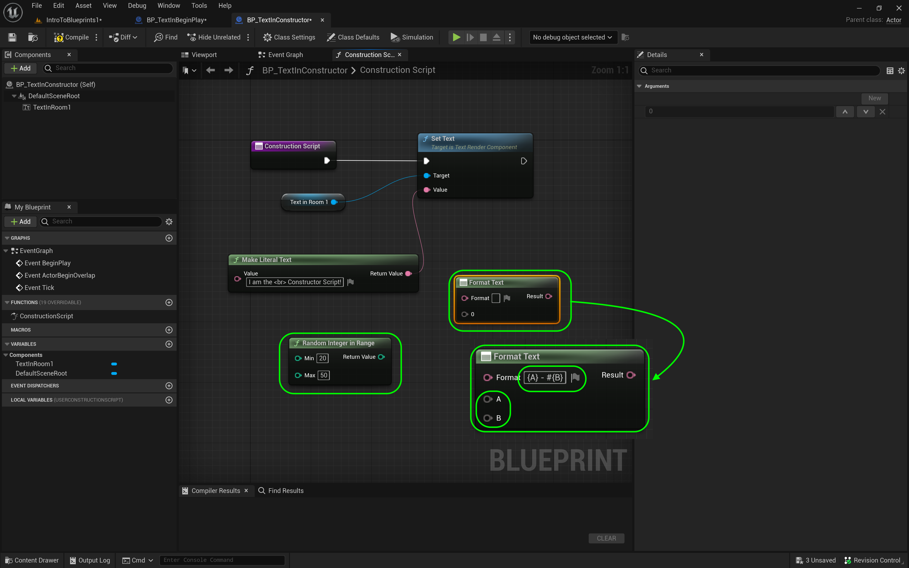
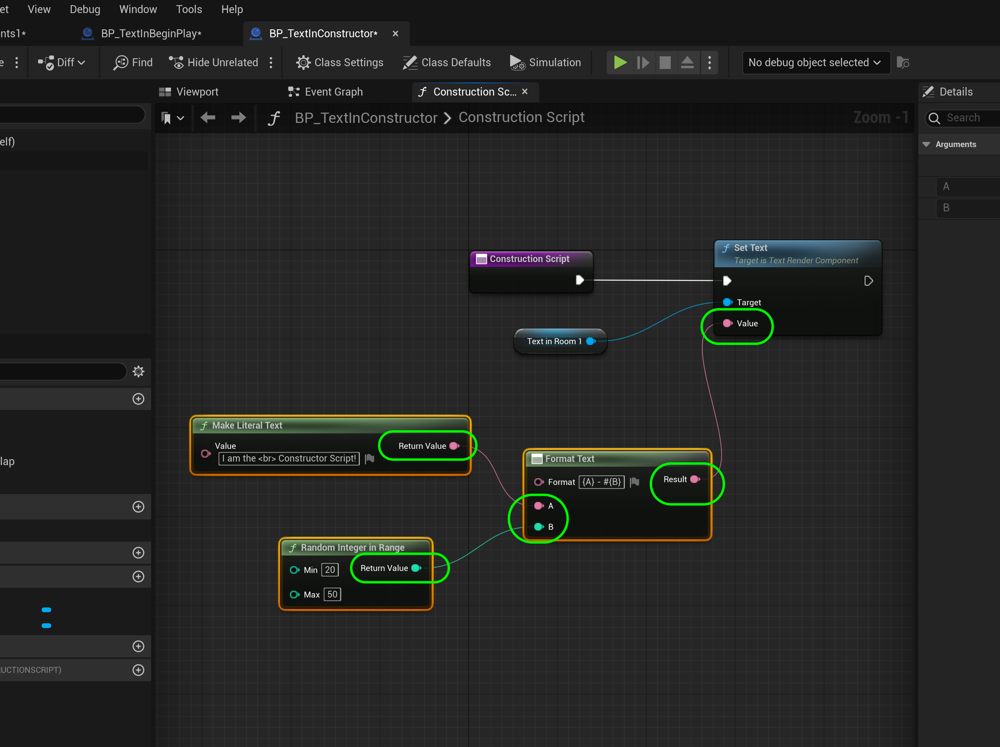
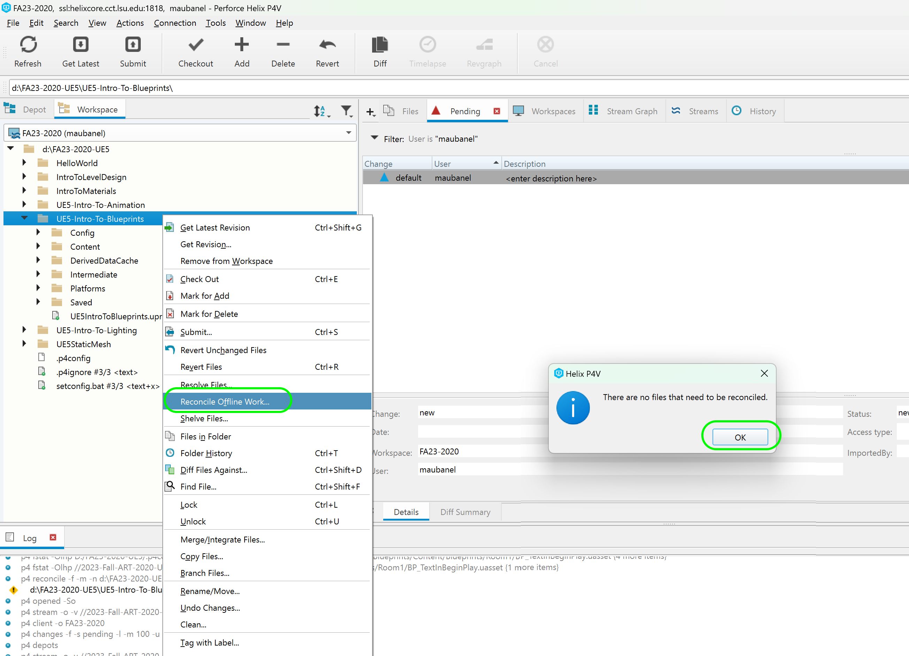

### Constructor & Begin Play II

[previous](../constructor-begin/README.md#user-content-constructor--begin-play) • [home](../README.md#user-content-ue4-blueprints) • [next](../collision/README.md#user-content-collision-events)

The Constructor runs in different scenarios.  The **Begin Play** event **ONLY** runs when you press **Run** in the editor.  It always runs **AFTER** the construction script runs.

---

##### `Step 1.`\|`ITB`|:small_blue_diamond:

Go to the **Blueprints | Room1** folder and right click on **BP_TextOnConstructor** and select **Duplicate**:

##### `Step 2.`\|`FHIU`|:small_blue_diamond: :small_blue_diamond: 

Rename the file to `BP_TextInBeginPlay`.

##### `Step 3.`\|`ITB`|:small_blue_diamond: :small_blue_diamond: :small_blue_diamond:

Drag the new **BP_TextOnBeginPlay** blueprint into the room, next to the other text blueprint.

##### `Step 4.`\|`ITB`|:small_blue_diamond: :small_blue_diamond: :small_blue_diamond: :small_blue_diamond:

Drag and drop the blueprint instances from the **Outliner** into the **Room 1** folder.

##### `Step 5.`\|`ITB`| :small_orange_diamond:

*Open* **BP_TextInBeginPlay**, enter the **Construction Script** tab and *copy* and *delete* all the nodes to the right of the **Construction Script** node.

##### `Step 6.`\|`ITB`| :small_orange_diamond: :small_blue_diamond:

Go into the **Event Graph** tab and click on an open space next to the **Event Begin Play** that is greyed out and press *paste*.

##### `Step 7.`\|`ITB`| :small_orange_diamond: :small_blue_diamond: :small_blue_diamond:

Adjust the position of the nodes to keep then neet. Attach the pin from **Event Begin Play** to the **Set Text** node. Now the **Begin Play** will only fire once when you run the game. So anything you connect to this pin will only run when you press the play button. Change the message to reflect that this will run when the **Begin Play** event is triggered. I put `I am the  BeginPlay Script node!`.  Notice that ** ** is a carriage return (new line) that is the same syntax used in **HTML**.

##### `Step 8.`\|`ITB`| :small_orange_diamond: :small_blue_diamond: :small_blue_diamond: :small_blue_diamond:

Press the <kbd>Compile</kbd> button until you get the green check mark.

##### `Step 9.`\|`ITB`| :small_orange_diamond: :small_blue_diamond: :small_blue_diamond: :small_blue_diamond: :small_blue_diamond:

Go into the game and notice that it now says **Text**. This is the default value of that **Text** node that you could change in the blueprint if you wish.

##### `Step 10.`\|`ITB`| :large_blue_diamond:

Press the <kbd>Play</kbd> button and voila the text changes. When you stop the game, it goes back to its prior state of just having **Text** on the screen. So **Begin Play** only runs when you press play and all its changes reset when you stop the editor. The **Construction** script affects the editor when changes are made and the **Event Graph** only runs when the play button is pressed.  The begin play is the first thing that runs and it only runs **once**.

https://user-images.githubusercontent.com/5504953/192156895-d0db3923-c6f4-4c94-bd30-4962ed210a39.mp4

##### `Step 11.`\|`ITB`| :large_blue_diamond: :small_blue_diamond: 

So **Begin Play** only runs when we run the game and it runs **ONCE**. Now we saw that the **Construction Script** ran when we compiled the blueprint. It also changes when that object changes in the level even before the game is run. Lets do one final demonstration of this.

Go back and open **BP_TextInConstructor** and add a **Random Integer in Range** node. Change the two values that the game will randomly generate to`20` and `50`. Change the **Make Litereal Text | Value** box `I am the  BeginPlay Script node! `. 

Add a **Format Text** node. Then type in the input box `{A} - #{B}`. This will add an **A** and **B** input pin and it will add a `- #` between each value.

##### `Step 12.`\|`ITB`| :large_blue_diamond: :small_blue_diamond: :small_blue_diamond: 

Send the **Make Literal Text | Return Value** to the **Format Text | A** pin.  Send the **Random Integer in Range | Return Value** to the **Format Text | B** pin.  Send the **Format Text | Result** to the **Set Text | Value**.

##### `Step 13.`\|`ITB`| :large_blue_diamond: :small_blue_diamond: :small_blue_diamond:  :small_blue_diamond: 

Now you can change the random number and run that node every time you compile the blueprint or change that blueprint object in the editor. It only runs in these two conditions and will not run during the game. If you hit play that text will always be the same for as long as the game is running. Please note that it will not run at all if you make a build so it should be nothing that is required by the game as this won't run in a baked build of the game.

https://github.com/maubanel/UE5-Blueprints/assets/5504953/03d80d69-f4db-40e6-b479-87433c683ed9

##### `Step 14.`\|`ITB`| :large_blue_diamond: :small_blue_diamond: :small_blue_diamond: :small_blue_diamond:  :small_blue_diamond: 

Select the **File | Save All** then press the <kbd>Revision Control</kbd> button and select **Submit Content**.  If you are prompted, select **Check Out** for all items that are not checked out of source control. Update the **Changelist Description** message and with the latest changes. Make sure all the files are correct and press the <kbd>Submit</kbd> button. A confirmation will pop up on the bottom right with a message about a changelist was submitted with a commit number. Quit Unreal and make sure your **Pending** tab in **P4V** is empty. **Submit** any work that is still in the editor.

##### `Step 15.`\|`ITB`| :large_blue_diamond: :small_orange_diamond: 

Sometimes not all files get submitted to Unreal especially for files that don't show up in the editor.  It is good practice one you submit in **Unreal** and quit the game to right click on the top most project folder and select **Reconcile Offline Work...**.

This will either give a message saying ther is nothing to reconcile or bring up a tab.  Make sure that these are **NOT** files in the **Intermediate** and **Saved** folders as these should be ignored from the `.p4ignore`.

If the files are in **Content** or **Configuration** then press the <kbd>Reconcile</kbd> button.  Then submit the changes with a message and press the <kbd>Submit</kbd> button.

<!--  -->

| [previous](../constructor-begin/README.md#user-content-constructor--begin-play)| [home](../README.md#user-content-ue4-blueprints) | [next](../collision/README.md#user-content-collision-events)|
|---|---|---|
