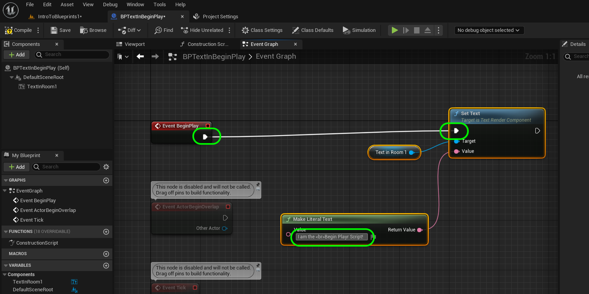

### Constructor & Begin Play II

[previous](../constructor-begin/README.md#user-content-constructor--begin-play) • [home](../README.md#user-content-ue4-blueprints) • [next](../collision/README.md#user-content-collision-events)

The Constructor runs in different scenarios.  The **Begin Play** event **ONLY** runs when you press **Run** in the editor.  It always runs **AFTER** the construction script runs.

 

---

##### `Step 1.`\|`ITB`|:small_blue_diamond:

Go to the **Blueprints | Room1** folder and right click on **BP_TextOnConstructor** and select **Duplicate**:

##### `Step 2.`\|`FHIU`|:small_blue_diamond: :small_blue_diamond: 

Rename the file to `BP_TextInBeginPlay`.

##### `Step 3.`\|`ITB`|:small_blue_diamond: :small_blue_diamond: :small_blue_diamond:

Drag the new **BP_TextOnBeginPlay** blueprint into the room, next to the other text blueprint.

##### `Step 4.`\|`ITB`|:small_blue_diamond: :small_blue_diamond: :small_blue_diamond: :small_blue_diamond:

Drag and drop the blueprint instances from the **Outliner** into the **Room 1** folder.

##### `Step 5.`\|`ITB`| :small_orange_diamond:

*Open* **BP_TextInBeginPlay**, enter the **Construction Script** tab and *copy* and *delete* all the nodes to the right of the **Construction Script** node.

##### `Step 6.`\|`ITB`| :small_orange_diamond: :small_blue_diamond:

Go into the **Event Graph** tab and click on an open space next to the **Event Begin Play** that is greyed out and press *paste*.

##### `Step 7.`\|`ITB`| :small_orange_diamond: :small_blue_diamond: :small_blue_diamond:

Adjust the position of the nodes to keep then neet. Attach the pin from **Event Begin Play** to the **Set Text** node. Now the **Begin Play** will only fire once when you run the game. So anything you connect to this pin will only run when you press the play button. Change the message to reflect that this will run when the **Begin Play** event is triggered. I put `I am the  BeginPlay Script node!`.  Notice that ** ** is a carriage return (new line) that is the same syntax used in **HTML**.

##### `Step 8.`\|`ITB`| :small_orange_diamond: :small_blue_diamond: :small_blue_diamond: :small_blue_diamond:

Press the <kbd>Compile</kbd> button until you get the green check mark.

##### `Step 9.`\|`ITB`| :small_orange_diamond: :small_blue_diamond: :small_blue_diamond: :small_blue_diamond: :small_blue_diamond:

Go into the game and notice that it now says **Text**. This is the default value of that **Text** node that you could change in the blueprint if you wish.

##### `Step 10.`\|`ITB`| :large_blue_diamond:

Press the <kbd>Play</kbd> button and voila the text changes.

When you stop the game, it goes back to its prior state of just having **Text** on the screen.

##### `Step 11.`\|`ITB`| :large_blue_diamond: :small_blue_diamond: 

So **Begin Play** only runs when we run the game and it runs **ONCE**. Now we saw that the **Construction Script** ran when we compiled the blueprint. It also changes when that object changes in the level even before the game is run.

Go to **BP_TextInConstructor** and *delete* the **Make Literal Text**. Replace it with **Make Literal String**. Add to the **Value** box `I am the  BeginPlay Script node!`. Add a **Random Integer in Range** node and add two values that the game will randomly generate. I used `20` and `50`. 

Add a **String | Append** node and connect **Make Literal String** into the **A** of the **Append** node and the **Random Integer In Range | Return Value** to the **B** side of the **Append** node. This adds an integer to string conversion node for you. This will concatonate the two strings together joining the message and the random number. 

Send the output of the **Append** node to the **Value** input pin in **Set Text** (it will add a **ToText(string)** conversion node for you).

##### `Step 12.`\|`ITB`| :large_blue_diamond: :small_blue_diamond: :small_blue_diamond: 

Now you can change the random number and run that node every time you compile the blueprint or change that blueprint object in the editor. It only runs in these two conditions and will not run during the game. If you hit play that text will always be the same for as long as the game is running.

https://user-images.githubusercontent.com/5504953/132024649-72889840-7518-45a7-adb6-55a6aa6d1edf.mp4

##### `Step 13.`\|`ITB`| :large_blue_diamond: :small_blue_diamond: :small_blue_diamond:  :small_blue_diamond: 

Lets connect Unreal with our GitHub repository. Click on **Source Control | Connect to Source Control...** and select the provider **Git (beta version)**. Click on the <kbd>Accept Settings</kbd> button.

##### `Step 14.`\|`ITB`| :large_blue_diamond: :small_blue_diamond: :small_blue_diamond: :small_blue_diamond:  :small_blue_diamond: 

Press **File | Save All** then go into **Source Control | Submit to Source Control**, add a message that you have completed room 1 and press the <kbd>Submit</kbd> button. Open up **GitHub Desktop** and **Push** changes to server. The first time you do this it will say **Publish Branch**.  Select this to finish off this section.

<!--  -->

| [previous](../constructor-begin/README.md#user-content-constructor--begin-play)| [home](../README.md#user-content-ue4-blueprints) | [next](../collision/README.md#user-content-collision-events)|
|---|---|---|
