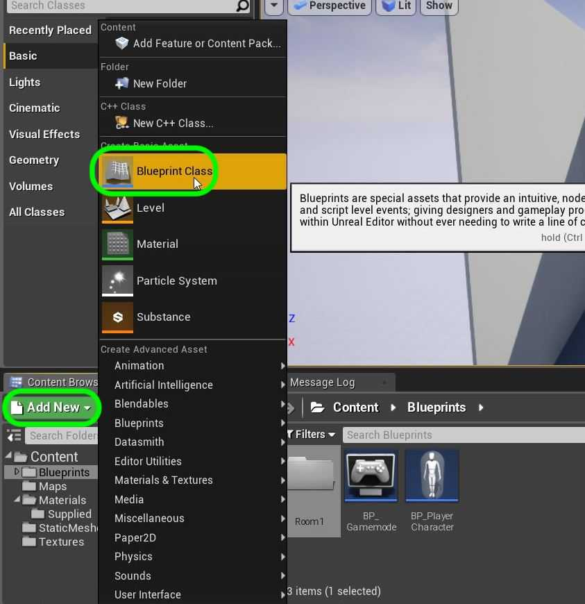
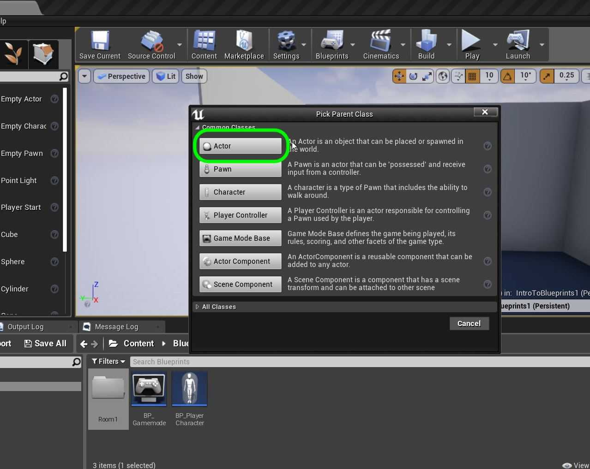
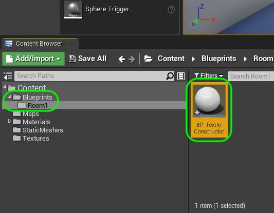

### Constructor & Begin Play

[previous](../setting-up/README.md#user-content-setting-up) • [home](../README.md#user-content-ue4-blueprints) • [next](../constructor-begin-ii/README.md#user-content-constructor--begin-play-ii)

In **UE4** the **Construction Script** is the first thing that a blueprint runs when a class is instantiated. What does this mean? If we have something running inside the level that the game boots up to it will run the code that is in its **Construction Script** as the editor boots up. Also any time an object is changed in the editor the **Construction Script**  runs again..  Remember it only runs once!

 The **Begin Play** runs when the game is run by pressing the Play buttons. It onlye runs once as well! So there are two times we can set things up for a game object, as the level loads, when a level object is altered and when the game runs.

 

---

##### `Step 1.`\|`ITB`|:small_blue_diamond:

In the **Blueprints** folder press the <kdbd>Add New</kbd> button and add a new **Blueprint Class**:

##### `Step 2.`\|`FHIU`|:small_blue_diamond: :small_blue_diamond: 

Pick an Actor as the base class. This is the most basic class that you can use for an object that exists in a level. It provides a bunch of functionality that we will be exploring including the ability to add blueprint logic.

All other classes inherit from the **Actor** class object.  [Inheritance](https://en.wikipedia.org/wiki/Inheritance_(object-oriented_programming)) is an object oriented programming concept.

##### `Step 3.`\|`ITB`|:small_blue_diamond: :small_blue_diamond: :small_blue_diamond:

Call it `BP_TextInConstructor`.

##### `Step 4.`\|`ITB`|:small_blue_diamond: :small_blue_diamond: :small_blue_diamond: :small_blue_diamond:

##### `Step 5.`\|`ITB`| :small_orange_diamond:

##### `Step 6.`\|`ITB`| :small_orange_diamond: :small_blue_diamond:

##### `Step 7.`\|`ITB`| :small_orange_diamond: :small_blue_diamond: :small_blue_diamond:

##### `Step 8.`\|`ITB`| :small_orange_diamond: :small_blue_diamond: :small_blue_diamond: :small_blue_diamond:

##### `Step 9.`\|`ITB`| :small_orange_diamond: :small_blue_diamond: :small_blue_diamond: :small_blue_diamond: :small_blue_diamond:

##### `Step 10.`\|`ITB`| :large_blue_diamond:

##### `Step 11.`\|`ITB`| :large_blue_diamond: :small_blue_diamond: 

##### `Step 12.`\|`ITB`| :large_blue_diamond: :small_blue_diamond: :small_blue_diamond: 

##### `Step 13.`\|`ITB`| :large_blue_diamond: :small_blue_diamond: :small_blue_diamond:  :small_blue_diamond: 

##### `Step 14.`\|`ITB`| :large_blue_diamond: :small_blue_diamond: :small_blue_diamond: :small_blue_diamond:  :small_blue_diamond: 

##### `Step 15.`\|`ITB`| :large_blue_diamond: :small_orange_diamond: 

##### `Step 16.`\|`ITB`| :large_blue_diamond: :small_orange_diamond:   :small_blue_diamond: 

##### `Step 17.`\|`ITB`| :large_blue_diamond: :small_orange_diamond: :small_blue_diamond: :small_blue_diamond:

##### `Step 18.`\|`ITB`| :large_blue_diamond: :small_orange_diamond: :small_blue_diamond: :small_blue_diamond: :small_blue_diamond:

##### `Step 19.`\|`ITB`| :large_blue_diamond: :small_orange_diamond: :small_blue_diamond: :small_blue_diamond: :small_blue_diamond: :small_blue_diamond:

##### `Step 20.`\|`ITB`| :large_blue_diamond: :large_blue_diamond:

##### `Step 21.`\|`ITB`| :large_blue_diamond: :large_blue_diamond: :small_blue_diamond:

___

| [previous](../setting-up/README.md#user-content-setting-up)| [home](../README.md#user-content-ue4-blueprints) | [next](../constructor-begin-ii/README.md#user-content-constructor--begin-play-ii)|
|---|---|---|
