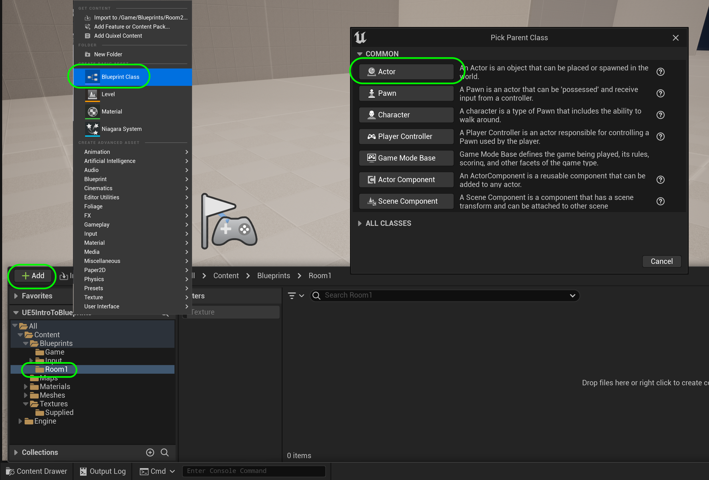

### Constructor & Begin Play

[previous](../setting-up/README.md#user-content-setting-up) • [home](../README.md#user-content-ue4-blueprints) • [next](../constructor-begin-ii/README.md#user-content-constructor--begin-play-ii)

In **UE5** the **[Construction Script](https://docs.unrealengine.com/5.0/en-US/construction-script-in-unreal-engine/)** is the first thing that a blueprint runs when a class is instantiated. What does this mean? If we have something running inside the level that the game boots up to it will run the code that is in its **Construction Script** as the editor boots up. Also any time an object is changed in the editor the **Construction Script**  runs again..  Remember it only runs once!

 The **Begin Play** runs when the game is run by pressing the Play buttons. It only runs once as well! So there are two times we can set things up for a game object, as the level loads, when a level object is altered and when the game runs.

 

---

##### `Step 1.`\|`ITB`|:small_blue_diamond:

In the **Blueprints | Room1** folder press the <kbd>+ Add</kbd> button and add a new **Blueprint Class**:

##### `Step 2.`\|`FHIU`|:small_blue_diamond: :small_blue_diamond: 

Pick an Actor as the base class. This is the most basic class that you can use for an object that exists in a level. It provides a bunch of functionality that we will be exploring including the ability to add blueprint logic.

All other classes inherit from the **Actor** class object.  [Inheritance](https://en.wikipedia.org/wiki/Inheritance_(object-oriented_programming)) is an object oriented programming concept.

##### `Step 3.`\|`ITB`|:small_blue_diamond: :small_blue_diamond: :small_blue_diamond:

Call it `BP_TextInConstructor`.

##### `Step 4.`\|`ITB`|:small_blue_diamond: :small_blue_diamond: :small_blue_diamond: :small_blue_diamond:

Double click on the newly created Blueprint.

##### `Step 5.`\|`ITB`| :small_orange_diamond:

Now in actors we can add components to it that add common game functionality to an object.

Now you are going to press the <kbd>+ Add</kbd> Component button (make sure you are in the Viewport tab). Look for **Text Render** (you can start typing it in the search bar). This node will render 2D text for us in the game engine.

##### `Step 6.`\|`ITB`| :small_orange_diamond: :small_blue_diamond:

Rename the component to `TextInRoom1`.

##### `Step 7.`\|`ITB`| :small_orange_diamond: :small_blue_diamond: :small_blue_diamond:

Press the **Construction Script** tab to get access to the constructor. This script runs in the editor **before** the game starts. Every time you update an object, it will run again (a single time). You should see a node with a white **Execution** pin called **Construction Script**

Execution pins determines the order of operations.  In a normal text script it goes from line 1 then subsequently through each block in order from top to bottom.  In **Blueprints** it follows the execution pin. All blueprints contains nodes that just have an execution pin (in this case **Construction Script**).  This is where the execution starts.  It then follows the chain of white connectors to determine the order that each block is run in.  This could go in any direction in the blueprint (so a node can be anywhere, it is the execution pin connector that determines order).

##### `Step 8.`\|`ITB`| :small_orange_diamond: :small_blue_diamond: :small_blue_diamond: :small_blue_diamond:

*Right click* on an empty part of the graph and type `Text Render | SetText(TextInRoom1)` as we want the set text node. Notice that the function also includes the name of the **Text** component we just named (TextInRoom1) so we know we are targeting only this component, which is what we want.

##### `Step 9.`\|`ITB`| :small_orange_diamond: :small_blue_diamond: :small_blue_diamond: :small_blue_diamond: :small_blue_diamond:

Another way of achieving the same means would be to drag the **TextInRoom1** component onto the graph.  Then you would pull off of the pint and select **Components | Set Text**.

##### `Step 10.`\|`ITB`| :large_blue_diamond:

The white arrows in blueprint nodes control the order of execution.  The round colored input and output pins determine the data coming into the node and the data going out of the node.

In this case the data coming in is a pointer to our **Text Render** component. This means that this operation will change this component. Then you *attach* the execution pin from the **Construction Script** node to the **SetText node**. This determines the order that scripts are run in. The first function that runs is **SetText**. Notice that the **Compile** button has a question mark. This construction script will run as soon as you press <kbd>Compile</kbd> if the object is in the room (which it isn't yet). Notice there is a question mark on it (will it compile or will there be errors?).

##### `Step 11.`\|`ITB`| :large_blue_diamond: :small_blue_diamond: 

Now we need to feed this node some text to print. Right click on the open graph and type **Utilities | Text | Make Literal Text** and select it. This is an **[FText](https://docs.unrealengine.com/4.27/en-US/ProgrammingAndScripting/ProgrammingWithCPP/UnrealArchitecture/StringHandling/FText/)** data type that is created by the **UE4** team for this engine. In other languages we might see this as a **[String](https://en.wikipedia.org/wiki/String_(computer_science))** type.

Add a short text message in the **Make Literal Text** node box. I added `I am the  Constructor Script`. Now *feed* the return value of this node to the input pin in the **Value** node. This will feed the TEXT we just created into the **Text Render** component we just added.

` ` is an acceptable carriage return (new line) in the text fields in **E4**.  You might recognize this as it is **HTML** syntax.

##### `Step 12.`\|`ITB`| :large_blue_diamond: :small_blue_diamond: :small_blue_diamond: 

Press the <kbd>Compile</kbd> button. No changes to blueprints will be seen until it is compiled. This changes it from the node graph to usable machine code that the game engine can run. If it has no errors you will see a green check mark.

##### `Step 13.`\|`ITB`| :large_blue_diamond: :small_blue_diamond: :small_blue_diamond:  :small_blue_diamond: 

Now go to the game window and drag and drop this new blueprint **BP_Text_In_Constructor** into the first room. Rotate it so the text faces the front of the room. Notice you can see the text we entered which shows us that the construction script has run.

##### `Step 14.`\|`ITB`| :large_blue_diamond: :small_blue_diamond: :small_blue_diamond: :small_blue_diamond:  :small_blue_diamond: 

The text is a bit small, lets make the font bigger. Go back into the blueprint and select the **Text Render** component you called **TextInRoom1**. Go to the Details panel on the right and look for **World Size**. Change this value to `74`. Change the **Horizontal Alignment** to `Center` to center the text.

##### `Step 15.`\|`ITB`| :large_blue_diamond: :small_orange_diamond: 

Press the <kbd>Compile</kbd> button then go back to the game. You wil notice that the font is now a lot larger:

##### `Step 16.`\|`ITB`| :large_blue_diamond: :small_orange_diamond:   :small_blue_diamond: 

Go back to the blueprint and *change* the **Text Render Color** to contrast with the background. 

##### `Step 17.`\|`ITB`| :large_blue_diamond: :small_orange_diamond: :small_blue_diamond: :small_blue_diamond:

Lets make a change and show when the constructor runs. Go back to the **blueprint** and change the text, I added an `!` at the end of the text. Notice that the compile button has a question mark on it. **Don't press compile**.

##### `Step 18.`\|`ITB`| :large_blue_diamond: :small_orange_diamond: :small_blue_diamond: :small_blue_diamond: :small_blue_diamond:

Go to the game screen and it is not updated, it still has the old spelling.

##### `Step 19.`\|`ITB`| :large_blue_diamond: :small_orange_diamond: :small_blue_diamond: :small_blue_diamond: :small_blue_diamond: :small_blue_diamond:

Go back to the blueprint and press <kbd>Compile</kbd>. You will see that if it compiles without errors you see a green checkmark.

##### `Step 20.`\|`ITB`| :large_blue_diamond: :large_blue_diamond:

Go to the game and you can see that when the compile completed it ran the constructor.  You did not have to press run to see it update.  The editor updated it because that blueprint changed when it compiled which ran the **Constructor** script.

<!--  -->

| [previous](../setting-up/README.md#user-content-setting-up)| [home](../README.md#user-content-ue4-blueprints) | [next](../constructor-begin-ii/README.md#user-content-constructor--begin-play-ii)|
|---|---|---|
