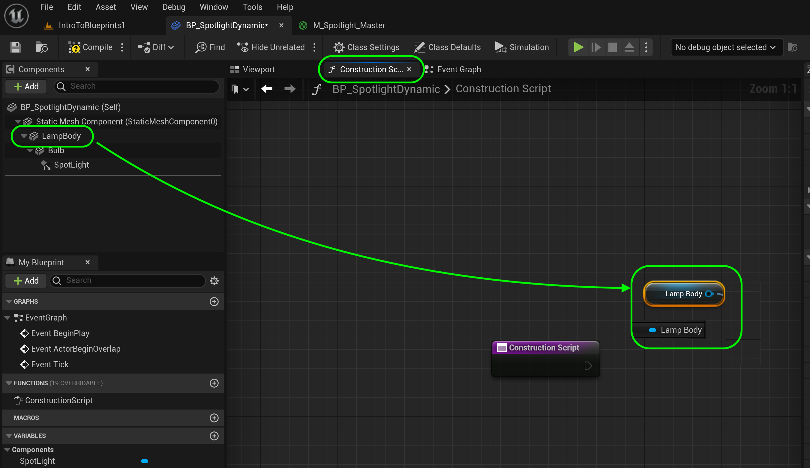
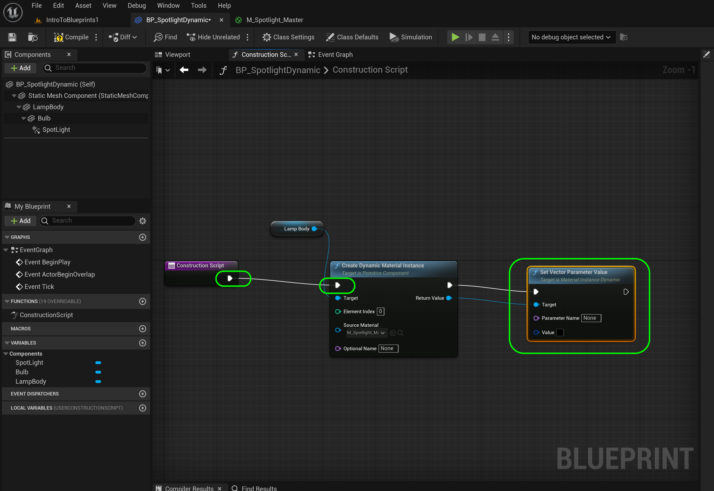

### Dynamic Materials

[previous](../grouping-meshes/README.md#user-content-grouping-meshes) • [home](../README.md#user-content-ue4-blueprints) • [next](../private-variables/README.md#user-content-private-variables)

What if we want to change a property in the material dynamincally through the blueprint? What if we want to change the property of a component like the spotlight color? We will be looking at both of these in the upcoming exercise.

This is not as straight forward as changing a value to an existing material.  We have to change the **type** to a dynamic material which is different from the one supplied in the editor (a *static* material).  Please note that a dynamic material is more expensive so only create one if you do need to make changes dynamically during gameplay.

 

---

##### `Step 1.`\|`ITB`|:small_blue_diamond:

Create a new folder called `Room 4` in the **Blueprints** folder. Go to the **Blueprints | Room3** folder and duplicate **BP_Spotlight**. Call it `BP_SpotlightDynamic`. Drag **BP_Spotlight_Dynamic** into the **Room 4** folder. Now when files you should always right click on the root folder and select **Fix Up Redirectors in Folder**. Put one of these blueprints in **Room 4** and rotate it to your liking:

https://user-images.githubusercontent.com/5504953/192262596-dda6161e-3853-4a67-ad32-c0277ab8f4b6.mp4

##### `Step 2.`\|`FHIU`|:small_blue_diamond: :small_blue_diamond: 

Open up **BP_SpotlightDynamic**. Now we want to affect the color of the glow in the lamp **Material**. *Click* on the **Lamp** static mesh component and rename the component to `Lamp`. Look for the material and *double click* the icon to load it up. Make sure you are opening **M_Spotlight_Master**.

##### `Step 3.`\|`ITB`|:small_blue_diamond: :small_blue_diamond: :small_blue_diamond:

Look for the parameter that adjusts the light color. Just before the **Emissive** color we have a **Vector Parameter** called **Light Color**. This is the color we want to change in code in the blueprint.

##### `Step 4.`\|`ITB`|:small_blue_diamond: :small_blue_diamond: :small_blue_diamond: :small_blue_diamond:

Go to the **blueprint** and into the **Construction Script** tab. *Drag* a reference to the **Lamp** component which contains that material we just looked at.

##### `Step 5.`\|`ITB`| :small_orange_diamond:

Now we need to reference just the material attached to the lamp component. To do this pull off of the **Lamp** pin then type **Create Dynamic Material Instance**. Make sure the subtitle says **Target is Primitive Component** and you have all the pins shown in the screenshot.

We need to make the material dynamic in the constructor. This will allow us to access parameters within the material. Leave **Element Index** at `0`. If there were more than one material attached to the static mesh then you would select the one you want to access (it always starts counting from material 0). For **Source Material**, select **M_Spotlight_Master** which is the material we want to alter (we just looked at it).

##### `Step 6.`\|`ITB`| :small_orange_diamond: :small_blue_diamond:

Connect the execution pins from the **Construction Script** node.

##### `Step 7.`\|`ITB`| :small_orange_diamond: :small_blue_diamond: :small_blue_diamond:

Drag off the **Create Dynamic Material Instance | Return Value** pin to help the node suggestions. Let go of the left mouse button and start to type **Set Vector Parameter Value**. You can see that this is in the **Material** section which gives us a good hint that this is what we want.

##### `Step 8.`\|`ITB`| :small_orange_diamond: :small_blue_diamond: :small_blue_diamond: :small_blue_diamond:

Go to the material and find out how the Parameter name is spelled with spaces and caps. You have to enter this exactly in the **Parameter Name** box `Light Color`. Make sure it is the same as it is in the material with a space between the two words.

##### `Step 9.`\|`ITB`| :small_orange_diamond: :small_blue_diamond: :small_blue_diamond: :small_blue_diamond: :small_blue_diamond:

Hover over the **Value** pin in the **Set Vector Parameter Value** input node. Notice that it wants a **Linear Color Structure**. This gives us a *hint*.

##### `Step 10.`\|`ITB`| :large_blue_diamond:

Drag off the left pin, let go and enter **Linear Color**. Select the **Make Linear Color** node.

##### `Step 11.`\|`ITB`| :large_blue_diamond: :small_blue_diamond: 

Make this node pure blue with a solid alpha. Press the <kbd>Compile</kbd> button.

##### `Step 12.`\|`ITB`| :large_blue_diamond: :small_blue_diamond: :small_blue_diamond: 

Go into the game and checkout the color of the light. The actual light is still green but the light bulb glow is now blue.

##### `Step 13.`\|`ITB`| :large_blue_diamond: :small_blue_diamond: :small_blue_diamond:  :small_blue_diamond: 

Now go back to the **blueprint** and *drag* a reference from the light called **Spotlight** to the main graph area.

##### `Step 14.`\|`ITB`| :large_blue_diamond: :small_blue_diamond: :small_blue_diamond: :small_blue_diamond:  :small_blue_diamond: 

Now drag off the Spotlight pin and type **lightcolor**. Out of the options **Set Light Color** is what we want.

##### `Step 15.`\|`ITB`| :large_blue_diamond: :small_orange_diamond: 

We will make the color of the light the same as the color of the bulb glow. Grab the output pin from the **Make Linear Color** node and connect it to the **New Light Color** input pin on the **Set Light Color** node.

##### `Step 16.`\|`ITB`| :large_blue_diamond: :small_orange_diamond:   :small_blue_diamond: 

Nothing will happen with this light until the *execution pins* are *connected*. Then press the <kbd>Compile</kbd> button so that the changes can run in engine.

##### `Step 17.`\|`ITB`| :large_blue_diamond: :small_orange_diamond: :small_blue_diamond: :small_blue_diamond:

Make sure the compile is succesful by checking to see that there is a green checkmark by the compile button.

##### `Step 18.`\|`ITB`| :large_blue_diamond: :small_orange_diamond: :small_blue_diamond: :small_blue_diamond: :small_blue_diamond:

Now go back to the game and hit run. You will see that both the bulb and the color of the light are set dynamically in the blueprint! But the lightbulb is still glowing white. Lets fix that.

##### `Step 19.`\|`ITB`| :large_blue_diamond: :small_orange_diamond: :small_blue_diamond: :small_blue_diamond: :small_blue_diamond: :small_blue_diamond:

Repeat creating a **Dynamic Material Instance** with **SM_Lightbulb**. Go look at the static mesh and notice that the **M_Glass** in **Element Index** `1`. Add another **Vector Parameter Value** to it. The parameter we want to change is called `ColorGlow`. Run in game and you can see that the light, casing glow and lightbulb glow are all the same color.

https://user-images.githubusercontent.com/5504953/132038111-ba9730c2-cba5-4700-b76c-c8151d931e3d.mp4

##### `Step 20.`\|`ITB`| :large_blue_diamond: :large_blue_diamond:

Press **File | Save All** then go into **Source Control | Submit to Source Control**, add a message that you have completed room 1 and press the <kbd>Submit</kbd> button. Open up **GitHub Desktop** and **Push** changes to server. The first time you do this it will say **Publish Branch**.  Select this to finish off this section.

<!--  -->

| [previous](../grouping-meshes/README.md#user-content-grouping-meshes)| [home](../README.md#user-content-ue4-blueprints) | [next](../private-variables/README.md#user-content-private-variables)|
|---|---|---|
