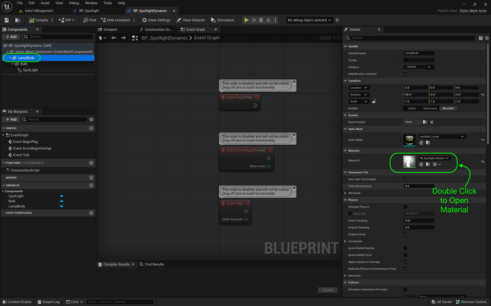
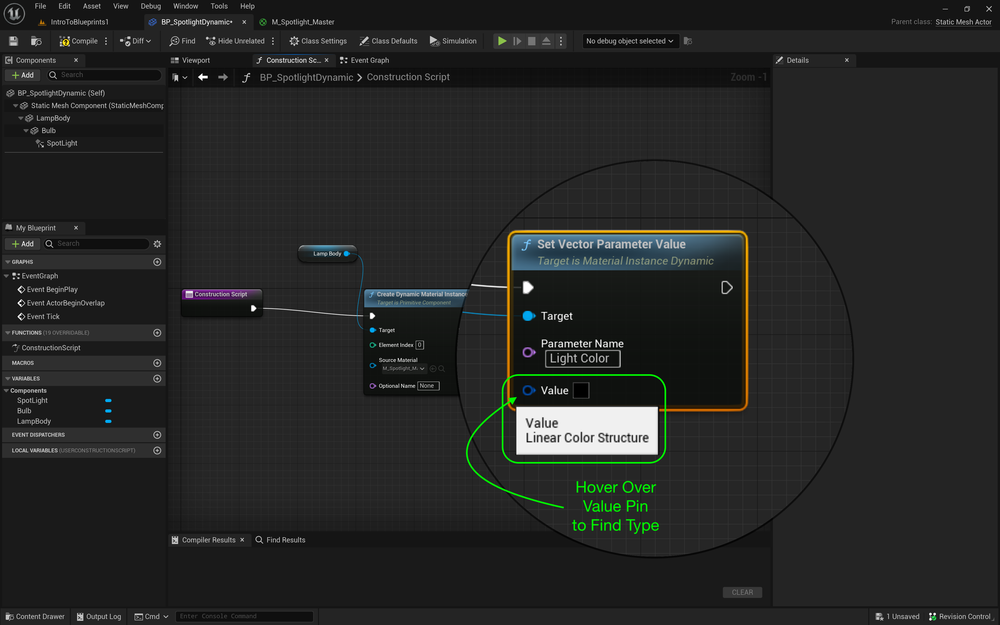
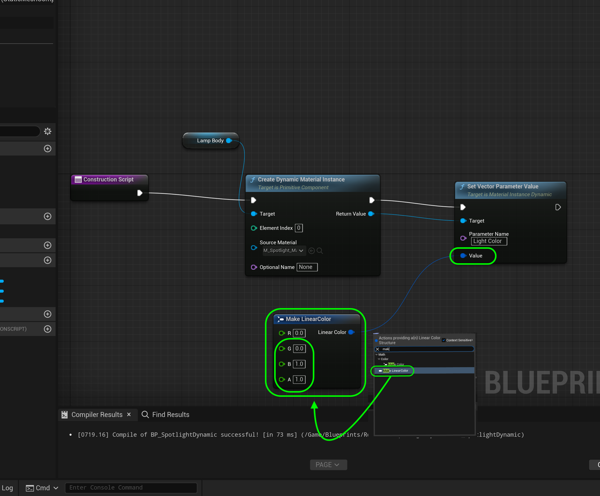

### Dynamic Materials

[previous](../grouping-meshes/README.md#user-content-grouping-meshes) • [home](../README.md#user-content-ue4-blueprints) • [next](../private-variables/README.md#user-content-private-variables)

What if we want to change a property in the material dynamincally through the blueprint? What if we want to change the property of a component like the spotlight color? We will be looking at both of these in the upcoming exercise.

This is not as straight forward as changing a value to an existing material.  We have to change the **type** to a dynamic material which is different from the one supplied in the editor (a *static* material).  Please note that a dynamic material is more expensive so only create one if you do need to make changes dynamically during gameplay.

---

##### `Step 1.`\|`ITB`|:small_blue_diamond:

Create a new folder called `Room 4` in the **Blueprints** folder. Go to the **Blueprints | Room3** folder and duplicate **BP_Spotlight**. Call it `BP_SpotlightDynamic`. Drag **BP_Spotlight_Dynamic** into the **Room 4** folder. Now when files you should always right click on the root folder and select **Fix Up Redirectors in Folder**. Put one of these blueprints in **Room 4** and rotate it to your liking:

https://user-images.githubusercontent.com/5504953/192262596-dda6161e-3853-4a67-ad32-c0277ab8f4b6.mp4

##### `Step 2.`\|`FHIU`|:small_blue_diamond: :small_blue_diamond: 

Open up **BP_SpotlightDynamic**. Now we want to affect the color of the glow in the lamp **Material**. *Click* on the **LampBody** static mesh component. Look for the material and *double click* the icon to load it up. Make sure you are opening **M_Spotlight_Master**.

##### `Step 3.`\|`ITB`|:small_blue_diamond: :small_blue_diamond: :small_blue_diamond:

The nodes are a mess so clean them up so that you can properly represent the logic flow. Look for the parameter that adjusts the light color. Just before the **Emissive** color we have a **Vector Parameter** called **Light Color**. This is the color we want to change in code in the blueprint. Notice the space in the name - this is VERY important.

##### `Step 4.`\|`ITB`|:small_blue_diamond: :small_blue_diamond: :small_blue_diamond: :small_blue_diamond:

Go to the **blueprint** and into the **Construction Script** tab. *Drag* a reference to the **Lamp** component which contains that material we just looked at.

##### `Step 5.`\|`ITB`| :small_orange_diamond:

Now we need to reference just the material attached to the lamp component. To do this pull off of the **Lamp** pin then type **Create Dynamic Material Instance**. Make sure the subtitle says **Target is Primitive Component** and you have all the pins shown in the screenshot.

We need to make the material dynamic in the constructor. This will allow us to access parameters within the material. Leave **Element Index** at `0`. If there were more than one material attached to the static mesh then you would select the one you want to access (it always starts counting from material 0). For **Source Material**, select **M_Spotlight_Master** which is the material we want to alter (we just looked at it).

##### `Step 6.`\|`ITB`| :small_orange_diamond: :small_blue_diamond:

Connect the execution pins from the **Construction Script** node. Drag off the **Create Dynamic Material Instance | Return Value** pin to help the node suggestions. Let go of the left mouse button and start to type **Set Vector Parameter Value**. You can see that this is in the **Material** section which gives us a good hint that this is what we want. Connect the data and execution pins from **Create Material Instance** to **Set Vector Parameter Value**.

##### `Step 7.`\|`ITB`| :small_orange_diamond: :small_blue_diamond: :small_blue_diamond:

Go to the material and find out how the Parameter name is spelled with spaces and caps. You have to enter this exactly in the **Parameter Name** box `Light Color`. Make sure it is the same as it is in the material with a space between the two words. To be safe it is always best to copy and paste the name.

##### `Step 8.`\|`ITB`| :small_orange_diamond: :small_blue_diamond: :small_blue_diamond: :small_blue_diamond:

Hover over the **Value** pin in the **Set Vector Parameter Value** input node. Notice that it wants a **Linear Color Structure**. This gives us a *hint*.

##### `Step 9.`\|`ITB`| :small_orange_diamond: :small_blue_diamond: :small_blue_diamond: :small_blue_diamond: :small_blue_diamond:

Drag off the left pin, let go and enter **Linear Color**. Select the **Make Linear Color** node. Make this node pure blue with a solid alpha. Press the <kbd>Compile</kbd> button.

##### `Step 10.`\|`ITB`| :large_blue_diamond:

Make sure the glow from the inside of the light case is blue.

##### `Step 11.`\|`ITB`| :large_blue_diamond: :small_blue_diamond: 

Now go back to the **blueprint** and *drag* a reference from the light called **Get | Spotlight** to the main graph area.

##### `Step 12.`\|`ITB`| :large_blue_diamond: :small_blue_diamond: :small_blue_diamond: 

Now drag off the Spotlight pin and type **lightcolor**. Take the output of **MakeLinearColor | Linear Color** to the input **New Light Color** so that the light and the glow are the same color.

##### `Step 13.`\|`ITB`| :large_blue_diamond: :small_blue_diamond: :small_blue_diamond:  :small_blue_diamond: 

Nothing will happen with this light until the *execution pins* are *connected*. Then press the <kbd>Compile</kbd> button so that the changes can run in engine.

##### `Step 14.`\|`ITB`| :large_blue_diamond: :small_blue_diamond: :small_blue_diamond: :small_blue_diamond:  :small_blue_diamond: 

Duplicate the lights so that you have 4 lights in room 4.  Then move the **Blueprints** into the **Outliner | Room4** folder. 

##### `Step 15.`\|`ITB`| :large_blue_diamond: :small_orange_diamond: 

Rotate the **Player Start** to face room 4 (by rotating by 90°).

https://github.com/maubanel/UE5-Blueprints/assets/5504953/2c02088d-6502-49c1-8181-284d6856302b

##### `Step 16.`\|`ITB`| :large_blue_diamond: :small_orange_diamond:   :small_blue_diamond: 

If we select the **Lightbulb** static mesh we see it has two materials.  The glow shader is in **Material | Element 1** in **M_Glass**.  It is the vector **ColorGlow** that sets the color of the glow for the lightbulb.

##### `Step 17.`\|`ITB`| :large_blue_diamond: :small_orange_diamond: :small_blue_diamond: :small_blue_diamond:

Repeat creating a **Dynamic Material Instance** with **SM_Lightbulb**. Go look at the static mesh and notice that the **M_Glass** in **Element Index** `1`. Set the **Element Index** to `1` and the **Source Material** to `M_Glass`.

##### `Step 18.`\|`ITB`| :large_blue_diamond: :small_orange_diamond: :small_blue_diamond: :small_blue_diamond: :small_blue_diamond:

Add another **Vector Parameter Value** to it. The parameter we want to change is called `ColorGlow`. Connect the 

##### `Step 19.`\|`ITB`| :large_blue_diamond: :small_orange_diamond: :small_blue_diamond: :small_blue_diamond: :small_blue_diamond: :small_blue_diamond:

 Run in game and you can see that the light, casing glow and lightbulb glow are all the same color. Press the <kbd>Compile</kbd> button and run the game.  Now everything glows blue.

https://user-images.githubusercontent.com/5504953/192379265-49c1b8fe-47e4-4c8a-9077-687fe5eb2cb1.mp4

##### `Step 20.`\|`ITB`| :large_blue_diamond: :large_blue_diamond:

##### `Step 21.`\|`ITB`| :large_blue_diamond: :large_blue_diamond: :small_blue_diamond:

Select the **File | Save All** then quit UE5.   Go to **P4V** and go the top project folder (the one that holds the `.uproject` file and **Content** folder) and press the <kbd>+Add</kbd> then <kbd>OK</kbd> button.  This makes sure any files that Unreal didn't add get added to source control. Press the <kbd>Submit</kbd> button and enter a message explaining the work done.  Press <kbd>Submit</kbd>.

<!--  -->

| [previous](../grouping-meshes/README.md#user-content-grouping-meshes)| [home](../README.md#user-content-ue4-blueprints) | [next](../private-variables/README.md#user-content-private-variables)|
|---|---|---|
