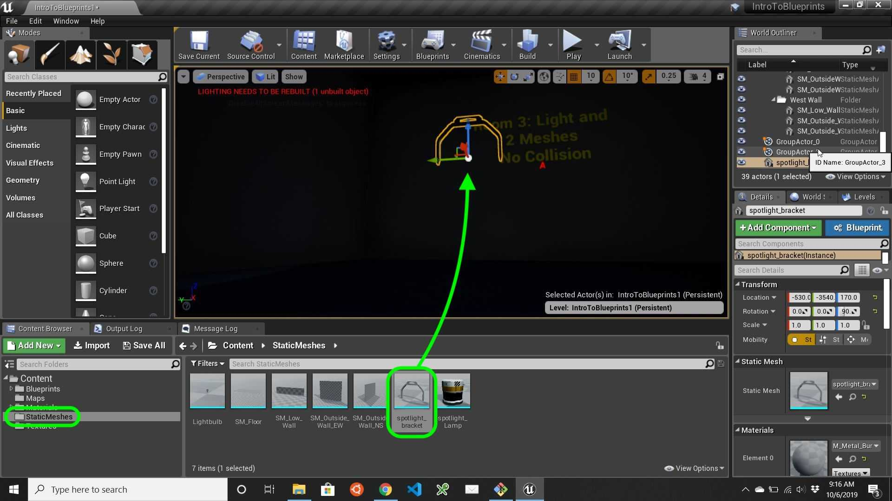
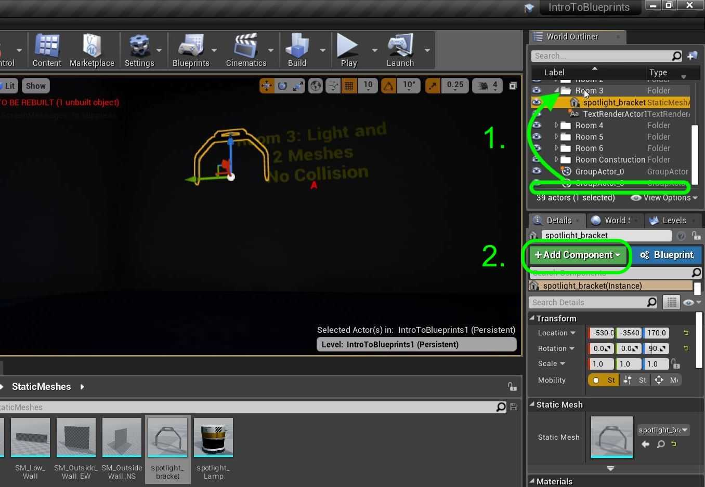
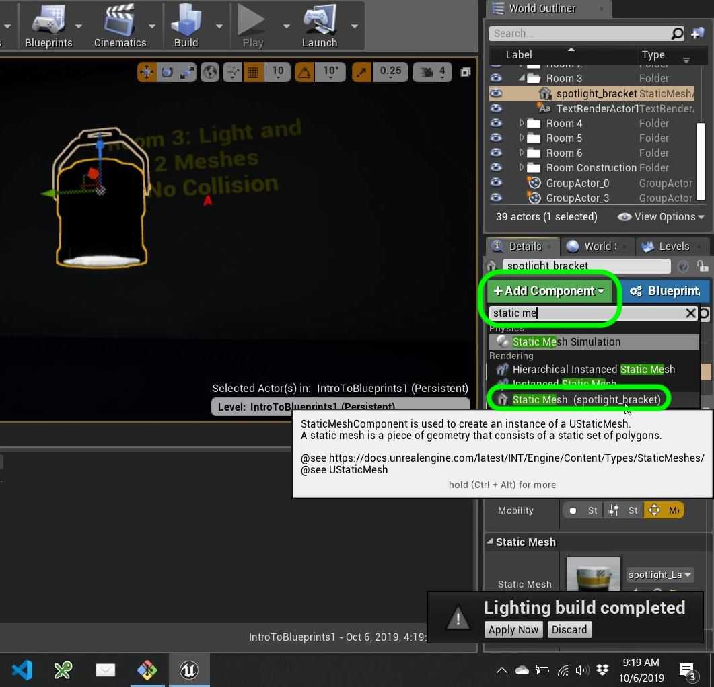
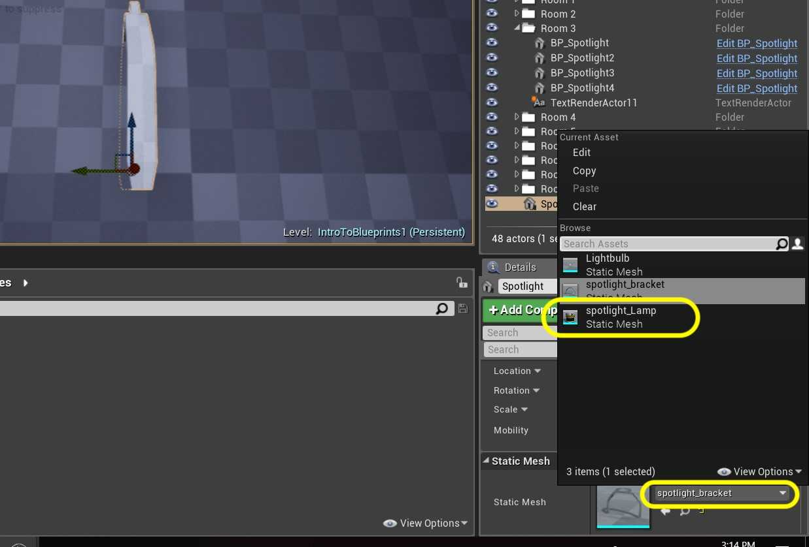
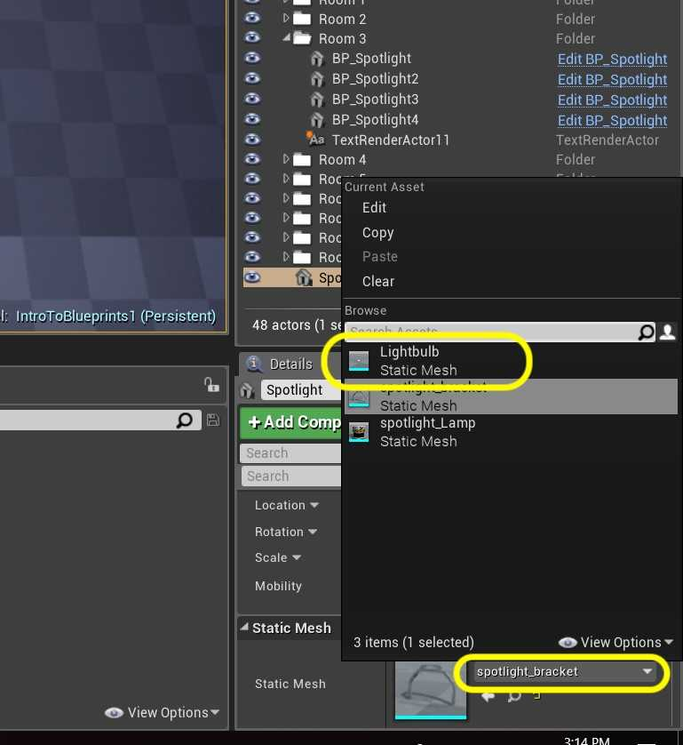
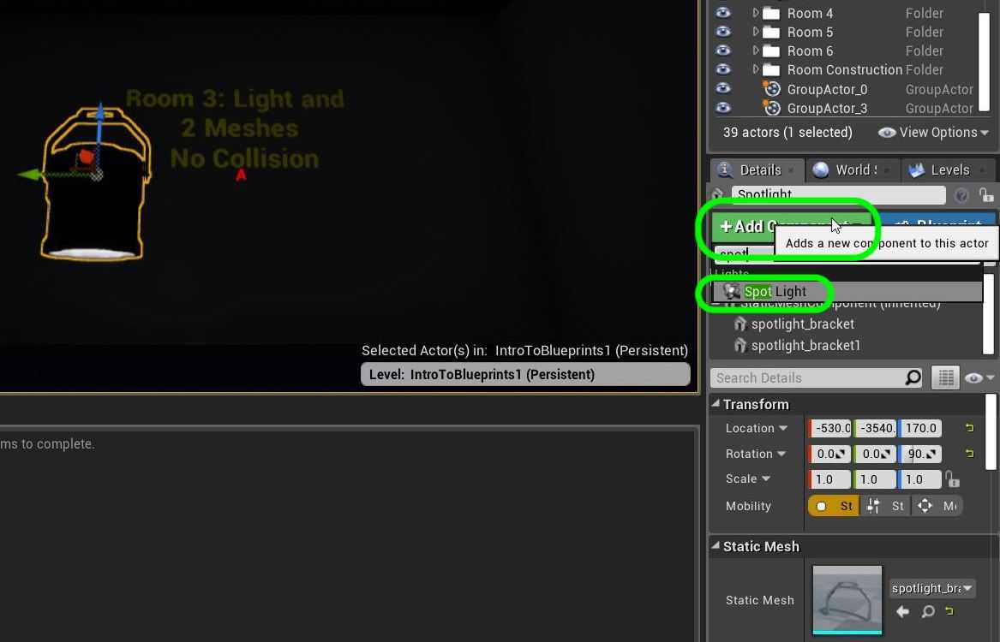

### Grouping Meshes

[previous](../collision/README.md#user-content-collision-events) • [home](../README.md#user-content-ue4-blueprints) • [next](../dynamic-materials/README.md#user-content-dynamic-materials)

Now **blueprints** are not just for logic. We can use them to create a more complex object with multiple meshes and components and save them as one blueprint. Then you can make multiple instances of them and they will be replicated. You can also build it in the game world first, then create a bluprint after. Lets create a spotlight and see how this works.

 

---

##### `Step 1.`\|`ITB`|:small_blue_diamond:

Go to **Room 3** and go to the **StaticMeshes** folder. Drag the **spotlight_bracket** into the room. Rotate it so it faces the front of the room.

##### `Step 2.`\|`FHIU`|:small_blue_diamond: :small_blue_diamond: 

Move the object in the **World Outliner** into the **Room 3** folder. Then press the **Add Component** button.

##### `Step 3.`\|`ITB`|:small_blue_diamond: :small_blue_diamond: :small_blue_diamond:

Select another **Static Mesh** component.

##### `Step 4.`\|`ITB`|:small_blue_diamond: :small_blue_diamond: :small_blue_diamond: :small_blue_diamond:

Assign the **spotlight_lamp** mesh to this component

##### `Step 5.`\|`ITB`| :small_orange_diamond:

Add a third static mesh component by pressing the <kbd>Add Component</kbd> button:

##### `Step 6.`\|`ITB`| :small_orange_diamond: :small_blue_diamond:

Assign the **Lightbulb** static mesh.

##### `Step 7.`\|`ITB`| :small_orange_diamond: :small_blue_diamond: :small_blue_diamond:

Rotate lightbulb so that the bulb faces down and move it to the proper location.

##### `Step 8.`\|`ITB`| :small_orange_diamond: :small_blue_diamond: :small_blue_diamond: :small_blue_diamond:

Rename the **Actor** to `Spotlight`.

##### `Step 9.`\|`ITB`| :small_orange_diamond: :small_blue_diamond: :small_blue_diamond: :small_blue_diamond: :small_blue_diamond:

Add another component but this time an actual Spotlight so it can project an in game spotlight. Pressing <kbd>Add Component</kbd> button then select **Spot Light**.

##### `Step 10.`\|`ITB`| :large_blue_diamond:

Now make sure that your **Spotlight** is selected in the **World Outliner**. Then press the **Blueprint** button to turn this from a actor to a reusable blueprint. Add it to the **Blueprints** folder and call it `BP_Spotlight`. Make sure **New Subclass** is selected then press the Select button. Create a new folder called `Room3` and move the new blueprint into the folder.

##### `Step 11.`\|`ITB`| :large_blue_diamond: :small_blue_diamond: 

Open the **BP_Spotlight** blueprint and select the **Spotlight**. You will see that its rotation may not match the light.

##### `Step 12.`\|`ITB`| :large_blue_diamond: :small_blue_diamond: :small_blue_diamond: 

Make sure it is rotated in the same direction as the lamp.

##### `Step 13.`\|`ITB`| :large_blue_diamond: :small_blue_diamond: :small_blue_diamond:  :small_blue_diamond: 

Select the **Lamp** component and rotate the lamp so that it doesn't point straight down. Tune it to your liking:

##### `Step 14.`\|`ITB`| :large_blue_diamond: :small_blue_diamond: :small_blue_diamond: :small_blue_diamond:  :small_blue_diamond: 

Select the **Spotlight** then set the light color to your preference. I picked green.

##### `Step 15.`\|`ITB`| :large_blue_diamond: :small_orange_diamond: 

Check the lamp out in game. I am noticing a problem with a model casting a shadow I don't like in the light. Youe light might not show up at all as the light source is hidden in geometry in the light bulp mesh. Move the **Spot Light** component further away from the light bulb and check in game to where it no longer is shadowed or occluded by the light bulb mesh.

##### `Step 16.`\|`ITB`| :large_blue_diamond: :small_orange_diamond:   :small_blue_diamond: 

Now by having it as a blueprint I can just drop it in the room multiple times and rotate it in different direcions. I have a game object that I can instance as much as I want with the functionality I need!

##### `Step 17.`\|`ITB`| :large_blue_diamond: :small_orange_diamond: :small_blue_diamond: :small_blue_diamond:

Now this is what it could look like in game.

##### `Step 18.`\|`ITB`| :large_blue_diamond: :small_orange_diamond: :small_blue_diamond: :small_blue_diamond: :small_blue_diamond:

That's it for **Room 3**. Press **Save All** then go into **Source Control | Submit to Source Control...**, add a message that you have completed room 3 and press the <kbd>Submit</kbd> button. Now go to **GitHub Desktop** and **Push** changes to server. 

___

| [previous](../collision/README.md#user-content-collision-events)| [home](../README.md#user-content-ue4-blueprints) | [next](../dynamic-materials/README.md#user-content-dynamic-materials)|
|---|---|---|
