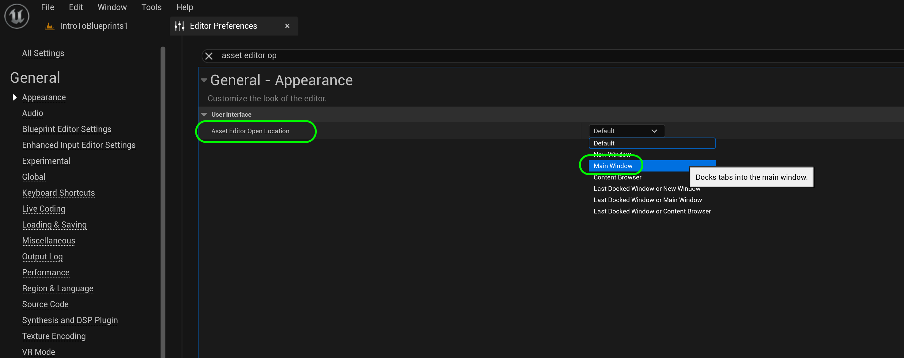
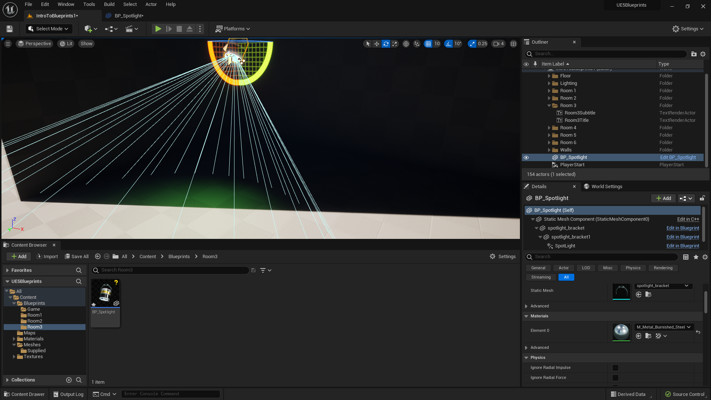

### Grouping Meshes

[previous](../collision/README.md#user-content-collision-events) • [home](../README.md#user-content-ue4-blueprints) • [next](../dynamic-materials/README.md#user-content-dynamic-materials)

Now **blueprints** are not just for logic. We can use them to create a more complex object with multiple meshes and components and save them as one blueprint. Then you can make multiple instances of them and they will be replicated. You can also build it in the game world first, then create a bluprint after. Lets create a spotlight and see how this works.

---

##### `Step 1.`\|`ITB`|:small_blue_diamond:

Move the **Player Start** to **Room 3**. Select the **StaticMeshes** folder. Drag the **spotlight_bracket** into the room. Position it so it faces the front left of the room.

##### `Step 2.`\|`FHIU`|:small_blue_diamond: :small_blue_diamond: 

Move the object in the **World Outliner** into the **Room 3** folder. Then press the **Add Component** button. Select another **Static Mesh** component.

##### `Step 3.`\|`ITB`|:small_blue_diamond: :small_blue_diamond: :small_blue_diamond:

Assign the **spotlight_lamp** mesh to this component and name it `LampBody`.

##### `Step 4.`\|`ITB`|:small_blue_diamond: :small_blue_diamond: :small_blue_diamond: :small_blue_diamond:

Add a third static mesh component by pressing the <kbd>Add Component</kbd> button. Assign the **Lightbulb** static mesh. Call the component `Bulb`.

##### `Step 5.`\|`ITB`| :small_orange_diamond:

Change the name in the **World Outliner** from **Spotlight Bracket** to `Spotlight`. Add another component but this time an actual Spotlight so it can project an in game spotlight. Pressing <kbd>Add Component</kbd> button then select **Spot Light**. Make sure that **Lamp Body** is a child of the bracket static mesh.

##### `Step 6.`\|`ITB`| :small_orange_diamond: :small_blue_diamond:

Rotate the spotlight so it points in the direction of the lamp.  In my case downwards.  Make sure the spotlight is a child of the **Bulb**.

##### `Step 7.`\|`ITB`| :small_orange_diamond: :small_blue_diamond: :small_blue_diamond:

Adjust the height of the spotlight so it doesn't cast a shadow from inside the lamp.  Adjust it and stop as soon as the shadows go away.

https://github.com/maubanel/UE5-Blueprints/assets/5504953/f6db16cc-4280-4c23-a467-9d55876e12d3

##### `Step 8.`\|`ITB`| :small_orange_diamond: :small_blue_diamond: :small_blue_diamond: :small_blue_diamond:

Now I am having an issue with a freeze where the blueprint pop up goes to a second monitor that is not there.  It is a known bug and can be avoided by going to **Editor Preferences** and changing **Asset Editor Open Location** to `Main Window`.  This avoids a hang on the next step where the blueprint menu never appears on screen.

##### `Step 9.`\|`ITB`| :small_orange_diamond: :small_blue_diamond: :small_blue_diamond: :small_blue_diamond: :small_blue_diamond:

Create a new folder called **Room3** in the **Blueprints** folder. Now make sure that your **Spotlight** is selected in the **Outliner**. Then press the <kbd>Convert to Blueprint</kbd> button to turn this from a level instance to a reusable blueprint. Add it to the **Blueprints | Room3** folder and call it `BP_Spotlight`. Make sure **New Subclass** is selected then press the <kbd>Select</kbd> button. 

##### `Step 10.`\|`ITB`| :large_blue_diamond:

Select the **Lamp** component and rotate the lamp so that it doesn't point straight down. Tune it to your liking. Select the **Spotlight** then set the light color to your preference. I picked green. Also set the **Intensity** to be a bit brighter.

##### `Step 11.`\|`ITB`| :large_blue_diamond: :small_blue_diamond: 

##### `Step 12.`\|`ITB`| :large_blue_diamond: :small_blue_diamond: :small_blue_diamond: 

Check the lamp out in game. Make sure the light bulb mesh is not casting a shadow from the light. If it is *move* the **Spot Light** component further away from the light bulb and check in game to where it no longer is shadowed or occluded by the light bulb mesh.

##### `Step 13.`\|`ITB`| :large_blue_diamond: :small_blue_diamond: :small_blue_diamond:  :small_blue_diamond: 

Now by having it as a blueprint I can just drop it in the room multiple times and rotate it in different direcions. Lets duplicate the light three times and rotate it at different angles to fill the room with colored light.

##### `Step 14.`\|`ITB`| :large_blue_diamond: :small_blue_diamond: :small_blue_diamond: :small_blue_diamond:  :small_blue_diamond: 

Move all four **BP_Spotlight** actors into the **Room3** folder in the **Outliner**.

##### `Step 15.`\|`ITB`| :large_blue_diamond: :small_orange_diamond: 

Press play to see your work in game.  Now you can reuse this blueprint in as many levels as you would like.

https://user-images.githubusercontent.com/5504953/192174713-0b6c6328-d23a-42a8-abc6-7ec9a9bf24c2.mp4

##### `Step 16.`\|`ITB`| :large_blue_diamond: :small_orange_diamond:   :small_blue_diamond: 

Select the **File | Save All** then quit UE5.   Go to **P4V** and go the top project folder (the one that holds the `.uproject` file and **Content** folder) and press the <kbd>+Add</kbd> then <kbd>OK</kbd> button.  This makes sure any files that Unreal didn't add get added to source control. Press the <kbd>Submit</kbd> button and enter a message explaining the work done.  Press <kbd>Submit</kbd>.

<!--  -->

| [previous](../collision/README.md#user-content-collision-events)| [home](../README.md#user-content-ue4-blueprints) | [next](../dynamic-materials/README.md#user-content-dynamic-materials)|
|---|---|---|
