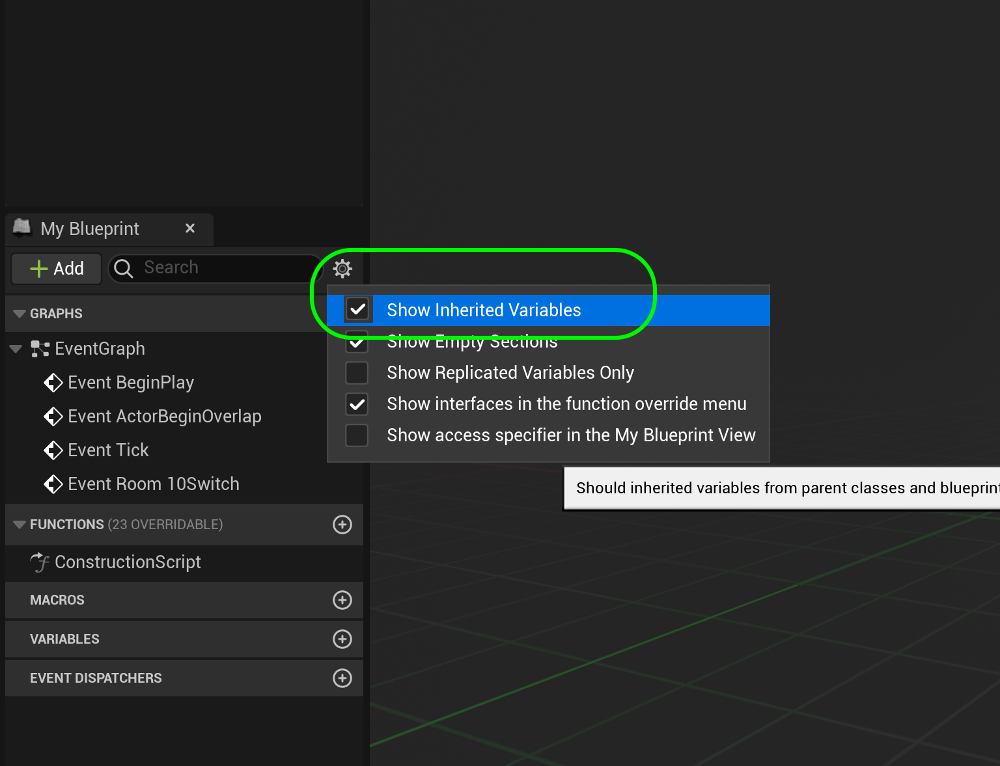
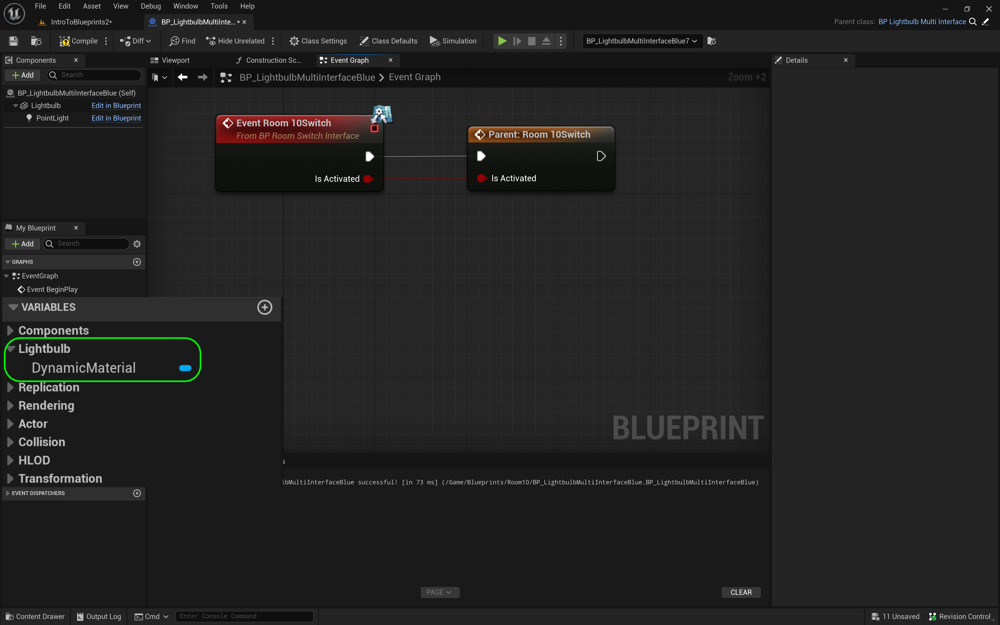
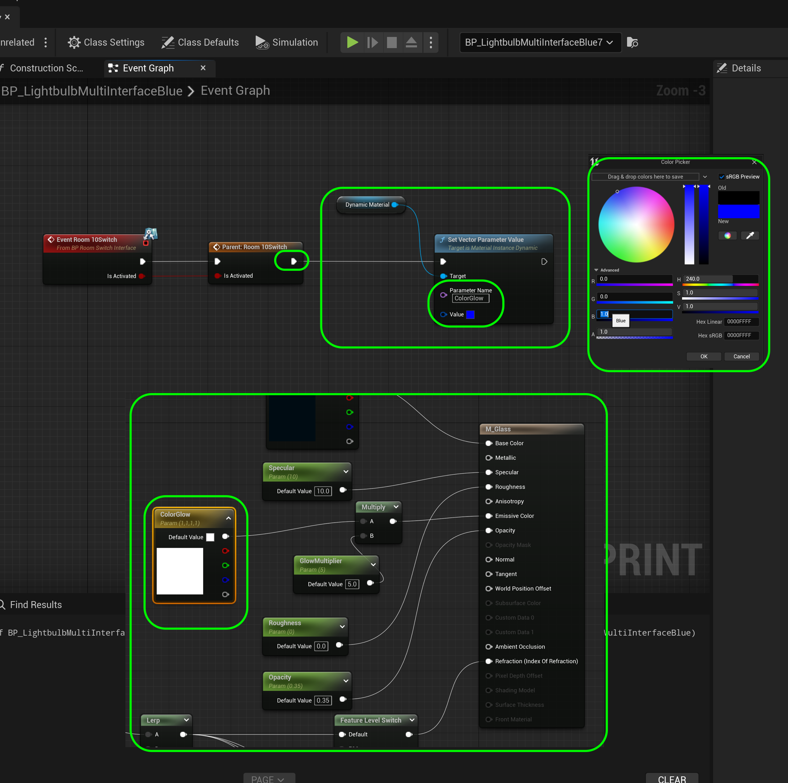
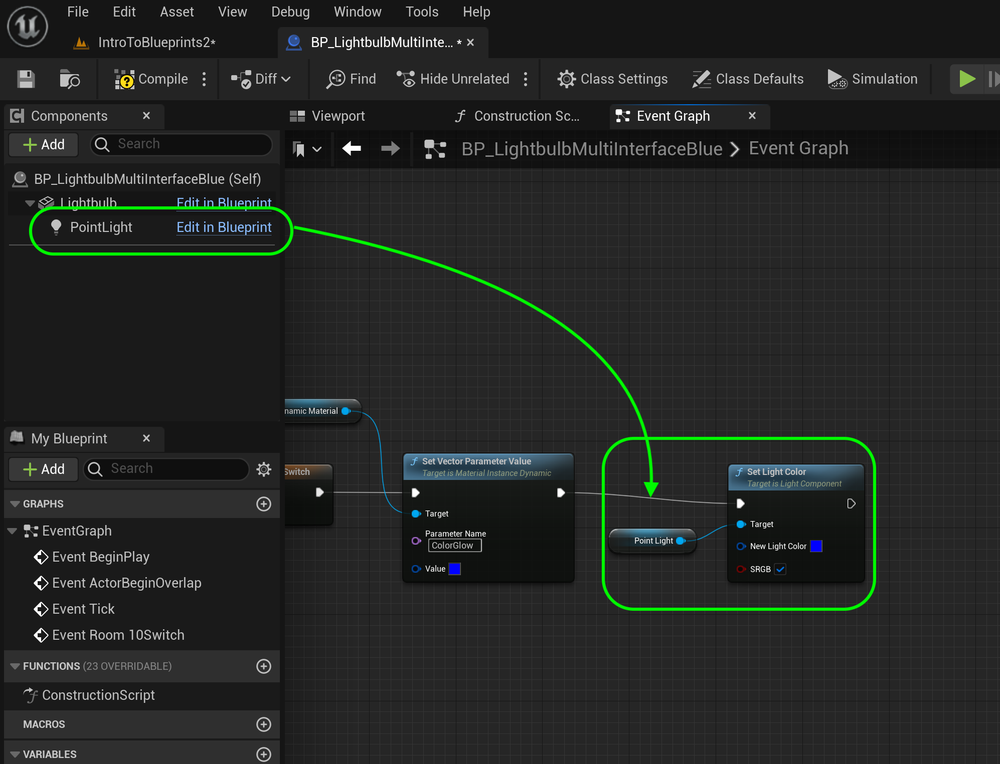
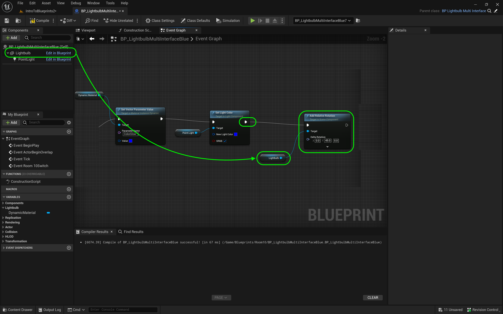

### Communicate Through Interface II

[previous](../interface/README.md#user-content-communicate-through-interface) • [home](../README.md#user-content-ue4-blueprints) • [next](../orbiting-actors/README.md#user-content-orbiting-actors)

Communicate through a blueprint interface part II.  Now we will be demonstrating the real power of an interface.  We can inherit from our lightbulb blueprint and override the interface so we have a custom implementation when it is called.

 

---

##### `Step 1.`\|`ITB`|:small_blue_diamond:

The power of this interface is that other objects can define the interface to do a different action.  So turning on might a light for a light switch, but could also have a TV that implements turning on by showing a movie on the screen. You can also inherit from the same object class and define a different implementation for the interface as well.

Lets another light but this time it will be blue. Go to **Blueprints | Room 10** and *right click* on **BP_LightbulbMultiInterface** and select **Create Child Blueprint Class** and name it `BP_LightbulbMultiInterfaceBlue`. 

##### `Step 2.`\|`FHIU`|:small_blue_diamond: :small_blue_diamond: 

Now this is different than duplicating as it is now a child class and calls its parents behavior.  Notice all your events and functions like **Event Tick** call their parents behavior so they will act the same.  In this case it calls **Parent: Tick**. So when it runs it will be exactly the same.

##### `Step 3.`\|`ITB`|:small_blue_diamond: :small_blue_diamond: :small_blue_diamond:

Now the first things we need to do is open the parent **BP_LightbulbMultiInterface** and change the variable **Dynamic Material** to no longer be **Private** by setting it to `false`.  We want to access this in the child blueprint we just made and can't if it is a private variable.  To acccess a parent variable it must be public.

##### `Step 4.`\|`ITB`|:small_blue_diamond: :small_blue_diamond: :small_blue_diamond: :small_blue_diamond:

Now just like the tick was calling its parent behavior we want to override the way we implemented the interface in the parent.  So go to **Function | Override** and select `Room10Switch`.  You will see an event **Room10Switch** be added to the graph.

##### `Step 5.`\|`ITB`| :small_orange_diamond:

Now this is overriding the parent behavior.  But we want the light to turn on and off with the parent.  So we can call it.  Right click on on the **Event Room10Switch** node and select **Add Call to Parent Function**.  This will add a **Parent: Room10Switch** node to the chart.  Connect the execuation pins as well as **bIsActivated** to **bIsActivated** on the parent call.

##### `Step 6.`\|`ITB`| :small_orange_diamond: :small_blue_diamond:

Now we need access to the Dynamic Material variable in the parent which is in category **Lightbulb** but it is not visible.  We need it to alter the color of the glow on the light.  Lick the **Gear** at the top of the **MyBlueprint** tab and set **Show Inherited Variables** to `true`. 

##### `Step 7.`\|`ITB`| :small_orange_diamond: :small_blue_diamond: :small_blue_diamond:

Now we get a lot of other variables but the one we are looking for is **Lightbulb | DynamicMaterial**.

##### `Step 8.`\|`ITB`| :small_orange_diamond: :small_blue_diamond: :small_blue_diamond: :small_blue_diamond:

Drag the **Dynamic Material** variable to the graph and pull off of the blue pin to select a **Set Vector Parameter Value**.  Connect the execution pin from **Parent: Room10Switch** to **Set Vector Parameter Value** nodes.  Change the color **Value** to blue (`0.0, 0.0, 1.0, 1.0`) then press the <kbd>OK</kbd> button. Now the material we are affecting is **M_Glass** and the parameter we want to change is `ColorGlow`.  Enter the **Parameter Name** as `ColorGlow`.

##### `Step 9.`\|`ITB`| :small_orange_diamond: :small_blue_diamond: :small_blue_diamond: :small_blue_diamond: :small_blue_diamond:

Now we want the light to be blue as well. Drag a copy of the **Point Light** component so we can reference its variables. Pull off of the **Point Light** pin and select **Set Light Color** node.  Connect the execution pin from **Set Vector Parameter Value** and set the **New Light Color** to the same blue (`0.0, 0.0, 1.0, 1.0`).

##### `Step 10.`\|`ITB`| :large_blue_diamond:

Now go to the editor and add scatter the **BP_LightbulbMultiInterfaceBlue** throughout room 10 intermingling them with their parents.

##### `Step 11.`\|`ITB`| :large_blue_diamond: :small_blue_diamond: 

Press the <kbd>Play</kbd> button and and enter the volume.  You should now have white and blue lights for this new class.  Notice that we are able to leave the level blueprint and even though we are only getting all actors of class **BP_LightbulbMultiInterface** it also gets all classes who have this in their inheritance heirachy.  So since **BP_LightbulbMultiInterfaceBlue** inherits from **BP_LightbulbMultiInterface** it is picked up in that array.  And since we define the interface in the parent through object oriented polymorphism it calls the child implementation at the same time.  This allows us to have a generic enemy class and have different enemy behavior for each child.  This allows us to not have to know about the specific implementation of the children and just call the interface in the parent class.  If you don't understand all of this it is ok.  

https://github.com/maubanel/UE5-Blueprints/assets/5504953/c5b10e76-ccc7-4a7d-8ab4-f949d1ce67da

##### `Step 12.`\|`ITB`| :large_blue_diamond: :small_blue_diamond: :small_blue_diamond: 

Lets make the change a bit more obvious, the color change is rather subtle. Drag a copy of the **Lightbulb** component to the graph.  Pull off of the blue pin and select **Add Relative Rotation**.  Change the **Delta Rotation** on the **Y** axis to `45.0`.  Connect the execution pin from **Set Light Color** to **Add Relative Rotation**.

##### `Step 13.`\|`ITB`| :large_blue_diamond: :small_blue_diamond: :small_blue_diamond:  :small_blue_diamond: 

Press the <kbd>Play</kbd> button and and enter the volume. Now the lightbulbs rotate back and forth.

https://github.com/maubanel/UE5-Blueprints/assets/5504953/fb0aa325-6778-4f4b-a577-89640e42aded

##### `Step 14.`\|`ITB`| :large_blue_diamond: :small_blue_diamond: :small_blue_diamond: :small_blue_diamond:  :small_blue_diamond: 

##### `Step 15.`\|`ITB`| :large_blue_diamond: :small_orange_diamond: 

<!--  -->

| [previous](../interface/README.md#user-content-communicate-through-interface)| [home](../README.md#user-content-ue4-blueprints) | [next](../orbiting-actors/README.md#user-content-orbiting-actors)|
|---|---|---|
