### Communicate Through Interface II

[previous](../interface/README.md#user-content-communicate-through-interface) • [home](../README.md#user-content-ue4-blueprints) • [next](../orbiting-actors/README.md#user-content-orbiting-actors)

Communicate through a blueprint interface part II

 

---

##### `Step 1.`\|`ITB`|:small_blue_diamond:

Now we want to call the event that the **BP_LightbulbMultiInterface** subscribed to.  *Pull* off of the **Array Element** pin from the **For Each Loop** node and add a call to **Turn Room 10 Switches On And Off**.  This array element pin is accessing a reference to each lightbulb in the loop and running the nodes that are part of the interface definition in that blueprint (BP_LightbulbMultiInterface).

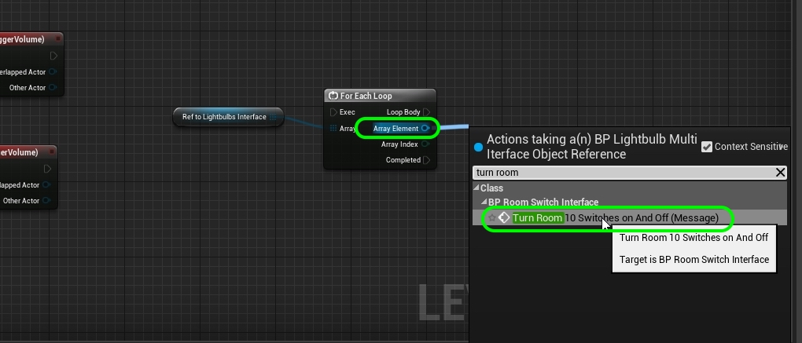

##### `Step 2.`\|`FHIU`|:small_blue_diamond: :small_blue_diamond: 

*Connect* the  execution pins from **Begin Overlap** node to the **For Each Loop** to the **Turn Room 10 Switches On And Off** nodes.  Make sure that the **Is On** pin is set to `true` (ticked) as this is the turning on state.  Then copy the **For Each** and **Turn Room 10 Switches On And Off** nodes and connect them to the **End Overlap** node and make **IsOn** `false` (un-ticked) as it is turning the light off.

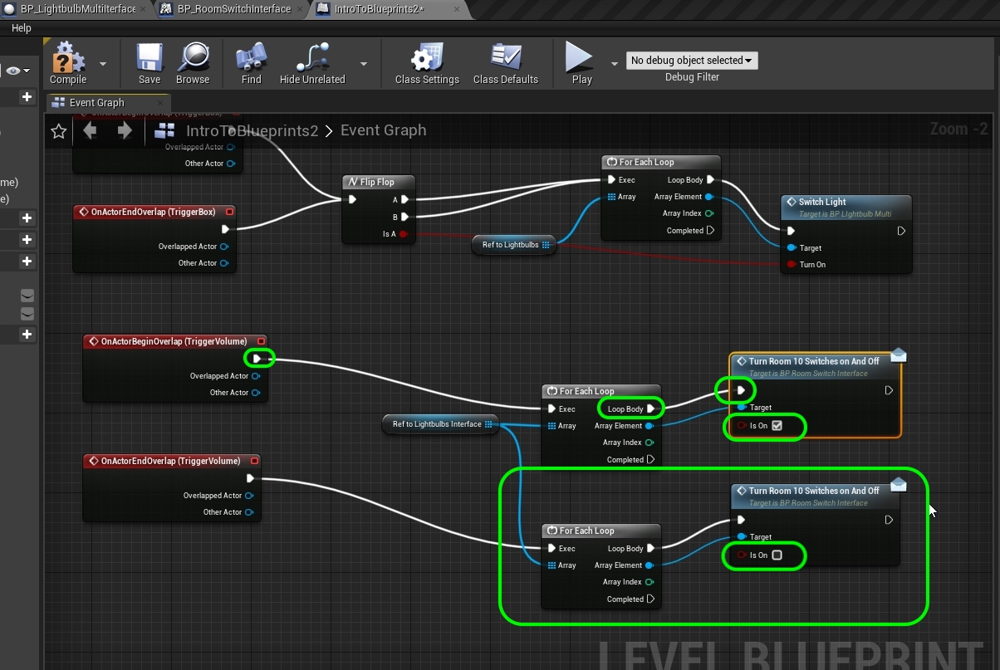

##### `Step 3.`\|`ITB`|:small_blue_diamond: :small_blue_diamond: :small_blue_diamond:

Now we have the bluprint calling the interface and passing all the lights in the room. We also have the interface implemented in the lightbulb that turns on and off. Run the game and walk in and out of the volume.

##### `Step 4.`\|`ITB`|:small_blue_diamond: :small_blue_diamond: :small_blue_diamond: :small_blue_diamond:

The power of this interface is that other objects can define the interface to do a different action.  So turning on might a light for a light switch, but could also have a TV that implements turning on by showing a movie on the screen. Lets add a cube that rotates when turned on and stops when turned off. Go to **Blueprints | Room 8** and *right click* on **BP_RotateObject** and select **Duplicate**.

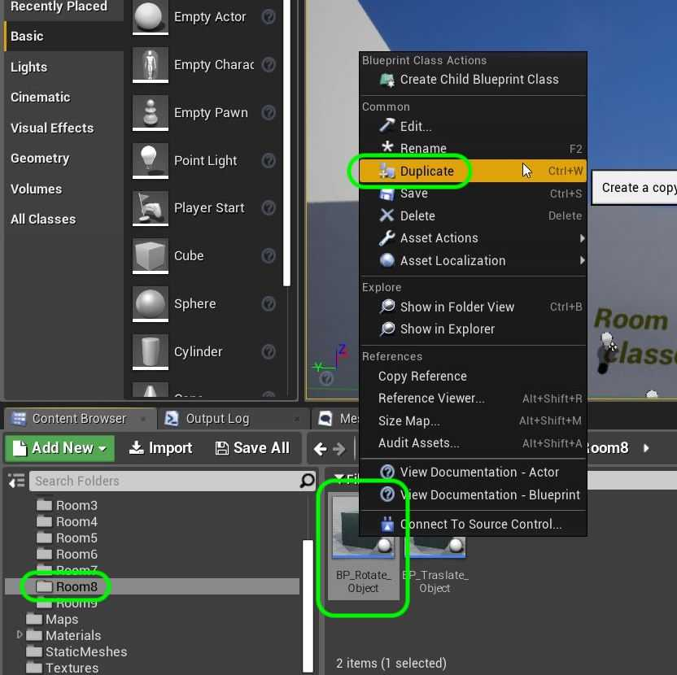

##### `Step 5.`\|`ITB`| :small_orange_diamond:

Call it `BP_RotateRm10` and *drag it* into the **Room10** folder.

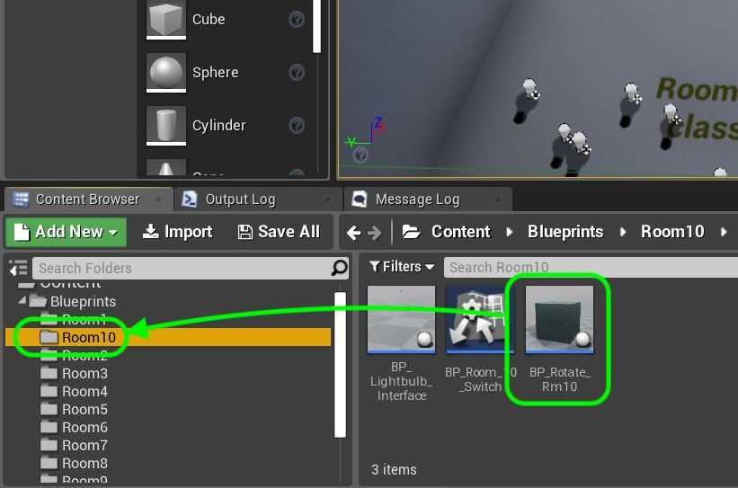

##### `Step 6.`\|`ITB`| :small_orange_diamond: :small_blue_diamond:

Drag two **BP_Rotate_Rm10** in the room.

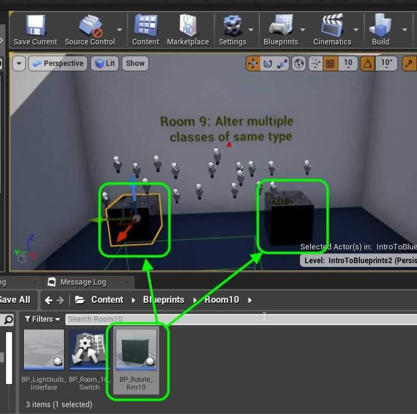

##### `Step 7.`\|`ITB`| :small_orange_diamond: :small_blue_diamond: :small_blue_diamond:

Open up the BP_Rotate_Rm10 blueprint. *Delete* all the Pitch and Roll nodes to leave just the Yaw.

##### `Step 8.`\|`ITB`| :small_orange_diamond: :small_blue_diamond: :small_blue_diamond: :small_blue_diamond:

 *Delete* all three booleans in this blueprint (**bRotateOnZ**, **bRotateOnY**, **bRotateOnX**). We will be turning it on off in code and not in the game menu. So these variables are not necessary.

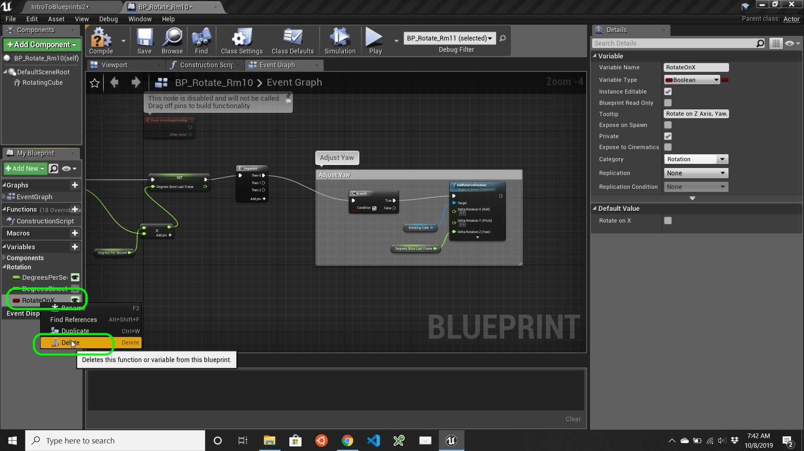

##### `Step 9.`\|`ITB`| :small_orange_diamond: :small_blue_diamond: :small_blue_diamond: :small_blue_diamond: :small_blue_diamond:

Select **Class Settings** then press **Interfaces | Add** and add the **BP_RoomSwitchInterface**. Press the <kbd>Compile</kbd> button.

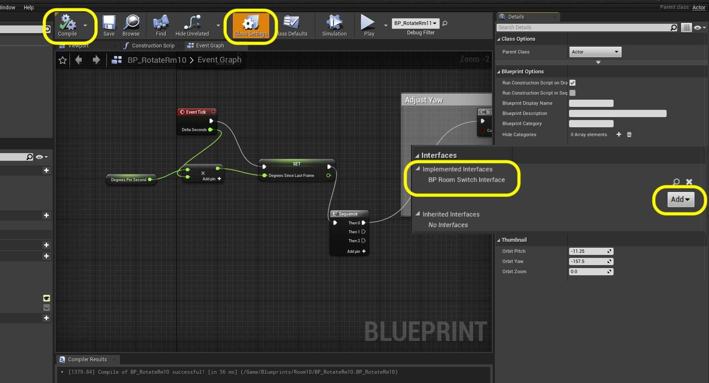

##### `Step 10.`\|`ITB`| :large_blue_diamond:

*Right click* on the graph and add a **Event Turns Room 10 Switches on Off** node.

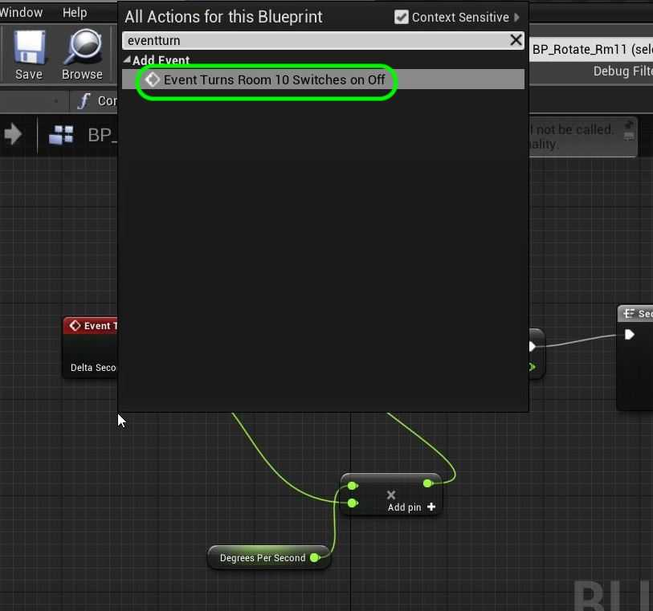

##### `Step 11.`\|`ITB`| :large_blue_diamond: :small_blue_diamond: 

Now remove the **Event Tick** node *connect* the output of the **BP_RoomSwitchInterface** execution pin to the **Set Degrees Since Las Frame** node.

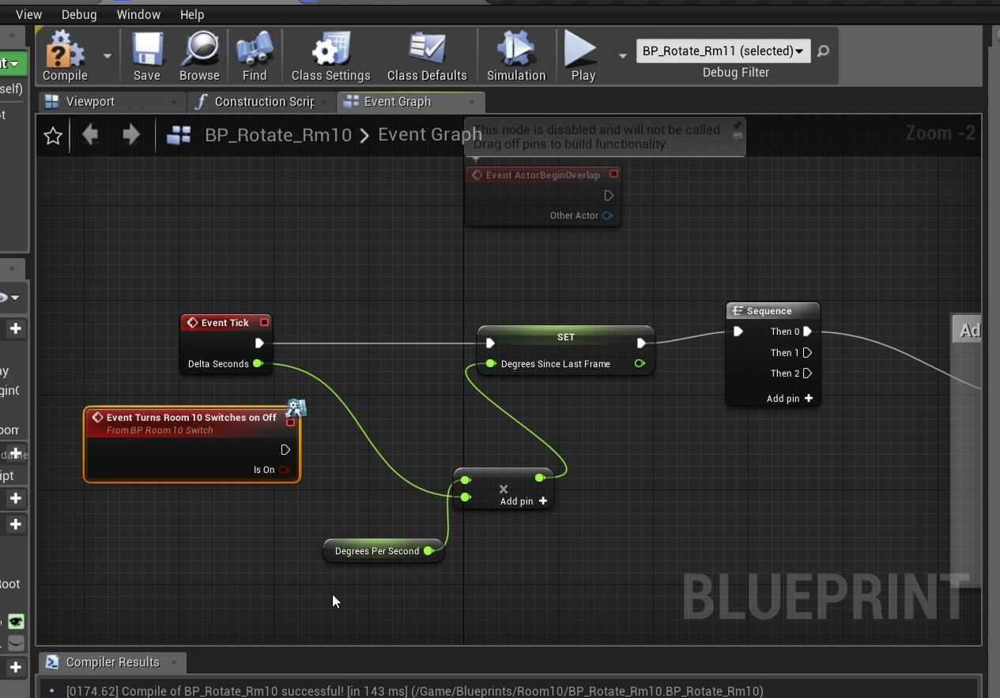

##### `Step 12.`\|`ITB`| :large_blue_diamond: :small_blue_diamond: :small_blue_diamond: 

Now we are missing the **Delta Seconds** that was fed by the **Event Tick** node. No problem we can get this value by *right clicking* and adding a **Get World Delta Seconds** node.

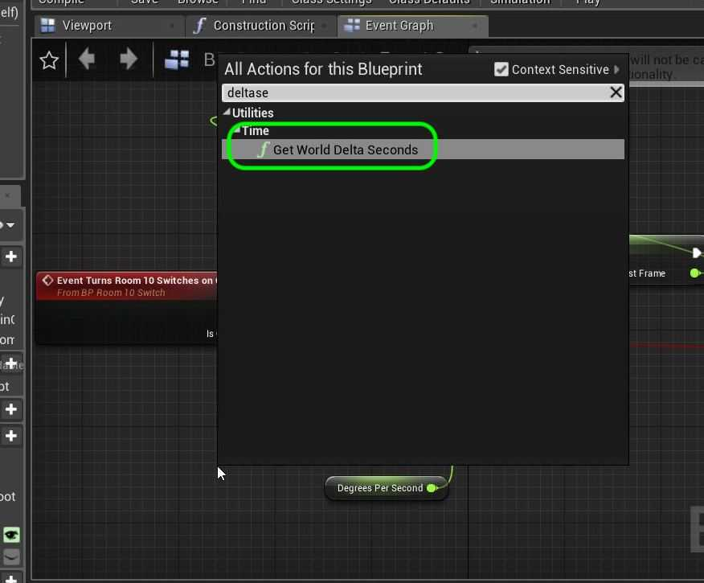

##### `Step 13.`\|`ITB`| :large_blue_diamond: :small_blue_diamond: :small_blue_diamond:  :small_blue_diamond: 

*Connect* the output of the **Get World Delta Seconds** node to the empty **Multiplication** node.

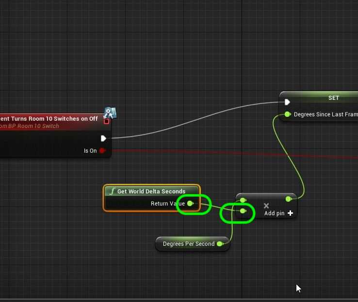

##### `Step 14.`\|`ITB`| :large_blue_diamond: :small_blue_diamond: :small_blue_diamond: :small_blue_diamond:  :small_blue_diamond: 

*Connect* the **Is On** output pin from the **Event** node and connect it to the **Condition** pin in the **Branch** node.

*Press* the <kbd>Compile</kbd> button.

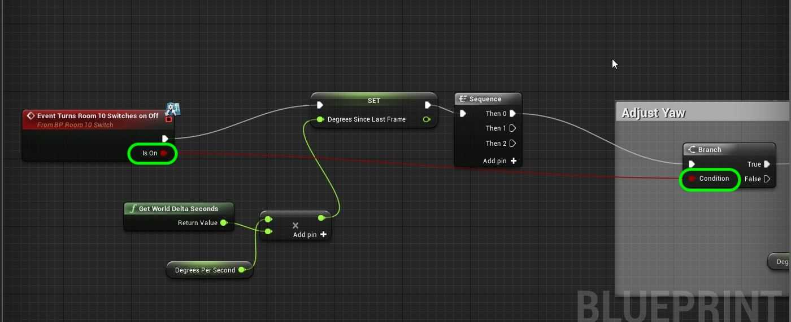

##### `Step 15.`\|`ITB`| :large_blue_diamond: :small_orange_diamond: 

Go to the **Level Blueprint** for **IntroToBlueprints2** and *right click* on **RefToLightbulbsInterface** and select **Duplicate**.

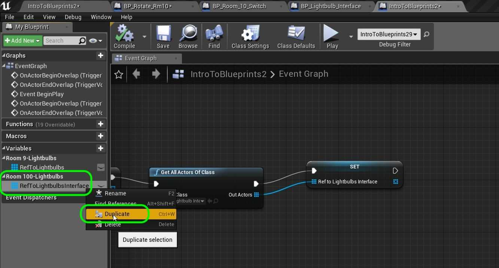

##### `Step 16.`\|`ITB`| :large_blue_diamond: :small_orange_diamond:   :small_blue_diamond: 

Name it `RefToRotateInterface` and change the type to **BP_RotateRoom10 | Object Reference**. Update the **Tooltip**.

##### `Step 17.`\|`ITB`| :large_blue_diamond: :small_orange_diamond: :small_blue_diamond: :small_blue_diamond:

Now at the end of the **Begin Play** event *off* the last **Set** node execution pin and *add* a **Get All Actors Of Class** node and change the Actor Class to **BP_RotateRm10**.

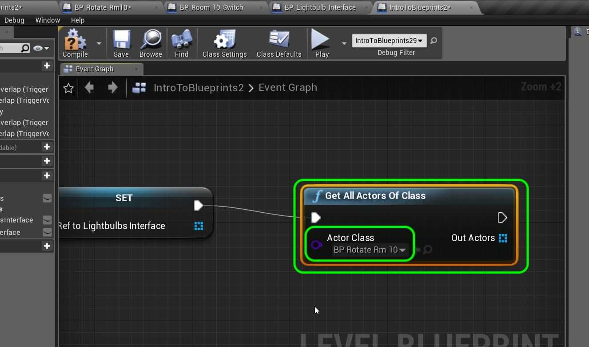

##### `Step 18.`\|`ITB`| :large_blue_diamond: :small_orange_diamond: :small_blue_diamond: :small_blue_diamond: :small_blue_diamond:

Add a **Set RefToRotateInterface** node and connect the execution and array pins to the **Get All Actors Of Class** node.

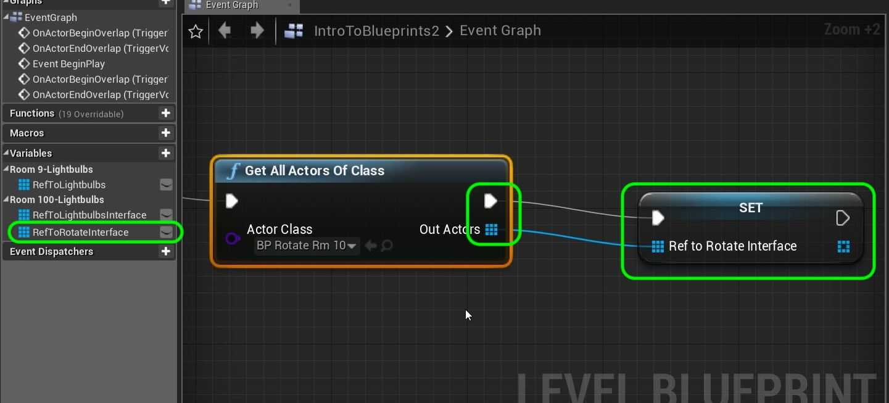

##### `Step 19.`\|`ITB`| :large_blue_diamond: :small_orange_diamond: :small_blue_diamond: :small_blue_diamond: :small_blue_diamond: :small_blue_diamond:

Now to rotate we need to keep calling the cube every frame the player is in the collision volume. There is only an enter and and exit event so we will need to add a boolean. First add an **Event Tick** node to call. Add a new **Variable** called `bRotateCube` and make it **Variable Type** called **Boolean**. *Set it* to **Private** and set it ot the **Room10Lightbulbs** Category. *Make sure* it is a single variable and not an array (no group of squares icon next to the **Variable Type**).

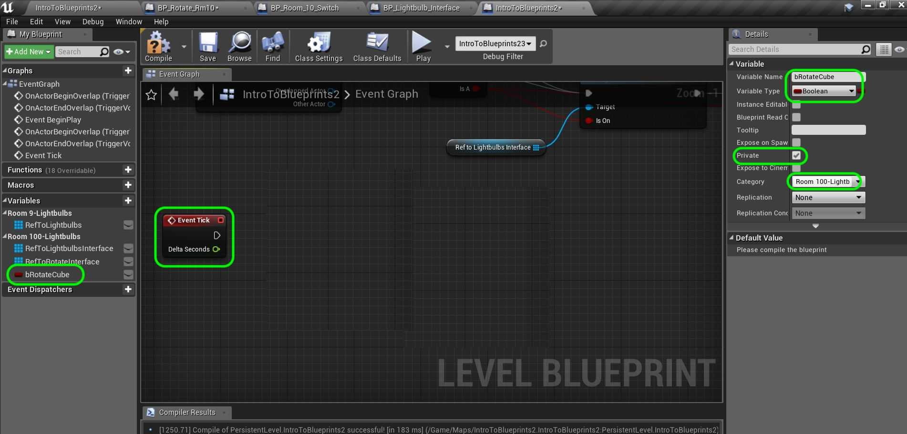

##### `Step 20.`\|`ITB`| :large_blue_diamond: :large_blue_diamond:

*Drag and drop* a **Get bRotateCube** variable onto the bottom of the **Event Graph**.

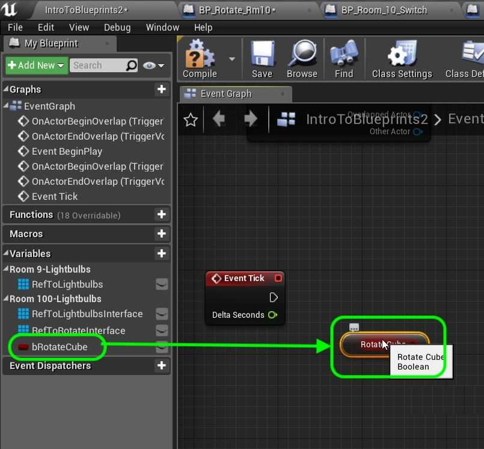

##### `Step 21.`\|`ITB`| :large_blue_diamond: :large_blue_diamond: :small_blue_diamond:

Add an **Event Tick** node.  *Drag and drop* a **Get RefToRotateInterface** variable to the chart. Add a **Turn Room 10 Switches on Off(Message)** node and connect the array output to the **Target** input.

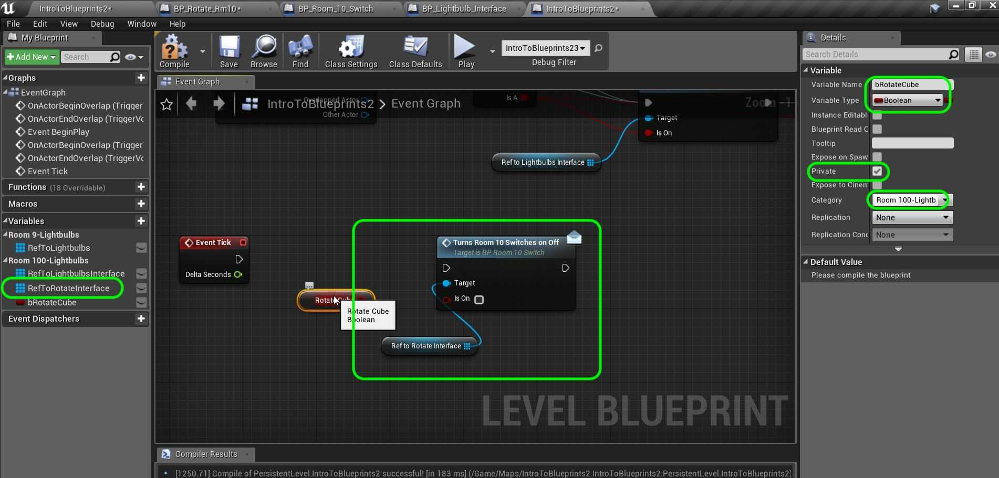

##### `Step 22.`\|`ITB`| :large_blue_diamond: :large_blue_diamond: :small_blue_diamond: :small_blue_diamond:

*Connect* the **Event Tick** execution pin to the **Turn Room 10 Switches on Off** pin and *connect* the **Rotate Cube** output boolean pin to the **Turn Room 10 Switches on Of**f node.

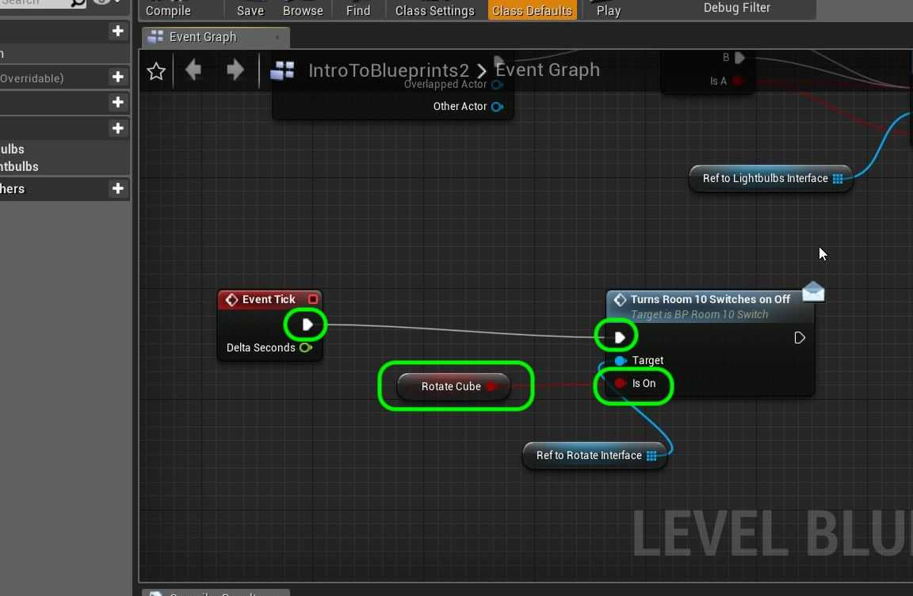

##### `Step 23.`\|`ITB`| :large_blue_diamond: :large_blue_diamond: :small_blue_diamond: :small_blue_diamond: :small_blue_diamond:

Now in the Overlap events we need to turn the **bRotateCube** boolean on and off. Go to the end and add a **Set bRotateCube** node. *Attach* the execution pin from the **Turns Room 10 Switches on Off** and *connect* it to the **Set** node. *Connect* the output **IsA** pin from the **Flip Flop** node to the** Rotate Cube** input in the **Set** node.

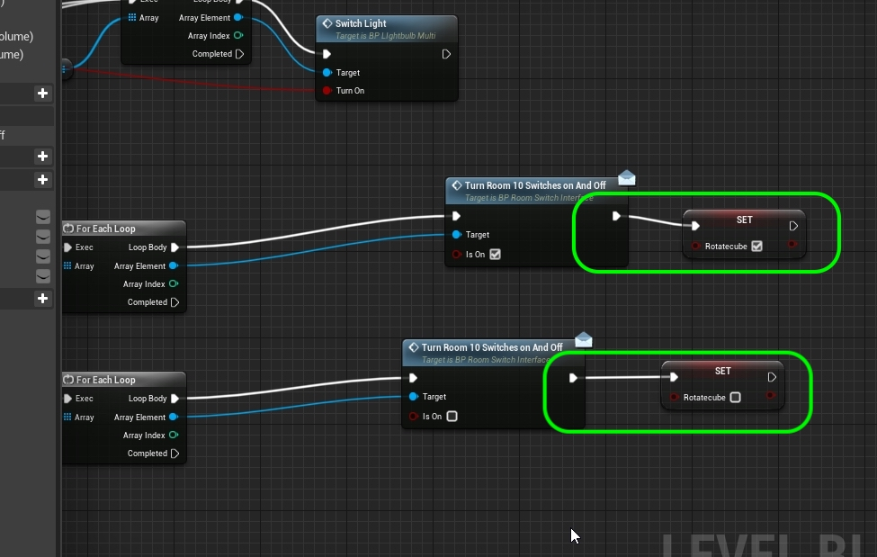

##### `Step 24.`\|`ITB`| :large_blue_diamond: :large_blue_diamond: :small_blue_diamond: :small_blue_diamond: :small_blue_diamond: :small_blue_diamond:

Now go to the game and play it. Notice that the single interface can trigger two completely different type of events!

##### `Step 25.`\|`ITB`| :large_blue_diamond: :large_blue_diamond: :small_orange_diamond:

That's it for **Room 10**. Press **Save All** and update Github by committing and pushing all the changes made. Next up we will be rotating around an actor.

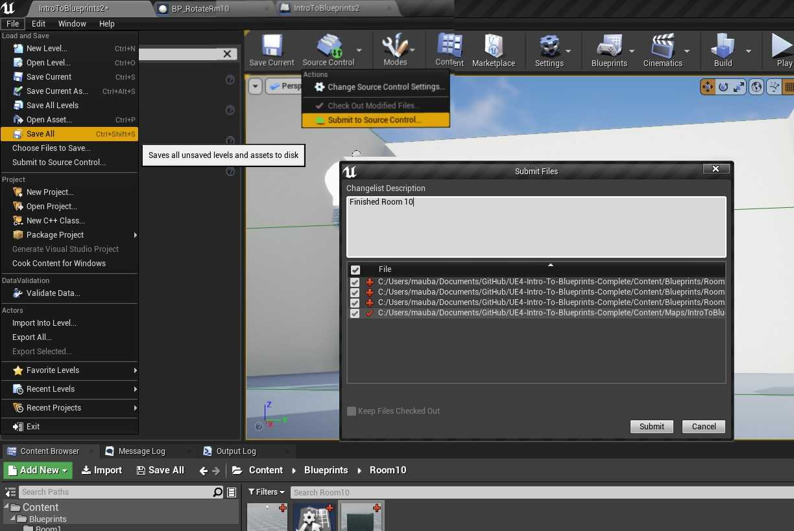

___

| [previous](../interface/README.md#user-content-communicate-through-interface)| [home](../README.md#user-content-ue4-blueprints) | [next](../orbiting-actors/README.md#user-content-orbiting-actors)|
|---|---|---|
