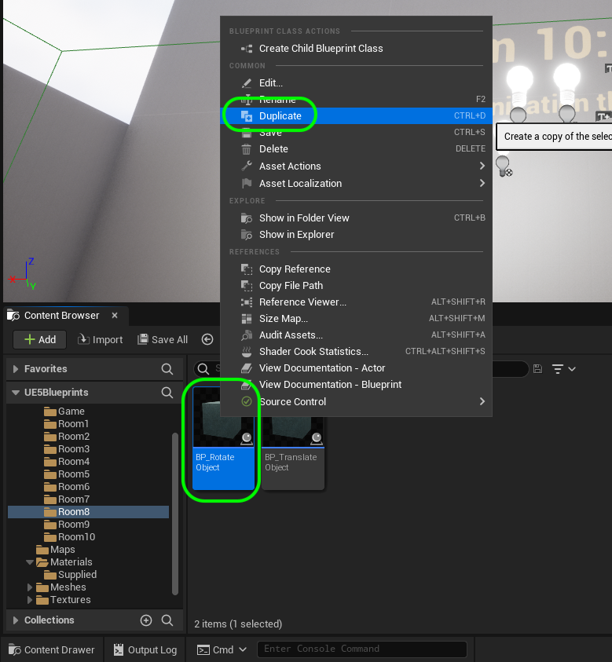
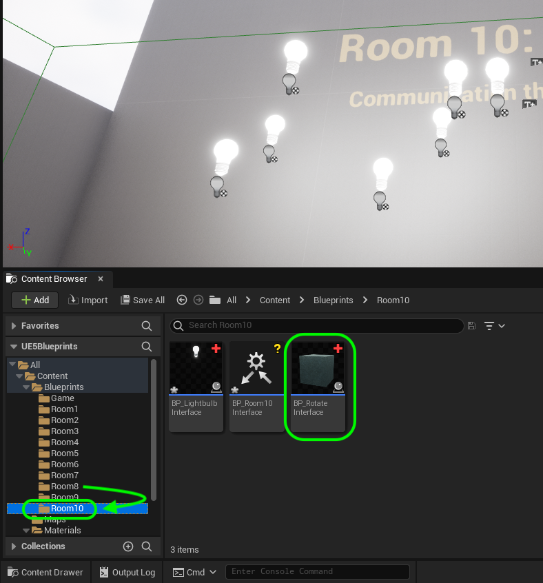
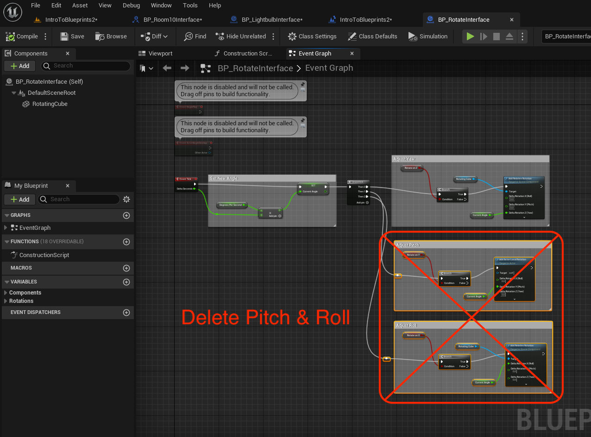
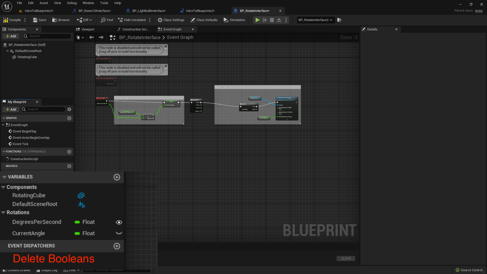
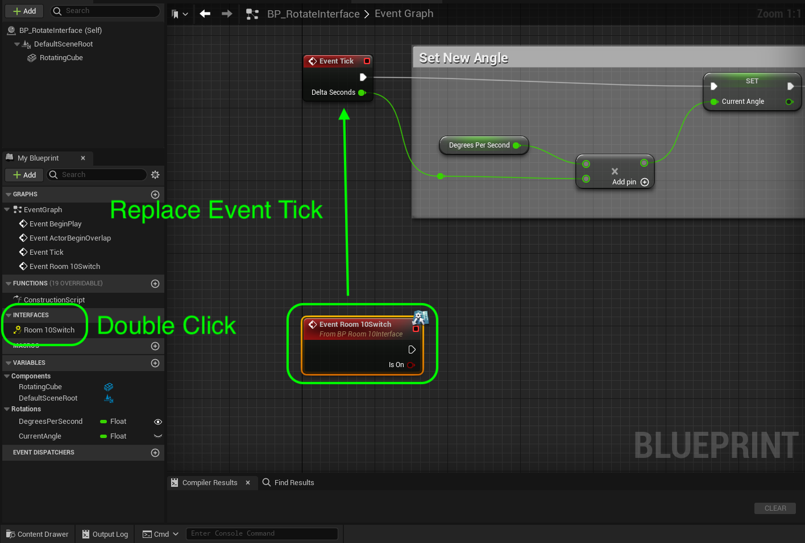
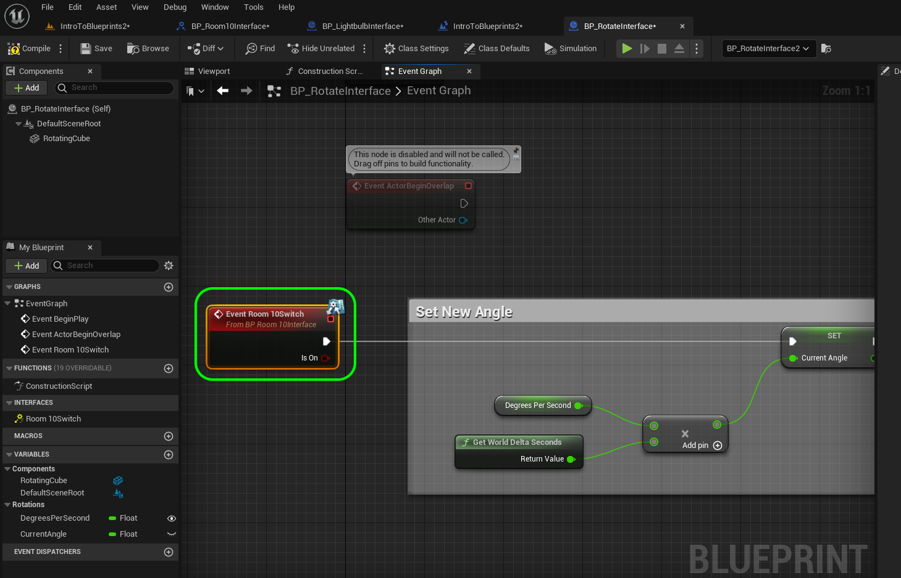
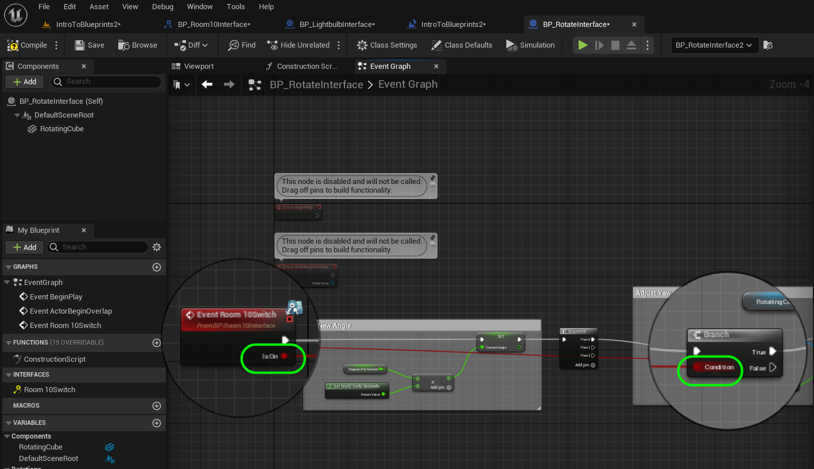
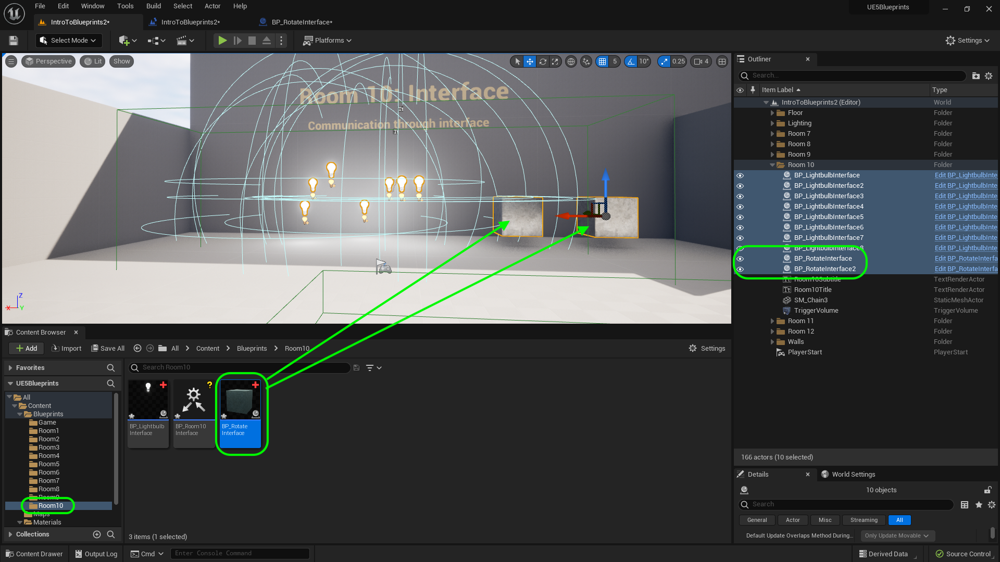

### Communicate Through Interface II

[previous](../interface/README.md#user-content-communicate-through-interface) • [home](../README.md#user-content-ue4-blueprints) • [next](../orbiting-actors/README.md#user-content-orbiting-actors)

Communicate through a blueprint interface part II

 

---

##### `Step 1.`\|`ITB`|:small_blue_diamond:

The power of this interface is that other objects can define the interface to do a different action.  So turning on might a light for a light switch, but could also have a TV that implements turning on by showing a movie on the screen. Lets add a cube that rotates when turned on and stops when turned off. Go to **Blueprints | Room 8** and *right click* on **BP_RotateObject** and select **Duplicate**.

##### `Step 2.`\|`FHIU`|:small_blue_diamond: :small_blue_diamond: 

Call it `BP_RotateInterface` and *drag it* into the **Room10** folder.

##### `Step 3.`\|`ITB`|:small_blue_diamond: :small_blue_diamond: :small_blue_diamond:

Open up the BP_Rotate_Rm10 blueprint. *Delete* all the Pitch and Roll nodes to leave just the Yaw.

##### `Step 4.`\|`ITB`|:small_blue_diamond: :small_blue_diamond: :small_blue_diamond: :small_blue_diamond:

Delete the three booleans **RotateOnZ**, **RotateOnY** and **RotateOnX**. We will be rotating the cube around only Z when the user enters the volume, so we will remove the switches.

##### `Step 5.`\|`ITB`| :small_orange_diamond:

Select **Interfaces** and double click the **BP_Room10Switch**. Replace the **Event Tick** with the interface event.  This way the user will trigger the interface in both the lightbulb and this new rotating cube.

##### `Step 6.`\|`ITB`| :small_orange_diamond: :small_blue_diamond:

Now remove the **Event Tick** node *connect* the output of the **BP_RoomSwitchInterface** execution pin to the **Set Degrees Since Las Frame** node.

##### `Step 7.`\|`ITB`| :small_orange_diamond: :small_blue_diamond: :small_blue_diamond:

Now we are missing the **Delta Seconds** that was fed by the **Event Tick** node. No problem we can get this value by *right clicking* and adding a **Get World Delta Seconds** node. *Connect* the output of the **Get World Delta Seconds** node to the empty **Multiplication** node. This is the exact same node, so we can get this without having to use the tick event.

##### `Step 8.`\|`ITB`| :small_orange_diamond: :small_blue_diamond: :small_blue_diamond: :small_blue_diamond:

*Connect* the **Is On** output pin from the **Event** node and connect it to the **Condition** pin in the **Branch** node. *Press* the <kbd>Compile</kbd> button.

##### `Step 9.`\|`ITB`| :small_orange_diamond: :small_blue_diamond: :small_blue_diamond: :small_blue_diamond: :small_blue_diamond:

Go to the **Level Blueprint** for **IntroToBlueprints2** and *right click* on **RefToLightbulbsInterface** and select **Duplicate**. Name it `RefToRotateInterface` and change the type to **BP_RotateRoom10 | Object Reference**. Update the **Tooltip**.

##### `Step 10.`\|`ITB`| :large_blue_diamond:

##### `Step 11.`\|`ITB`| :large_blue_diamond: :small_blue_diamond: 

##### `Step 12.`\|`ITB`| :large_blue_diamond: :small_blue_diamond: :small_blue_diamond: 

##### `Step 13.`\|`ITB`| :large_blue_diamond: :small_blue_diamond: :small_blue_diamond:  :small_blue_diamond: 

##### `Step 14.`\|`ITB`| :large_blue_diamond: :small_blue_diamond: :small_blue_diamond: :small_blue_diamond:  :small_blue_diamond: 

Drag two **BP_RotateInterface** in the room.

##### `Step 15.`\|`ITB`| :large_blue_diamond: :small_orange_diamond: 

##### `Step 16.`\|`ITB`| :large_blue_diamond: :small_orange_diamond:   :small_blue_diamond: 

##### `Step 17.`\|`ITB`| :large_blue_diamond: :small_orange_diamond: :small_blue_diamond: :small_blue_diamond:

Now at the end of the **Begin Play** event *off* the last **Set** node execution pin and *add* a **Get All Actors Of Class** node and change the Actor Class to **BP_RotateRm10**.

##### `Step 18.`\|`ITB`| :large_blue_diamond: :small_orange_diamond: :small_blue_diamond: :small_blue_diamond: :small_blue_diamond:

Add a **Set RefToRotateInterface** node and connect the execution and array pins to the **Get All Actors Of Class** node.

##### `Step 19.`\|`ITB`| :large_blue_diamond: :small_orange_diamond: :small_blue_diamond: :small_blue_diamond: :small_blue_diamond: :small_blue_diamond:

Now to rotate we need to keep calling the cube every frame the player is in the collision volume. There is only an enter and and exit event so we will need to add a boolean. First add an **Event Tick** node to call. Add a new **Variable** called `bRotateCube` and make it **Variable Type** called **Boolean**. *Set it* to **Private** and set it ot the **Room10Lightbulbs** Category. *Make sure* it is a single variable and not an array (no group of squares icon next to the **Variable Type**).

##### `Step 20.`\|`ITB`| :large_blue_diamond: :large_blue_diamond:

*Drag and drop* a **Get bRotateCube** variable onto the bottom of the **Event Graph**.

##### `Step 21.`\|`ITB`| :large_blue_diamond: :large_blue_diamond: :small_blue_diamond:

*Drag and drop* a **Get RefToRotateInterface** variable to the chart. Add a **Turn Room 10 Switches on Off(Message)** node and connect the array output to the **Target** input.

##### `Step 22.`\|`ITB`| :large_blue_diamond: :large_blue_diamond: :small_blue_diamond: :small_blue_diamond:

*Connect* the **Event Tick** execution pin to the **Turn Room 10 Switches on Off** pin and *connect* the **Rotate Cube** output boolean pin to the **Turn Room 10 Switches On and Off | IsOn** node.

##### `Step 23.`\|`ITB`| :large_blue_diamond: :large_blue_diamond: :small_blue_diamond: :small_blue_diamond: :small_blue_diamond:

Now in the Overlap events we need to turn the **bRotateCube** boolean on and off. Go to the end and add two **Set bRotateCube** nodes. *Attach* the execution pin from both **Turns Room 10 Switches on Off** nodes and *connect* it to the **Set** nodes. Set the **RotateCube** boolean to `true` on the begin overlap and to `false` on the end overlap pathway.

##### `Step 24.`\|`ITB`| :large_blue_diamond: :large_blue_diamond: :small_blue_diamond: :small_blue_diamond: :small_blue_diamond: :small_blue_diamond:

Now go to the game and play it. Notice that the single interface can trigger two completely different type of events!

##### `Step 25.`\|`ITB`| :large_blue_diamond: :large_blue_diamond: :small_orange_diamond:

That's it for **Room 10**. Press **Save All** and update Github by committing and pushing all the changes made. Next up we will be rotating around an actor.

<!--  -->

| [previous](../interface/README.md#user-content-communicate-through-interface)| [home](../README.md#user-content-ue4-blueprints) | [next](../orbiting-actors/README.md#user-content-orbiting-actors)|
|---|---|---|
