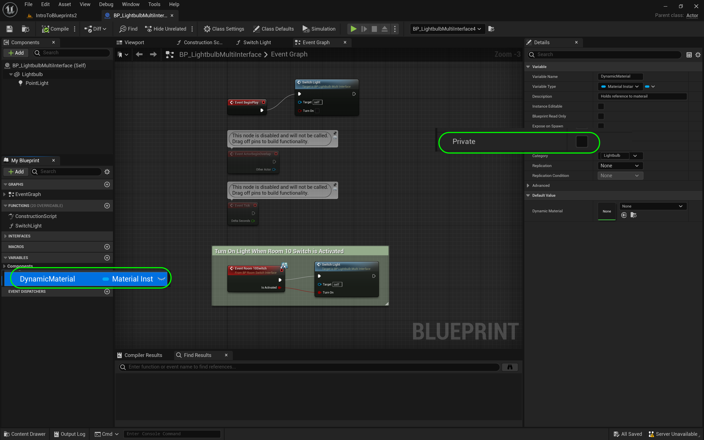

### Communicate Through Interface II

[previous](../interface/README.md#user-content-communicate-through-interface) • [home](../README.md#user-content-ue4-blueprints) • [next](../orbiting-actors/README.md#user-content-orbiting-actors)

Communicate through a blueprint interface part II.  Now we will be demonstrating the real power of an interface.  We can inherit from our lightbulb blueprint and override the interface so we have a custom implementation when it is called.

 

---

##### `Step 1.`\|`ITB`|:small_blue_diamond:

The power of this interface is that other objects can define the interface to do a different action.  So turning on might a light for a light switch, but could also have a TV that implements turning on by showing a movie on the screen. You can also inherit from the same object class and define a different implementation for the interface as well.

Lets another light but this time it will be blue. Go to **Blueprints | Room 10** and *right click* on **BP_LightbulbMultiInterface** and select **Create Child Blueprint Class** and name it `BP_LightbulbMultiInterfaceBlue`. 

##### `Step 2.`\|`FHIU`|:small_blue_diamond: :small_blue_diamond: 

Now this is different than duplicating as it is now a child class and calls its parents behavior.  Notice all your events and functions like **Event Tick** call their parents behavior so they will act the same.  In this case it calls **Parent: Tick**. So when it runs it will be exactly the same.

##### `Step 3.`\|`ITB`|:small_blue_diamond: :small_blue_diamond: :small_blue_diamond:

Now the first things we need to do is open the parent **BP_LightbulbMultiInterface** and change the variable **Dynamic Material** to no longer be **Private** by setting it to `false`.  We want to access this in the child blueprint we just made and can't if it is a private variable.  To acccess a parent variable it must be public.

##### `Step 4.`\|`ITB`|:small_blue_diamond: :small_blue_diamond: :small_blue_diamond: :small_blue_diamond:

Now just like the tick was calling its parent behavior we want to override the way we implemented the interface in the parent.  So go to **Function | Override** and select `Room10Switch`.  You will see an event **Room10Switch** be added to the graph.

##### `Step 5.`\|`ITB`| :small_orange_diamond:

Now this is overriding the parent behavior.  But we want the light to turn on and off with the parent.  So we can call it.  Right click on on the **Event Room10Switch** node and select **Add Call to Parent Function**.  This will add a **Parent: Room10Switch** node to the chart.  Connect the execuation pins as well as **bIsActivated** to **bIsActivated** on the parent call.

##### `Step 6.`\|`ITB`| :small_orange_diamond: :small_blue_diamond:

Now remove the **Event Tick** node *connect* the output of the **BP_RoomSwitchInterface** execution pin to the **Set Degrees Since Las Frame** node.

##### `Step 7.`\|`ITB`| :small_orange_diamond: :small_blue_diamond: :small_blue_diamond:

Now we are missing the **Delta Seconds** that was fed by the **Event Tick** node. No problem we can get this value by *right clicking* and adding a **Get World Delta Seconds** node. *Connect* the output of the **Get World Delta Seconds** node to the empty **Multiplication** node. This is the exact same node, so we can get this without having to use the tick event.

##### `Step 8.`\|`ITB`| :small_orange_diamond: :small_blue_diamond: :small_blue_diamond: :small_blue_diamond:

*Connect* the **Is On** output pin from the **Event** node and connect it to the **Condition** pin in the **Branch** node. *Press* the <kbd>Compile</kbd> button.

##### `Step 9.`\|`ITB`| :small_orange_diamond: :small_blue_diamond: :small_blue_diamond: :small_blue_diamond: :small_blue_diamond:

Go to the **Level Blueprint** for **IntroToBlueprints2** and *right click* on **Room10References** and select **Duplicate**. Name it `Room10ReferencesCubes` and change the type to **BP_RotateInterface**. Update the **Tooltip**.

##### `Step 10.`\|`ITB`| :large_blue_diamond:

Now at the end of the **Begin Play** event *off* the last **Set** node execution pin and *add* a **Get All Actors Of Class** node 

##### `Step 11.`\|`ITB`| :large_blue_diamond: :small_blue_diamond: 

*Change* the Actor Class to **BP_RotateInterface** and make sure the execution pins are connected.

##### `Step 12.`\|`ITB`| :large_blue_diamond: :small_blue_diamond: :small_blue_diamond: 

Add a **Set RefToRotateInterface** node and connect the execution and array pins to the **Get All Actors Of Class** node. Add a comment around these two nodes.

##### `Step 13.`\|`ITB`| :large_blue_diamond: :small_blue_diamond: :small_blue_diamond:  :small_blue_diamond: 

Now to rotate we need to keep calling the cube every frame the player is in the collision volume. There is only an enter and and exit event so we will need to add a boolean. Add a new **Variable** called `RotateCube` and make it **Variable Type** called **Boolean**. *Set it* to **Private** and set it ot the **Room 10** Category. *Make sure* it is a single variable and not an array (no group of squares icon next to the **Variable Type**).

##### `Step 14.`\|`ITB`| :large_blue_diamond: :small_blue_diamond: :small_blue_diamond: :small_blue_diamond:  :small_blue_diamond: 

Right click and add the **Event Tick** back to the bottom of the graph. *Drag and drop* a **Get RotateCube** variable next to it.

##### `Step 15.`\|`ITB`| :large_blue_diamond: :small_orange_diamond: 

*Drag and drop* a **Get RefToRotateInterface** variable to the chart. Add a **Turn Room 10 Switches on Off(Message)** node.

##### `Step 16.`\|`ITB`| :large_blue_diamond: :small_orange_diamond:   :small_blue_diamond: 

*Connect* the array output of **Room 10ReferencesCubes** to the **Target** input of the **Room 10 Switch** message. *Connect* the **Event Tick** execution pin to the **Turn Room 10 Switch** pin and *connect* the **Rotate Cube** output boolean pin to the **Turn Room 10 Switch | IsOn** node.

What this will do is trigger that message in the interface to fire in each cube as they need to be called every frame not just when the player enters the volume.

##### `Step 17.`\|`ITB`| :large_blue_diamond: :small_orange_diamond: :small_blue_diamond: :small_blue_diamond:

Now in the Overlap events we need to turn the **bRotateCube** boolean on and off. Go to the end and add two **Set bRotateCube** nodes. *Attach* the execution pin from both **Turns Room 10 Switch** nodes and *connect* it to the **Set** nodes. Set the **RotateCube** boolean to `true` on the begin overlap and to `false` on the end overlap pathway. Add a comment on top of these nodes

##### `Step 18.`\|`ITB`| :large_blue_diamond: :small_orange_diamond: :small_blue_diamond: :small_blue_diamond: :small_blue_diamond:

Drag two **BP_RotateInterface** in the room. Make sure they are in the **Room 10** folder in the **Outliner**.

##### `Step 19.`\|`ITB`| :large_blue_diamond: :small_orange_diamond: :small_blue_diamond: :small_blue_diamond: :small_blue_diamond: :small_blue_diamond:

Now go to the game and play it. Notice that the single interface can trigger two completely different type of events!

https://user-images.githubusercontent.com/5504953/193569015-26620727-ace0-4fe5-a179-3c3fabb14a10.mp4

##### `Step 20.`\|`ITB`| :large_blue_diamond: :large_blue_diamond:

Select the **File | Save All** then quit UE5.   Go to **P4V** and go the top project folder (the one that holds the `.uproject` file and **Content** folder) and press the <kbd>+Add</kbd> then <kbd>OK</kbd> button.  This makes sure any files that Unreal didn't add get added to source control. Press the <kbd>Submit</kbd> button and enter a message explaining the work done.  Press <kbd>Submit</kbd>.

<!--  -->

| [previous](../interface/README.md#user-content-communicate-through-interface)| [home](../README.md#user-content-ue4-blueprints) | [next](../orbiting-actors/README.md#user-content-orbiting-actors)|
|---|---|---|
