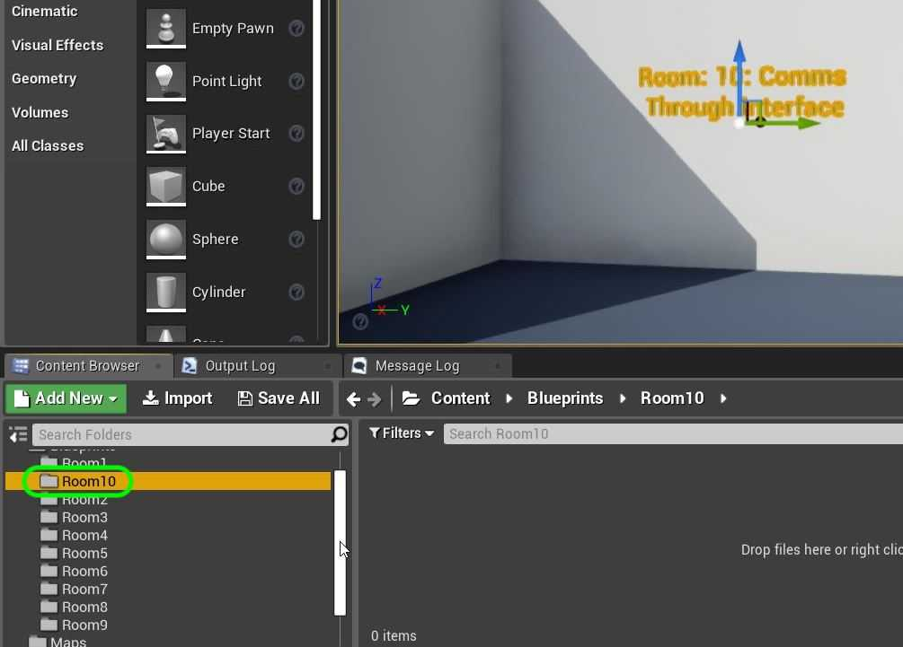
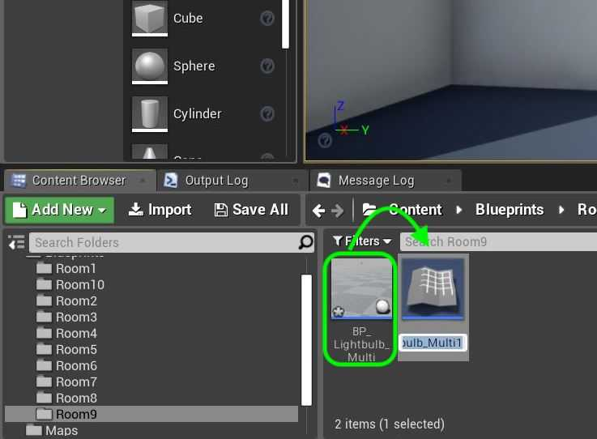
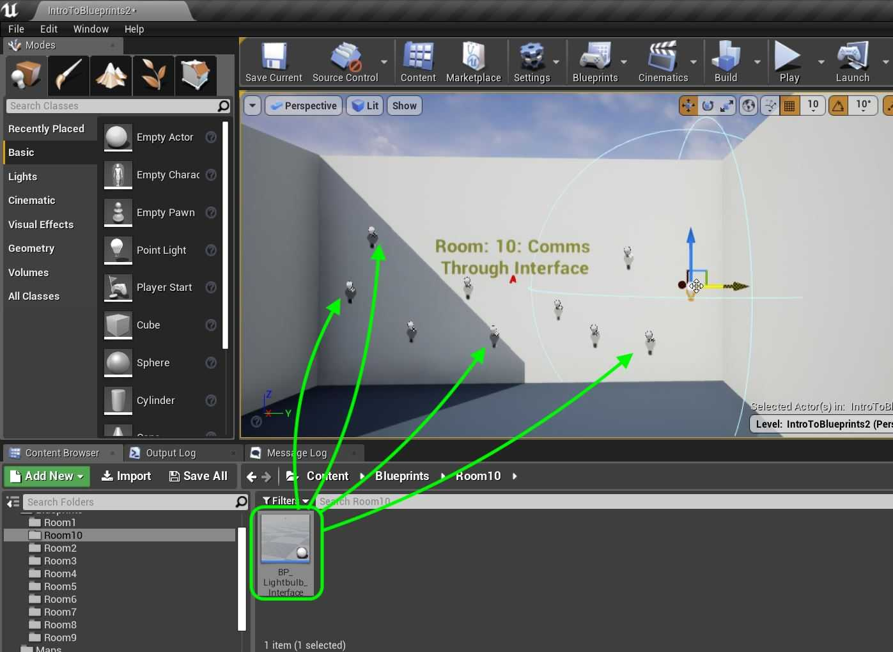
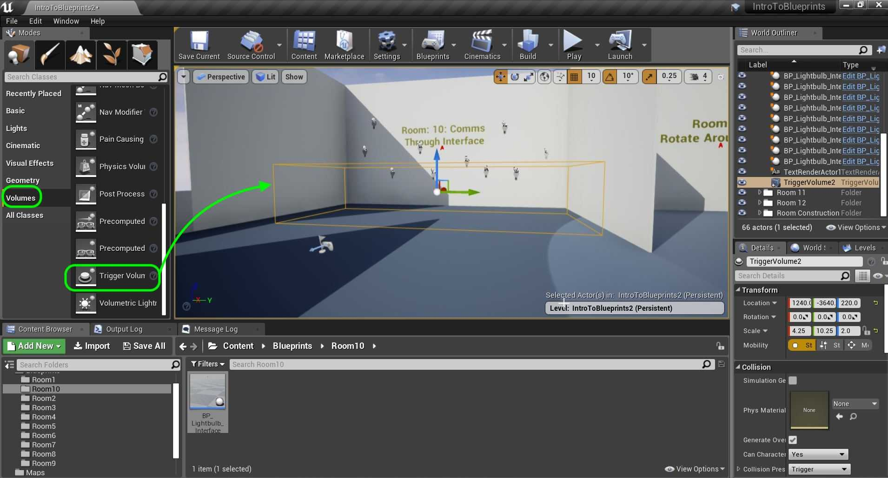
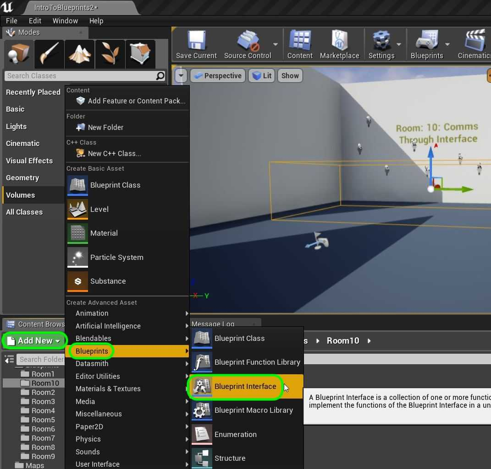

### Communicate Through Interface

[previous](../multiple-actors-ii/README.md#user-content-dynamically-alter-multiple-classes-ii) • [home](../README.md#user-content-ue4-blueprints) • [next](../interface-ii/README.md#user-content-communicate-through-interface-ii)

What if we wanted a single event in the game interact with different objects differently (run different functions)? We can use an interface to implement as we like in each blueprint class. Interfaces (or abstract classes in C++) are very useful in game development. It enforces a structure on multiple objects so that we can call events and functions in all of them. I will show you a very simple use of an interface in this example. This is another way we can interface between actors. This allows us to communicate to multiple actor classes with one paradigm.

 

---

##### `Step 1.`\|`ITB`|:small_blue_diamond:

Scooch the camera over to **Room 10**. Add a `Room10` folder to the **Content Browser**.

##### `Step 2.`\|`FHIU`|:small_blue_diamond: :small_blue_diamond: 

*Right click* on **Room 9 | BP_LightbulbMulti** and *duplicate* it.

##### `Step 3.`\|`ITB`|:small_blue_diamond: :small_blue_diamond: :small_blue_diamond:

*Call* the new blueprint `BP_LightbulbMultiInterface`. Move to **Room10**.

##### `Step 4.`\|`ITB`|:small_blue_diamond: :small_blue_diamond: :small_blue_diamond: :small_blue_diamond:

*Drag and drop* several **BP_LightbulbMultiInterface** into room 10.

##### `Step 5.`\|`ITB`| :small_orange_diamond:

Drag a **Trigger Volume** to the level. Scale it to be in front where you can walk in and out of it in the room. *Clean* up the **World Outliner** by dragging all blueprints and the trigger volume into **Room 10**.

##### `Step 6.`\|`ITB`| :small_orange_diamond: :small_blue_diamond:

We are going to now create a special blueprint that will bridge multiple object. Press Add New and select **Blueprints | Blueprint Interface**. This ios not like a regular blueprint class but creates an interface that multiple blueprints can communicate through.

> A [Blueprint Interface](https://docs.unrealengine.com/4.26/en-US/ProgrammingAndScripting/Blueprints/UserGuide/Types/Interface/) is a collection of one or more functions - name only, no implementation - that can be added to other Blueprints. Any Blueprint that has the Interface added is guaranteed to have those functions. The functions of the Interface can be given functionality in each of the Blueprints that added it. This is essentially like the concept of an interface in general programming, which allows multiple different types of Objects to all share and be accessed through a common interface. Put simply, Blueprint Interfaces allow different Blueprints to share with and send data to one another. - UE4 manual

##### `Step 7.`\|`ITB`| :small_orange_diamond: :small_blue_diamond: :small_blue_diamond:

##### `Step 8.`\|`ITB`| :small_orange_diamond: :small_blue_diamond: :small_blue_diamond: :small_blue_diamond:

##### `Step 9.`\|`ITB`| :small_orange_diamond: :small_blue_diamond: :small_blue_diamond: :small_blue_diamond: :small_blue_diamond:

##### `Step 10.`\|`ITB`| :large_blue_diamond:

##### `Step 11.`\|`ITB`| :large_blue_diamond: :small_blue_diamond: 

##### `Step 12.`\|`ITB`| :large_blue_diamond: :small_blue_diamond: :small_blue_diamond: 

##### `Step 13.`\|`ITB`| :large_blue_diamond: :small_blue_diamond: :small_blue_diamond:  :small_blue_diamond: 

##### `Step 14.`\|`ITB`| :large_blue_diamond: :small_blue_diamond: :small_blue_diamond: :small_blue_diamond:  :small_blue_diamond: 

##### `Step 15.`\|`ITB`| :large_blue_diamond: :small_orange_diamond: 

##### `Step 16.`\|`ITB`| :large_blue_diamond: :small_orange_diamond:   :small_blue_diamond: 

##### `Step 17.`\|`ITB`| :large_blue_diamond: :small_orange_diamond: :small_blue_diamond: :small_blue_diamond:

##### `Step 18.`\|`ITB`| :large_blue_diamond: :small_orange_diamond: :small_blue_diamond: :small_blue_diamond: :small_blue_diamond:

##### `Step 19.`\|`ITB`| :large_blue_diamond: :small_orange_diamond: :small_blue_diamond: :small_blue_diamond: :small_blue_diamond: :small_blue_diamond:

##### `Step 20.`\|`ITB`| :large_blue_diamond: :large_blue_diamond:

##### `Step 21.`\|`ITB`| :large_blue_diamond: :large_blue_diamond: :small_blue_diamond:

___

| [previous](../multiple-actors-ii/README.md#user-content-dynamically-alter-multiple-classes-ii)| [home](../README.md#user-content-ue4-blueprints) | [next](../interface-ii/README.md#user-content-communicate-through-interface-ii)|
|---|---|---|
