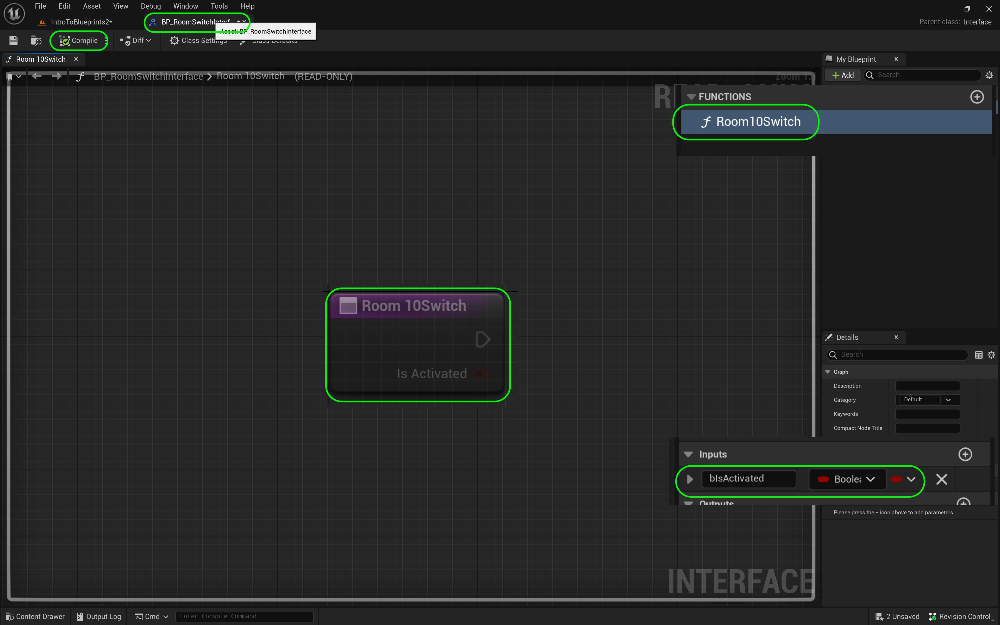
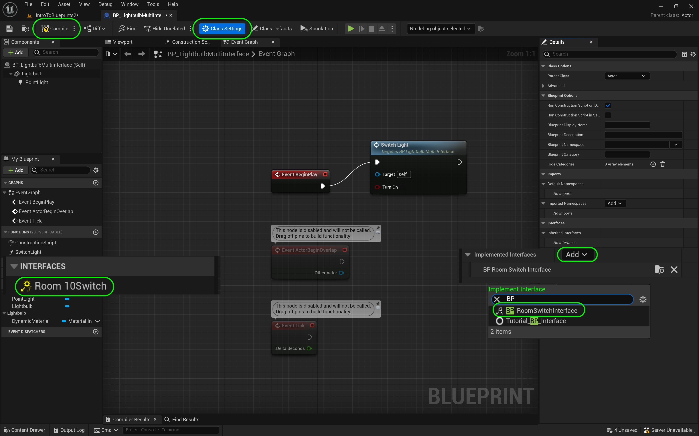
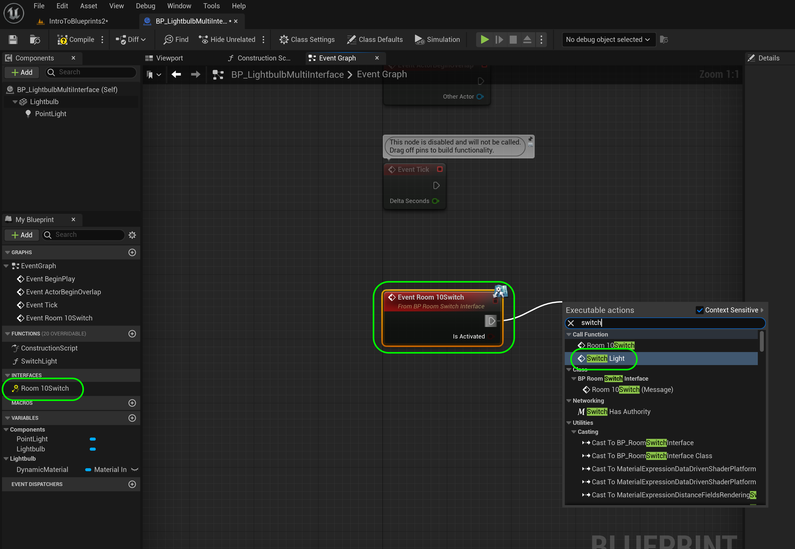
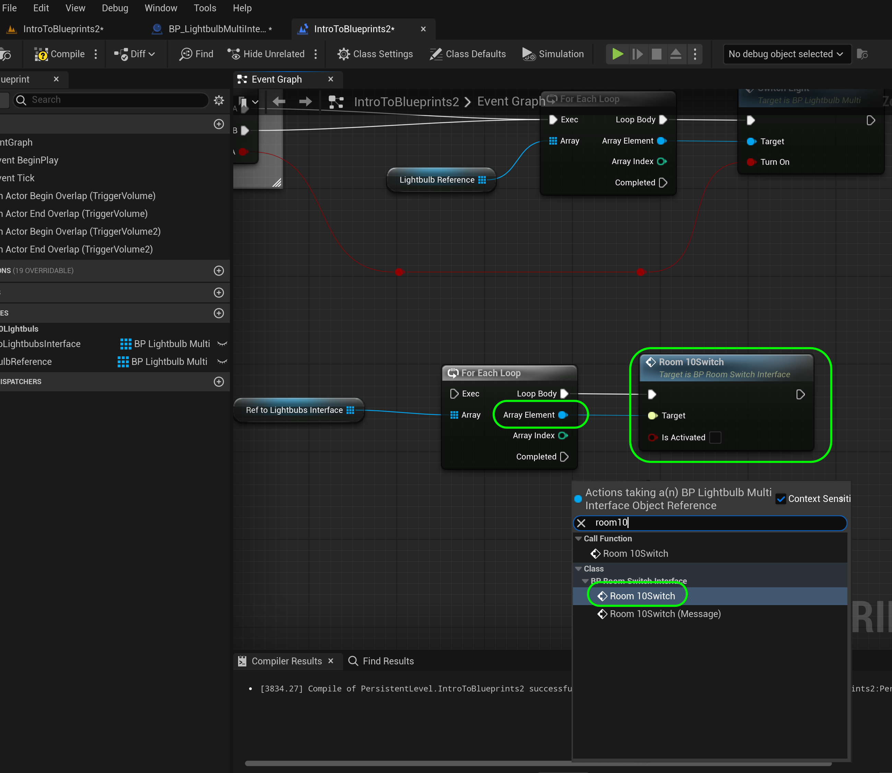

### Communicate Through Interface

[previous](../multiple-actors-ii/README.md#user-content-dynamically-alter-multiple-classes-ii) • [home](../README.md#user-content-ue4-blueprints) • [next](../interface-ii/README.md#user-content-communicate-through-interface-ii)

What if we wanted a single event in the game interact with different objects differently (run different functions)? We can use an interface to implement as we like in each blueprint class. Interfaces (or abstract classes in C++) are very useful in game development. It enforces a structure on multiple objects so that we can call events and functions in all of them. I will show you a very simple use of an interface in this example. This is another way we can interface between actors. This allows us to communicate to multiple actor classes with one paradigm.

 

---

##### `Step 1.`\|`ITB`|:small_blue_diamond:

Scooch the camera over to **Room 10**. Add a `Blueprints | Room10` folder to the **Content Browser**.

##### `Step 2.`\|`FHIU`|:small_blue_diamond: :small_blue_diamond: 

*Right click* on **Room 9 | BP_LightbulbMulti** and *duplicate* it. *Call* the new blueprint `BP_LightbulbMultiInterface`. 

##### `Step 3.`\|`ITB`|:small_blue_diamond: :small_blue_diamond: :small_blue_diamond:

Move **BP_LightbulbMultiInterface** to **Room10**.

##### `Step 4.`\|`ITB`|:small_blue_diamond: :small_blue_diamond: :small_blue_diamond: :small_blue_diamond:

*Drag and drop* around ten **BP_LightbulbMultiInterface** into room 10. Move the blueprints into the **Room 10** folder in the **Outliner**.

##### `Step 5.`\|`ITB`| :small_orange_diamond:

Drag a **Trigger Volume** to the level. Scale it to be in front where you can walk in and out of it in the room. I chose a **Brush Size** of `2000, 900, 8000` on **X, Y, Z** respectively. *Clean* up the **World Outliner** by dragging all blueprints and the trigger volume into **Room 10**. Adjust the **Brush Settings** so that the volume takes up the front part of the room that the player can walk in and out of.

##### `Step 6.`\|`ITB`| :small_orange_diamond: :small_blue_diamond:

Rotate the **Player Start** actor so it faces room 10.

##### `Step 7.`\|`ITB`| :small_orange_diamond: :small_blue_diamond: :small_blue_diamond:

We are going to now create a special blueprint that will bridge multiple object. Go to **Blueprints | Room 10** and *press* **Add/Immport** and *select* **Blueprints | Blueprint Interface**. *Name* it `BP_RoomSwitchInterface`. 

This is not like a regular blueprint class but creates an interface that multiple blueprints can share common functions.

> A [Blueprint Interface](https://docs.unrealengine.com/4.26/en-US/ProgrammingAndScripting/Blueprints/UserGuide/Types/Interface/) is a collection of one or more functions - name only, no implementation - that can be added to other Blueprints. Any Blueprint that has the Interface added is guaranteed to have those functions. The functions of the Interface can be given functionality in each of the Blueprints that added it. This is essentially like the concept of an interface in general programming, which allows multiple different types of Objects to all share and be accessed through a common interface. Put simply, Blueprint Interfaces allow different Blueprints to share with and send data to one another. - UE4 manual

##### `Step 8.`\|`ITB`| :small_orange_diamond: :small_blue_diamond: :small_blue_diamond: :small_blue_diamond:

Open this new blueprint. Notice it is read only. It is a virtual interface so you will define it in the actors. We never put nodes in an interface. This is completely blank. But we get a default function (you can have more than one if you like). Rename **NewFunction_0** to `Room10Switch`. We can also add parameters to the function. *Select* **Room10Switch** on the graph and *press* the **+** button next to **Inputs** and call this variable `bIsActivated` and make it type **Boolean**. Leave its default value at `false`.  *Press* the <kbd>Compile</kbd> button.

All other blueprints we use in room 10 will *subscribe* to this interface will be define this method.  Then when the interface is called all objects that define it will run.  This means that each object can behave differently.

##### `Step 9.`\|`ITB`| :small_orange_diamond: :small_blue_diamond: :small_blue_diamond: :small_blue_diamond: :small_blue_diamond:

Open up **BP_LightbulbMultiInterface** as we are going to subcribe to the **Interface**. This is a commitment that we will implement the one interface function with a parameter that we have created. Press the **Class Settings** *tab* and in the **Details** panel press the **Implemented Interfaces | Add** dropdown menu and select the **BP_RoomSwitchInterface** we just created. Then most importantly,finish by pressing the <kbd>Compile</kbd> button. On the left hand side you should see the method for that interface pop up **Room 10 Switch**.

##### `Step 10.`\|`ITB`| :large_blue_diamond:

Each actor that subscribes to it can create its own definition. This means that the behavior can be customized PER actor class. Double click on the **Interface | Room 10 Switch**. This adds an event so there is an execution pin. Now call the **Switch Light** function by adding its node. This means that when this is called and it is activated it will call switch light. If it is activated the boolean will be true and it will turn the light on and if not it will be false and turn the light off.

##### `Step 11.`\|`ITB`| :large_blue_diamond: :small_blue_diamond: 

*Attach* the execution pins and the boolean pins between **bIsActivated** to **bTurnOn**. This will run the function we previously wrote to turn the light on and off. *Press* the <kbd>Compile</kbd> button.

##### `Step 12.`\|`ITB`| :large_blue_diamond: :small_blue_diamond: :small_blue_diamond: 

Open up the **Level Blueprint**. It is called **Intro to Blueprints 2**. Press the **+** button next to **Variables** and add a new variable called `RefToLightbulbsInterface`. Make it type **BP_LightbulbMultiInterface | Object Reference**.

*Press* the arrow icon next to the **Variable Type** and select an **Array**.

An [array](https://en.wikipedia.org/wiki/Array_programming) is a list of variables.  They can only be of a single type.  So this is creating an array of a reference to all the instances of the lightbulb in the room.

Add a **Description** with `Keeps array of all room 10 lightbulbs`. Set **Private** to `true` and add it to category `Room10Lightbulb`.

##### `Step 13.`\|`ITB`| :large_blue_diamond: :small_blue_diamond: :small_blue_diamond:  :small_blue_diamond: 

In the **Event Graph** *add* to the nodes that are attached to **Begin Play**. Add a **Get All Actors of Class** node and select a **BP_LightbulbMultiInterface** class.

##### `Step 14.`\|`ITB`| :large_blue_diamond: :small_blue_diamond: :small_blue_diamond: :small_blue_diamond:  :small_blue_diamond: 

Drag a copy of **RefToLightbulbsInterface** and add a **Set** node. Connect the execution pins and the **Out Actors** array node to the **RefToLightbulbsInterface** node.

##### `Step 15.`\|`ITB`| :large_blue_diamond: :small_orange_diamond: 

Make sure you still have the Trigger Volume selected in game. *Right click* on the event graph and select **Add Event for Trigger Volume 2 | Collision | Add On Actor Begin Overlap** AND **Add On Actor End Overlap**.

##### `Step 16.`\|`ITB`| :large_blue_diamond: :small_orange_diamond:   :small_blue_diamond: 

*Right click* on the graph and add a **Get Ref to Ligthbulbs Interface** node. Pull off the *array* pin and select a **For Each Loop** node to go into each lightbulb to turn it on and off.

##### `Step 17.`\|`ITB`| :large_blue_diamond: :small_orange_diamond: :small_blue_diamond: :small_blue_diamond:

Now we want to call the event that the **BP_LightbulbMultiInterface** subscribed to.  *Pull* off of the **Array Element** pin from the **For Each Loop** node and add a call the interface **Room10Switch**.  This array element pin is accessing a reference to each lightbulb in the loop and running the nodes that are part of the interface definition in that blueprint (BP_LightbulbMultiInterface). Connect the execution pins from the **For Each Loop** to the **Room 10 Switch** nodes.

##### `Step 18.`\|`ITB`| :large_blue_diamond: :small_orange_diamond: :small_blue_diamond: :small_blue_diamond: :small_blue_diamond:

*Connect* the  execution pins from **Begin Overlap** node to the **For Each Loop** to the **Turn Room 10 Switches On And Off** nodes.  Change **IsActivated** pin to be set to `true` (ticked) as this is the activated state.  Then copy the **For Each** and **Room10Switch** nodes and connect them to the **End Overlap** node and make **IsOn** `false` (un-ticked) as it is turning the light off. Connect the **For Each | Array** to the same **Ref to Lightbulbs Interface** array variables.

##### `Step 19.`\|`ITB`| :large_blue_diamond: :small_orange_diamond: :small_blue_diamond: :small_blue_diamond: :small_blue_diamond: :small_blue_diamond:

Now we have the bluprint calling the interface and passing all the lights in the room. We also have the interface implemented in the lightbulb that turns on and off. Run the game and walk in and out of the volume.

https://user-images.githubusercontent.com/5504953/193556800-df42a2e9-0c38-47bc-8442-7f82d28fa40a.mp4

<!--  -->

| [previous](../multiple-actors-ii/README.md#user-content-dynamically-alter-multiple-classes-ii)| [home](../README.md#user-content-ue4-blueprints) | [next](../interface-ii/README.md#user-content-communicate-through-interface-ii)|
|---|---|---|
