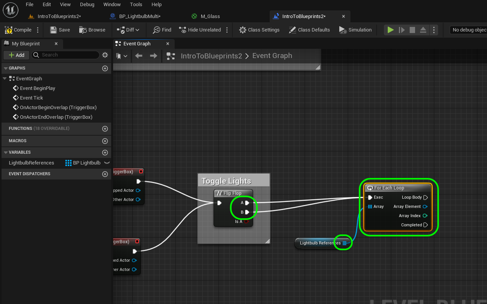
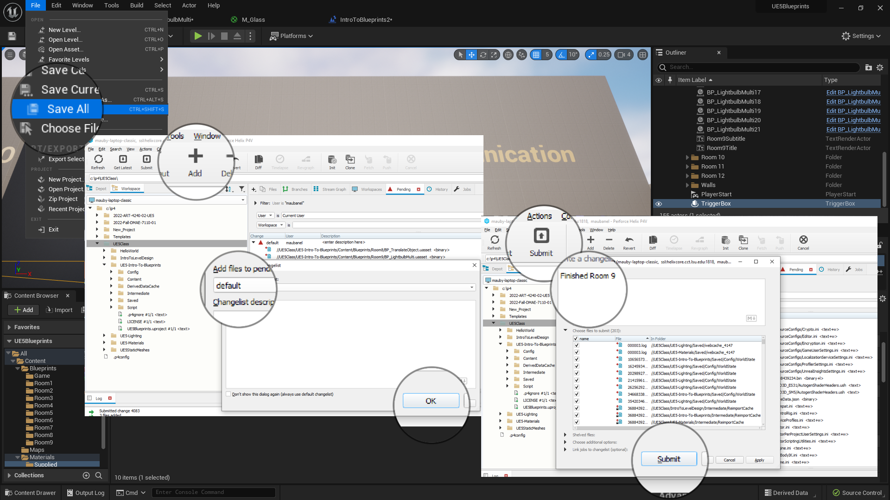

### Dynamically Alter Multiple Classes II

[previous](../multiple-actors/README.md#user-content-dynamically-alter-multiple-classes) • [home](../README.md#user-content-ue4-blueprints) • [next](../interface/README.md#user-content-communicate-through-interface)

Controlling multiple actors through level blueprints continued...

 

---

##### `Step 1.`\|`ITB`|:small_blue_diamond:

Now do we get access to any object that is in the room? This is easy go to the game and select the **Trigger Volume** you just selected. Make sure you still have the trigger volume selected in the editor. Right click on the graph and see that we can now access events to this game object. Select **Add Event for Trigger Box 0 | Collision | Add on Actor Begin Overlap** AND a **Add Event for Trigger Box 0 | Collision | Add on Actor End Overlap** node. This will trigger the nodes when an actor enters and leaves the volume.

##### `Step 2.`\|`FHIU`|:small_blue_diamond: :small_blue_diamond: 

So now you should have two events for when the player enters and leaves the volume.

##### `Step 3.`\|`ITB`|:small_blue_diamond: :small_blue_diamond: :small_blue_diamond:

*Add* a new **Variable** and make it **Variable Type** of **BP_LightbulbMulti | Object Reference** and call it `LightbulbReferences` and make it **Private**. What is the difference between **Object Reference** and **Class Reference**? The latter refers to the class as a whole and the **Object Reference** refers to each instance that is running. In this case we want to access each individual instance seperately. Next to **Variable** type *click* on the **icon** and select the **Grid** icon to store an **array** of all lightbulbs. The array type stores a list of objects of the same type.  So for **LightbulbReference** it will store a list of all the **BP_LightbulbMulti**'s in the level.  Add a **Description** saying `Holds reference to all the lightbulbs in Room 9`. 

https://user-images.githubusercontent.com/5504953/193477461-7465cd3c-1878-4e4b-91e3-4d9181c15ee6.mp4

##### `Step 4.`\|`ITB`|:small_blue_diamond: :small_blue_diamond: :small_blue_diamond: :small_blue_diamond:

Now we need to get all the instances of the lightbulbs in the room. Add an **Event Begin Play** node. Right click and add a **Get All Actors of Class**. When you see a node that has **Get All** you know that it will most likely output an array of values. In **Actor Class** select `BP_LightbulbMulti`. Connect the execution pins from **Begin Play** to **Get All Actors of Class**.

##### `Step 5.`\|`ITB`| :small_orange_diamond:

Now drag a copy of **Set Lightbulb Reference** and connect the output array pin to the input array pin of these nodes as shown. Connect the execution pin from **Get All Actors of Class** to **Set Lightbulb** nodes. Connect the execution pin from **Get All Actors from Class** to the **Set Lightbulb Reference** node.

##### `Step 7.`\|`ITB`| :small_orange_diamond: :small_blue_diamond: :small_blue_diamond:

Clean up your node graph and add a comment indicating that we are getting a reference to all the actors in the scene.

##### `Step 6.`\|`ITB`| :small_orange_diamond: :small_blue_diamond:

*Add* a **Flip Flop** node to the chart. This node when triggered toggles between true and false. Connect it to both the **Overlap** nodes. This way the first time you enter the volue it will switch on, then when you leave swtich off. This will continue this behavior during the game. What will happen is that the **IsA** boolean on the **Flip Flop** pin will change from **True** to **False** and back.

##### `Step 8.`\|`ITB`| :small_orange_diamond: :small_blue_diamond: :small_blue_diamond: :small_blue_diamond:

Add a comment by pressing the <kbd>C</kbd> and call it `Toggle Lights`. *Drag* a copy of the **Get RefToLightbulbs** variable onto the graph.

##### `Step 9.`\|`ITB`| :small_orange_diamond: :small_blue_diamond: :small_blue_diamond: :small_blue_diamond: :small_blue_diamond:

How do we get access to each instance of each lightbulb in the array and not the entire array? We use a **For Each Loop**. *Right click* and add a **For Each Loop** to the graph. *Connect* the **A** and **B** execution pins from the **Flip Flop** node to the **E**xec pin in the **For Each Loop** node. *Connect* the output of the **RefToLightbulbs** node to the **Array** input pin in the **For Each Loop**.

##### `Step 10.`\|`ITB`| :large_blue_diamond:

*Pull off* of the **Array Element** pin and trigger the **Switch Light** function in each light.  This for each loop goes through each instance and calls the **Switch Light** function.

##### `Step 11.`\|`ITB`| :large_blue_diamond: :small_blue_diamond: 

Connect the output of the **Flip Flop | Is A** node to the **Switch Light** node's **Is On** pin. Connect the execution pin from **Loop Body** to **Switch Light**. *Press** the <kbd>Compile</kbd> button. **IsA** gives the current state.  So every time the **Flip Flop** node is triggered this goes between **True** and **False**.  **IsA** outputs the switched state (so if it was **True** before and when triggered becomes **False**).

##### `Step 12.`\|`ITB`| :large_blue_diamond: :small_blue_diamond: :small_blue_diamond: 

Go back to **BP_LightbulbMulti** and make sure that the **Begin Play** switches the lights off by default.  So **Turn On** should be `false`.

##### `Step 13.`\|`ITB`| :large_blue_diamond: :small_blue_diamond: :small_blue_diamond:  :small_blue_diamond: 

*Press* the <kbd>Play</kbd> button and run into the volume, it should trigger the lights to turn on.  Then leave the collision volume and it kills all the lights.  The nice thing is we have one collision volumes that controls all 20 lights.

https://user-images.githubusercontent.com/5504953/193478516-fd17a586-e420-4272-aff7-9d1d0b92a875.mp4

##### `Step 14.`\|`ITB`| :large_blue_diamond: :small_blue_diamond: :small_blue_diamond: :small_blue_diamond:  :small_blue_diamond: 

Make sure all the Lightbulbs and the 

Select the **File | Save All** then quit UE5.   Go to **P4V** and go the top project folder (the one that holds the `.uproject` file and **Content** folder) and press the <kbd>+Add</kbd> then <kbd>OK</kbd> button.  This makes sure any files that Unreal didn't add get added to source control. Press the <kbd>Submit</kbd> button and enter a message explaining the work done.  Press <kbd>Submit</kbd>.

<!--  -->

| [previous](../multiple-actors/README.md#user-content-dynamically-alter-multiple-classes)| [home](../README.md#user-content-ue4-blueprints) | [next](../interface/README.md#user-content-communicate-through-interface)|
|---|---|---|
