### Dynamically Alter Multiple Classes

[previous](../translation/README.md#user-content-translation) • [home](../README.md#user-content-ue4-blueprints) • [next](../multiple-actors-ii/README.md#user-content-dynamically-alter-multiple-classes-ii)

Now you don't always have to assign the reference to the variable. You can access multiple instances of an object of the same class dynamically at run time as opposed to storing it in a variable at compile time. We can do this with a special node called **Get All Actors From Class**.

 

---

##### `Step 1.`\|`ITB`|:small_blue_diamond:

Add a `Room9` folder to your project. Press the <kbd>Add New</kbd> button and select **Blueprint Class**. Select type **Actor** class and call it `BP_LightbulbMulti`.

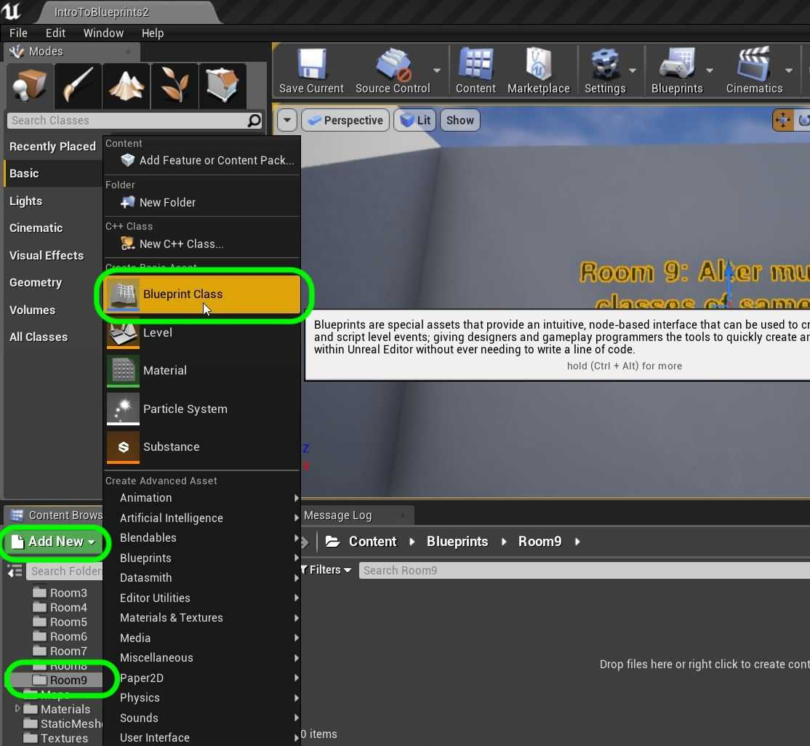

##### `Step 2.`\|`FHIU`|:small_blue_diamond: :small_blue_diamond: 

Open the new blueprint and *add* a new **Static Mesh** by *pressing* the **Add Component** button. Add a **Static Mesh** `SM_Lightbulb`.

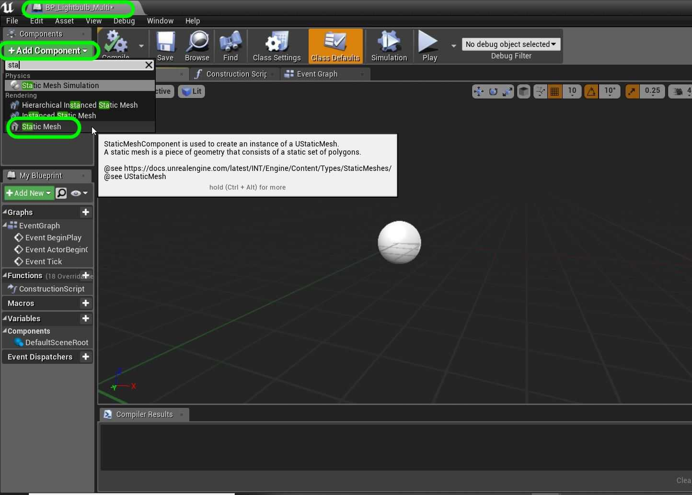

##### `Step 3.`\|`ITB`|:small_blue_diamond: :small_blue_diamond: :small_blue_diamond:

*Rename* static mesh to `Lightbulb` and *drag* it on its parent making it the root object. *Change* the scale to `10.0` on the **X,Y & Z** axis.

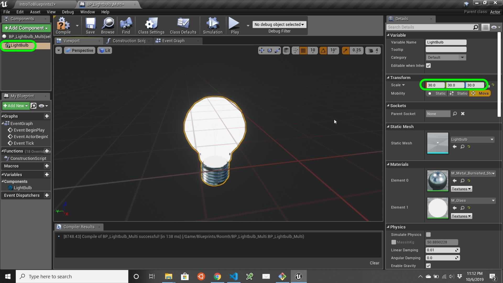

##### `Step 4.`\|`ITB`|:small_blue_diamond: :small_blue_diamond: :small_blue_diamond: :small_blue_diamond:

Scoot over to **Room 9** and *add* a whole bunch of lightbulbs in the room.

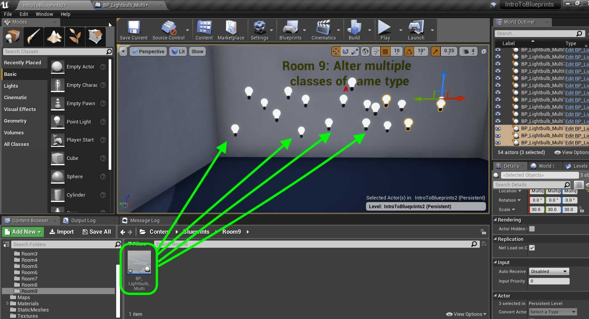

##### `Step 5.`\|`ITB`| :small_orange_diamond:

Open up **BP_Lightbulb**. Add a new component **Point Light** so that the bulbs actually light up the room. Make sure it is a child to the static mesh by dragging it over it. This way when you move the lightbult the light moves with it. Check that in the level it is casting light.

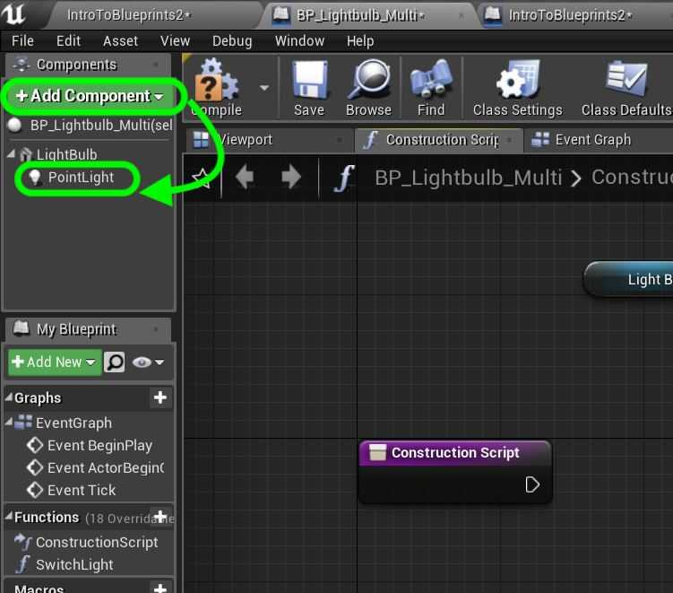

##### `Step 6.`\|`ITB`| :small_orange_diamond: :small_blue_diamond:

We need to add a dynamic materail to the **Construction Script**. To switch the light on and off we will need to turn the point light on and off as well as the material glow. Drag a reference of the **Lightbulb** static mesh onto the graph. Pull off the blue pin and select a **Create Dynamic Material** node.

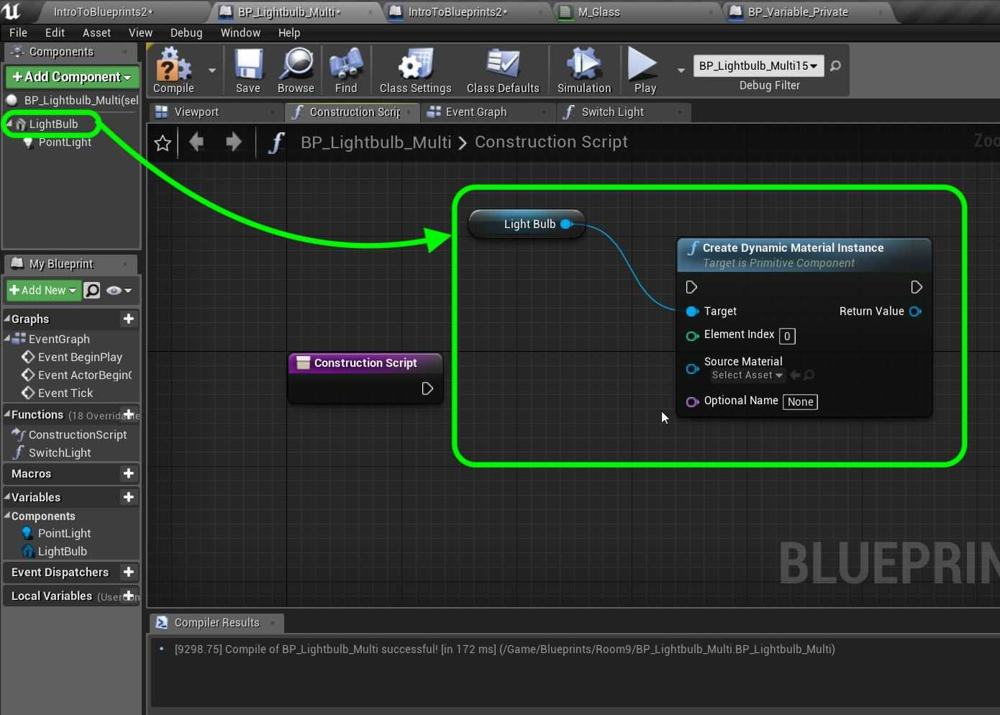

##### `Step 7.`\|`ITB`| :small_orange_diamond: :small_blue_diamond: :small_blue_diamond:

*Add* a new **Variable** and call it `DynamicMaterial`. *Choose* variable type **Material Instance Dynamic | Object Reference**. *Add* a **Tooltip** that says `Holds reference to material`. Put it in category `Lightbulb` and make it `Private`. *Drag* a copy to the graph and plug the **Return Value** from the **Create Dynamic Material Node** to the input pin of the **Set DynamicMaterial Variable**.

##### `Step 8.`\|`ITB`| :small_orange_diamond: :small_blue_diamond: :small_blue_diamond: :small_blue_diamond:

*Connect* the execution pins from the **Construction** script node to the **Create Dynamic Material Instance** to the **Set Dynamic Material** nodes. Now the lightbulb's material with the glow is in **M_Glass**. *Select* the **Source Material** as `M_Glass` and set the **Element Index** to `1`.

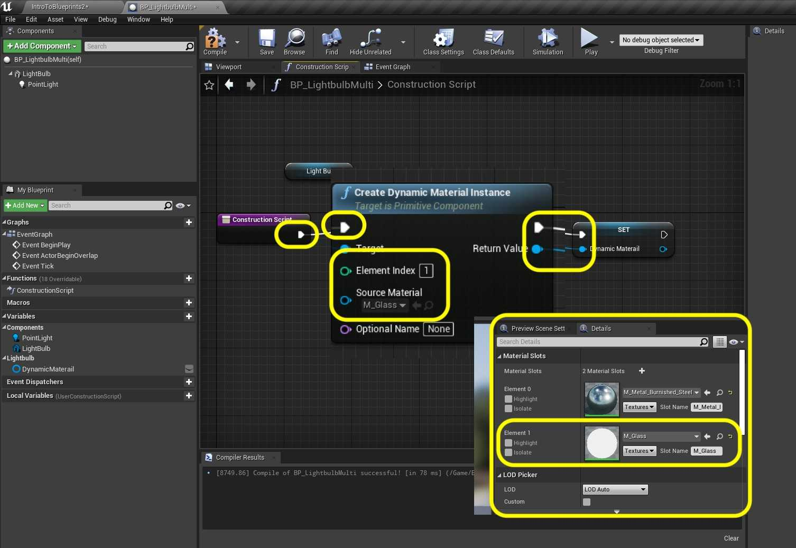

##### `Step 9.`\|`ITB`| :small_orange_diamond: :small_blue_diamond: :small_blue_diamond: :small_blue_diamond: :small_blue_diamond:

Press the **+** button next to **Functions** to add a new function. This allows us to put nodes in this blueprint that can be called from other objects. So intead of an internal event (BeginPlay or Tick) you can create your own function name and call it from another object.

Call this new function `SwitchLight`. We need to add an **Input** and call it `bIsOn`. Make it type **boolean**. Without this there is no way for the function to know if we are turning the light **on** or **off**. Notice that this adds a pin to the **Switch Light** execution pin.

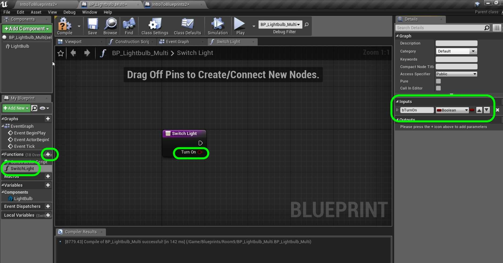

##### `Step 10.`\|`ITB`| :large_blue_diamond:

*Add* a **Branch Node** to the node graph. *Attach* the execution pins and the **Turn On** output pin from **Switch Light** to the input pin in the **Branch** Node. We will handle the turn on light logic from the **True** output pin and the turn off logic from the **False** pin.

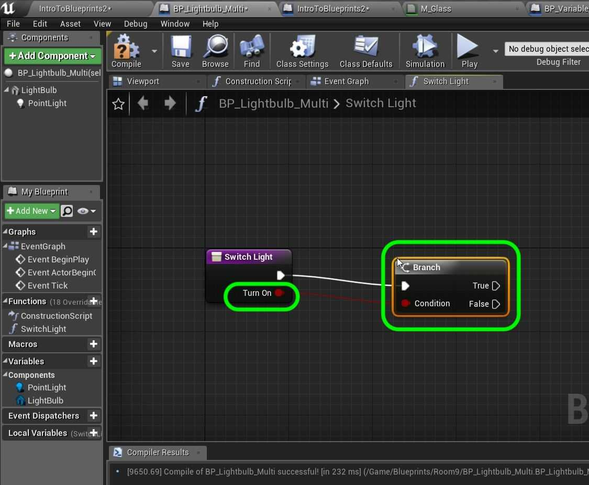

##### `Step 11.`\|`ITB`| :large_blue_diamond: :small_blue_diamond: 

*Click* on the **Point Light** in the **Components** menu. Lets look at the **Details** panel. A **Variable** called **Intensity** can be used to turn the acutal light on and off. We can set it to `0` when off and `5000` when on. Drag the **Point Light** to the graph and pull off its pin and select **Set Intensity** to change this value. Since this is for turning on set the **New Intensity** to `5000`.

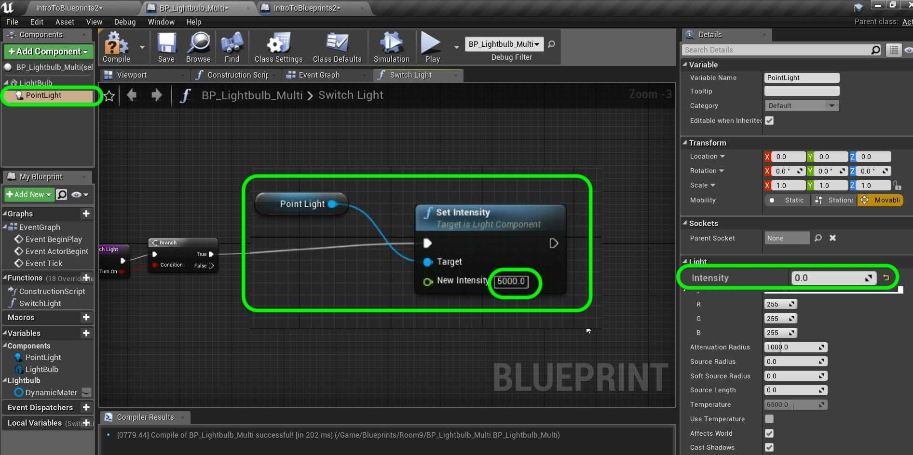

##### `Step 12.`\|`ITB`| :large_blue_diamond: :small_blue_diamond: :small_blue_diamond: 

Open up the **M_Glass** material. Look at what is going into the **Emissive Color** channel. We can use the **GlowMultiplier** Scalar Parameter to turn the glow on and off.

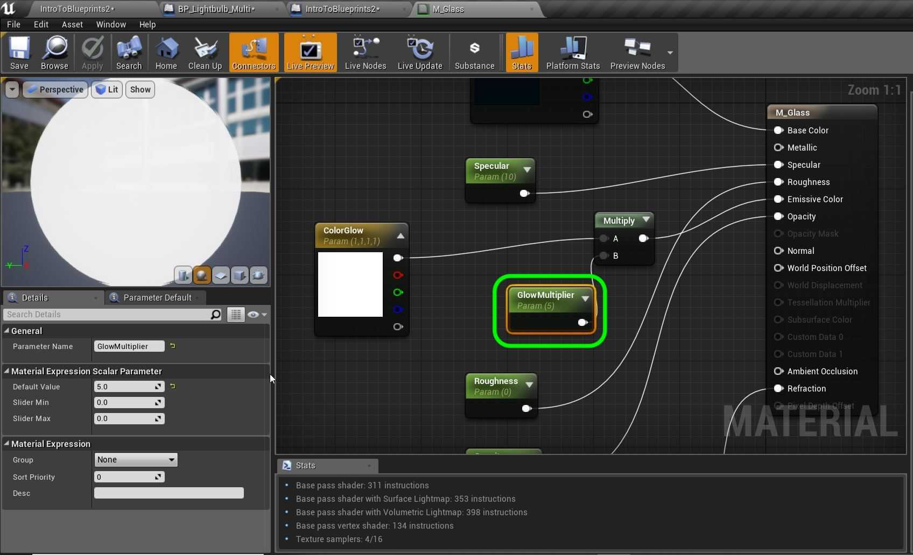

##### `Step 13.`\|`ITB`| :large_blue_diamond: :small_blue_diamond: :small_blue_diamond:  :small_blue_diamond: 

*Add* a reference to the **Dynamic Material** we just captured. *Pull off* the output pin and select **Set Scalar Parameter Value** and change the **Parameter Name** to `GlowMultiplier`. Make sure it is EXACTLY the same as the material. Set the **Value** to `6.0`. *Connect* the execution pins.

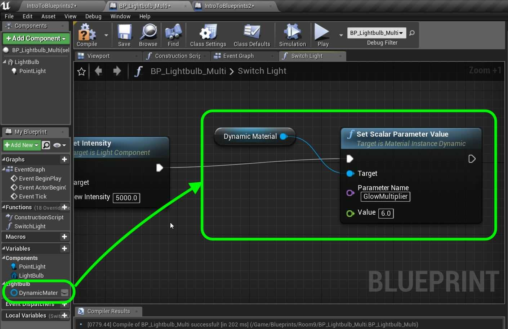

##### `Step 14.`\|`ITB`| :large_blue_diamond: :small_blue_diamond: :small_blue_diamond: :small_blue_diamond:  :small_blue_diamond: 

Add a `Turn Light On` comment by highlighting the nodes and pressing the <kbd>C</kbd> key.

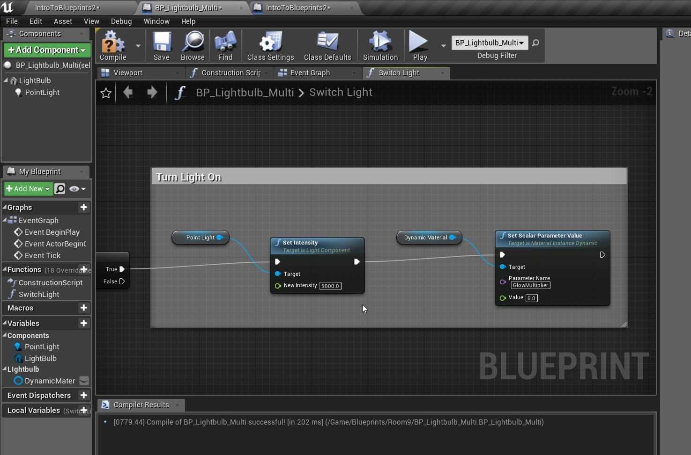

##### `Step 15.`\|`ITB`| :large_blue_diamond: :small_orange_diamond: 

*Copy and paste* all these nodes and change the comment to `Turn Light Off`. Set **New Intensity** and **Value** pins to `0.0`. *Connect* the **Set Intensity** execution pin to the **False** branch in the **Switch** node.

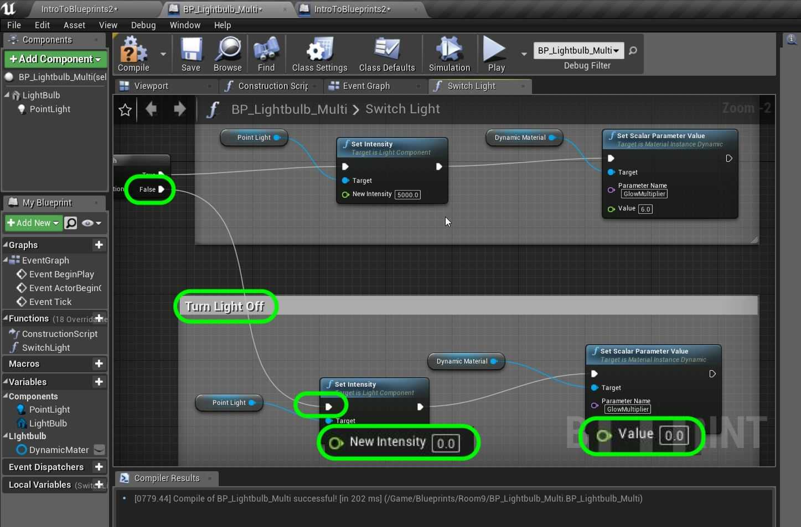

##### `Step 16.`\|`ITB`| :large_blue_diamond: :small_orange_diamond:   :small_blue_diamond: 

##### `Step 17.`\|`ITB`| :large_blue_diamond: :small_orange_diamond: :small_blue_diamond: :small_blue_diamond:

##### `Step 18.`\|`ITB`| :large_blue_diamond: :small_orange_diamond: :small_blue_diamond: :small_blue_diamond: :small_blue_diamond:

##### `Step 19.`\|`ITB`| :large_blue_diamond: :small_orange_diamond: :small_blue_diamond: :small_blue_diamond: :small_blue_diamond: :small_blue_diamond:

##### `Step 20.`\|`ITB`| :large_blue_diamond: :large_blue_diamond:

##### `Step 21.`\|`ITB`| :large_blue_diamond: :large_blue_diamond: :small_blue_diamond:

___

| [previous](../translation/README.md#user-content-translation)| [home](../README.md#user-content-ue4-blueprints) | [next](../multiple-actors-ii/README.md#user-content-dynamically-alter-multiple-classes-ii)|
|---|---|---|
