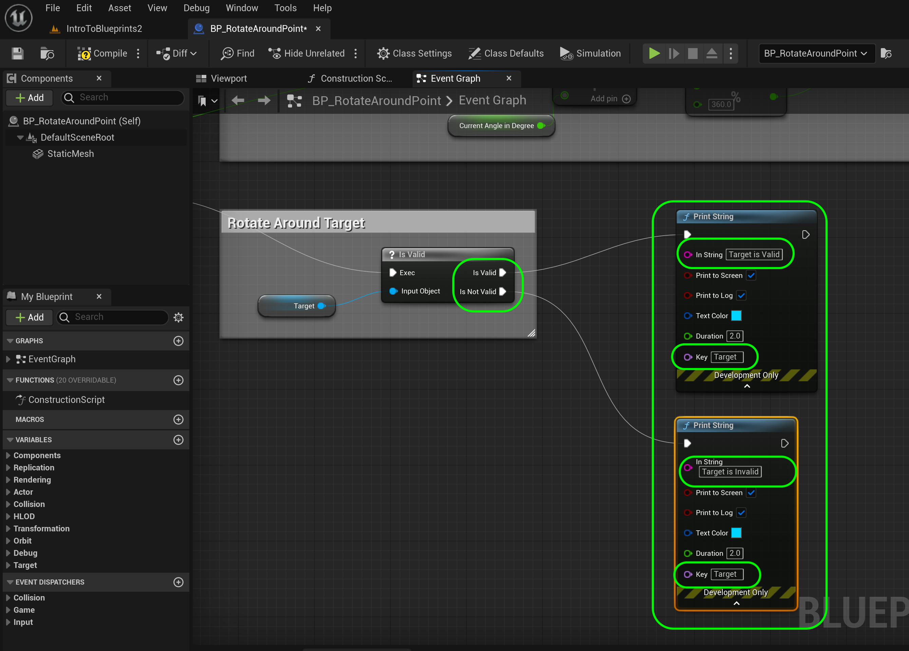
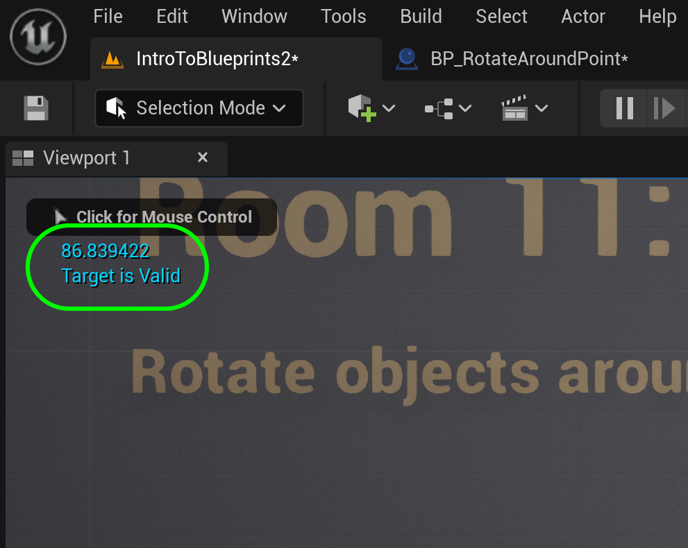
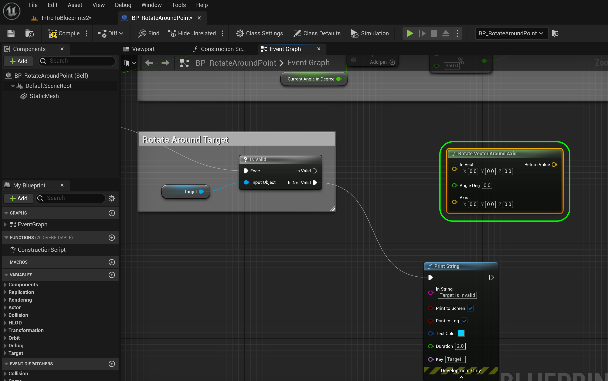
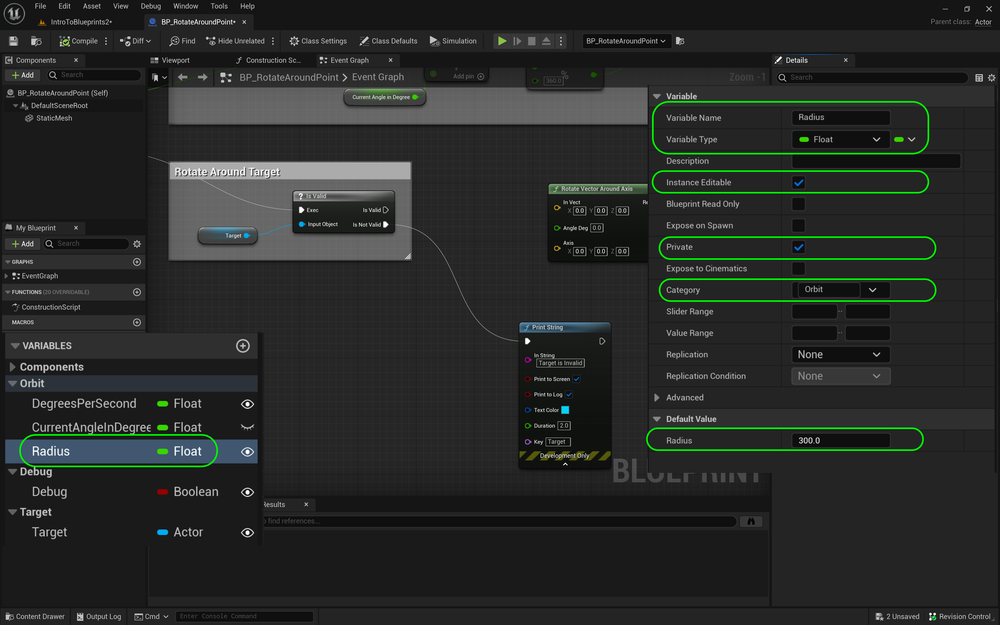
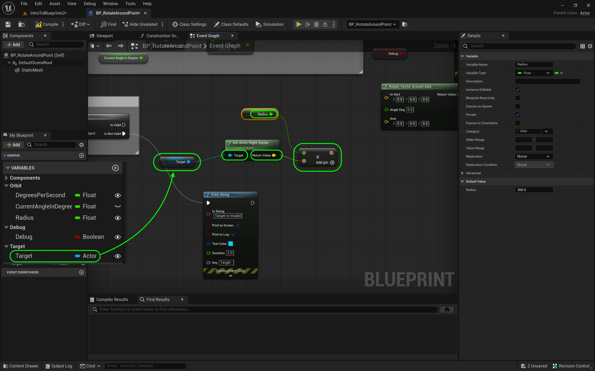
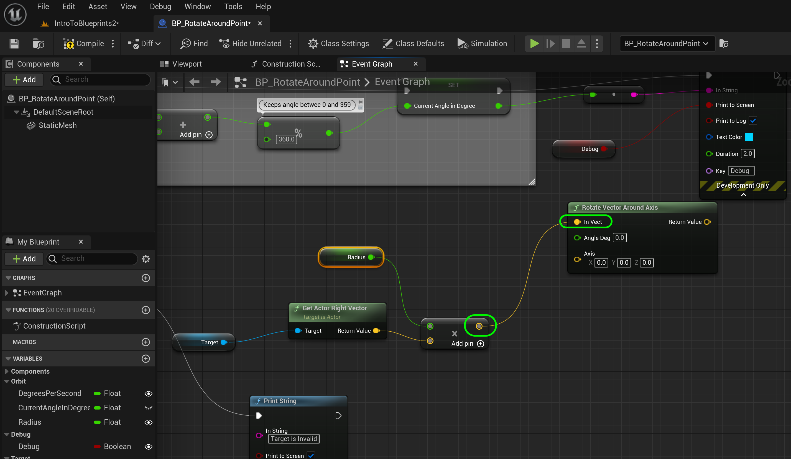
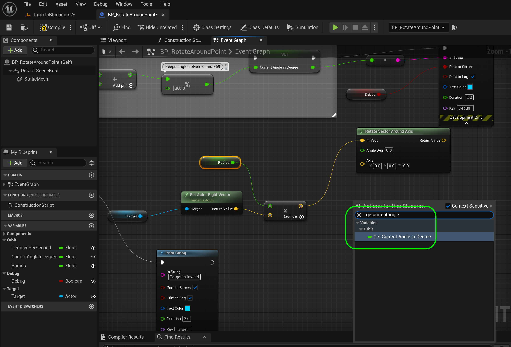

### Orbiting Actors II

[previous](../orbiting-actors/README.md#user-content-orbiting-actors) • [home](../README.md#user-content-ue4-blueprints) • [next](../orbiting-actors-iii/README.md#user-content-orbiting-actors-iii)

Orbiting actors continued.

 

---

##### `Step 1.`\|`ITB`|:small_blue_diamond:

*Place* the node so that it is between the **Addition** node and **Set** node. *Connect* the output of the **Addition** node to the top input of the **%** modulo node.  Set the output of **%** to the **Set Current Angle in Degrees** node. *Change* the value you are taking the division from `1` to `360`. This will return a remainder between 0 and 359 (which is what we want).

##### `Step 2.`\|`FHIU`|:small_blue_diamond: :small_blue_diamond: 

You can also add a smaller comment on top of any node. If you click on the three dots that show up on the top left corner when you hover on the node you can adda comment. I added to the **Modulo** node `Keep angle between 0 and 359`.

##### `Step 3.`\|`ITB`|:small_blue_diamond: :small_blue_diamond: :small_blue_diamond:

*Run* in game and you will notice that the number always goes back to 0 when it passes 360. Perfect!

https://user-images.githubusercontent.com/5504953/193663782-1efddf2f-fca6-4e20-928e-a7c8f4fc5dc9.mp4

##### `Step 4.`\|`ITB`|:small_blue_diamond: :small_blue_diamond: :small_blue_diamond: :small_blue_diamond:

Now we need to rotate around the cube actor. We need a variable to access its class. Add a new **Variable**, call it `Target`.  Select type **Actor | Object Reference**.

##### `Step 5.`\|`ITB`| :small_orange_diamond:

Make sure the **Instance Editable** is set to `true`, that the variable is **Private** and that the **Category** is set to `Target`. Give the variable a **Description**.  Mine was `Actor to rotate around in level`

##### `Step 6.`\|`ITB`| :small_orange_diamond: :small_blue_diamond:

To keep our graph neat we will put the rotation nodes under the current group. Lets *add* a **Sequence Node**. *Highjack* the output of the **Tick** node to the input of the **Sequence** node. Then attach the **Then 0** output to the **Set** node. Press the <kbd>Compile</kbd> button.

https://user-images.githubusercontent.com/5504953/193666218-2d197836-e1e9-40af-84a5-0a031a5d0346.mp4

##### `Step 7.`\|`ITB`| :small_orange_diamond: :small_blue_diamond: :small_blue_diamond:

*Drag and drop* the **Target** variable under the other nodes and select **Get**. Now this is a pointer to a game object that you need to assign in the world editor. Whenever we point to an object we should test for a NULL pointer (pointing to an object in a memory address that does not exist yet). *Pull off* of the **Target to Rotate Around** node and select a **Utilities | ? Is Valid** (be careful there are many different is valid nodes) node:

##### `Step 8.`\|`ITB`| :small_orange_diamond: :small_blue_diamond: :small_blue_diamond: :small_blue_diamond:

Connect the **Then 1** output of the **Sequence** node execution pin to the execution input in the **Is Valid** pin. Make sure the variable output is connected to the **Input Object** pin on the **Is Valid** node. Put a large comment box around it saying `Rotate Around Target`.

##### `Step 9.`\|`ITB`| :small_orange_diamond: :small_blue_diamond: :small_blue_diamond: :small_blue_diamond: :small_blue_diamond:

Now lets test our work to date. We have enough information to run a test in game. Add two **Print String** nodes. Connect one to the **Is Valid** output of the **Is Valid** node and the other to the **Is Not Valid** pin. The **Is Valid** print statement should have message `Target is Valid` with a **Key** value set to of `Target`. The other should have a message `Target is Invalid` with a **Key** value set to of `Target`.

##### `Step 10.`\|`ITB`| :large_blue_diamond:

Now go into the game and don't assign a target, just run it as is. You should see the red message **Target is Invalid** appears when you *run* the game.

##### `Step 11.`\|`ITB`| :large_blue_diamond: :small_blue_diamond: 

Now highlight the **BP_RotateAround** actor in the scene and press the <kbd>Lock</kbd> button to lock the **Details** panel.  Then you can drag the **Rotate Around Me** cube actor from the scene to the **Target** input that we set up. Release the lock at the end by pressing the <kbd>Lock</kbd> to turn it off.

##### `Step 12.`\|`ITB`| :large_blue_diamond: :small_blue_diamond: :small_blue_diamond: 

When we run the game we now have a valid game object. The message says in blue *Target is Valid* which is what we wanted!

##### `Step 13.`\|`ITB`| :large_blue_diamond: :small_blue_diamond: :small_blue_diamond:  :small_blue_diamond: 

OK, lets move on with the rotation. Delete the top **Print** node. Replace it by *right clicking* and add a **Rotate Vector Around Axis** node.

##### `Step 14.`\|`ITB`| :large_blue_diamond: :small_blue_diamond: :small_blue_diamond: :small_blue_diamond:  :small_blue_diamond: 

Now lets look at our input nodes. So we will be calculating from the object we are rotating around (the cube); from its origin point. The **In Vector** is a relative vector to the cube and will make the radius of the rotation. The angle is the value we have already calculated in degrees. The axis will be the **Z** axis of the cube. This means that it will rotate around its **Z** axis (remember it is Z up in UE5).

##### `Step 15.`\|`ITB`| :large_blue_diamond: :small_orange_diamond: 

Make a new variable of type **Float** called `Radius`. Make sure it is **Instance Editable** and **Private**. Add the **Category** `Orbit` and add a **tooltip**. *Press* the <kbd>Compile</kbd> button.

*Set* the **default value** of the **Radius** to `300` and press the <kbd>Compile</kbd> again.

##### `Step 16.`\|`ITB`| :large_blue_diamond: :small_orange_diamond:   :small_blue_diamond: 

Now *drag and drop* a **Get Radius** to the graph and we need to figure out how to attach this to the **In Vector** input. Now this is a **float** and the in vector wants a vector (hover over the pins). Now we will just be affecting the **Z** vector of the object. Now if we split the pins and plug this into the **X** vector this will work in world space. Regardless of the rotation of the cube, this will be always rotating around world **Z**. What if we want it to rotate with the cube. We need it relative to the cube's rotation. *Unreal* gives us a normalized vector along the plane called **Get Actor Right Vector**. This is a vector that is 1 unit long point to the relative right side direction of the actor regardless of his world rotation. Add a **Get Actor Right Vector** node.

##### `Step 17.`\|`ITB`| :large_blue_diamond: :small_orange_diamond: :small_blue_diamond: :small_blue_diamond:

Now *drag* a **Get** reference to the **Target To Rotate Around** variable and attack it to the **Target** input of **Get Actor Right Vector**. We are rotating around the referenced object, not ourselves. Now we want to scale this normalized vector by adding a **Multiplication** node and attaching the return value of **Get Actor Right Vector** to the top pin of the **Multiplication** node and the **Radius** to the bottom pin of the **Multipllication node**.

##### `Step 18.`\|`ITB`| :large_blue_diamond: :small_orange_diamond: :small_blue_diamond: :small_blue_diamond: :small_blue_diamond:

Send the output of this **Multiply** into the **In Vect** pin of the **Rotate Vector Around Axis** node:

##### `Step 19.`\|`ITB`| :large_blue_diamond: :small_orange_diamond: :small_blue_diamond: :small_blue_diamond: :small_blue_diamond: :small_blue_diamond:

We can also add variables without dragging and dropping. We can click on an open part of the graph and type **Get Current Angle In Degrees**.

##### `Step 20.`\|`ITB`| :large_blue_diamond: :large_blue_diamond:

*Connect* the output of the **Get Current Angle In Degrees** pin to the **Angle Deg** input in the **Rotate Vector Around Axis** node. Add appropriate comments:

<!--  -->

| [previous](../orbiting-actors/README.md#user-content-orbiting-actors)| [home](../README.md#user-content-ue4-blueprints) | [next](../orbiting-actors-iii/README.md#user-content-orbiting-actors-iii)|
|---|---|---|
