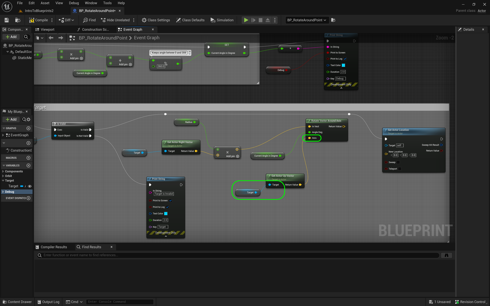
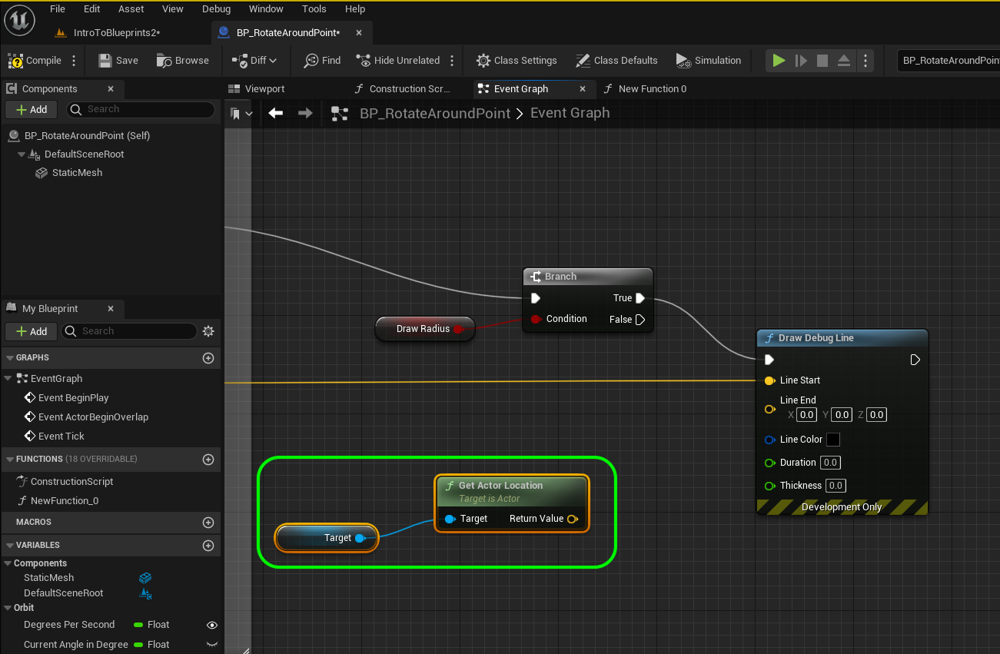

### Orbiting Actors III

[previous](../orbiting-actors-ii/README.md#user-content-orbiting-actors-ii) • [home](../README.md#user-content-ue4-blueprints) • [next](../orbiting-actors-iv/README.md#user-content-orbiting-actors-iv)

Orbiting actors continued.

 

---

##### `Step 1.`\|`ITB`|:small_blue_diamond:

Now we want to rotate around the relative Z axis of the box. So we will r*ight click* and select the **Get Actor Up Vector** node. This is the same idea as the right vector except this is the relative **Z** axis of the box. It is also relative to the player so it is always up based on the player regardless of their rotation in the room. Also expand the Rotate Around Target comment box to cover these new nodes.

##### `Step 2.`\|`FHIU`|:small_blue_diamond: :small_blue_diamond: 

Now again this is relative to the box. So take the output of the **Target** node and *connect* it to the **Target** of the **Get Actor Up Vector**. Then *connect* its **Return Value** to the **Axis** input pin on the **Rotate Vector Around Axis** node.

##### `Step 3.`\|`ITB`|:small_blue_diamond: :small_blue_diamond: :small_blue_diamond:

Now we can get to the meat of this room. We have calculated where in world coordinates our blueprint needs to be relative to the object we are rotating around. *Right click* and select **Set Actor Location**. *Connect* the **Is Valid** pin from the **Is Valid** node and *connect* it ot the input execution pin in the **Set Actor Location** node. 

##### `Step 4.`\|`ITB`|:small_blue_diamond: :small_blue_diamond: :small_blue_diamond: :small_blue_diamond:

Now we have figured out how far to the right the player needs to be of the cube and the z axis of rotatoin.  We now need to go from local to wolrd space and add the cube's current location to this vector. Add a **Get Actor Location** node and an **Addition** node adding the output of the **Rotate Vector Around Axis** node.  Then send the output of the **Addition** node to the **New Location** in the **Set Actor Location** node.

##### `Step 5.`\|`ITB`| :small_orange_diamond:

Add a **Get Target** node and attach it to the **Target** pin of the **Get Actor Location** node. We want to rotate around the target actor.

##### `Step 6.`\|`ITB`| :small_orange_diamond: :small_blue_diamond:

##### `Step 7.`\|`ITB`| :small_orange_diamond: :small_blue_diamond: :small_blue_diamond:

*Run* the game and look in the room, the sphere should be rotating around the cube. I adjusted the scale of the static mesh to be a bit smaller. Now try rotating the cube and see if the oribting follows its angle? 

https://user-images.githubusercontent.com/5504953/193694162-45b3a72e-5fae-4790-9b0c-3e5cf4d68785.mp4

##### `Step 8.`\|`ITB`| :small_orange_diamond: :small_blue_diamond: :small_blue_diamond: :small_blue_diamond:

Now lets draw the radius of this rotation in debug to visualize it. *Right click* on **ShowDebug**  and **Duplicate** another **Boolean** variable called `DrawRadius`. Make it **Instance Editable** and **Private** with a **Tooltip** and **Category** `Debug`.

##### `Step 9.`\|`ITB`| :small_orange_diamond: :small_blue_diamond: :small_blue_diamond: :small_blue_diamond: :small_blue_diamond:

Now add a **Get Draw Radius** & a **Branch** node. Send the output of the **Draw Radius** to the the **Branch | Condition** pin.

##### `Step 10.`\|`ITB`| :large_blue_diamond:

Right click on the open graph and select the node **Draw Debug Line**. *Grab* the output of the **Addition** pin just before the **Set Actor Location** node. This is the location of the player. *Place* it in the **Line Start** input pin in the **Draw Debug Line** node:

##### `Step 11.`\|`ITB`| :large_blue_diamond: :small_blue_diamond: 

Now the line will go to the center of the box we are rotating around. *Grab* a get variable of **Target** and *attach* it to a **Get Actor Location** node.

##### `Step 12.`\|`ITB`| :large_blue_diamond: :small_blue_diamond: :small_blue_diamond: 

Connect the output **Execution** pin from the **Set Actor Location** node to the input pin of the **Branch** node.  Make sure the execution pin from the **Branch | True** is set to the input **Draw Debug Line** node.  Set the **Duration** to `0.0` and the **Thickness** to `3.0`. *Press* the <kbd>Compile</kbd> button.

##### `Step 13.`\|`ITB`| :large_blue_diamond: :small_blue_diamond: :small_blue_diamond:  :small_blue_diamond: 

Now go into the game and make sure the **Draw Radius** variable is set to `true`.

##### `Step 14.`\|`ITB`| :large_blue_diamond: :small_blue_diamond: :small_blue_diamond: :small_blue_diamond:  :small_blue_diamond: 

Run the game and voila, a line drawing the radius of the rotation.

https://user-images.githubusercontent.com/5504953/193801571-72b804f8-0959-47dd-9feb-67fd2d1c57a3.mp4

##### `Step 15.`\|`ITB`| :large_blue_diamond: :small_orange_diamond: 

Now select the nodes for drawing the debug line and add an appopriate comment.

##### `Step 16.`\|`ITB`| :large_blue_diamond: :small_orange_diamond:   :small_blue_diamond: 

Now the rotation is always clockwise. What if we wanted the sphere to rotate counter-clockwise? We would need to send a negative rotation number instead of a positive one. Lets start by adding a **Boolean** variable called `TurnClockwise`. Make it **Instance Editable** and **Private**. Put it in **Category** `Orbit` and add a **Description**.  Notice the description is used as a tooltip if you hover over the **Variable**?

##### `Step 17.`\|`ITB`| :large_blue_diamond: :small_orange_diamond: :small_blue_diamond: :small_blue_diamond:

Go back to the nodes where you are setting the rotation in degrees. Add a **Get Turn Clockwise** node to access this variable. *Pull* from the output pin and add a **Select Float**. 

##### `Step 18.`\|`ITB`| :large_blue_diamond: :small_orange_diamond: :small_blue_diamond: :small_blue_diamond: :small_blue_diamond:

Make sure the **Clockwise** pin connects to the **Pick A** input on the **Select Float** node. This is fairly straight forward. If **Clockwise** is true then the output is the *A* pin, it if is false it is the *B* pin. So for *A* we want `1.0` and for **B** we want `-1.0`. Press the **Add Pin +** on the **Multiplication** node and send the **Select Float | Return Value** to the new third pin.

##### `Step 19.`\|`ITB`| :large_blue_diamond: :small_orange_diamond: :small_blue_diamond: :small_blue_diamond: :small_blue_diamond: :small_blue_diamond:

*Press* the <kbd>Play</kbd> button and toggle turn clockwise on and off and the direction of the orbiting willl change!

https://user-images.githubusercontent.com/5504953/193805243-f889ec74-0845-42c0-933b-c084f9194a15.mp4

<!--  -->

| [previous](../orbiting-actors-ii/README.md#user-content-orbiting-actors-ii)| [home](../README.md#user-content-ue4-blueprints) | [next](../orbiting-actors-iv/README.md#user-content-orbiting-actors-iv)|
|---|---|---|
