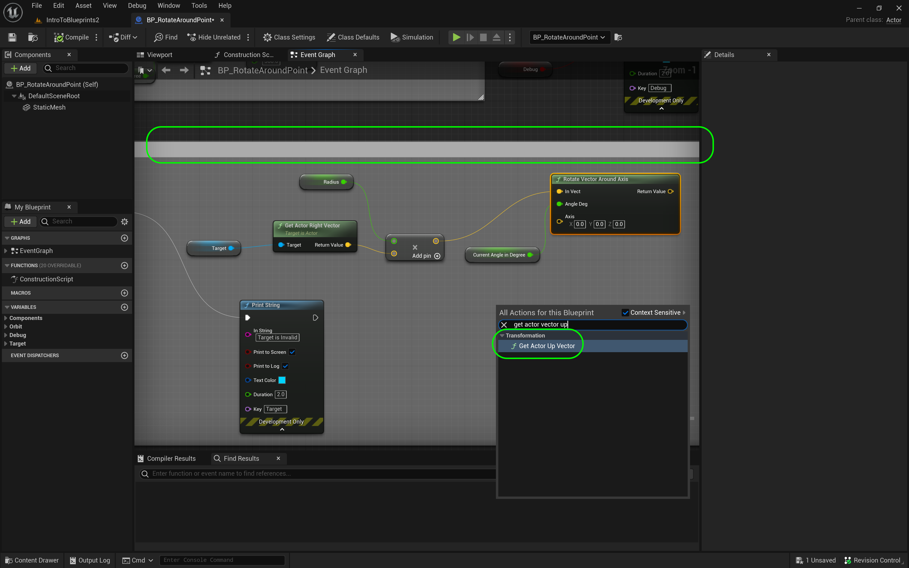

### Orbiting Actors III

[previous](../orbiting-actors-ii/README.md#user-content-orbiting-actors-ii) • [home](../README.md#user-content-ue4-blueprints) • [next](../orbiting-actors-iv/README.md#user-content-orbiting-actors-iv)

Orbiting actors continued.

 

---

##### `Step 1.`\|`ITB`|:small_blue_diamond:

Now we want to rotate around the relative Z axis of the box. So we will r*ight click* and select the **Get Actor Up Vector** node. This is the same idea as the right vector except this is the relative **Z** axis of the box. It is also relative to the player so it is always up based on the player regardless of their rotation in the room.

##### `Step 2.`\|`FHIU`|:small_blue_diamond: :small_blue_diamond: 

Now again this is relative to the box. So take the output of the **Target To Rotate Around** node and *connect* it to the **Target** of the **Get Actor Up Vector**. Then *connect* its **Return Value** to the **Axis** input pin on the **Rotate Vector Around Axis** node. Add comments...

##### `Step 3.`\|`ITB`|:small_blue_diamond: :small_blue_diamond: :small_blue_diamond:

Now we can get to the meat of this room. We have calculated where in world coordinates our blueprint needs to be relative to the object we are rotating around. *Right click* and select **Set Actor Location**. *Connect* the **Return Value** output pin of the **Rotate Vector Around Axis** node to the **New Location** pin in the **Set Actor Location** node. *Highjack* the **Is Valid** pin from the **Is Valid** node and *connect* it ot the input execution pin in the **Set Actor Location** node. *Delete* the dangling **Print String** node as we no longer need it.

##### `Step 4.`\|`ITB`|:small_blue_diamond: :small_blue_diamond: :small_blue_diamond: :small_blue_diamond:

We will leave the error print as this will warn us if we have not assigned a target in the editor. Add some commnents to explain what we are doing:

##### `Step 5.`\|`ITB`| :small_orange_diamond:

Before we try it in game, I just realized I made an error. The vector is in local space to the cube. What I need to do is to get this into world coordinates. I do this by adding my current location to this vector. Add a **Get Actor Location** node and an **Vector + Vector** node adding the output of the **Return Vector Around Axis** node.  Then send the output of the **Addition** node to the **New Location** in the **Set Actor Location** node:

##### `Step 6.`\|`ITB`| :small_orange_diamond: :small_blue_diamond:

Add a **Get Target to Rotate Around** node and attach it to the **Target** pin of the **Get Actor Location** node. We want to rotate around the target actor.

##### `Step 7.`\|`ITB`| :small_orange_diamond: :small_blue_diamond: :small_blue_diamond:

*Run* the game and look in the room, the sphere should be rotating around the cube. Now try rotating the cube and see if the oribting follows its angle? 

##### `Step 8.`\|`ITB`| :small_orange_diamond: :small_blue_diamond: :small_blue_diamond: :small_blue_diamond:

Now lets draw the radius of this rotation in debug to visualize it. Add another **Boolean** variable called `bDrawRadius`. Make it **Instance Editable** and **Private** with a **Tooltip** and **Category** `Debug`.

##### `Step 9.`\|`ITB`| :small_orange_diamond: :small_blue_diamond: :small_blue_diamond: :small_blue_diamond: :small_blue_diamond:

Now add a **Get Draw Radius** & a **Branch** node. Send the output of the **Draw Radius** to the the **Branch | Condition** pin.

##### `Step 10.`\|`ITB`| :large_blue_diamond:

Right click on the open graph and select the node **Draw Debug Line**:

##### `Step 11.`\|`ITB`| :large_blue_diamond: :small_blue_diamond: 

*Grab* the output of the **Vector + Vector** pin just before the **Set Actor Location** node. This is the location of the player. *Place* it in the **Line Start** input pin in the **Draw Debug Line** node:

##### `Step 12.`\|`ITB`| :large_blue_diamond: :small_blue_diamond: :small_blue_diamond: 

Now the line will go to the center of the box we are rotating around. *Grab* a get variable of **Target Rotate Around** and *attach* it to a **Get Actor Location** node.

##### `Step 13.`\|`ITB`| :large_blue_diamond: :small_blue_diamond: :small_blue_diamond:  :small_blue_diamond: 

Connect the output **Execution** pin from the **Set Actor Location** node to the input pin of the **Branch** node:

##### `Step 14.`\|`ITB`| :large_blue_diamond: :small_blue_diamond: :small_blue_diamond: :small_blue_diamond:  :small_blue_diamond: 

*Connect* the output pin of **Get Actor Location | Return Value** pin for the cube to the **Line End** input pin of the **Draw Debug Line** node. *Connect* the **True** execution pin from **Branch to Draw Debug Line** execution pin.

##### `Step 15.`\|`ITB`| :large_blue_diamond: :small_orange_diamond: 

For the **Draw Debug Line** set the Duration to` 0.0` and the line Thickness to `3.0`. *Press* the <kbd>Compile</kbd> button. *Press* the <kbd>Compile</kbd> button.

##### `Step 16.`\|`ITB`| :large_blue_diamond: :small_orange_diamond:   :small_blue_diamond: 

Now go into the game and make sure the boolean for the drawing of the radius is set to `true`.

##### `Step 17.`\|`ITB`| :large_blue_diamond: :small_orange_diamond: :small_blue_diamond: :small_blue_diamond:

Run the game and voila, a line drawing the radius of the rotation.

##### `Step 18.`\|`ITB`| :large_blue_diamond: :small_orange_diamond: :small_blue_diamond: :small_blue_diamond: :small_blue_diamond:

Now the rotation is always clockwise. What if we wanted the sphere to rotate counter-clockwise? We would need to send a negative rotation number instead of a positive one. Lets start by adding a **Boolean** variable called `bTurnClockwise`. Make it **Instance Editable** and **Private**. Put it in **Category** `Rotation` and add a **Tooltip**:

##### `Step 19.`\|`ITB`| :large_blue_diamond: :small_orange_diamond: :small_blue_diamond: :small_blue_diamond: :small_blue_diamond: :small_blue_diamond:

Go back to the nodes where you are setting the rotation in degrees. Add a **Get Turn Clockwise** node to access this variable.

##### `Step 20.`\|`ITB`| :large_blue_diamond: :large_blue_diamond:

*Pull* from the output pin and add a **Select Float**.

##### `Step 21.`\|`ITB`| :large_blue_diamond: :large_blue_diamond: :small_blue_diamond:

Make sure the **Clockwise** pin connects to the **Pick A** input on the **Select Float** node. This is fairly straight forward. If **Clockwise** is true then the output is the *A* pin, it if is false it is the *B* pin. So for *A* we want `1.0` and for **B** we want `-1.0`.

<!--  -->

| [previous](../orbiting-actors-ii/README.md#user-content-orbiting-actors-ii)| [home](../README.md#user-content-ue4-blueprints) | [next](../orbiting-actors-iv/README.md#user-content-orbiting-actors-iv)|
|---|---|---|
