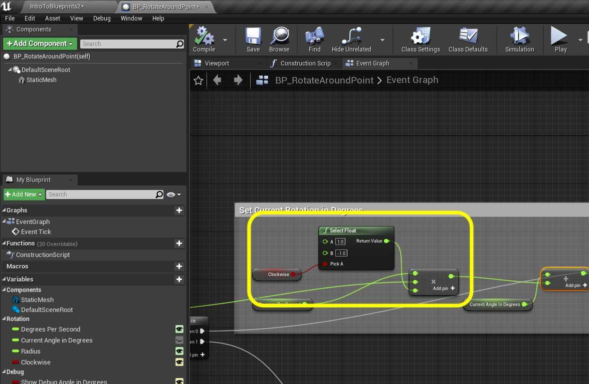
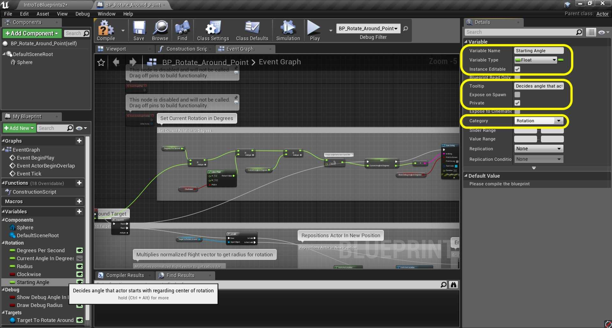
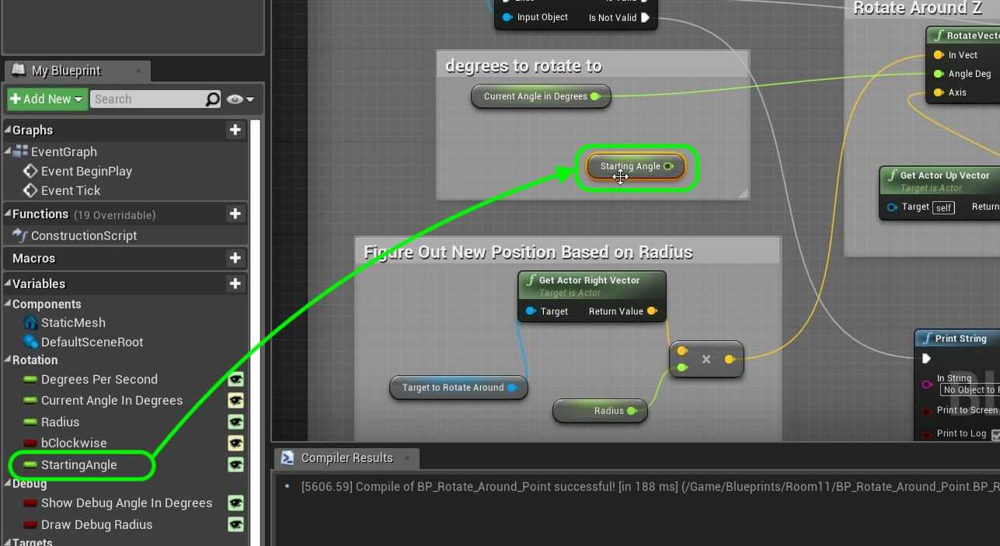
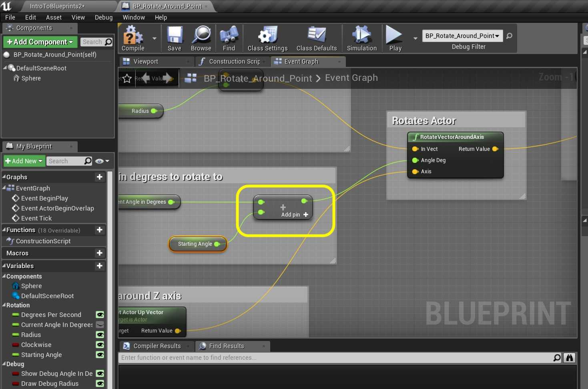
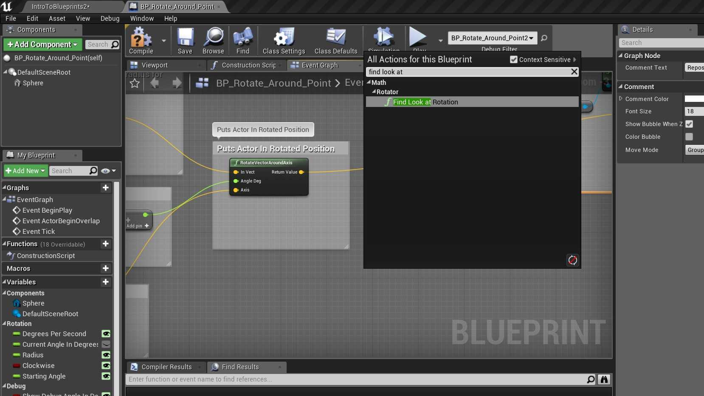
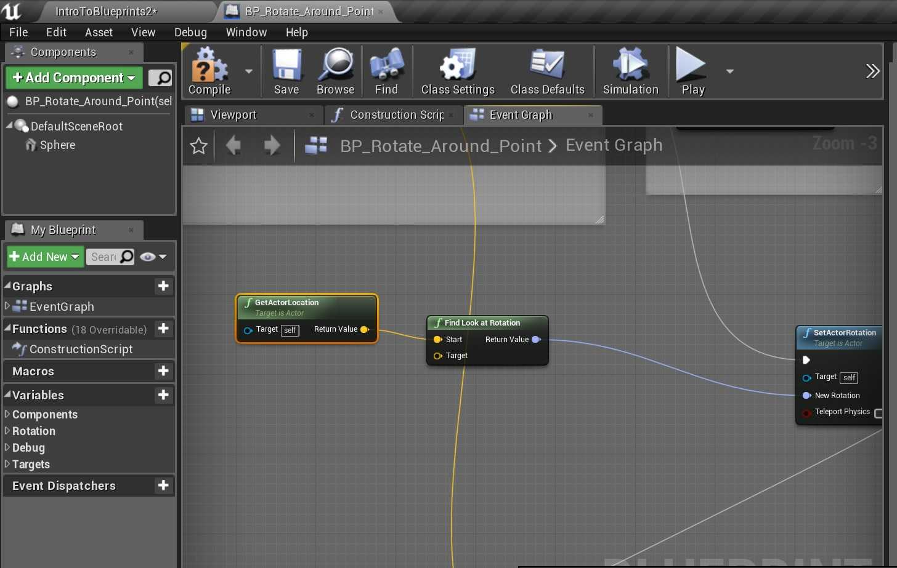
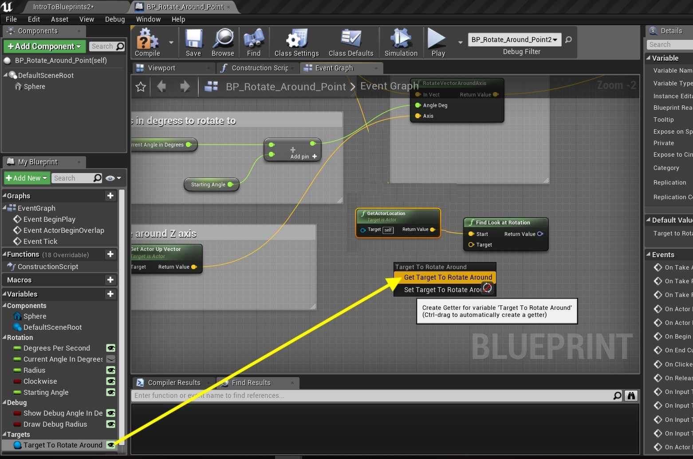
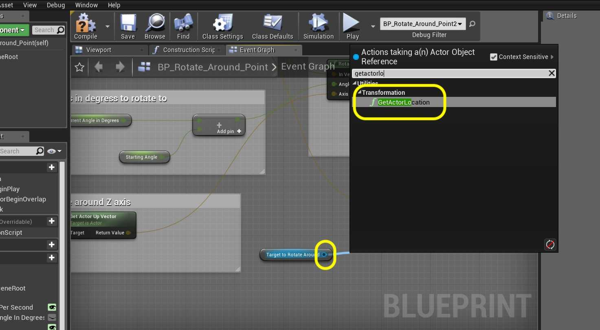
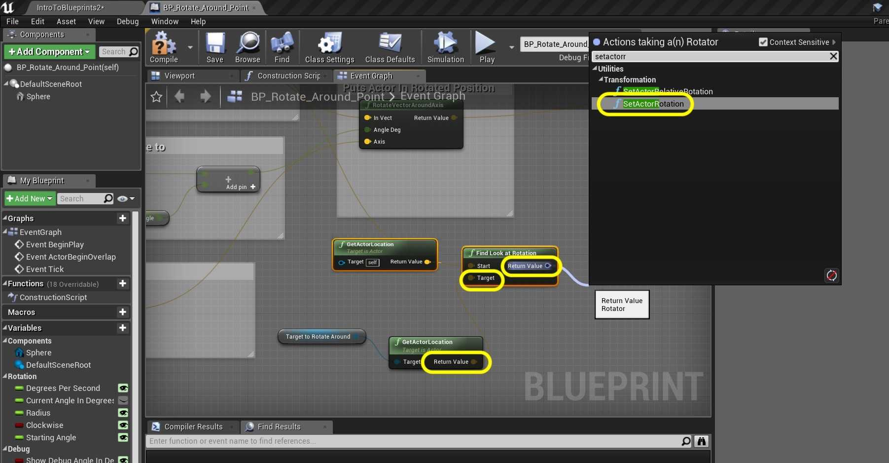
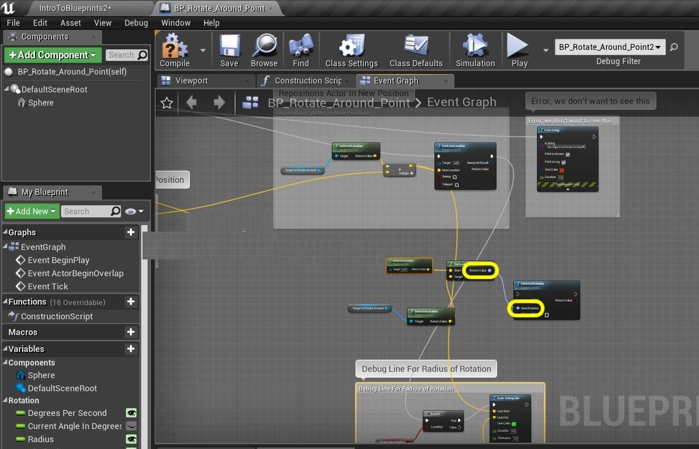

### Orbiting Actors IV

[previous](../orbiting-actors-iii/README.md#user-content-orbiting-actors-iii) • [home](../README.md#user-content-ue4-blueprints) • [next](../user-input/README.md#user-content-user-input)

Orbiting actors continued...

 

---

##### `Step 1.`\|`ITB`|:small_blue_diamond:

Now multiply the output of the multiplication of the degrees per second times the tick by 1 or -1. Press **Add pin +** on the **Multiplication** node after D**egrees Per Second**. *Attach* the output of the **Select A Float** node into the third pin of the **Multiplication** node.

##### `Step 2.`\|`FHIU`|:small_blue_diamond: :small_blue_diamond: 

Run the game and switch between clockwise and counter-clockwise on the game object. The rotation should change!

##### `Step 3.`\|`ITB`|:small_blue_diamond: :small_blue_diamond: :small_blue_diamond:

Now what if we want to have mulitiple sphere blueprints orbiting around the same object. If we had more than one, they would all move one atop each other. What we want to do is add a starting angle (or offset angle) so they are at different distances. *Add* a variable called `Starting Angle` of type **Float** with **Instance Editable** and **Private** set to `true`. Change the **Category** to `Rotation` and add a **Tooltip**.

##### `Step 4.`\|`ITB`|:small_blue_diamond: :small_blue_diamond: :small_blue_diamond: :small_blue_diamond:

*Drag* the **Get Starting Angle** variable to right after the **Current Angle In Degrees ** that goes to the **Rotate Vector Around Axis** node.

##### `Step 5.`\|`ITB`| :small_orange_diamond:

Add a **Float + Float** node to add the **Current Angle In Degrees** and **Starting Angle** variables together. Send the output to the **AngleDeg** input in **RotateVectorAroundAxis** node.

##### `Step 6.`\|`ITB`| :small_orange_diamond: :small_blue_diamond:

Add three more blueprints in the scene. Make sure you assign **Rotate Around Me** to the **Target to Rotate Around**. Have one set to **Starting Angle** `0.0`, the next to `90.0`, the next to `180.0` and the final to `270.0`. *Run* it and it should look like:

##### `Step 7.`\|`ITB`| :small_orange_diamond: :small_blue_diamond: :small_blue_diamond:

Now the sphere is changing location but is not facing the center cube. Lets add some functionality so that the sphere looks at the center point during the rotation so that is translates AND rotates during this sequence. *Right click* on the open graph and look for the **Find Look at Rotation** node:

##### `Step 8.`\|`ITB`| :small_orange_diamond: :small_blue_diamond: :small_blue_diamond: :small_blue_diamond:

Add a **Get Actor Location** node and hook the the output to the the **Find Look At Rotation** node's **Start** pin:

##### `Step 9.`\|`ITB`| :small_orange_diamond: :small_blue_diamond: :small_blue_diamond: :small_blue_diamond: :small_blue_diamond:

So if the starting point of the look is the sphere location. Then the end point is the center. *Drag* a **Get Target To Rotate Around:** node onto the graph.

##### `Step 10.`\|`ITB`| :large_blue_diamond:

Drag off of the pin and select the **Get Actor Location** node which returns the location of the actor we are orbiting around.

##### `Step 11.`\|`ITB`| :large_blue_diamond: :small_blue_diamond: 

*Connect* the output of the **Get Actor Location** node to the **Target** input of the **Find Look at Rotation** node. *Grab* the **Return Value** pin and *select* the **Set Actor Rotation** node:

##### `Step 12.`\|`ITB`| :large_blue_diamond: :small_blue_diamond: :small_blue_diamond: 

*Connect* the output of the **Find Look at Rotation | Return Value** pin to the input of the **Set Actor Rotation | New Rotation** pin.

##### `Step 13.`\|`ITB`| :large_blue_diamond: :small_blue_diamond: :small_blue_diamond:  :small_blue_diamond: 

Connect the output execution pin of the **Draw Debug Line** node to the input execution pin of the **Set Actor Rotation** node:

##### `Step 14.`\|`ITB`| :large_blue_diamond: :small_blue_diamond: :small_blue_diamond: :small_blue_diamond:  :small_blue_diamond: 

*Run* the game and walk into the collision volume. Now the spheres rotate and continue to face the center and now it looks pretty good. Lets end it here.

##### `Step 15.`\|`ITB`| :large_blue_diamond: :small_orange_diamond: 

That's it for **Room 11**. Press **Save All** and update **Github** by committing and pushing1all the changes made. 

___

| [previous](../orbiting-actors-iii/README.md#user-content-orbiting-actors-iii)| [home](../README.md#user-content-ue4-blueprints) | [next](../user-input/README.md#user-content-user-input)|
|---|---|---|
