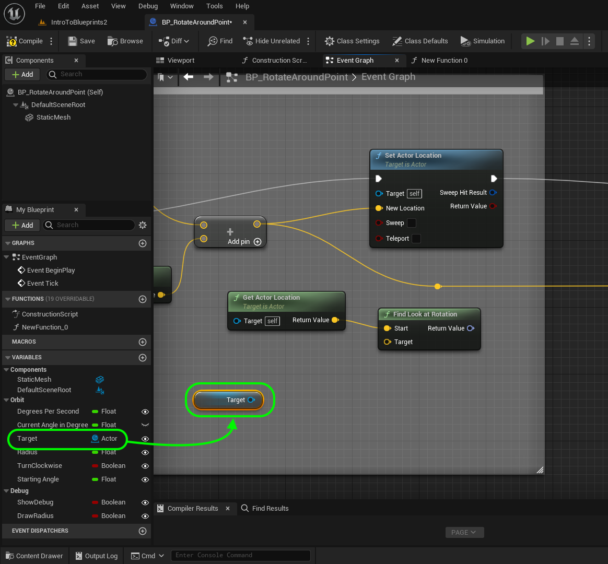
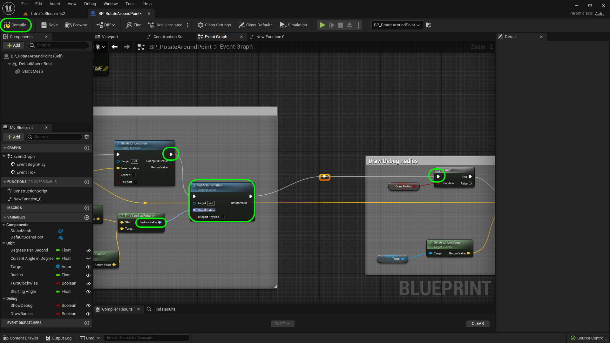
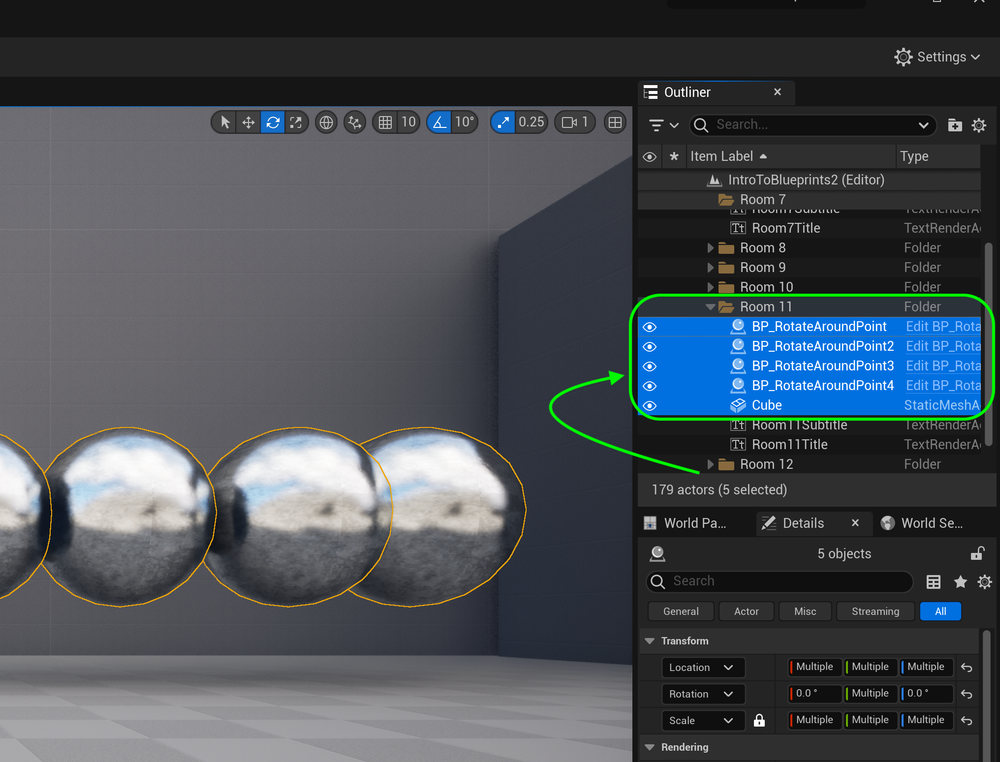
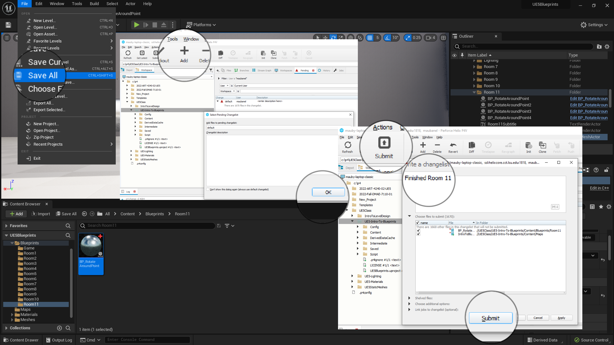
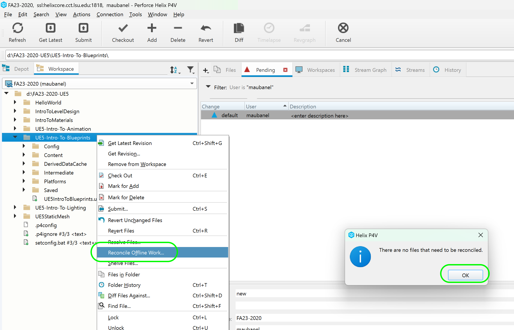

### Orbiting Actors IV

[previous](../orbiting-actors-iii/README.md#user-content-orbiting-actors-iii) • [home](../README.md#user-content-ue4-blueprints) • [next](../user-input/README.md#user-content-user-input)

Orbiting actors continued...

 

---

##### `Step 1.`\|`ITB`|:small_blue_diamond:

Now what if we want to have mulitiple sphere blueprints orbiting around the same object. If we had more than one, they would all move one atop each other. What we want to do is add a starting angle (or offset angle) so they are at different distances. *Add* a variable called `Starting Angle` of type **Float** with **Instance Editable** and **Private** set to `true`. Change the **Category** to `Rotation` and add a **Tooltip**.

##### `Step 2.`\|`FHIU`|:small_blue_diamond: :small_blue_diamond: 

*Drag* the **Get Starting Angle** variable to right after the **Current Angle In Degrees ** that goes to the **Rotate Vector Around Axis** node.

##### `Step 3.`\|`ITB`|:small_blue_diamond: :small_blue_diamond: :small_blue_diamond:

Add an **Addition** node to add the **Current Angle In Degrees** and **Starting Angle** variables together. Send the output to the **AngleDeg** input in **RotateVectorAroundAxis** node.

##### `Step 4.`\|`ITB`|:small_blue_diamond: :small_blue_diamond: :small_blue_diamond: :small_blue_diamond:

Add three more blueprints in the scene. Make sure you assign **Rotate Around Me** to the **Target to Rotate Around**. Have one set to **Starting Angle** `0.0`, the next to `90.0`, the next to `180.0` and the final to `270.0`. *Run* it and it should look like all 4 balls orbit 90° away from each other.

https://user-images.githubusercontent.com/5504953/193809502-e7173448-8ef8-400d-95fe-8ddcf77d3472.mp4

##### `Step 5.`\|`ITB`| :small_orange_diamond:

Go back to the editor and rotate the cube so that it is off axis.  We want to test that we are actally rotating based on the center cube's local space.  It should oribit along the axis as the cube rotates.

https://user-images.githubusercontent.com/5504953/193819037-2a90c966-dd97-4104-89fd-ffb6ab79b241.mp4

##### `Step 6.`\|`ITB`| :small_orange_diamond: :small_blue_diamond:

Now the sphere is changing location but is not facing the center cube. Lets add some functionality so that the sphere looks at the center point during the rotation so that is translates AND rotates during this sequence. *Right click* on the open graph and look for the **Find Look at Rotation** node:

##### `Step 7.`\|`ITB`| :small_orange_diamond: :small_blue_diamond: :small_blue_diamond:

Add a **Get Actor Location** node and hook the the output to the the **Find Look At Rotation** node's **Start** pin.

##### `Step 8.`\|`ITB`| :small_orange_diamond: :small_blue_diamond: :small_blue_diamond: :small_blue_diamond:

So if the starting point of the look is the sphere location. Then the end point is the center. *Drag* a **Get Target** node onto the graph.

##### `Step 9.`\|`ITB`| :small_orange_diamond: :small_blue_diamond: :small_blue_diamond: :small_blue_diamond: :small_blue_diamond:

Add a **Get Actor Location** node which returns the location of the actor we are orbiting at.

##### `Step 10.`\|`ITB`| :large_blue_diamond:

Now to figure out the angle between the sphere and the target adda **Find Look at Rotatoin** node. *Connect* the output of the tow **Get Actor Location** nodes to the **Target** input pints of the **Find Look at Rotation** node.

##### `Step 11.`\|`ITB`| :large_blue_diamond: :small_blue_diamond: 

 Add a **Set Actor Rotation** node and connect the output of **Find Look at Rotation | Return Value** node into the **Set Actor Rotation | New Rotation** node.  Connect the output execution pin of the **Set Actor Location** node to the input execution pin of the **Set Actor Rotation** node. Also connect the **Set Actor Rotatione** execution pin to the **Branch** node. Please note the yellow line does not connect to anything in the **Set Actor Rotation** node. *Press* the <kbd>Compile</kbd> button.

##### `Step 12.`\|`ITB`| :large_blue_diamond: :small_blue_diamond: :small_blue_diamond: 

*Run* the game and walk into the collision volume. Now the spheres rotate and continue to face the center and now it looks pretty good. Lets end it here.

https://user-images.githubusercontent.com/5504953/194048999-5f7c35da-ba26-4c25-b189-2dd6537fba01.mp4

##### `Step 13.`\|`ITB`| :large_blue_diamond: :small_blue_diamond: :small_blue_diamond:  :small_blue_diamond: 

Place all the objects from the rotation into the **Outliner | Room 11** folder.

##### `Step 14.`\|`ITB`| :large_blue_diamond: :small_blue_diamond: :small_blue_diamond: :small_blue_diamond:  :small_blue_diamond: 

Select the **File | Save All** then press the <kbd>Revision Control</kbd> button and select **Submit Content**.  If you are prompted, select **Check Out** for all items that are not checked out of source control. Update the **Changelist Description** message and with the latest changes. Make sure all the files are correct and press the <kbd>Submit</kbd> button. A confirmation will pop up on the bottom right with a message about a changelist was submitted with a commit number. Quit Unreal and make sure your **Pending** tab in **P4V** is empty. **Submit** any work that is still in the editor.

##### `Step 15.`\|`ITB`| :large_blue_diamond: :small_orange_diamond: 

Sometimes not all files get submitted to Unreal especially for files that don't show up in the editor.  It is good practice one you submit in **Unreal** and quit the game to right click on the top most project folder and select **Reconcile Offline Work...**.

This will either give a message saying ther is nothing to reconcile or bring up a tab.  Make sure that these are **NOT** files in the **Intermediate** and **Saved** folders as these should be ignored from the `.p4ignore`.

If the files are in **Content** or **Configuration** then press the <kbd>Reconcile</kbd> button.  Then submit the changes with a message and press the <kbd>Submit</kbd> button.

 

<!--  -->

| [previous](../orbiting-actors-iii/README.md#user-content-orbiting-actors-iii)| [home](../README.md#user-content-ue4-blueprints) | [next](../user-input/README.md#user-content-user-input)|
|---|---|---|
