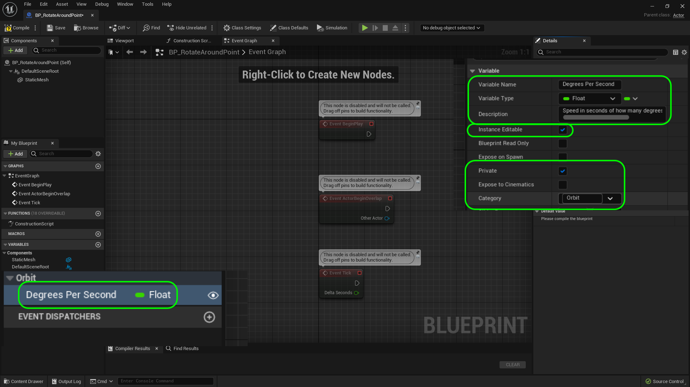
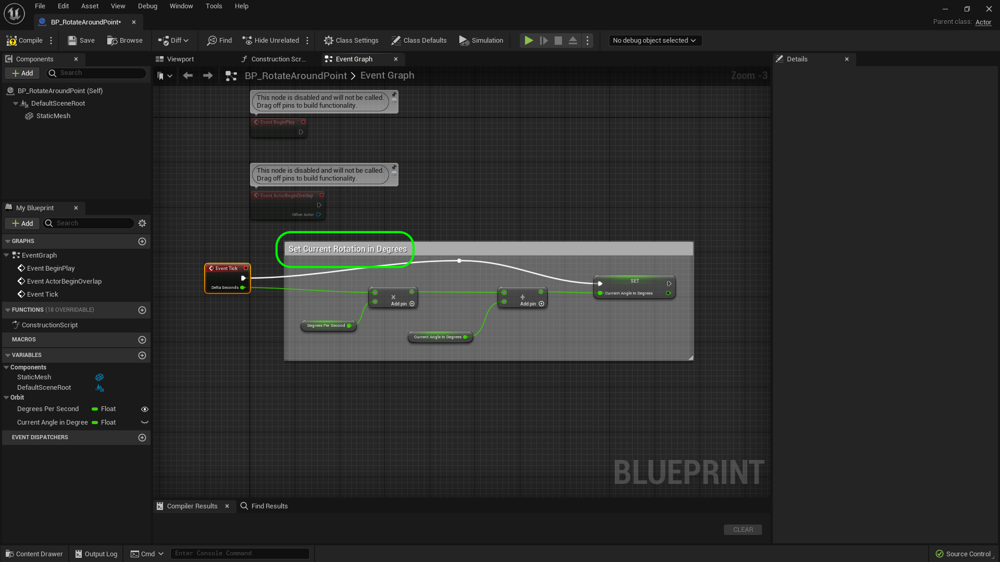

### Orbiting Actors

[previous](../interface-ii/README.md#user-content-communicate-through-interface-ii) • [home](../README.md#user-content-ue4-blueprints) • [next](../orbiting-actors-ii/README.md#user-content-orbiting-actors-ii)

Now lets do something a bit more complicated. We will be adding debug information to help us check out work along the way. We will do a bit of vector manipulation and basic vector arithmetic. Lets orbit (move and rotate) multiple objects around annother object.

 

---

##### `Step 1.`\|`ITB`|:small_blue_diamond:

Move the camera to room 11. *Add* a new Folder called **Blueprints | Room11**. *Create* a new **Blueprint Class** of type **Actor** and call it `BP_RotateAroundPoint`. Move the **Player Start** actor in front of room 11. 

##### `Step 2.`\|`FHIU`|:small_blue_diamond: :small_blue_diamond: 

*Drag* a **Cube** into the middle of the room. Give it space as we will have a blueprint sphere orbit around it. 

##### `Step 3.`\|`ITB`|:small_blue_diamond: :small_blue_diamond: :small_blue_diamond:

Call it in the **World Outliner** `Rotate Around Me`. *Drag* it into the **Room11** folder. 

##### `Step 4.`\|`ITB`|:small_blue_diamond: :small_blue_diamond: :small_blue_diamond: :small_blue_diamond:

*Double click* **BP_Rotate_Around_Room** and press the **Add Component** button and add a **Static Mesh** to the blueprint.

##### `Step 5.`\|`ITB`| :small_orange_diamond:

Go to the **Details** panel and *press* **View Options** and select **Engine Content**. Then search for **Sphere** and add this to the blueprint.

##### `Step 6.`\|`ITB`| :small_orange_diamond: :small_blue_diamond:

*Assign* the **Material** `M_Metal_Burnished_Steel` to the **Sphere** mesh in the details panel:

##### `Step 7.`\|`ITB`| :small_orange_diamond: :small_blue_diamond: :small_blue_diamond:

Now we need to figure out how fast we want to orbit around the actor. We will measure it in degrees per second. Add a variable to hold this speed by *pressing* the **+** button next to **Variables**. *Call* is `Degrees Per Second`, make sure it is of type **Float**, that it is **Instance Editable**, **Private** and set the category to **Orbit**. Add a **Description**, mine says *Speed of how fast an object rotates per second*.

##### `Step 8.`\|`ITB`| :small_orange_diamond: :small_blue_diamond: :small_blue_diamond: :small_blue_diamond:

Now we need a variable to store the current angle that the actor is in relative to whom it is orbiting around. This will store a fractional number between 0 and 360. Call it **Current Angle In Degrees**, make sure it is of type **Float**, make it **Private** and put it in **Category** `Orbit`.

##### `Step 9.`\|`ITB`| :small_orange_diamond: :small_blue_diamond: :small_blue_diamond: :small_blue_diamond: :small_blue_diamond:

Select the **Event Graph** tab. Lets program our current angle. *Drag* the **Degrees Per Second** variable to the **Event Graph** and select **Get**. *Drag off* of the pin and we now want a **Multiplication** node:

##### `Step 10.`\|`ITB`| :large_blue_diamond:

Now since we need to do this every frame we will do the from the **Tick Event** node. Also this node gives us the time since last frame in milliseconds. So we multiply our **Degrees Per Second** variable by **Delta Seconds** coming from the **Tick** node:

##### `Step 11.`\|`ITB`| :large_blue_diamond: :small_blue_diamond: 

That will give us the rotation amount in degrees this frame. So we need to add it to our current angle. Drag and drop a **Get** node for **Current Angle In Degrees** and an **Addition** node. *Add* this current angle to the output of the **Multiplication** node.

##### `Step 12.`\|`ITB`| :large_blue_diamond: :small_blue_diamond: :small_blue_diamond: 

*Drag and drop* a **Set** node for **Current Angle In Degrees** and attach the output of the last **Addition** node to it. *Connect* the execution pin with the **Tick** node.

##### `Step 13.`\|`ITB`| :large_blue_diamond: :small_blue_diamond: :small_blue_diamond:  :small_blue_diamond: 

Add the comment `Set Current Rotation in Degrees` to the group of nodes coming after the **Tick** node.

##### `Step 14.`\|`ITB`| :large_blue_diamond: :small_blue_diamond: :small_blue_diamond: :small_blue_diamond:  :small_blue_diamond: 

Now it is a good idea to test our work after each step. There is a fair amount to do before we can see a rotation. We want to make sure there are no bugs before we go to far. So lets print this value and we should see an angle increase over time. We do not always want to display it so lets put it on a switch that we can adjust. Lets add a **Boolean** called `ShowDebug` variable that is **Instance Editable**, **Private** and in **Category** `Debug`. Add a **Description** as well.

##### `Step 15.`\|`ITB`| :large_blue_diamond: :small_orange_diamond: 

*Drag* a **Get Show Debug Angle In Degrees** variable and *drag off* of the pin. Select a **Print String** node. Note that this is not for an official HUD in the game. This is just for testing and will not show up in a release build.

##### `Step 16.`\|`ITB`| :large_blue_diamond: :small_orange_diamond:   :small_blue_diamond: 

Connect the output **Set** execution pin to the **Print String** input pin. *Press* the small arrow at the bottom to expand the options. Now this will print every frame so we don't want the default 2.0 second variable. We will just get a large scrolling mess (try it!). Set **Duration** to `0.0`.

##### `Step 17.`\|`ITB`| :large_blue_diamond: :small_orange_diamond: :small_blue_diamond: :small_blue_diamond:

Go to the game and drag a copy of the blueprint into the scene next to the box. Make sure **Show Debug** is set to `true`. *Run* the game and we get **Hello**. This is not what we wanted, we wanted to see the current angle in degrees!

##### `Step 18.`\|`ITB`| :large_blue_diamond: :small_orange_diamond: :small_blue_diamond: :small_blue_diamond: :small_blue_diamond:

Go back to the blueprint and see if you can figure it out. Look at the **In String** box and you see **Hello**. We want this to read the current angle. *Drag* the output pin from **Set Current Angle In Degrees** node to the **In String** pin on **Print String**. **UE4** will pick a conversion node to go from **Float** to **String**.

Clean up the nodes so that they are neat. *Press* the <kbd>Compile</kbd> button.

##### `Step 19.`\|`ITB`| :large_blue_diamond: :small_orange_diamond: :small_blue_diamond: :small_blue_diamond: :small_blue_diamond: :small_blue_diamond:

Make sure that **Degrees Per Seconds** is set to `30`. Go back to the game and select the **BP_Rotate_Around_Point** object in the **World Outliner**. Make sure **Show Debug** is set to `true`.

##### `Step 20.`\|`ITB`| :large_blue_diamond: :large_blue_diamond:

Now the debug menu we are printing shows a number going up. There is only one problem. This will probably be OK for a while but really I want to clamp the number between **0** and **360**.

https://user-images.githubusercontent.com/5504953/193660942-60885a5c-7409-4281-b9cc-f3cf8a17cdbb.mp4

##### `Step 21.`\|`ITB`| :large_blue_diamond: :large_blue_diamond: :small_blue_diamond:

This is exactly what I want. Right click and start typing **Modulo** and select the **Float | %(Float)** modulo node.

<!--  -->

| [previous](../interface-ii/README.md#user-content-communicate-through-interface-ii)| [home](../README.md#user-content-ue4-blueprints) | [next](../orbiting-actors-ii/README.md#user-content-orbiting-actors-ii)|
|---|---|---|
