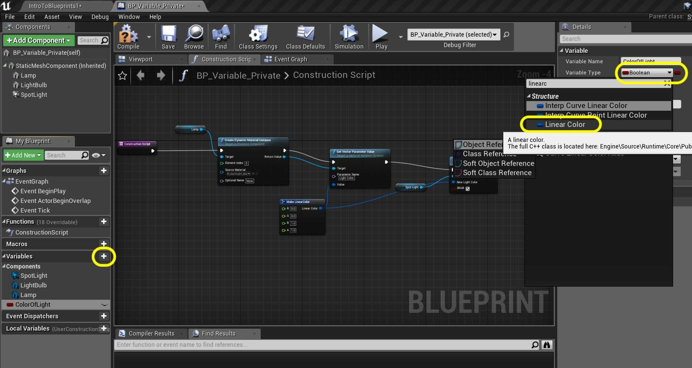
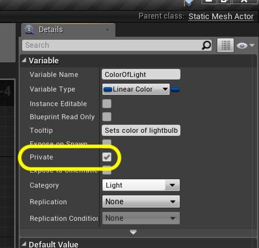
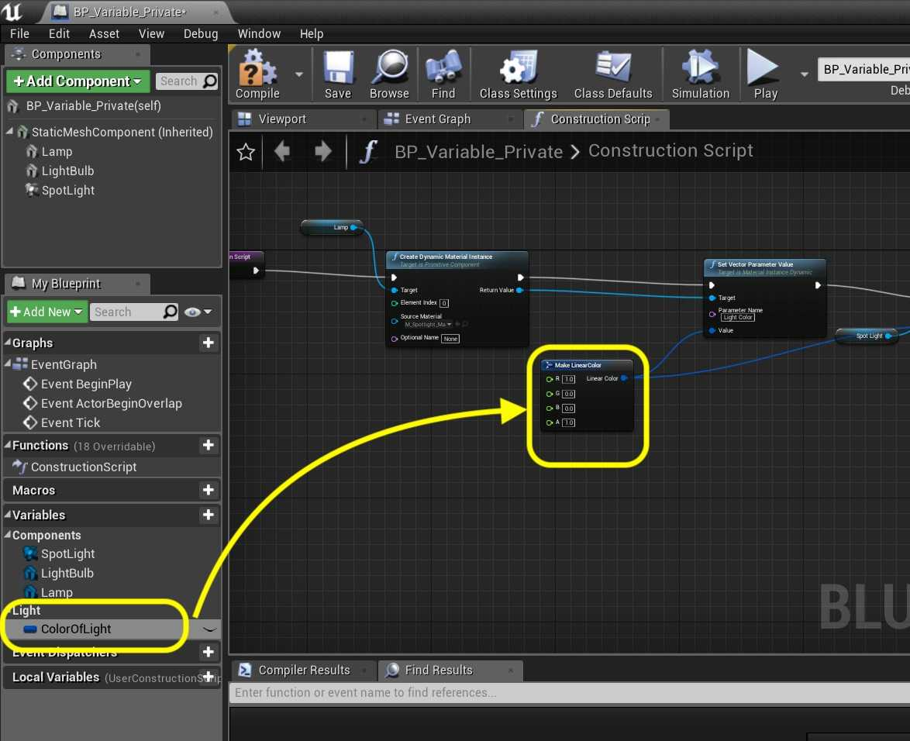
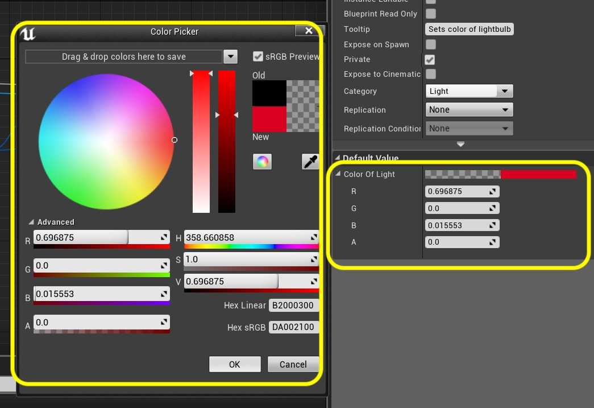
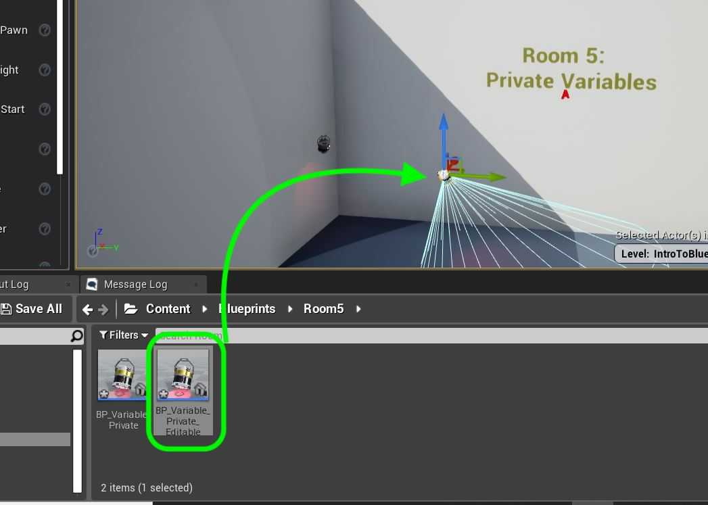
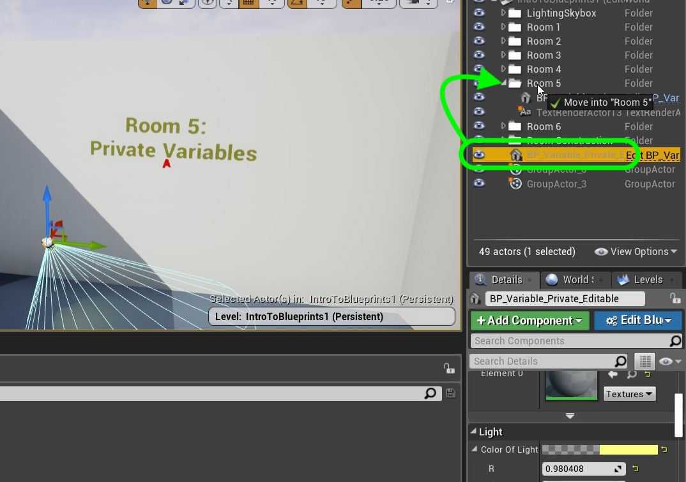
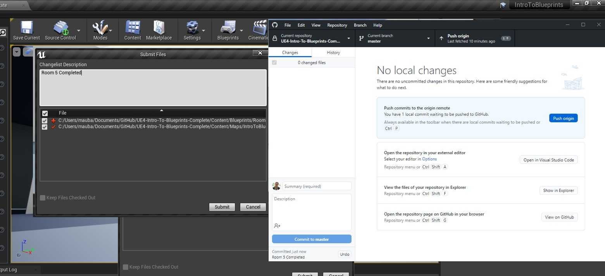

### Private Variables

[previous](../dynamic-materials/README.md#user-content-dynamic-materials) • [home](../README.md#user-content-ue4-blueprints) • [next](../components/README.md#user-content-components)

What is a [variable](https://en.wikipedia.org/wiki/Variable_(computer_science)) in computer programming and why would we want to use it? A variable is a container that allows us to access information stored in memory through a symbolic name. What the variable refers to is a value that can refer to any type of object. In video games we use it to store important information such as **High Score**, **Health** and other values that change over time. We also store data that we want to customize and tune in the game engine. Lets take the light we did in the last exercise and store the color in a variable.

It is best to keep variables **private** if possible. This is called **[encapsulation](https://en.wikipedia.org/wiki/Encapsulation_(computer_programming))** or **data-hiding**. When working on a project with a team, it is usually best to have all the funtionality that a class/objecdt needs contained within that class (or blueprint). If another object needs to interact with it then it is best to have getters and setters so that other classes can interact with this class. This makes the code easier to maintain and debug in the long term.

 

---

##### `Step 1.`\|`ITB`|:small_blue_diamond:

*Add* a new folder called `Room5` in the **Blueprints** folder.  Right click on **Room4 | BP_Spotlight_Dynamic** and select **Duplicate**.  Call the new blueprint `BP_Variable_Private`. *Drag* this new blueprint into the **Room5** folder. Right click on **Blueprints** and select **Fix Up Redirectors in Folder**.

https://user-images.githubusercontent.com/5504953/192381780-30645c21-4a4b-4406-97a5-71daaec3c983.mp4

##### `Step 2.`\|`FHIU`|:small_blue_diamond: :small_blue_diamond: 

In the **World Outliner** drag and drop the variable into **Room 5**.

##### `Step 3.`\|`ITB`|:small_blue_diamond: :small_blue_diamond: :small_blue_diamond:

##### `Step 4.`\|`ITB`|:small_blue_diamond: :small_blue_diamond: :small_blue_diamond: :small_blue_diamond:

We want to use a variable to store the light color. Open the blueprint and press the **+** button next to **Variables** in the **MyBlueprint** menu. In the details panel type `Linear Color`. Select this as the type of variable.:

##### `Step 5.`\|`ITB`| :small_orange_diamond:

Name the variable something that describes what it does. I called it `ColorOfLight`. I also put it in a **Category** called `Light` (this will not show up by default, you can just type it in and it will add it in the future in this blueprint as a category). It is always best practice to also leave a **Tooltip** in the details panel. This way anytime a user hovers over the variable name a full explanation can be given. This allows you to use shorter less descriptive variable names and still provide a full description. My tooltip was `Sets color of lightbulb and spotlight beam in game`.

##### `Step 6.`\|`ITB`| :small_orange_diamond: :small_blue_diamond:

Right now I don't plan on allowing other blueprints to alter this variable. So if even if I don't know if it will be editable it is best practice to set variables as **Private** which you do by clicking the radio button in the **Details** panel.

##### `Step 7.`\|`ITB`| :small_orange_diamond: :small_blue_diamond: :small_blue_diamond:

Now we no longer need the **Make Linear Color** node as we will be replacing it with a variable. Delete this node and drag and drop the **ColorOfLight** variable in its place. We are getting the value and not setting is so select **Get** with the pop up menu.  In the future I will just refer to this as **Get ColorOfLight**.

##### `Step 8.`\|`ITB`| :small_orange_diamond: :small_blue_diamond: :small_blue_diamond: :small_blue_diamond:

*Hook up* the pins coming out of the variable to the **Value** pin in the **Set Vector Parameter** node as well as the **New Light Color** pin in the **Set Light Color** node:

##### `Step 9.`\|`ITB`| :small_orange_diamond: :small_blue_diamond: :small_blue_diamond: :small_blue_diamond: :small_blue_diamond:

Now where do we enter the value for this variable? We go to the default section in the **Details** panel. If this is not editable then press the <kbd>Compile</kbd> button, this will make the default available to edit. This allows us to set what our base value will be. I double clicked on the color bar and set it to red (original default was black)

##### `Step 10.`\|`ITB`| :large_blue_diamond:

Now run the game and notice that the color is set withing the blueprint through the variable.

##### `Step 11.`\|`ITB`| :large_blue_diamond: :small_blue_diamond: 

There is another useful feature with variables while still keeping them private. We can expose them so that they don't have to be edited within the blueprint. We can edit them within the room and allow each object to have a different color! To do this right click the **BP_Variable_Private** and select **Duplicate**. Name this new blueprint `BP_Variable_Editable`.

##### `Step 12.`\|`ITB`| :large_blue_diamond: :small_blue_diamond: :small_blue_diamond: 

Open the Blueprint. There are two places you can make the variable editable. In the **MyBlueprints | Color of Light** variable there is a closed or open eyball next to the variable name. If it is open then it is editable. Also in the **Details** panel is has a radio box called **Instance Editable**. The word instance here is important as you can have a separate instance for each object in the room!

##### `Step 13.`\|`ITB`| :large_blue_diamond: :small_blue_diamond: :small_blue_diamond:  :small_blue_diamond: 

Now go back to the game engine and put a copy of **BP_Variable_Private** in the room. Select this actor in the **World Outliner**. Go to the **Details** panel and you will see an option to adjust the **Editable** variable we just created. I changed it to yellow and it changes right away in game as any change runs the construction script.

##### `Step 14.`\|`ITB`| :large_blue_diamond: :small_blue_diamond: :small_blue_diamond: :small_blue_diamond:  :small_blue_diamond: 

Clean up the **World Outliner** by dragging the object into the **Room 5** folder.

##### `Step 15.`\|`ITB`| :large_blue_diamond: :small_orange_diamond: 

Now add another light and double click this color in the details panel. Adjust the color. One of benefits of this instance editable variable is we don't have to recompile. We can see the color update as we change it allowing for more effetive tuning in game.

##### `Step 16.`\|`ITB`| :large_blue_diamond: :small_orange_diamond:   :small_blue_diamond: 

Put as many lights with different colors in this room as you like!

##### `Step 17.`\|`ITB`| :large_blue_diamond: :small_orange_diamond: :small_blue_diamond: :small_blue_diamond:

That's it for **Room 5**. Press **File | Save All** then go into **Source Control | Submit to Source Control**, add a message that you have completed room 1 and press the <kbd>Submit</kbd> button. Open up **GitHub Desktop** and **Push** changes to server. Select this to finish off this section.

<!--  -->

| [previous](../dynamic-materials/README.md#user-content-dynamic-materials)| [home](../README.md#user-content-ue4-blueprints) | [next](../components/README.md#user-content-components)|
|---|---|---|
