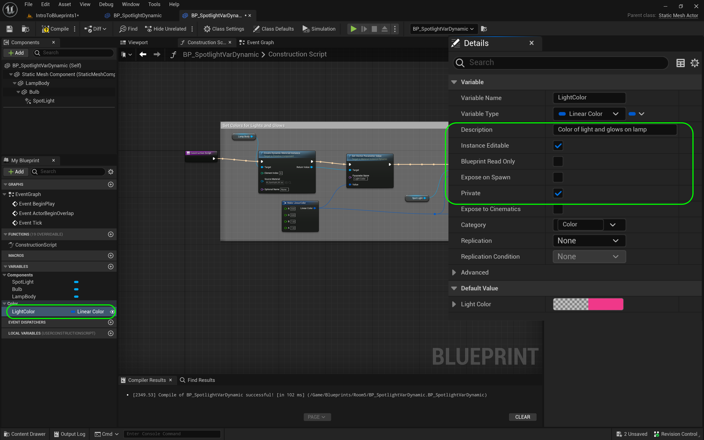

### Private Variables

[previous](../dynamic-materials/README.md#user-content-dynamic-materials) • [home](../README.md#user-content-ue4-blueprints) • [next](../components/README.md#user-content-components)

What is a [variable](https://en.wikipedia.org/wiki/Variable_(computer_science)) in computer programming and why would we want to use it? A variable is a container that allows us to access information stored in memory through a symbolic name. What the variable refers to is a value that can refer to any type of object. In video games we use it to store important information such as **High Score**, **Health** and other values that change over time. We also store data that we want to customize and tune in the game engine. Lets take the light we did in the last exercise and store the color in a variable.

It is best to keep variables **private** if possible. This is called **[encapsulation](https://en.wikipedia.org/wiki/Encapsulation_(computer_programming))** or **data-hiding**. When working on a project with a team, it is usually best to have all the funtionality that a class/objecdt needs contained within that class (or blueprint). If another object needs to interact with it then it is best to have getters and setters so that other classes can interact with this class. This makes the code easier to maintain and debug in the long term.

---

##### `Step 1.`\|`ITB`|:small_blue_diamond:

*Add* a new folder called `Room5` in the **Blueprints** folder.  Right click on **Room4 | BP_Spotlight_Dynamic** and select **Duplicate**.  Call the new blueprint `BP_Variable_Private`. *Drag* this new blueprint into the **Room5** folder. Right click on **Blueprints** and select **Fix Up Redirectors in Folder**.

https://user-images.githubusercontent.com/5504953/192381780-30645c21-4a4b-4406-97a5-71daaec3c983.mp4

##### `Step 2.`\|`FHIU`|:small_blue_diamond: :small_blue_diamond: 

In the **World Outliner** drag and drop the variable into **Room 5**.

##### `Step 3.`\|`ITB`|:small_blue_diamond: :small_blue_diamond: :small_blue_diamond:

We want to use a variable to store the light color. Open the blueprint and press the **+** button next to **Variables** in the **MyBlueprint** menu. In the details panel type `Linear Color`. Select this as the type of variable.

https://user-images.githubusercontent.com/5504953/192383110-08e62a28-6c9a-4fa4-bbf2-2721a93e270c.mp4

##### `Step 4.`\|`ITB`|:small_blue_diamond: :small_blue_diamond: :small_blue_diamond: :small_blue_diamond:

Name the variable something that describes what it does. I called it `LightColor`. II also put it in a **Category** called `Light` (this will not show up by default, you can just type it in and it will add it in the future in this blueprint as a category). Now where do we enter the value for this variable? We go to the default section in the **Details** panel. If this is not editable then press the <kbd>Compile</kbd> button, this will make the default available to edit. This allows us to set what our base value will be. I double clicked on the color bar and set it to yellow (original default was black)

##### `Step 5.`\|`ITB`| :small_orange_diamond:

t is always best practice to also leave a **Tooltip** in the details panel. This way anytime a user hovers over the variable name a full explanation can be given. This allows you to use shorter less descriptive variable names and still provide a full description. My tooltip was `Sets color of lightbulb and light glow`.

Right now I don't plan on allowing other blueprints to alter this variable. So if even if I don't know if it will be editable it is best practice to set variables as **Private** which you do by clicking the radio button in the **Details** panel.

We also want to edit the color in the game screen so that each instance can have its own color.  Set **Instance Editable** to `true`.  This will allow seperate editing in the details panel in the level you are working in.

##### `Step 6.`\|`ITB`| :small_orange_diamond: :small_blue_diamond:

Now we no longer need the **Make Linear Color** node as we will be replacing it with a variable. Delete this node and drag and drop the **Color of Light** variable in its place and select **Get Color of Light**. We are getting the value and not setting is so select **Get** with the pop up menu.  In the future I will just refer to this as **Get ColorOfLight**. Reconnect the output pin to the input pins in the three references in materials we linked the color to.

https://user-images.githubusercontent.com/5504953/192384929-6898b4f5-6f62-43d6-9ac0-285a65cdcce7.mp4

##### `Step 7.`\|`ITB`| :small_orange_diamond: :small_blue_diamond: :small_blue_diamond:

##### `Step 8.`\|`ITB`| :small_orange_diamond: :small_blue_diamond: :small_blue_diamond: :small_blue_diamond:

Now run the game and notice that the color is set withing the blueprint through the variable.

##### `Step 9.`\|`ITB`| :small_orange_diamond: :small_blue_diamond: :small_blue_diamond: :small_blue_diamond: :small_blue_diamond:

Now go back to the game engine and put a duplicate the blueprint putting the light next to the original to the right.

##### `Step 10.`\|`ITB`| :large_blue_diamond:

Now you can selet this second light and set it to a different color.  Since you set this variable to **Instance Editable** now each light in the scene can have a different color.  I set the second light to a green color.

##### `Step 11.`\|`ITB`| :large_blue_diamond: :small_blue_diamond: 

Repeat this and create 5 lights with different colors.

##### `Step 12.`\|`ITB`| :large_blue_diamond: :small_blue_diamond: :small_blue_diamond: 

Now make sure all the blueprints are in the **Room 5** folder.  Move the **Player Start** node to the front of room 5.  Press the <kbd>Play</kbd> button and make sure the ligths and the glow are all set to unique colors.

https://user-images.githubusercontent.com/5504953/192387219-4c4e6e08-ae43-4395-942e-260296013159.mp4

##### `Step 13.`\|`ITB`| :large_blue_diamond: :small_blue_diamond: :small_blue_diamond:  :small_blue_diamond: 

Select the **File | Save All** then quit UE5.   Go to **P4V** and go the top project folder (the one that holds the `.uproject` file and **Content** folder) and press the <kbd>+Add</kbd> then <kbd>OK</kbd> button.  This makes sure any files that Unreal didn't add get added to source control. Press the <kbd>Submit</kbd> button and enter a message explaining the work done.  Press <kbd>Submit</kbd>.

<!--  -->

| [previous](../dynamic-materials/README.md#user-content-dynamic-materials)| [home](../README.md#user-content-ue4-blueprints) | [next](../components/README.md#user-content-components)|
|---|---|---|
