### Rotation II

[previous](../rotation/README.md#user-content-rotation) • [home](../README.md#user-content-ue4-blueprints) • [next](../translation/README.md#user-content-translation)

Rotations continued...

 

---

##### `Step 1.`\|`ITB`|:small_blue_diamond:

Go back to the editor and *select* the **Blueprints** folder in the **Content Browser**. *Drag and drop* the **BP_Rotate_Object** into **Room 8**. *Position* it to the left hand side of the room and make sure that **Rotate on Z** is set to `true` and **Degrees Per Second** has a non 0 value between `-360` and `360` in the **Details** panel.

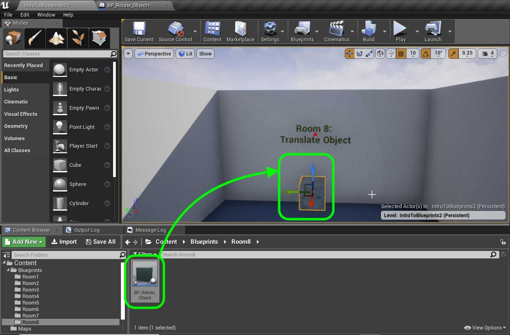

##### `Step 2.`\|`FHIU`|:small_blue_diamond: :small_blue_diamond: 

**Run** the game and the cube should rotate around the **Z** axis.

##### `Step 3.`\|`ITB`|:small_blue_diamond: :small_blue_diamond: :small_blue_diamond:

*Select* everything after the **Sequence** node for **Yaw** and *copy and paste* it beneath.

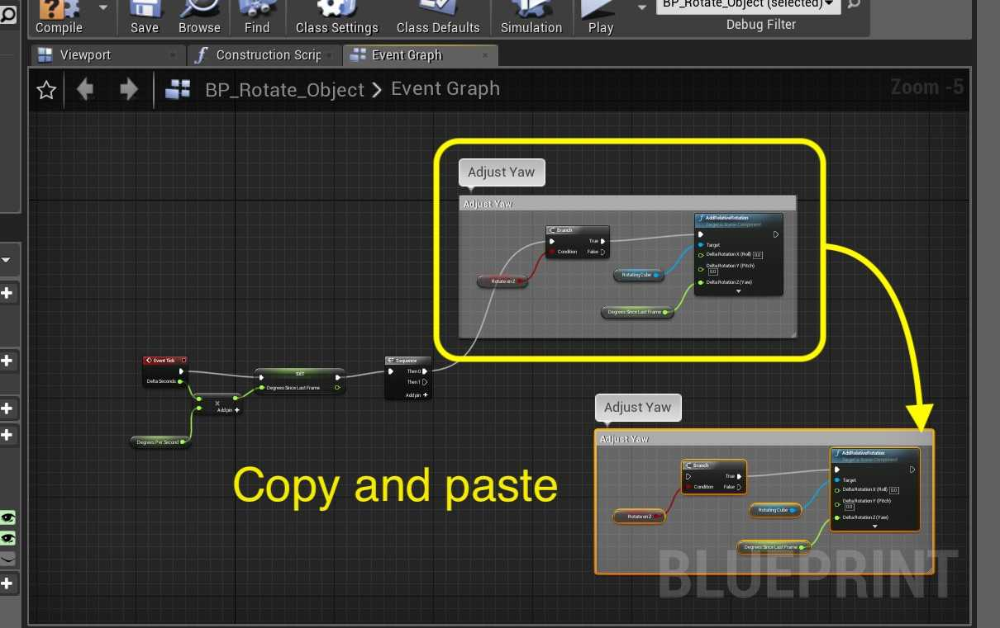

##### `Step 4.`\|`ITB`|:small_blue_diamond: :small_blue_diamond: :small_blue_diamond: :small_blue_diamond:

*Change* the link from **Degrees Since Last Frame** to the **Delta Rotation Y (Pitch)** input in the **AddRelativeRotation** node. *Connect* the execution pin from **Sequence | Then 1** to this copied **Branch** node. *Adjust* the **comment** appropriately:

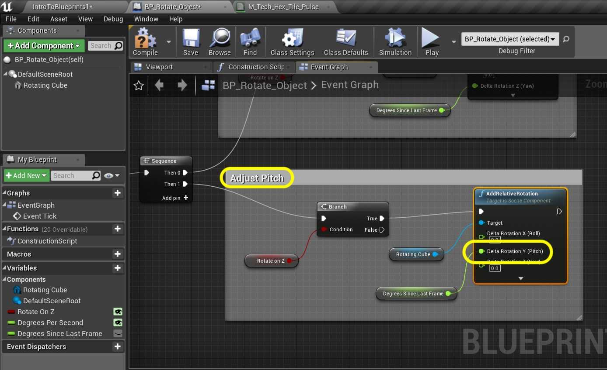

##### `Step 5.`\|`ITB`| :small_orange_diamond:
You can *right click* on the **bRotateOn Z** variable and *duplicate* it. *Rename* it to `bRotateOnY` and adjust the **Tooltip**. Drag a **Get** reference to it on the chart and delete the old **Z** reference and drag it into the **Condition** on the **Branch**.

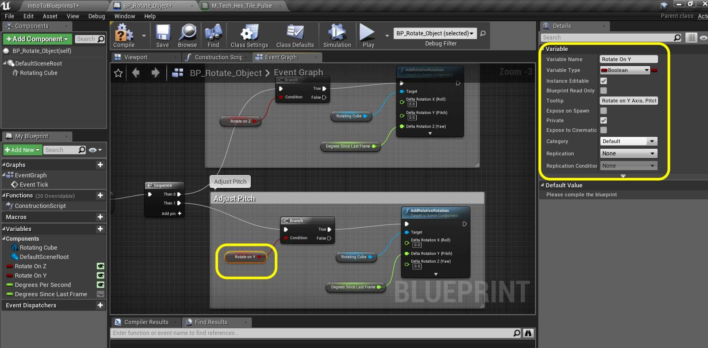

##### `Step 6.`\|`ITB`| :small_orange_diamond: :small_blue_diamond:

Now connect the output of **Sequence Then 1** node to the **Branch** node.

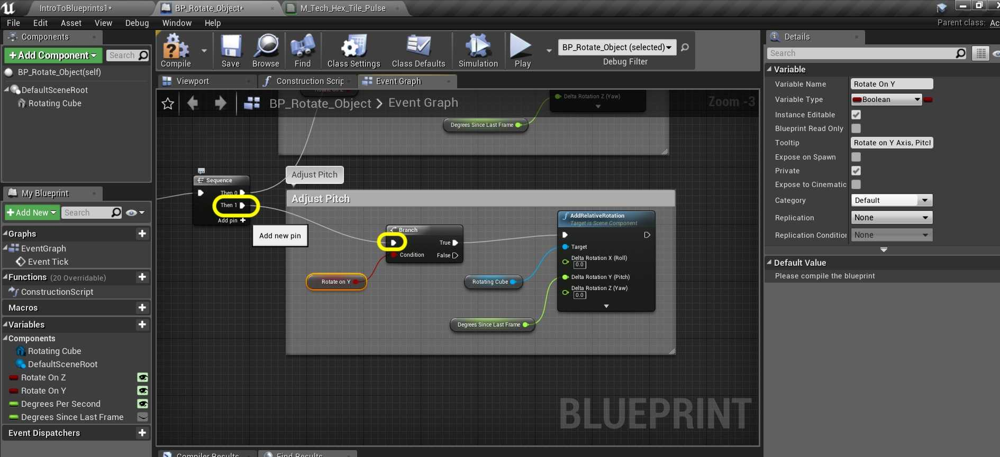

##### `Step 7.`\|`ITB`| :small_orange_diamond: :small_blue_diamond: :small_blue_diamond:

Go to the game and *deselect* the **Rotate On Z** and *select* the **Rotate on Y**. The actor should now rotate on the Y axis when the game runs. There is a problem. The actor gets stuck and stops rotating. This is [gimble lock](https://en.wikipedia.org/wiki/Gimbal_lock) which is a problem when we use **euler angles** to rotate. We can find a work around.

##### `Step 8.`\|`ITB`| :small_orange_diamond: :small_blue_diamond: :small_blue_diamond: :small_blue_diamond:

Go back to the **Blueprint** and remove the **Add Relative Rotation** node on **Pitch**:

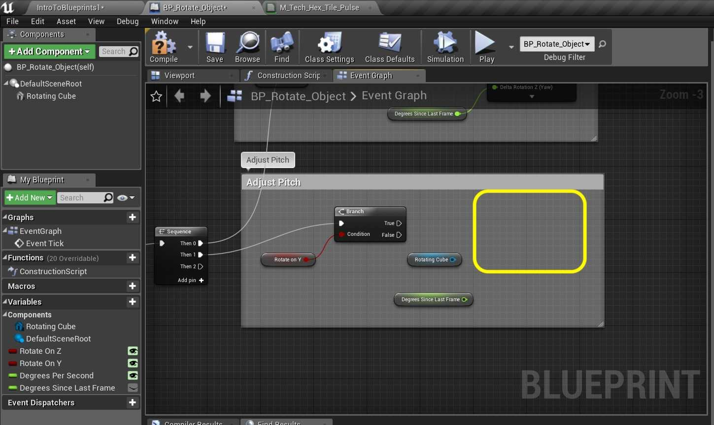

##### `Step 9.`\|`ITB`| :small_orange_diamond: :small_blue_diamond: :small_blue_diamond: :small_blue_diamond: :small_blue_diamond:

You can *delete* the **Rotating Cube** reference as we will not be using it. *Right click* on open space in the graph and select: **Add Actor Local Rotation** node. Connect the execution pin from the output **True** of the **Branch** node.

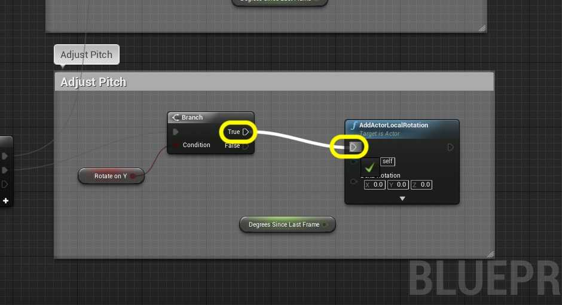

##### `Step 10.`\|`ITB`| :large_blue_diamond:

*Right click* on **Delta Rotation** and select **Split Struct Pin**:

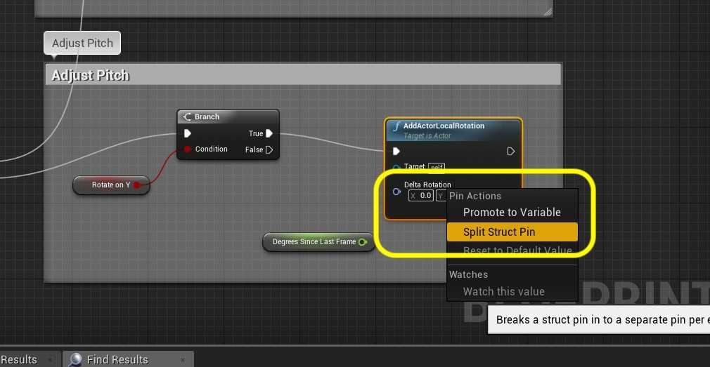

##### `Step 11.`\|`ITB`| :large_blue_diamond: :small_blue_diamond: 

*Send* the output of **Degrees Since Last Frame** to **Delta Rotation Y (Pitch)**.

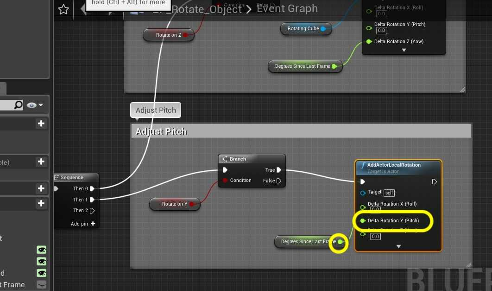

##### `Step 12.`\|`ITB`| :large_blue_diamond: :small_blue_diamond: :small_blue_diamond: 

Now go back to the game and try it out. No more gimble lock, the object rotates without stopping:

##### `Step 13.`\|`ITB`| :large_blue_diamond: :small_blue_diamond: :small_blue_diamond:  :small_blue_diamond: 

Lets do the final axis of rotation along the **X** axis for **Roll**. *Copy* the **Yaw (rotating around Z)** and *paste* it at the bottom. Change the **comment** `Adjust Roll`:

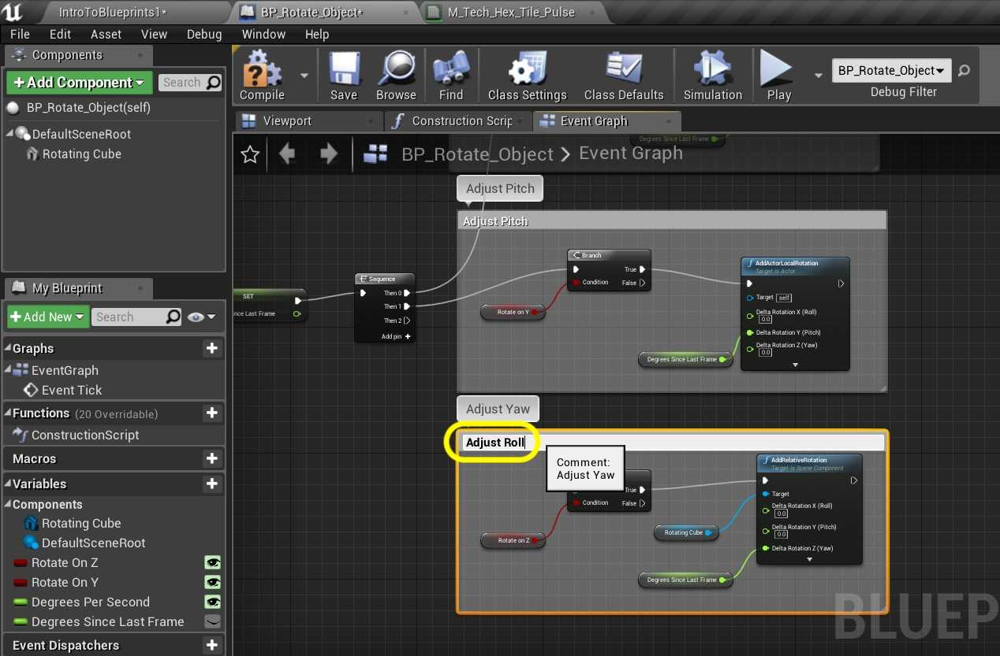

##### `Step 14.`\|`ITB`| :large_blue_diamond: :small_blue_diamond: :small_blue_diamond: :small_blue_diamond:  :small_blue_diamond: 

Delete the **Rotate On Z** boolean reference and duplicate it to create another boolean called `bRotateOnX`.

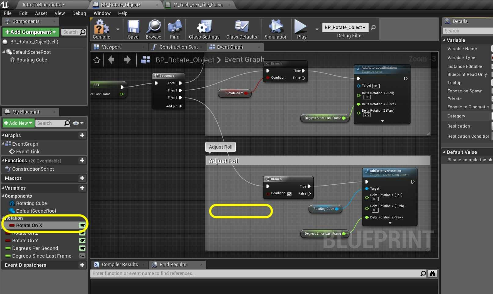

##### `Step 15.`\|`ITB`| :large_blue_diamond: :small_orange_diamond: 

I just noticed that I forgot to categorize the variables. Go back to each variable and add the category: `Rotation`.

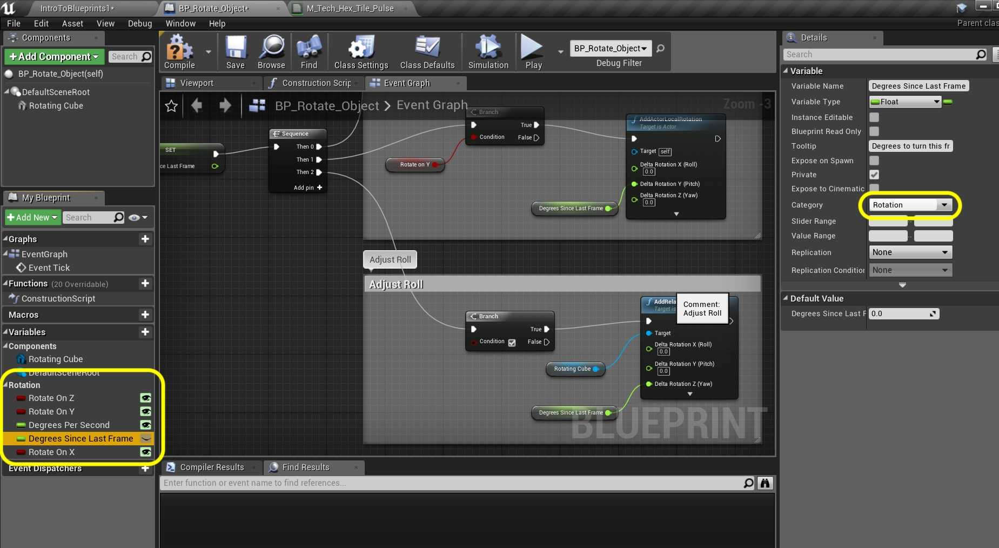

##### `Step 16.`\|`ITB`| :large_blue_diamond: :small_orange_diamond:   :small_blue_diamond: 

*Drag* a copy of the **Rotate On X** variable as a **Get** onto the graph and *send* it to the **Condition** input on the **Branch** node. Also, *connect* the **Degrees Since Last Frame** output to the **Delta Rotation X (Roll)** on the **Add Relative Rotation** node.

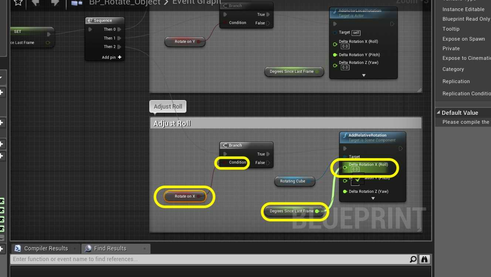

##### `Step 17.`\|`ITB`| :large_blue_diamond: :small_orange_diamond: :small_blue_diamond: :small_blue_diamond:

*Press* **Add Pin +** to **Sequence** node. *Attach* **Then 2** to the adjust roll **Branch** node. Your node graph should now look like:

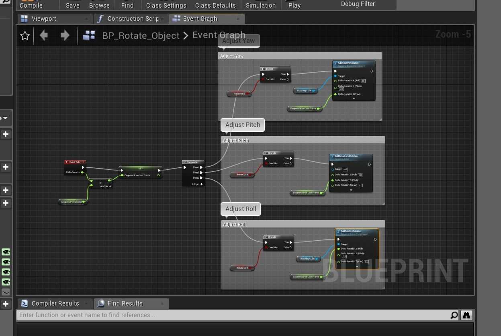

##### `Step 18.`\|`ITB`| :large_blue_diamond: :small_orange_diamond: :small_blue_diamond: :small_blue_diamond: :small_blue_diamond:

Go into the game and try different values and combinations both positive and negative. Also, look at your blueprint node chart as it runs to see how the booleans gate the operation flow. Now we will continue in this room but instead of rotation will be translating the cube instead.

##### `Step 19.`\|`ITB`| :large_blue_diamond: :small_orange_diamond: :small_blue_diamond: :small_blue_diamond: :small_blue_diamond: :small_blue_diamond:

Press the **File | Save All** then press the **Submit to Source Control...** and push in **Github Desktop**.

___

| [previous](../rotation/README.md#user-content-rotation)| [home](../README.md#user-content-ue4-blueprints) | [next](../translation/README.md#user-content-translation)|
|---|---|---|
