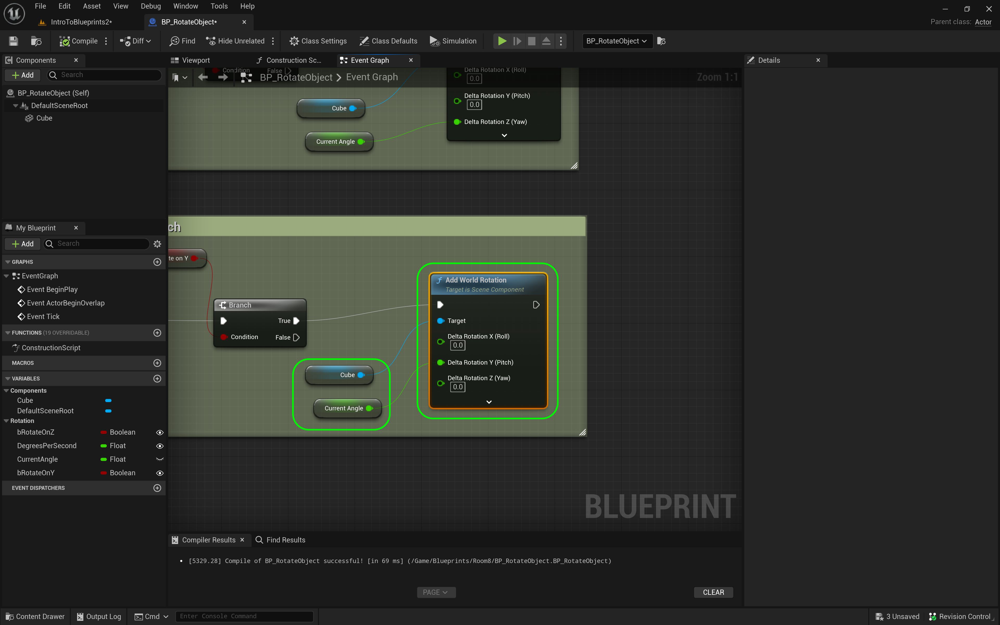

### Rotation II

[previous](../rotation/README.md#user-content-rotation) • [home](../README.md#user-content-ue4-blueprints) • [next](../translation/README.md#user-content-translation)

Rotations continued...

 

---

##### `Step 1.`\|`ITB`|:small_blue_diamond:

*Connect* the output of **Degrees Since Last Frame** with the input on the **Rotation** node into the **Delta Rotation Z (Yaw)** pin. Add a comment to the latest work by pressing the <kbd>C</kbd> key. 

##### `Step 2.`\|`FHIU`|:small_blue_diamond: :small_blue_diamond: 

Add a comment to the nodes on the left by pressing the <kbd>C</kbd> key. Press the <kbd>Compile</kbd> button.

##### `Step 3.`\|`ITB`|:small_blue_diamond: :small_blue_diamond: :small_blue_diamond:

Go back to the editor make sure that **Rotate on Z** is set to `true` and **Degrees Per Second** is set to `45` degrees per second.

##### `Step 4.`\|`ITB`|:small_blue_diamond: :small_blue_diamond: :small_blue_diamond: :small_blue_diamond:

**Run** the game and the cube should rotate around the **Z** axis.

https://user-images.githubusercontent.com/5504953/193435298-39b520c6-b88a-4694-b30b-aac2b1437fc3.mp4

##### `Step 5.`\|`ITB`| :small_orange_diamond:

*Select* everything after the **Sequence** node for **Yaw** and *copy and paste* it beneath.

##### `Step 6.`\|`ITB`| :small_orange_diamond: :small_blue_diamond:

*Change* the link from **Degrees Since Last Frame** to the **Delta Rotation Y (Pitch)** input in the **AddRelativeRotation** node. *Connect* the execution pin from **Sequence | Then 1** to this copied **Branch** node. *Adjust* the **comment** to `Adjust Pitch`.

##### `Step 7.`\|`ITB`| :small_orange_diamond: :small_blue_diamond: :small_blue_diamond:

You can *right click* on the **bRotateOn Z** variable and *duplicate* it. *Rename* it to `bRotateOnY` and adjust the **Tooltip** to `Pitch on Y Axis, Yaw, Shaking Head Yes/No`. Drag a **Get** reference to it on the chart and delete the old **Rotate on Z** node and drag it into the **Condition** on the **Branch**.

##### `Step 8.`\|`ITB`| :small_orange_diamond: :small_blue_diamond: :small_blue_diamond: :small_blue_diamond:

Now connect the output of **Sequence Then 1** node to the **Branch** node. Now right click on **Rotate on Z** in the **Pitch** section and select **Replace variable ReturnOnZ** with `ReturnOnY`.

##### `Step 9.`\|`ITB`| :small_orange_diamond: :small_blue_diamond: :small_blue_diamond: :small_blue_diamond: :small_blue_diamond:

Go to the game and *deselect* the **Rotate On Z** and *select* the **Rotate on Y**. The actor should now rotate on the Y axis when the game runs. There is a problem. The actor gets stuck and stops rotating. This is [gimble lock](https://en.wikipedia.org/wiki/Gimbal_lock) which is a problem when we use **euler angles** to rotate. We can find a work around.

https://user-images.githubusercontent.com/5504953/193435719-96fa204d-947c-4cd2-8a87-3b63fcefba44.mp4

##### `Step 10.`\|`ITB`| :large_blue_diamond:

Go back to the **Blueprint** and remove the **Add Relative Rotation** node on **Pitch**. *Right click* on open space in the graph and select: **Add Actor Local Rotation** node.

##### `Step 11.`\|`ITB`| :large_blue_diamond: :small_blue_diamond: 

You can *delete* the **Rotating Cube** reference as we will not be using it. Connect the execution pin from the output **True** of the **Branch** node.

##### `Step 12.`\|`ITB`| :large_blue_diamond: :small_blue_diamond: :small_blue_diamond: 

*Right click* on **Delta Rotation** and select **Split Struct Pin**.

##### `Step 13.`\|`ITB`| :large_blue_diamond: :small_blue_diamond: :small_blue_diamond:  :small_blue_diamond: 

*Send* the output of **Degrees Since Last Frame** to **Delta Rotation Y (Pitch)**. Press the <kbd>Compile</kbd> button.

##### `Step 14.`\|`ITB`| :large_blue_diamond: :small_blue_diamond: :small_blue_diamond: :small_blue_diamond:  :small_blue_diamond: 

Now go back to the game and try it out. No more gimble lock, the object rotates without stopping:

https://user-images.githubusercontent.com/5504953/193435945-400d044c-e9eb-4eab-a5b6-fa4ff2476cd2.mp4

##### `Step 15.`\|`ITB`| :large_blue_diamond: :small_orange_diamond: 

Lets do the final axis of rotation along the **X** axis for **Roll**. *Copy* the **Adjust Yaw** nodes and *paste* them at the bottom. Change the **Comment box** to `Adjust Roll`. Chnage the utput of the **Current Angle** pin to **Delta Rotatoin X (Roll)** on the **Add Relative Rotation** node.  Duplicate the **Rotate On Z** variable to create another boolean called `RotateOnX`.  Change the desciption to `Rotate around the X Axis?`. Right click on **Rotate on Z** in the **Roll** section and select **Replace variable RotateOnZ with | RotateOnX**.

https://user-images.githubusercontent.com/5504953/193449873-b946142d-06c3-4779-b79b-704e40aed5af.mp4

##### `Step 16.`\|`ITB`| :large_blue_diamond: :small_orange_diamond:   :small_blue_diamond: 

*Press* **Add Pin +** to **Sequence** node. *Attach* **Then 2** to the adjust roll **Branch** node. Your node graph should now be complete.  Press the <kbd>Compile</kbd> button.

https://user-images.githubusercontent.com/5504953/193450279-a45a0499-a604-4b69-846d-4728c39fa898.mp4

##### `Step 17.`\|`ITB`| :large_blue_diamond: :small_orange_diamond: :small_blue_diamond: :small_blue_diamond:

I misentered the ranges when typing in the restrictions for **Degress per Second**.  It is from `-359` to `359`, clamping the max speed to a full rotation per second in either the clockwise or counterclockwise directions.

##### `Step 18.`\|`ITB`| :large_blue_diamond: :small_orange_diamond: :small_blue_diamond: :small_blue_diamond: :small_blue_diamond:

Go into the game and try different values and combinations both positive and negative. Also, look at your blueprint node chart as it runs to see how the booleans gate the operation flow. Now we will continue in this room but instead of rotation will be translating the cube instead.

##### `Step 19.`\|`ITB`| :large_blue_diamond: :small_orange_diamond: :small_blue_diamond: :small_blue_diamond: :small_blue_diamond: :small_blue_diamond:

Press **File | Save All** then go into **Source Control | Submit to Source Control**, add a message that you have completed room 1 and press the <kbd>Submit</kbd> button. Open up **GitHub Desktop** and **Push** changes to server. Select this to finish off this section.

<!--  -->

| [previous](../rotation/README.md#user-content-rotation)| [home](../README.md#user-content-ue4-blueprints) | [next](../translation/README.md#user-content-translation)|
|---|---|---|
