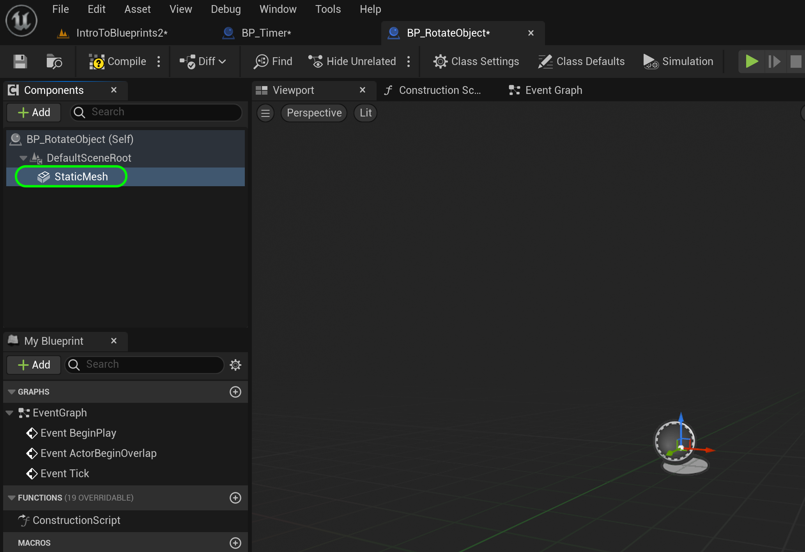

### Rotation

[previous](../tick-event-ii/README.md#user-content-tick-event-ii) • [home](../README.md#user-content-ue4-blueprints) • [next](../rotation-ii/README.md#user-content-rotation-ii)

We will be rotating an object in 3-D space through blueprints. Now there are two common ways of representing rotations in games.  One is with **[Eulers](https://en.wikipedia.org/wiki/Euler_angles)** and the other is with **[Quaternions](https://en.wikipedia.org/wiki/Quaternions_and_spatial_rotation)**. In the editor the rotations are represented as **Eulers** with the **XYZ** axis rotation in **degrees**.

 

---

##### `Step 1.`\|`ITB`|:small_blue_diamond:

Move the **Player Start** actor over to **Room 8**. *Create* a new folder called `Room8`. *Add* a new **Blueprint Class** of type **Actor** and call it `BP_RotateObject`. Drag the empty blueprint in the back of room 8. *Open up* the **blueprint**:

https://user-images.githubusercontent.com/5504953/193430834-d522e56f-099f-44b8-8efa-e8e995b8ed3b.mp4

##### `Step 2.`\|`FHIU`|:small_blue_diamond: :small_blue_diamond: 

*Add* a **Static Mesh** component to the blueprint. 

##### `Step 3.`\|`ITB`|:small_blue_diamond: :small_blue_diamond: :small_blue_diamond:

*Change* the **View Type** to see **Engine Content**. *Select* the **Cube** static mesh. You will have to turn on engine content to see the shape.

##### `Step 4.`\|`ITB`|:small_blue_diamond: :small_blue_diamond: :small_blue_diamond: :small_blue_diamond:

*Change* the **View Type** to hide **Engine Content**. *Assign* the **M_Metal_Burnished_Steel** Material. *Rename* the static mesh to `Rotating Cube`.

##### `Step 5.`\|`ITB`| :small_orange_diamond:

Now go to the **Event Graph** tab. We will be rotating on the **Z**, **X** and **Y** axis. So lets put in a **Sequence** node to keep our graph neat. Since this needs to animate every frame we will use the **Tick Event** and connect its execution pin to the **Sequence** node:

##### `Step 6.`\|`ITB`| :small_orange_diamond: :small_blue_diamond:

Now we want a switch in the editor to turn each rotating in each axis on or off. We will use a **boolean** that is exposed to the editor to accomplish this. *Add* a new **Variable** by pressing the **+** button and call it `RotateOnZ`. Make sure it is type **Boolean** and make sure that **Instance Editable** is set to `true`. Also since no other object will access this, set the **Private** access to `true`. *Add* a **tooltip** `Rotate on Z Axis, Yaw, Shaking Head No`. We want it to be instance editable so we can edit this boolean and turn on and off rotation in the game window in editor view.

https://user-images.githubusercontent.com/5504953/193431148-1f3d951d-0e1a-43a8-a35d-61944ec5c2b7.mp4

##### `Step 7.`\|`ITB`| :small_orange_diamond: :small_blue_diamond: :small_blue_diamond:

Drag the **Rotate On Z** boolean to the graph and select **Get**.

##### `Step 8.`\|`ITB`| :small_orange_diamond: :small_blue_diamond: :small_blue_diamond: :small_blue_diamond:

*Grab* the pin coming of the **Rotate On Z** node and select **Branch**. Again this is the same as an if statement.

##### `Step 9.`\|`ITB`| :small_orange_diamond: :small_blue_diamond: :small_blue_diamond: :small_blue_diamond: :small_blue_diamond:

Attach the Execution pins from **Sequence | The 0** to **Branch**.

##### `Step 10.`\|`ITB`| :large_blue_diamond:

*Drag and drop* the **Rotating Cube** component into the scene graph to create a reference. *Drag off* of the **Rotating Cube** pin and find the **Add Relative Rotation** node and *add* it to the scene graph.

##### `Step 11.`\|`ITB`| :large_blue_diamond: :small_blue_diamond: 

*Drag* the execution pin from the **True** output of the Branch and *connect* it to the **Add Relative Rotation**. This will only run the rotation if this boolean is set to **True**.

##### `Step 12.`\|`ITB`| :large_blue_diamond: :small_blue_diamond: :small_blue_diamond: 

We need another variable to track how many degrees per second the object will rotate in. We need to accept both positive and negative values. Flipping the sign will change the direction of rotation. Create a new **Variable** called `DegreesPerSecond` of type **Float**. Make the **Description** `Degrees of Rotation per Second`.   Set **Instance Editable** to `true` and **Private** to `true`. If you would like you could restrict the **Value Range** from `-360` to `360`. 

https://user-images.githubusercontent.com/5504953/193431472-7a13694a-a9bc-4347-ab12-e967e65f4c3c.mp4

##### `Step 13.`\|`ITB`| :large_blue_diamond: :small_blue_diamond: :small_blue_diamond:  :small_blue_diamond: 

Now we can set the speed of how many degrees per second that we would like to turn but how do we then know what each frame takes. Not all frames will be the same length so we can't just divide the **Degrees Per Second** by the frame rate. The easiest way is to multiply it by the delta time. Lets say this is 1/60th of a second or .01666. If we multiply our value of 45 (degrees per second) times .01666 we will get our time since last frame = .747 degrees.

We need a variable to keep this number in. *Duplicate* the variable **DegreesPerSecond** and creation another **Float** variable called `Current Angle` and set **Private** to `true`. Add a **Tooltip** such as `Current angle on axis`. Turn **Intance Editable** to `false`, and  empty out **Slider Range** and **Value Range**.

##### `Step 14.`\|`ITB`| :large_blue_diamond: :small_blue_diamond: :small_blue_diamond: :small_blue_diamond:  :small_blue_diamond: 

I forgot to assign a **Category** to all the variables.  So set the **Category** to `Rotations` for **RotationOnZ**, **CurrentAngle** and **DegreesPerSecond**.  The first one you will have to actuall type **Rotations** as it is not a menu option yet!

##### `Step 15.`\|`ITB`| :large_blue_diamond: :small_orange_diamond: 

Drag and drop the **Degrees Per Second** variable to the graph and select **Get**. *Right click* on the open graph and find a **Float * Float** node.

##### `Step 16.`\|`ITB`| :large_blue_diamond: :small_orange_diamond:   :small_blue_diamond: 

*Connect* the **Delta Seconds** from the **Event Tick** node to the **Multiply** node, and the output of **Degrees Per Second** to the **Multiply** node. *Add* a **Set Degree Since Last Frame** node reference to the variable. *Send* the result of this multiplication to the setter input for the **Set** node.

##### `Step 17.`\|`ITB`| :large_blue_diamond: :small_orange_diamond: :small_blue_diamond: :small_blue_diamond:

Now *break* the pins between the **Tick** event and **Sequence**. *Route* this execution through the **Set** node.

##### `Step 18.`\|`ITB`| :large_blue_diamond: :small_orange_diamond: :small_blue_diamond: :small_blue_diamond: :small_blue_diamond:

Now go back to the **Add Relative Rotation** node and *right click* on **Delta Rotation**. We just want to affect the *Z* axis so we will *select* **Split Struct Pin**:

##### `Step 19.`\|`ITB`| :large_blue_diamond: :small_orange_diamond: :small_blue_diamond: :small_blue_diamond: :small_blue_diamond: :small_blue_diamond:

Now *drag* the **Degrees Since Last Frame** variable into the scene graph and select **Get**.

##### `Step 20.`\|`ITB`| :large_blue_diamond: :large_blue_diamond:

*Connect* the output of **Degrees Since Last Frame** with the input on the **Rotation** node into the **Delta Rotation Z (Yaw)** pin.

##### `Step 21.`\|`ITB`| :large_blue_diamond: :large_blue_diamond: :small_blue_diamond:

Add a comment to the latest work by pressing the <kbd>C</kbd> key. Press the <kbd>Compile</kbd> button.

<!--  -->

| [previous](../tick-event-ii/README.md#user-content-tick-event-ii)| [home](../README.md#user-content-ue4-blueprints) | [next](../rotation-ii/README.md#user-content-rotation-ii)|
|---|---|---|
