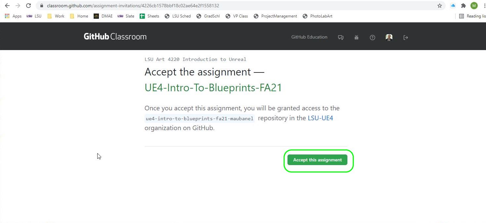
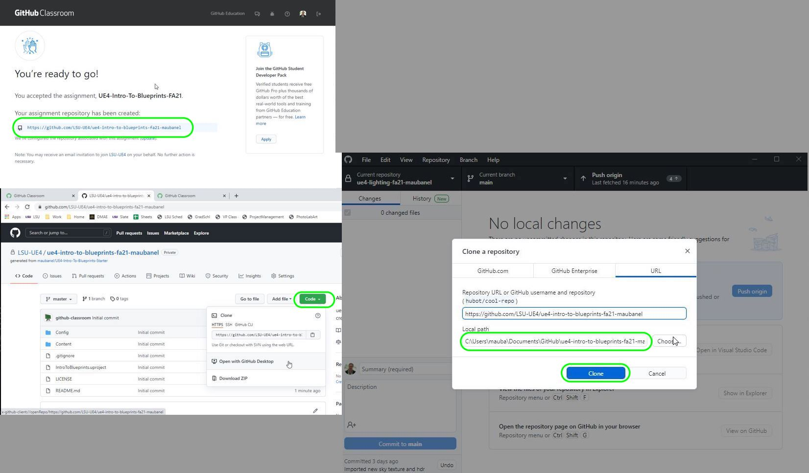

### Setting Up

[home](../README.md#user-content-ue4-blueprints) • [next](../constructor-begin/README.md#user-content-constructor--begin-play)

Lets get going by setting up the project so we can start using blueprints.

 

---

| `required.software`\|`UE4 Lighting`| 
| :--- |
| :floppy_disk: &nbsp; &nbsp; You will need to install the latest version of _UE4 4.26.x_ by downloading the [Epic Games Launcher](https://www.epicgames.com/store/en-US/download). You will also need a [GitHub](https://github.com/) account which is free to sign up for as we will be using version control. You will also need a mac or PC that is powerful enough to run unreal. If you are on a PC you will have to download and install [git](https://git-scm.com/downloads) (on a mac it may prompt you to install git as well but you can do it through the terminal). We will also install [Github Desktop](https://desktop.github.com) as it provides a GUI interface so you don't have to worry about command line. Once git is installed you will also need to download and install the [Git LFS (Large File System)](https://git-lfs.github.com) as well for both PC and mac.  You will also need access to Maya 2020..\n\nLets make sure you can see hidden folders. On the PC follow these [Windows 10 Turn on Hidden Folders](https://support.microsoft.com/en-us/help/4028316/windows-view-hidden-files-and-folders-in-windows-10) directions. On the Mac it is a bit more involved so go and [turn on hidden folders on Mac](https://ianlunn.co.uk/articles/quickly-showhide-hidden-files-mac-os-x-mavericks).|

##### `Step 1.`\|`ITL`|:small_blue_diamond:

After you accept the [GitHub Classroom](https://classroom.github.com/a/HDRB55xp) invitation, go to the new **GitHub** repository and click on the green Code button and select open with **GitHub Desktop** then confirm that you will open in desktop then pick a directory and press the <kbd>Clone</kbd> button.

##### `Step 2.`\|`FHIU`|:small_blue_diamond: :small_blue_diamond: 

Go to your new GitHub repository and press the <kbdCode</kbd> button and select **Open with GitHub Desktop**. Then you can **Clone** the project to your hard drive.

##### `Step 3.`\|`ITL`|:small_blue_diamond: :small_blue_diamond: :small_blue_diamond:

This will give you access to a folder called **UE4IntroToBlueprints** that will hold the UE4 project. Enter the folder double click the **UE4** project `IntroToBlueprints.uproject` to load it. Make sure you have Unreal 14.26.x installed.

##### `Step 4.`\|`ITL`|:small_blue_diamond: :small_blue_diamond: :small_blue_diamond: :small_blue_diamond:

##### `Step 5.`\|`ITL`| :small_orange_diamond:

##### `Step 6.`\|`ITL`| :small_orange_diamond: :small_blue_diamond:

##### `Step 7.`\|`ITL`| :small_orange_diamond: :small_blue_diamond: :small_blue_diamond:

##### `Step 8.`\|`ITL`| :small_orange_diamond: :small_blue_diamond: :small_blue_diamond: :small_blue_diamond:

##### `Step 9.`\|`ITL`| :small_orange_diamond: :small_blue_diamond: :small_blue_diamond: :small_blue_diamond: :small_blue_diamond:

##### `Step 10.`\|`ITL`| :large_blue_diamond:

##### `Step 11.`\|`ITL`| :large_blue_diamond: :small_blue_diamond: 

##### `Step 12.`\|`ITL`| :large_blue_diamond: :small_blue_diamond: :small_blue_diamond: 

##### `Step 13.`\|`ITL`| :large_blue_diamond: :small_blue_diamond: :small_blue_diamond:  :small_blue_diamond: 

##### `Step 14.`\|`ITL`| :large_blue_diamond: :small_blue_diamond: :small_blue_diamond: :small_blue_diamond:  :small_blue_diamond: 

##### `Step 15.`\|`ITL`| :large_blue_diamond: :small_orange_diamond: 

##### `Step 16.`\|`ITL`| :large_blue_diamond: :small_orange_diamond:   :small_blue_diamond: 

##### `Step 17.`\|`ITL`| :large_blue_diamond: :small_orange_diamond: :small_blue_diamond: :small_blue_diamond:

##### `Step 18.`\|`ITL`| :large_blue_diamond: :small_orange_diamond: :small_blue_diamond: :small_blue_diamond: :small_blue_diamond:

##### `Step 19.`\|`ITL`| :large_blue_diamond: :small_orange_diamond: :small_blue_diamond: :small_blue_diamond: :small_blue_diamond: :small_blue_diamond:

##### `Step 20.`\|`ITL`| :large_blue_diamond: :large_blue_diamond:

##### `Step 21.`\|`ITL`| :large_blue_diamond: :large_blue_diamond: :small_blue_diamond:

___

| [home](../README.md#user-content-ue4-blueprints) | [next](../constructor-begin/README.md#user-content-constructor--begin-play)|
|---|---|
