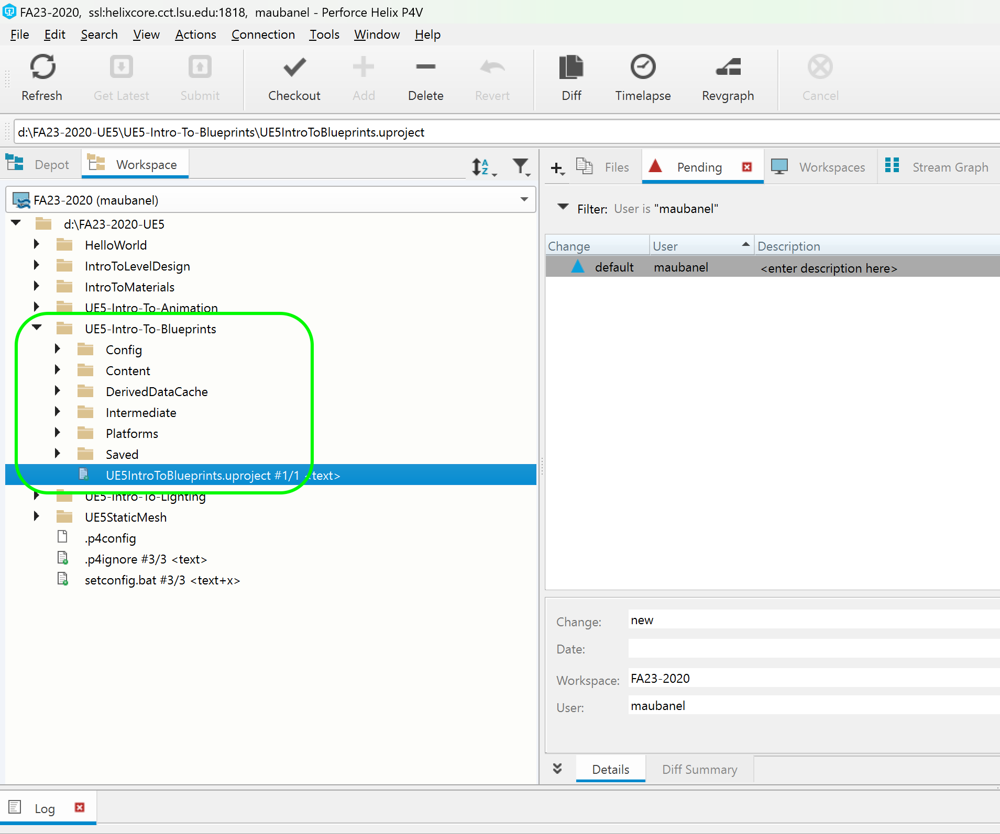
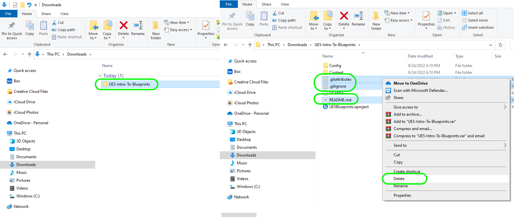

### Setting Up

[home](../README.md#user-content-ue4-blueprints) • [next](../constructor-begin/README.md#user-content-constructor--begin-play)

Lets get going by setting up the project so we can start using blueprints.

 

---

| `required.software`\|`UE4 Lighting`| 
| :--- |
| :floppy_disk: &nbsp; &nbsp; You will need to install the latest version of _UE5 5.0.X_ by downloading the [Epic Games Launcher](https://www.epicgames.com/store/en-US/download). You will also need a [P4V](https://www.perforce.com/downloads/helix-visual-client-p4v) account which is free to sign up for as we will be using version control. Lets make sure you can see hidden folders. On the PC follow these [Windows 10 Turn on Hidden Folders](https://support.microsoft.com/en-us/help/4028316/windows-view-hidden-files-and-folders-in-windows-10) directions.|

##### `Step 1.`\|`ITL`|:small_blue_diamond:

Navigate on your broswer to [GitHub UE5 Bluprints Starter](https://github.com/LSU-UE5/UE5-Intro-To-Blueprints-Starter). Right click on <kbd>Code</kbd> and select **Download Zip**.  Then when it finishes downloading right click on the zip file and select **Extract Here**. This will unzip the file.  Any attempt to run unreal inside a zipped folder will **not** work.

##### `Step 2.`\|`FHIU`|:small_blue_diamond: :small_blue_diamond: 

Change the name of the folder to

##### `Step 3.`\|`ITL`|:small_blue_diamond: :small_blue_diamond: :small_blue_diamond:

This will give you access to a folder called **UE4IntroToBlueprints** that will hold the UE4 project. Enter the folder double click the **UE4** project `IntroToBlueprints.uproject` to load it. Make sure you have Unreal 14.26.x installed.

##### `Step 4.`\|`ITL`|:small_blue_diamond: :small_blue_diamond: :small_blue_diamond: :small_blue_diamond:

The project should load up in the Room/Level **IntroToBlueprints1** room. Scoot the camera over to **Room 1**. You will also most likely see a dark room that has not been lit. You need to hit the <kbd>Build</kbd> button and wait for the lighting to build for the level. After this it should look normal again.

##### `Step 5.`\|`ITL`| :small_orange_diamond:

Go to the content browser and look at the folders that are provided. Go to the first **Blueprints** folder. You should see two files, one is a GameMode blueprint and the other is a character controller blueprint.

##### `Step 6.`\|`ITL`| :small_orange_diamond: :small_blue_diamond:

Go to the **Maps** folder and you should see two levels:

##### `Step 7.`\|`ITL`| :small_orange_diamond: :small_blue_diamond: :small_blue_diamond:

You will now go to the **Materials** folder and I have provided some materials for these exercises. The **Supplied** folder has materials used for the room. The remaining ones will be used in blueprints you will be creating.

##### `Step 8.`\|`ITL`| :small_orange_diamond: :small_blue_diamond: :small_blue_diamond: :small_blue_diamond:

In the **StaticMeshes** folder we have some models we will be using:

##### `Step 9.`\|`ITL`| :small_orange_diamond: :small_blue_diamond: :small_blue_diamond: :small_blue_diamond: :small_blue_diamond:

And finally we have a **Textures** folder with the textures for the spotlight we will be using:

##### `Step 10.`\|`ITL`| :large_blue_diamond:

Go into **Settings | Project Settings | Description** tab and fill in the requisite information:

##### `Step 11.`\|`ITL`| :large_blue_diamond: :small_blue_diamond: 

Go into the **Maps and Modes** tab. Notice the start up maps that we are booting to and meant to start with.

##### `Step 12.`\|`ITL`| :large_blue_diamond: :small_blue_diamond: :small_blue_diamond: 

Now select your default game mode: **BP_Gamemode**. This will select our character controller that we will be using:

##### `Step 13.`\|`ITL`| :large_blue_diamond: :small_blue_diamond: :small_blue_diamond:  :small_blue_diamond: 

Go back to the **Blueprints** folder and press the <kbd>Add/Import</kbd> button and select **New Folder**. Call it `Room1`.

<!--  -->

| [home](../README.md#user-content-ue4-blueprints) | [next](../constructor-begin/README.md#user-content-constructor--begin-play)|
|---|---|
