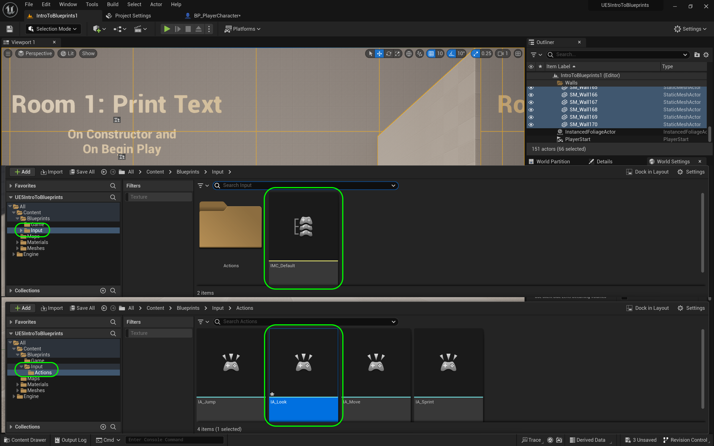

### Setting Up

[home](../README.md#user-content-ue4-blueprints) • [next](../constructor-begin/README.md#user-content-constructor--begin-play)

Lets get going by setting up the project so we can start using blueprints.

 

---

| `required.software`\|`UE4 Lighting`| 
| :--- |
| :floppy_disk: &nbsp; &nbsp; You will need to install the latest version of _UE5 5.0.X_ by downloading the [Epic Games Launcher](https://www.epicgames.com/store/en-US/download). You will also need a [P4V](https://www.perforce.com/downloads/helix-visual-client-p4v) account which is free to sign up for as we will be using version control. Lets make sure you can see hidden folders. On the PC follow these [Windows 10 Turn on Hidden Folders](https://support.microsoft.com/en-us/help/4028316/windows-view-hidden-files-and-folders-in-windows-10) directions.|

##### `Step 1.`\|`ITL`|:small_blue_diamond:

Navigate on your broswer to [GitHub UE5 Bluprints Starter](https://github.com/LSU-UE5/UE5-Intro-To-Blueprints-Starter). Right click on <kbd>Code</kbd> and select **Download Zip**.  Then when it finishes downloading right click on the zip file and select **Extract Here**. This will unzip the file.  Any attempt to run unreal inside a zipped folder will **not** work.

##### `Step 2.`\|`FHIU`|:small_blue_diamond: :small_blue_diamond: 

Change the name of the folder to `UE5 Intro To Blueprints`. Open the folder and delete `.gitattributes`, `.gitignore`, and `README.md`.

##### `Step 3.`\|`ITL`|:small_blue_diamond: :small_blue_diamond: :small_blue_diamond:

Now copy and paste the entire **UE5-Intro-To-Blueprints** bolder to your root of your **Perforce** directory. Delete the folder in the **Downloads** folder.

##### `Step 4.`\|`ITL`|:small_blue_diamond: :small_blue_diamond: :small_blue_diamond: :small_blue_diamond:

Add a [.p4ignore](https://github.com/maubanel/p4v-unreal/blob/main/files/ue5/.p4ignore) file by  clicking on the link and right clicking on **Raw** and select download as and call it `.p4ignore`. Put it in the same folder as your `.uproject` file.

##### `Step 5.`\|`ITL`| :small_orange_diamond:

Open up **P4V** and select the folder **UE5-Intro-To-Blueprints**.  Press the <kbd>+ Add</kbd> button. Leave it on the **Default** changelist and press the <kbd>OK</kbd> button.

##### `Step 6.`\|`ITL`| :small_orange_diamond: :small_blue_diamond:

Press the <kbd>Submit</kbd> button and enter a message.  Then in the pop-up press the <kbd>Submit</kbd> button.

##### `Step 7.`\|`ITL`| :small_orange_diamond: :small_blue_diamond: :small_blue_diamond:

In **P4V** double click **UE5Blueprints**.

##### `Step 8.`\|`ITL`| :small_orange_diamond: :small_blue_diamond: :small_blue_diamond: :small_blue_diamond:

The project should load up in the Room/Level **IntroToBlueprints1** room. Scoot the camera over to **Room 1**. 

##### `Step 9.`\|`ITL`| :small_orange_diamond: :small_blue_diamond: :small_blue_diamond: :small_blue_diamond: :small_blue_diamond:

Go to the content browser and look at the folders that are provided. Go to the first **Blueprints | Game** folder. You should see two files, one is a GameMode blueprint and the other is a character controller blueprint. The gamemode is used by **Project Settings** to load up the character in both levels in the game.

Go to the **Maps** folder and you should see two levels:

##### `Step 10.`\|`ITL`| :large_blue_diamond:

You will now go to the **Materials** folder and I have provided some materials for these exercises. The **Supplied** folder has materials used for the room. The remaining ones will be used in blueprints you will be creating.

In the **StaticMeshes** folder we have some models we will be using:

And finally we have a **Textures** folder with the textures for the spotlight we will be using:

Go into **Settings | Project Settings | Description** tab and fill in the requisite information:

##### `Step 11.`\|`ITL`| :large_blue_diamond: :small_blue_diamond: 

Go into the **Maps and Modes** tab. Notice the start up maps that we are booting to and meant to start with.

##### `Step 12.`\|`ITL`| :large_blue_diamond: :small_blue_diamond: :small_blue_diamond: 

Now select your default game mode: **BP_Gamemode**. This will select our character controller that we will be using:

##### `Step 13.`\|`ITL`| :large_blue_diamond: :small_blue_diamond: :small_blue_diamond:  :small_blue_diamond: 

Go back to the **Blueprints** folder and press the <kbd>Add/Import</kbd> button and select **New Folder**. Call it `Room1`.

<!--  -->

| [home](../README.md#user-content-ue4-blueprints) | [next](../constructor-begin/README.md#user-content-constructor--begin-play)|
|---|---|
