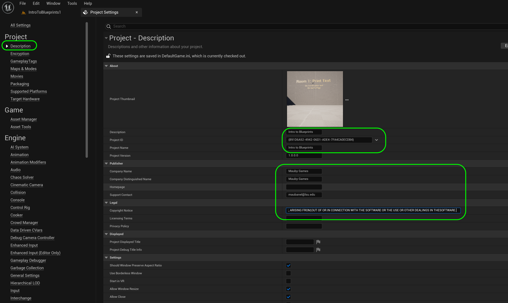

### Setting Up

[home](../README.md#user-content-ue4-blueprints) • [next](../constructor-begin/README.md#user-content-constructor--begin-play)

Lets get going by setting up the project so we can start using blueprints.

---

| `required.software`\|`UE4 Lighting`| 
| :--- |
| :floppy_disk: &nbsp; &nbsp; You will need to install the latest version of _UE5 5.2.X_ by downloading the [Epic Games Launcher](https://www.epicgames.com/store/en-US/download). You will also need a [P4V](https://www.perforce.com/downloads/helix-visual-client-p4v) account which is free to sign up for as we will be using version control. Lets make sure you can see hidden folders. On the PC follow these [Windows 10 Turn on Hidden Folders](https://support.microsoft.com/en-us/help/4028316/windows-view-hidden-files-and-folders-in-windows-10) directions.|

##### `Step 1.`\|`ITL`|:small_blue_diamond:

In your **Perforce** folder you should see a folder called **UE5-Intro-To-Blueprints**. Double click `UE5IntroToBlueprints.uproject` to load up **Unreal**.

##### `Step 2.`\|`FHIU`|:small_blue_diamond: :small_blue_diamond: 

You should make sure the player start is in front and facing to **Room 1**.

##### `Step 3.`\|`ITL`|:small_blue_diamond: :small_blue_diamond: :small_blue_diamond:

Now the player is similar to the one created in the animation walk through.  It is a first person player so no character (just a camera) and there is an **IA_Look** input action.  This action affects the camera so you can look around with the mouse. These are assigned butttons in the **IMC_Default** input controller.

##### `Step 4.`\|`ITL`|:small_blue_diamond: :small_blue_diamond: :small_blue_diamond: :small_blue_diamond:

In the **Blueprints | Game** folder we have two blueprints.  One is the first person characater you are controlling **BP_PlayerCharacter** and **BP_Gamemode** which uses this character as the default pawn.

##### `Step 5.`\|`ITL`| :small_orange_diamond:

Open up **Edit | Project Settings** and go into the **Maps and Modes** tab. Double check that the gamemode is set to `BP_GameMode` and that the **Default Pawn Class** is `MB_PlayerCharacter`. Also, make sure that we are booting up to `IntroToBlueprints1` as the **Editor Startup Map** and **GameDefaultMap** for now.

##### `Step 6.`\|`ITL`| :small_orange_diamond: :small_blue_diamond:

Go into **Edit | Project Settings | Description** tab and fill in the requisite information, especially the license file.  I use the [MIT License](https://www.google.com/search?client=safari&rls=en&q=mit+open+source+licnese+text&ie=UTF-8&oe=UTF-8).

##### `Step 7.`\|`ITL`| :small_orange_diamond: :small_blue_diamond: :small_blue_diamond:

In the **StaticMeshes | Supplied** folder we have some models we will be using for the exercise including the environment we are in.

##### `Step 8.`\|`ITL`| :small_orange_diamond: :small_blue_diamond: :small_blue_diamond: :small_blue_diamond:

You will now go to the **Materials | Supplied** folder and I have provided some materials for these exercises. T

##### `Step 9.`\|`ITL`| :small_orange_diamond: :small_blue_diamond: :small_blue_diamond: :small_blue_diamond: :small_blue_diamond:

##### `Step 10.`\|`ITL`| :large_blue_diamond:

##### `Step 11.`\|`ITL`| :large_blue_diamond: :small_blue_diamond: 

##### `Step 12.`\|`ITL`| :large_blue_diamond: :small_blue_diamond: :small_blue_diamond: 

And finally we have a **Textures** folder with the textures for the spotlight we will be using:

##### `Step 13.`\|`ITL`| :large_blue_diamond: :small_blue_diamond: :small_blue_diamond:  :small_blue_diamond: 

##### `Step 14.`\|`ITB`| :large_blue_diamond: :small_blue_diamond: :small_blue_diamond: :small_blue_diamond:  :small_blue_diamond: 

##### `Step 15.`\|`ITB`| :large_blue_diamond: :small_orange_diamond: 

Go back to the **Blueprints** folder and press the <kbd>Add/Import</kbd> button and select **New Folder**. Call it `Room1`.

##### `Step 16.`\|`ITB`| :large_blue_diamond: :small_orange_diamond:   :small_blue_diamond: 
Select the **File | Save All** then quit UE5.   Go to **P4V** and go the top project folder (the one that holds the `.uproject` file and **Content** folder) and press the <kbd>+Add</kbd> then <kbd>OK</kbd> button.  This makes sure any files that Unreal didn't add get added to source control. Press the <kbd>Submit</kbd> button and enter a message explaining the work done.  Press <kbd>Submit</kbd>.

<!--  -->

| [home](../README.md#user-content-ue4-blueprints) | [next](../constructor-begin/README.md#user-content-constructor--begin-play)|
|---|---|
