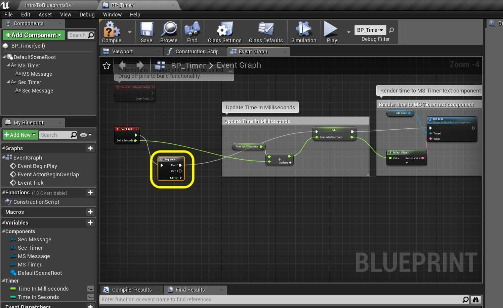
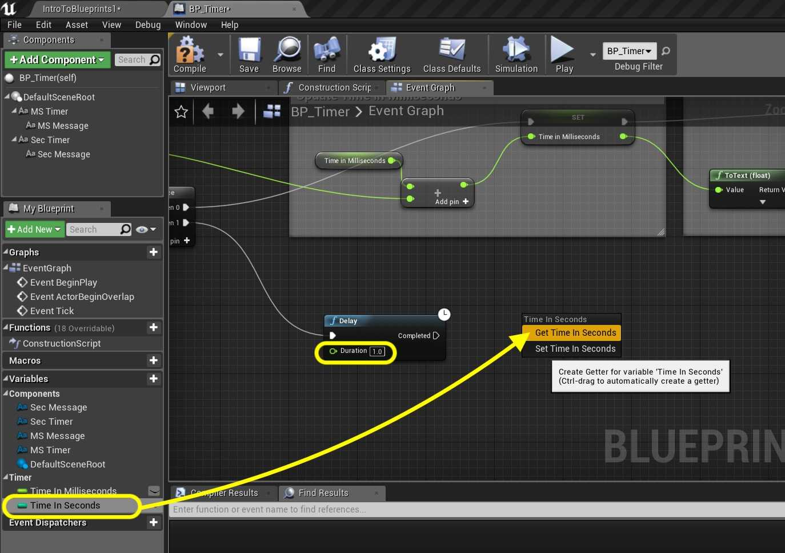

### Tick Event II

[previous](../tick-event/README.md#user-content-tick-event) • [home](../README.md#user-content-ue4-blueprints) • [next](../rotation/README.md#user-content-rotation)

Tick event continued...

 

---

##### `Step 1.`\|`ITB`|:small_blue_diamond:

Go back to the **Event Graph** tab in **BP_Timer**. Now to avoid having a very long Blueprint we can organize the graph by using a **Sequence** node. *Right click* and type **Sequence** then *connect* the execution pins between the **Tick Event** and the **Set** node through the **Then 0** pin:

##### `Step 2.`\|`FHIU`|:small_blue_diamond: :small_blue_diamond: 

*Right click* on an empty part of the graph and select **Delay** node. This will run the input every frame but only run the output pin after the delay has passed over and over again. Connect the output pin from the second **Sequence** node output to the input pin of **Delay**. Set the delay to `1.0` (it is set in seconds).

##### `Step 3.`\|`ITB`|:small_blue_diamond: :small_blue_diamond: :small_blue_diamond:

Drag the **Time In Seconds** node and *drop* it on the node chart. Select **Get**.

##### `Step 4.`\|`ITB`|:small_blue_diamond: :small_blue_diamond: :small_blue_diamond: :small_blue_diamond:

*Drag* off of the **Time In Seconds** pin and select **Int + Int** node. Now leave `1` as the default as we will be adding 1 every second. *Drag* the **Time In Seconds** variable onto the graph and *select* **Set**.

##### `Step 5.`\|`ITB`| :small_orange_diamond:

Connect the execution pin from the **Delay** node to the **Set** node. Connect the output pin from the **Add** node to the Input fo the **Set** node.

##### `Step 6.`\|`ITB`| :small_orange_diamond: :small_blue_diamond:

*Drag* the **Sec Timer** component into the graph and get a *reference* to it:

##### `Step 7.`\|`ITB`| :small_orange_diamond: :small_blue_diamond: :small_blue_diamond:

*Drag* off the **Sec Timer** pin and *select* the **Set Text** node:

##### `Step 8.`\|`ITB`| :small_orange_diamond: :small_blue_diamond: :small_blue_diamond: :small_blue_diamond:

*Connect* the Execution pins from **Set** to **Set Text**. *Drag* the output of **Time In Seconds** from the **Set** node into the **Value** input of the **Set Text** node. A converter will automatically be added.

##### `Step 9.`\|`ITB`| :small_orange_diamond: :small_blue_diamond: :small_blue_diamond: :small_blue_diamond: :small_blue_diamond:

Add comments to your latest work.

##### `Step 10.`\|`ITB`| :large_blue_diamond:

Open up the Blueprint and place it next to the millisecond timer in the level so you can watch both at once. Observe that the millisecond node runs all the time. Note that the Timer blocks the second blueprint from running except for once a second.

##### `Step 11.`\|`ITB`| :large_blue_diamond: :small_blue_diamond: 

That's it for **Room 7**. Press **Save All** and update **Github** by **committing** and **pushing** all the changes made. Next up we will be rotating and translating an object in 3D space.

___

| [previous](../tick-event/README.md#user-content-tick-event)| [home](../README.md#user-content-ue4-blueprints) | [next](../rotation/README.md#user-content-rotation)|
|---|---|---|
