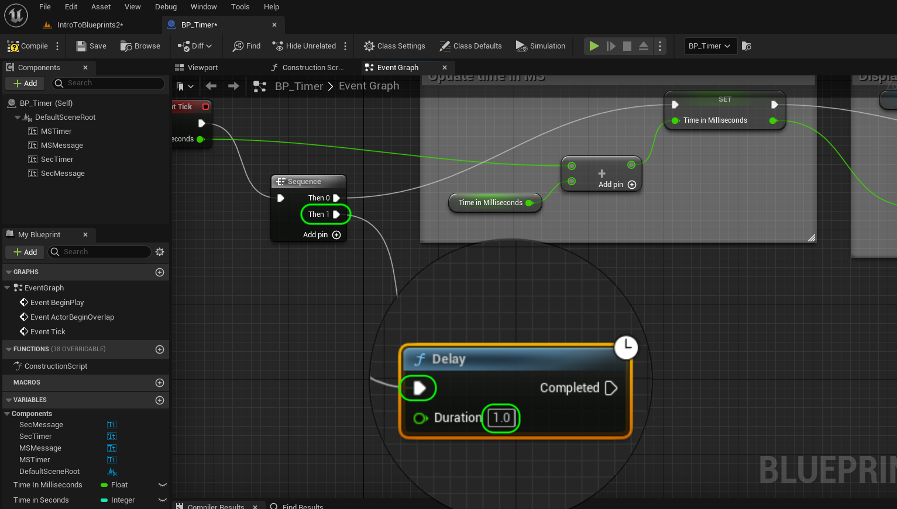
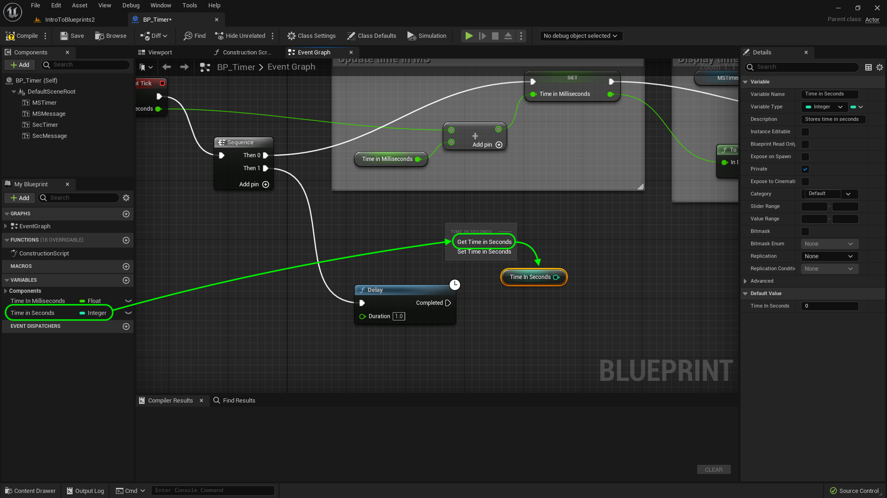
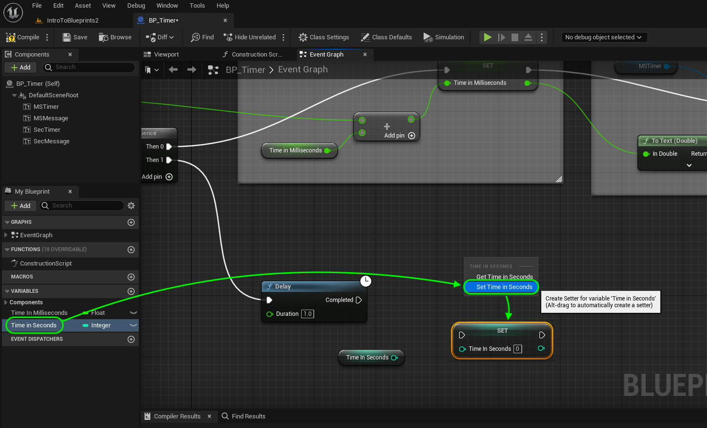
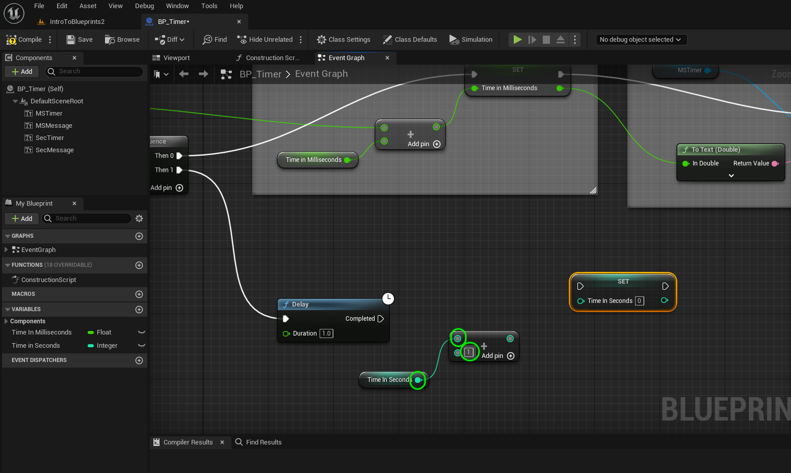
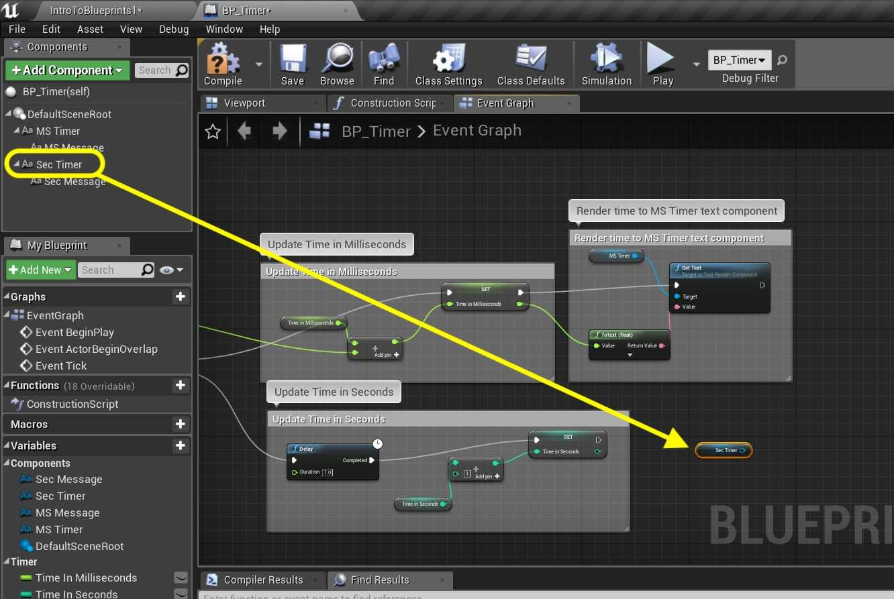
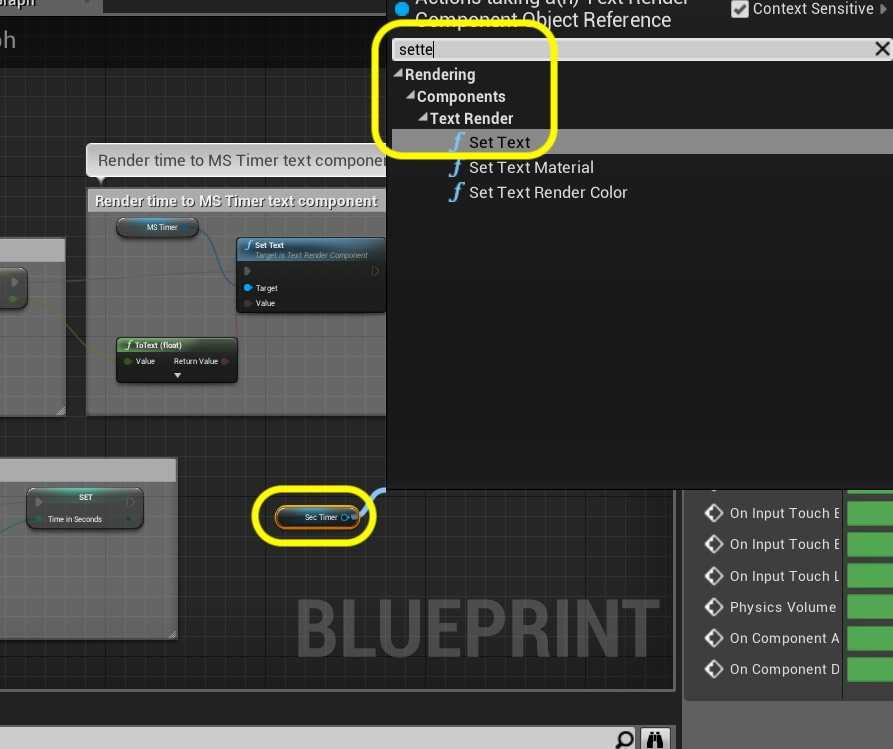
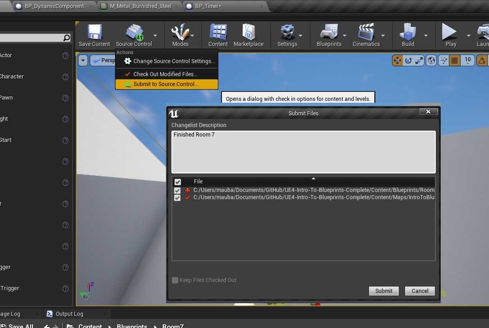

### Tick Event II

[previous](../tick-event/README.md#user-content-tick-event) • [home](../README.md#user-content-ue4-blueprints) • [next](../rotation/README.md#user-content-rotation)

Tick event continued...

 

---

##### `Step 1.`\|`ITB`|:small_blue_diamond:

*Right click* on an empty part of the graph and select **Delay** node. This will run the input every frame but only run the output pin after the delay has passed over and over again. Connect the output pin from the second **Sequence** node output to the input pin of **Delay**. Set the delay to `1.0` (it is set in seconds). Connect the execution pins of the **Sequence | Then 1** to the **Delay** node.

What this sequence node does is run everything the **Then 0** pin *first*, when completed executes the **Then 1** pin.

##### `Step 2.`\|`FHIU`|:small_blue_diamond: :small_blue_diamond: 

Drag the **Time In Seconds** node and *drop* it on the node chart. Select **Get**.

##### `Step 3.`\|`ITB`|:small_blue_diamond: :small_blue_diamond: :small_blue_diamond:

*Drag* the **Time In Seconds** variable onto the graph and *select* **Set**.

##### `Step 4.`\|`ITB`|:small_blue_diamond: :small_blue_diamond: :small_blue_diamond: :small_blue_diamond:

*Drag* off of the **Time In Seconds** pin and select **Add** node. Now leave `1` as the default as we will be adding 1 every second. 

##### `Step 5.`\|`ITB`| :small_orange_diamond:

Connect the execution pin from the **Delay** node to the **Set** node. Connect the output pin from the **Add** node to the Input fo the **Set** node. Change the addition to a single second by changing the value to `1` in the addition node as this will be adding 1 every second.

##### `Step 6.`\|`ITB`| :small_orange_diamond: :small_blue_diamond:

*Drag* the **Sec Timer** component into the graph and get a *reference* to it:

##### `Step 7.`\|`ITB`| :small_orange_diamond: :small_blue_diamond: :small_blue_diamond:

*Drag* off the **Sec Timer** pin and *select* the **Set Text** node:

##### `Step 8.`\|`ITB`| :small_orange_diamond: :small_blue_diamond: :small_blue_diamond: :small_blue_diamond:

*Connect* the Execution pins from **Set** to **Set Text**. *Drag* the output of **Time In Seconds** from the **Set** node into the **Value** input of the **Set Text** node. A converter will automatically be added.

##### `Step 9.`\|`ITB`| :small_orange_diamond: :small_blue_diamond: :small_blue_diamond: :small_blue_diamond: :small_blue_diamond:

Add comments to your latest work. Press the <kbd>Compile</kbd> button.

##### `Step 10.`\|`ITB`| :large_blue_diamond:

Open up the Blueprint and place it next to the millisecond timer in the level so you can watch both at once. Observe that the millisecond node runs all the time. Note that the Timer blocks the second blueprint from running except for once a second.

##### `Step 11.`\|`ITB`| :large_blue_diamond: :small_blue_diamond: 

That's it for **Room 7**. Press **File | Save All** then go into **Source Control | Submit to Source Control**, add a message that you have completed room 1 and press the <kbd>Submit</kbd> button. Open up **GitHub Desktop** and **Push** changes to server. Select this to finish off this section.

<!--  -->

| [previous](../tick-event/README.md#user-content-tick-event)| [home](../README.md#user-content-ue4-blueprints) | [next](../rotation/README.md#user-content-rotation)|
|---|---|---|
