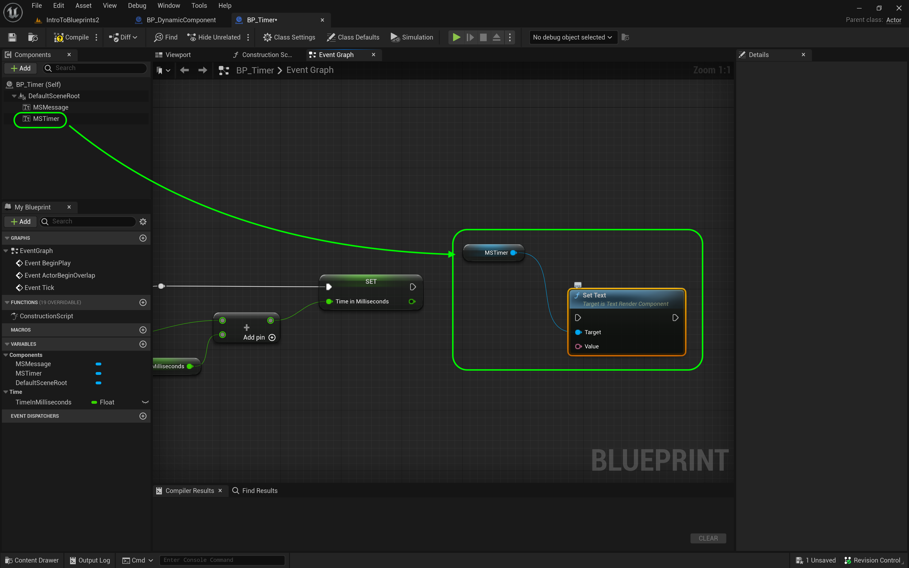

### Tick Event

[previous](../components/README.md#user-content-components) • [home](../README.md#user-content-ue4-blueprints) • [next](../tick-event-ii/README.md#user-content-tick-event-ii)

Now the most common game event type is the **Tick Event**. This is what we run every frame. Any game logic that needs to be run every frame (like polling controls to move a player) will be done within the tick event and will happen as fast as the framerate runs.

 

---

##### `Step 1.`\|`ITB`|:small_blue_diamond:

Go back to **Maps** and load **IntroToBlueprint2**. Scoot over to **Room 7** as this is where we will start!

##### `Step 2.`\|`FHIU`|:small_blue_diamond: :small_blue_diamond: 

Scoot over to **Room 7**. Add a new folder in **Blueprints** and call it `Room7`. Press the <kbd>+ Add</kbd> button and then select **Blueprint Class**. Select class **Actor**. Call it `BP_Timer`.

https://user-images.githubusercontent.com/5504953/193081327-68f5ef84-57a5-4fbb-96ff-79853550170b.mp4

##### `Step 3.`\|`ITB`|:small_blue_diamond: :small_blue_diamond: :small_blue_diamond:

Open up the blueprint and *add* a **Text Render** component by *pressing* the **Add Component** button.

##### `Step 4.`\|`ITB`|:small_blue_diamond: :small_blue_diamond: :small_blue_diamond: :small_blue_diamond:

*Rename* the **Component** to `MS Timer`. *Press* the color and select a shade of green. Change the **World Size** to `120` and rename the **Text** message to the number `0`. Set the **Horizontal Alignment** to `Center` and the **Vertical Alignment** to `Text Center`.

##### `Step 5.`\|`ITB`| :small_orange_diamond:

Add another **Text Render** component and call it `MS Message`. Change the color to yellow and alter the **Text** message to `Time in Milliseconds`. Set the **Horizontal Alignment** to `Center` and the **Vertical Alignment** to `Text Center`. *Press* the **Compile** button.

##### `Step 6.`\|`ITB`| :small_orange_diamond: :small_blue_diamond:

Go to the **Event Graph** tab and in the **MyBlueprints** tab press **+** next to **Variable** and add a **Float** called `Time in Milliseconds`. Add a **tooltip** with the message `Stores total time in level in milliseconds`. Make sure **Private** is set to `true`.

##### `Step 7.`\|`ITB`| :small_orange_diamond: :small_blue_diamond: :small_blue_diamond:

What we want to do is every frame add the number of milliseconds that have passed to this variable. So we need to read it, then add the delta time since last frame. Drag the Variable into the graph and select **Get Time In Milliseconds**.

##### `Step 8.`\|`ITB`| :small_orange_diamond: :small_blue_diamond: :small_blue_diamond: :small_blue_diamond:

Now *place* an **Add** node which adds two numbers of any type together. *Take* the output **Pin** from the **Event Tick** called **Delta Seconds** and *put* it in into the input of the **Addition** node. *Take* the output of the variable **Time in Milliseconds** and put it into the input of the **Addition** node.

##### `Step 9.`\|`ITB`| :small_orange_diamond: :small_blue_diamond: :small_blue_diamond: :small_blue_diamond: :small_blue_diamond:

Drag the **Time In Milliseconds** variable into the graph and this time select **Set Time In Milliseconds** as we will write this addition to the variable:

##### `Step 10.`\|`ITB`| :large_blue_diamond:

*Connect* the Execution pins between the **Event Tick** node and the **Set** node. Also, *connect* the output of the **Addition** node to the input of the **Set Node**.

##### `Step 11.`\|`ITB`| :large_blue_diamond: :small_blue_diamond: 

Now, what we want to do is take the output of this variable and have it print to screen. The **MS Timer** text component set to `0` is what we want to target. *Drag* the **MS Timer** component into the scene graph so we have a reference. *Drag* from the output pin and start typing **Set Text**. This will allow us to adjust the text component dynamically during gameplay.

##### `Step 12.`\|`ITB`| :large_blue_diamond: :small_blue_diamond: :small_blue_diamond: 

*Connect* the output **Time in Milliseconds** pin from **Set** node to the **Value** pin in **Set Text**. This automatically adds a **To Text (Double)** node. *Connect* the execution pins from the same nodes. 

##### `Step 13.`\|`ITB`| :large_blue_diamond: :small_blue_diamond: :small_blue_diamond:  :small_blue_diamond: 

Add comments to explain the graph (highlight nodes and press the <kbd>C</kbd> key). I split it into the two sections that make sense to me. Press the <kbd>Compile</kbd> button.

##### `Step 14.`\|`ITB`| :large_blue_diamond: :small_blue_diamond: :small_blue_diamond: :small_blue_diamond:  :small_blue_diamond: 

Now go to the game and *drag* the **BP_Timer** blueprint into **Room 7**. If the text is backwards, *rotate* it to face the center of the room.

##### `Step 15.`\|`ITB`| :large_blue_diamond: :small_orange_diamond: 

Now run the game and the millisecond counter should count very quickly (hard to see the fractional numbers as they change so fast). We will create another one with just seconds.

https://user-images.githubusercontent.com/5504953/193118883-b0b568e7-2ad4-46d2-8a4b-530830503c30.mp4

##### `Step 16.`\|`ITB`| :large_blue_diamond: :small_orange_diamond:   :small_blue_diamond: 

Lets add the ability to count in whole seconds. Go back to the **BP_Timer** blueprint and *select* the **MS Timer** and **MS Message** components. *Right click* and *select* **Duplicate**.

##### `Step 17.`\|`ITB`| :large_blue_diamond: :small_orange_diamond: :small_blue_diamond: :small_blue_diamond:

Duplicate MS Timer Message

Now move the new copies to the right so they are next to each other. Change the names of the components to `Sec Timer` and `Sec Message`.

##### `Step 18.`\|`ITB`| :large_blue_diamond: :small_orange_diamond: :small_blue_diamond: :small_blue_diamond: :small_blue_diamond:

Change the message in the **Sec Message** component to `Time in Seconds`.

##### `Step 19.`\|`ITB`| :large_blue_diamond: :small_orange_diamond: :small_blue_diamond: :small_blue_diamond: :small_blue_diamond: :small_blue_diamond:

Now go back to the **Event Graph** and add a new **Variable** by pressing the **+** button. This time we will make it an integer. A **float** stores a fractional number, an **integer** stores a whole number. Since we are *counting* seconds whole numbers will do. Set the variable to **Variable Type | Integer**. Call it `Time in Seconds`, add a **Tooltip** and make sure that **Private** is set to `true`.

##### `Step 20.`\|`ITB`| :large_blue_diamond: :large_blue_diamond:

Go back to the **Event Graph** tab in **BP_Timer**. You can disconnect any pin by <kbd>Alt</kbd> left clicking on it. Delete the execution pin coming from **Event Tick**. Now to avoid having a very long Blueprint we can organize the graph by using a **Sequence** node. *Right click* and type **Sequence** then *connect* the execution pins between the **Tick Event** and the **Set** node through the **Then 0** pin.

https://user-images.githubusercontent.com/5504953/193120853-36a6e2a0-916d-409a-a48c-e1b415e3e1c8.mp4

<!--  -->

| [previous](../components/README.md#user-content-components)| [home](../README.md#user-content-ue4-blueprints) | [next](../tick-event-ii/README.md#user-content-tick-event-ii)|
|---|---|---|
