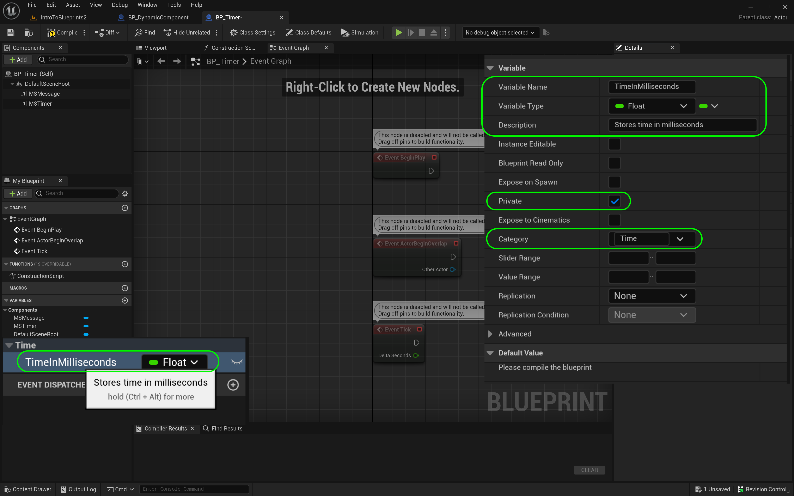
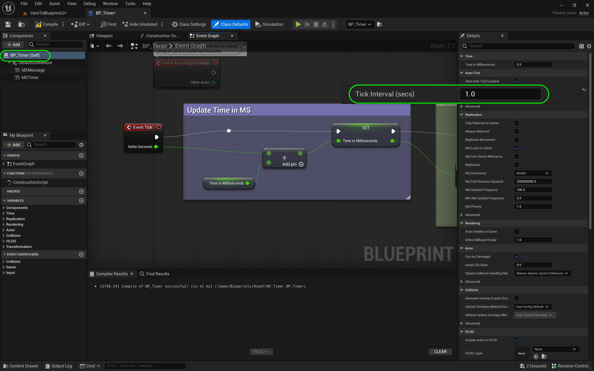

### Tick Event

[previous](../components/README.md#user-content-components) • [home](../README.md#user-content-ue4-blueprints) • [next](../rotation/README.md#user-content-rotation)

Now the most common game event type is the **Tick Event**. This is what we run every frame. Any game logic that needs to be run every frame (like polling controls to move a player) will be done within the tick event and will happen as fast as the framerate runs.

---

##### `Step 1.`\|`ITB`|:small_blue_diamond:

Go back to **Maps** and load **IntroToBlueprint2**. Scoot over to **Room 7** as this is where we will start!

##### `Step 2.`\|`FHIU`|:small_blue_diamond: :small_blue_diamond: 

Scoot over to **Room 7**. Add a new folder in **Blueprints** and call it `Room7`. Press the <kbd>+ Add</kbd> button and then select **Blueprint Class**. Select class **Actor**. Call it `BP_Timer`.

https://user-images.githubusercontent.com/5504953/193081327-68f5ef84-57a5-4fbb-96ff-79853550170b.mp4

##### `Step 3.`\|`ITB`|:small_blue_diamond: :small_blue_diamond: :small_blue_diamond:

Open up the blueprint and *add* a **Text Render** component by *pressing* the **Add Component** button.

##### `Step 4.`\|`ITB`|:small_blue_diamond: :small_blue_diamond: :small_blue_diamond: :small_blue_diamond:

*Rename* the **Component** to `MS Timer`. *Press* the color and select a shade of green. Change the **World Size** to `120` and rename the **Text** message to the number `0`. Set the **Horizontal Alignment** to `Center` and the **Vertical Alignment** to `Text Center`.

##### `Step 5.`\|`ITB`| :small_orange_diamond:

Add another **Text Render** component and call it `MS Message`. Change the color to yellow and alter the **Text** message to `Time in Milliseconds`. Set the **Horizontal Alignment** to `Center` and the **Vertical Alignment** to `Text Center`. *Press* the **Compile** button.

##### `Step 6.`\|`ITB`| :small_orange_diamond: :small_blue_diamond:

Go to the **Event Graph** tab and in the **MyBlueprints** tab press **+** next to **Variable** and add a **Float** called `TimeInMilliseconds`. Add a **tooltip** with the message `Stores total time in level in milliseconds`. Make sure **Private** is set to `true`. Create a new **Group** called `Time`.

##### `Step 7.`\|`ITB`| :small_orange_diamond: :small_blue_diamond: :small_blue_diamond:

What we want to do is every frame add the number of milliseconds that have passed to this variable. So we need to read it, then add the delta time since last frame. Drag the Variable into the graph and select **Get | TimeInMilliseconds**. Now *place* an **Add** node which adds two numbers of any type together. *Take* the output **Pin** from the **Event Tick** called **Delta Seconds** and *put* it in into the input of the **Addition** node. *Take* the output of the variable **Time in Milliseconds** and put it into the input of the **Addition** node.

##### `Step 8.`\|`ITB`| :small_orange_diamond: :small_blue_diamond: :small_blue_diamond: :small_blue_diamond:

Drag the **Time In Milliseconds** variable into the graph and this time select **Set Time In Milliseconds** as we will write this addition to the variable. *Connect* the Execution pins between the **Event Tick** node and the **Set** node. Also, *connect* the output of the **Addition** node to the input of the **Set Node**.

##### `Step 9.`\|`ITB`| :small_orange_diamond: :small_blue_diamond: :small_blue_diamond: :small_blue_diamond: :small_blue_diamond:

Now, what we want to do is take the output of this variable and have it print to screen. The **MS Timer** text component set to `0` is what we want to target. *Drag* the **MS Timer** component into the scene graph so we have a reference. *Drag* from the output pin and start typing **Set Text**. This will allow us to adjust the text component dynamically during gameplay.

##### `Step 10.`\|`ITB`| :large_blue_diamond:

*Connect* the output **Time in Milliseconds** pin from **Set** node to the **Value** pin in **Set Text**. This automatically adds a **To Text (Double)** node. *Connect* the execution pins from the same nodes. 

##### `Step 11.`\|`ITB`| :large_blue_diamond: :small_blue_diamond: 

Add comments to explain the graph (highlight nodes and press the <kbd>C</kbd> key). I split it into the two sections that make sense to me. Press the <kbd>Compile</kbd> button.

##### `Step 12.`\|`ITB`| :large_blue_diamond: :small_blue_diamond: :small_blue_diamond: 

Now go to the game and *drag* the **BP_Timer** blueprint into **Room 7**. If the text is backwards, *rotate* it to face the center of the room.

##### `Step 13.`\|`ITB`| :large_blue_diamond: :small_blue_diamond: :small_blue_diamond:  :small_blue_diamond: 

Now run the game and the millisecond counter should count very quickly (hard to see the fractional numbers as they change so fast). We will fix that to just show seconds.

https://github.com/maubanel/UE5-Blueprints/assets/5504953/df2975f1-1ed1-45f5-aefa-f1d82b4992d7

##### `Step 14.`\|`ITB`| :large_blue_diamond: :small_blue_diamond: :small_blue_diamond: :small_blue_diamond:  :small_blue_diamond: 

The **Tick Event** updates every frame which is upwards of 90FPS here, which is why you can't make out what is happening.  It doesn't have to be so.  You can go to the top node in the component and set the **Tick Interval** from `0.0` (no delay) to `1.0` (updates once a second).

##### `Step 15.`\|`ITB`| :large_blue_diamond: :small_orange_diamond: 

Press the <kbd>Play</kbd> button and now we get an update every second! The only issue is that it is showing the decimal point.  Lets fix that and only show whole numbers.

https://github.com/maubanel/UE5-Blueprints/assets/5504953/ec44fbbf-2c11-475f-88f5-9c1ad022785c

##### `Step 16.`\|`ITB`| :large_blue_diamond: :small_orange_diamond:   :small_blue_diamond: 

Change **MS Message** to `Time in Seconds`.

##### `Step 17.`\|`ITB`| :large_blue_diamond: :small_orange_diamond: :small_blue_diamond: :small_blue_diamond:

Open up

https://github.com/maubanel/UE5-Blueprints/assets/5504953/753b4ef1-e634-4088-a7c7-73adb2453a4d

##### `Step 18.`\|`ITB`| :large_blue_diamond: :small_orange_diamond: :small_blue_diamond: :small_blue_diamond: :small_blue_diamond:

Go to the **To Text (Float)** node and press the triangle at the bottom to open up more options.  Set the **Maximum Fractional Digits** to `0`. Press the <kbd>Play</kbd> button and now we have the time updating only in whole seconds.  We are more efficient with the framerate as we are only ticking once a second.

##### `Step 19.`\|`ITB`| :large_blue_diamond: :small_orange_diamond: :small_blue_diamond: :small_blue_diamond: :small_blue_diamond: :small_blue_diamond:

Select the **File | Save All** then press the <kbd>Revision Control</kbd> button and select **Submit Content**.  If you are prompted, select **Check Out** for all items that are not checked out of source control. Update the **Changelist Description** message and with the latest changes. Make sure all the files are correct and press the <kbd>Submit</kbd> button. A confirmation will pop up on the bottom right with a message about a changelist was submitted with a commit number. Quit Unreal and make sure your **Pending** tab in **P4V** is empty. **Submit** any work that is still in the editor.

##### `Step 20.`\|`ITB`| :large_blue_diamond: :large_blue_diamond:

Sometimes not all files get submitted to Unreal especially for files that don't show up in the editor.  It is good practice one you submit in **Unreal** and quit the game to right click on the top most project folder and select **Reconcile Offline Work...**.

This will either give a message saying ther is nothing to reconcile or bring up a tab.  Make sure that these are **NOT** files in the **Intermediate** and **Saved** folders as these should be ignored from the `.p4ignore`.

If the files are in **Content** or **Configuration** then press the <kbd>Reconcile</kbd> button.  Then submit the changes with a message and press the <kbd>Submit</kbd> button.

 

<!--  -->

| [previous](../components/README.md#user-content-components)| [home](../README.md#user-content-ue4-blueprints) | [next](../rotation/README.md#user-content-rotation)|
|---|---|---|
