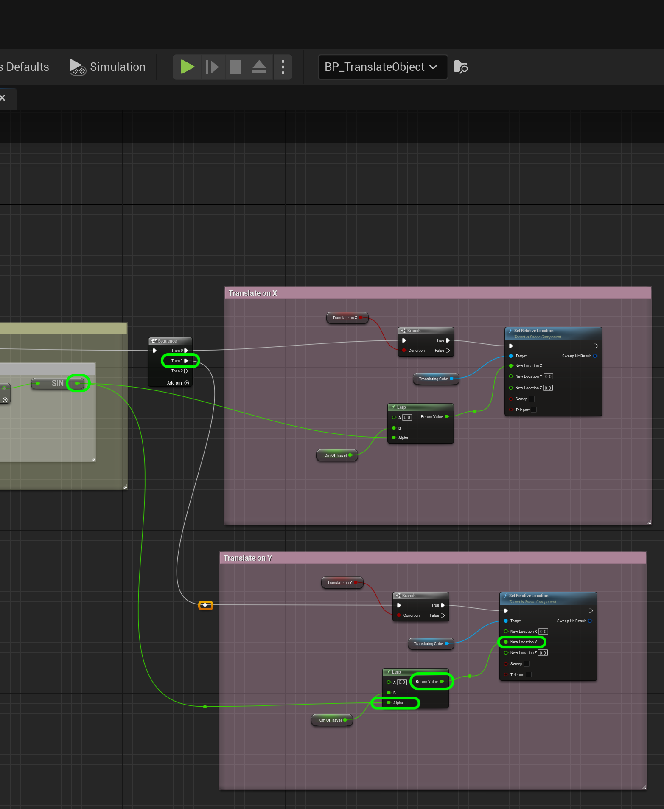
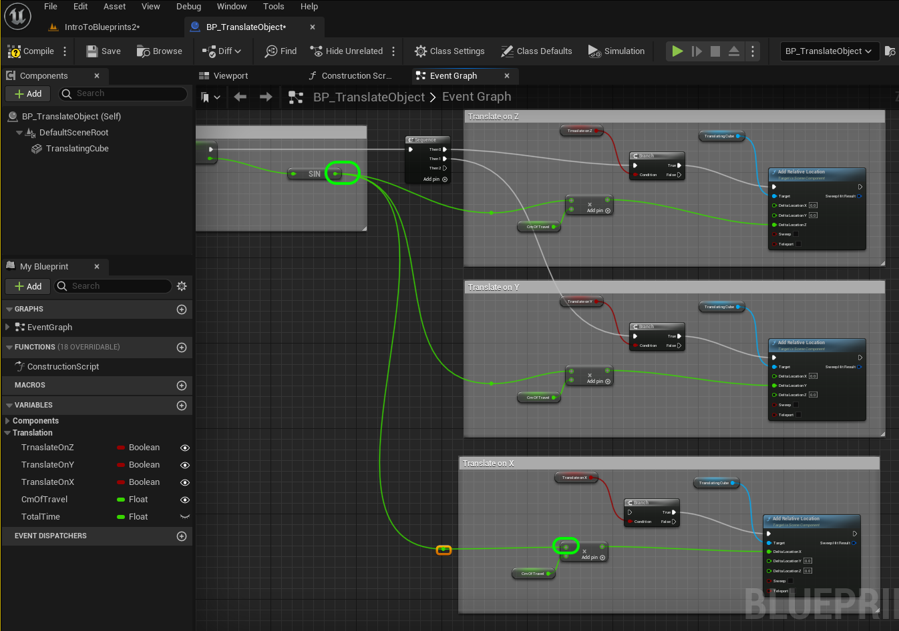
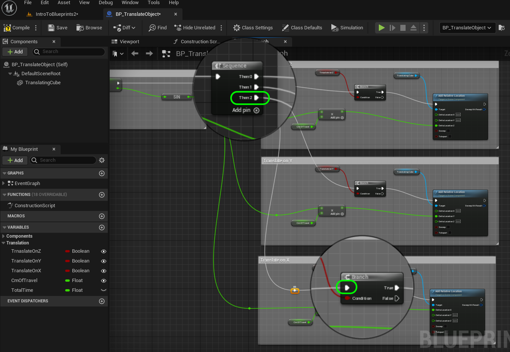

### Translation II

[previous](../translation/README.md#user-content-translation) • [home](../README.md#user-content-ue5-blueprints) • [next](../multiple-actors/README.md#user-content-dynamically-alter-multiple-classes)

Lets finish up translating the cube on the Y and X axis.

 

---

##### `Step 1.`\|`ITB`|:small_blue_diamond:

Connect the output of the **Multiplication** pin to the **Delta Location Y** pin in the **Translate on Y** section.

##### `Step 2.`\|`ITB`|:small_blue_diamond: :small_blue_diamond: 

In the editor change it to only **Translate on Z** as `true` and the **CmOfTravel** to `4`. *Press* the <kbd>Play</kbd> button to see the box move in and out of the screen.

https://user-images.githubusercontent.com/5504953/193455503-434b6730-87b7-4d61-861b-2abda5624914.mp4

##### `Step 3.`\|`ITB`|:small_blue_diamond: :small_blue_diamond: :small_blue_diamond:

*Copy and paste* all the nodes from the **Translate On Z** section again. Change the **Comment** to `Translate on X`. Also *delete* the **Translate On Z** getter in the graph and drag and drop **Translate On X**. Change the connecdtion from the **Multiplication** node to **Delta Locaion on X**.

##### `Step 4.`\|`ITB`|:small_blue_diamond: :small_blue_diamond: :small_blue_diamond: :small_blue_diamond:

Connect the output of the **Sin** node to the top input of the **Mutliplication** node.

##### `Step 5.`\|`ITB`| :small_orange_diamond:

*Pull* of the **Then 2** execution pin and place it into the **Branch** node you just to translate on x.

##### `Step 6.`\|`ITB`| :small_orange_diamond: :small_blue_diamond:

Go into the game and turhning each axis on and off. Also, look at your blueprint node chart as it runs to see how the booleans gate the operation flow.

##### `Step 7.`\|`ITB`| :small_orange_diamond: :small_blue_diamond: :small_blue_diamond:

##### `Step 8.`\|`ITB`| :small_orange_diamond: :small_blue_diamond: :small_blue_diamond: :small_blue_diamond:

##### `Step 9.`\|`ITB`| :small_orange_diamond: :small_blue_diamond: :small_blue_diamond: :small_blue_diamond: :small_blue_diamond:

##### `Step 10.`\|`ITB`| :large_blue_diamond:

##### `Step 11.`\|`ITB`| :large_blue_diamond: :small_blue_diamond: 

##### `Step 12.`\|`ITB`| :large_blue_diamond: :small_blue_diamond: :small_blue_diamond: 

##### `Step 13.`\|`ITB`| :large_blue_diamond: :small_blue_diamond: :small_blue_diamond:  :small_blue_diamond: 

##### `Step 14.`\|`ITB`| :large_blue_diamond: :small_blue_diamond: :small_blue_diamond: :small_blue_diamond:  :small_blue_diamond: 

##### `Step 15.`\|`ITB`| :large_blue_diamond: :small_orange_diamond: 

##### `Step 16.`\|`ITB`| :large_blue_diamond: :small_orange_diamond:   :small_blue_diamond: 

##### `Step 17.`\|`ITB`| :large_blue_diamond: :small_orange_diamond: :small_blue_diamond: :small_blue_diamond:

##### `Step 18.`\|`ITB`| :large_blue_diamond: :small_orange_diamond: :small_blue_diamond: :small_blue_diamond: :small_blue_diamond:

##### `Step 19.`\|`ITB`| :large_blue_diamond: :small_orange_diamond: :small_blue_diamond: :small_blue_diamond: :small_blue_diamond: :small_blue_diamond:

##### `Step 20.`\|`ITB`| :large_blue_diamond: :large_blue_diamond:

##### `Step 21.`\|`ITB`| :large_blue_diamond: :large_blue_diamond: :small_blue_diamond:

<!--  -->

| [previous](../translation/README.md#user-content-translation)| [home](../README.md#user-content-ue5-blueprints) | [next](../multiple-actors/README.md#user-content-dynamically-alter-multiple-classes)|
|---|---|---|
