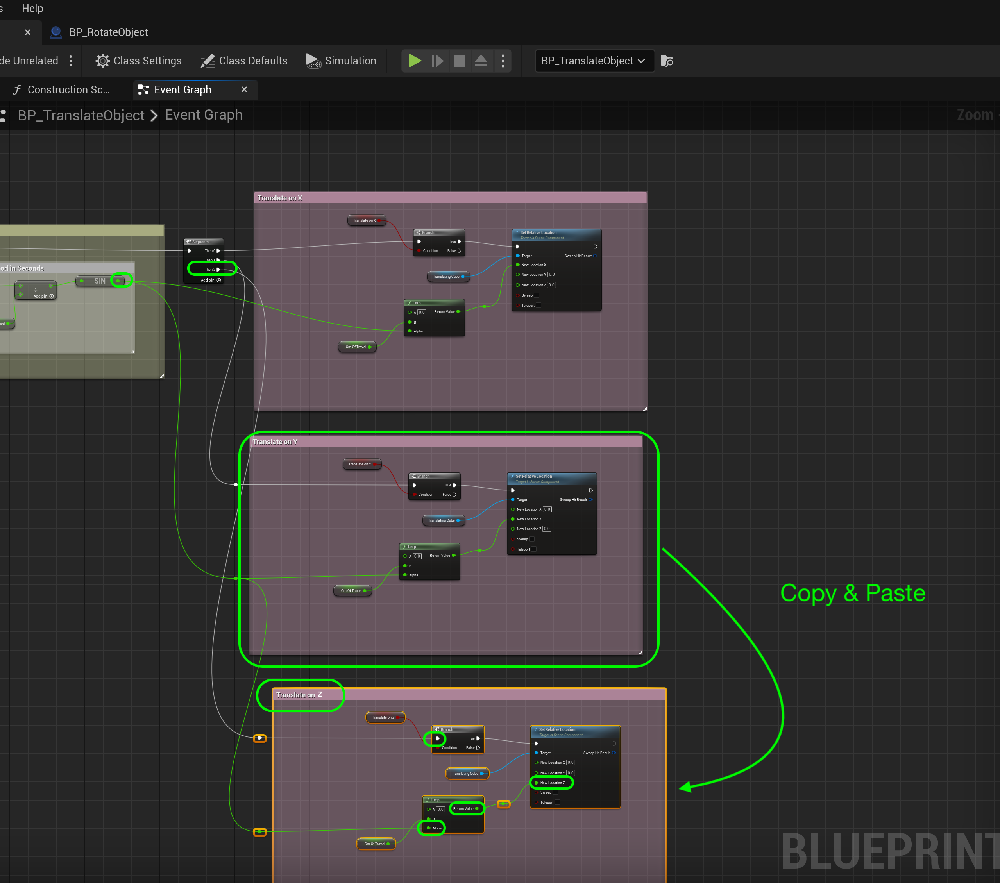

### Translation II

[previous](../translation/README.md#user-content-translation) • [home](../README.md#user-content-ue5-blueprints) • [next](../multiple-actors/README.md#user-content-dynamically-alter-multiple-classes)

Lets finish up translating the cube on the Y and X axis.

 

---

##### `Step 1.`\|`ITB`|:small_blue_diamond:
*Copy and paste* the entire section below it. Change the **Comment** to `Translate on Y`.  Right click on the **bTranslateOnX** node and select **Replace variable 'bTranslateOnX' with... | bTranslateOnY`**.  This will change it to the **Y** axis. 

##### `Step 2.`\|`ITB`|:small_blue_diamond: :small_blue_diamond: 

Connect the **Lerp** from the Y section to **SetRelativeLocatoin | New Location Y**. Connect the **Alpha** of the **Lerp** to the **SIN** node.Connect the output of the **Sequence | Then 1** pin to the **Branch** node hooked up to **bTranslateOnY**.

##### `Step 3.`\|`ITB`|:small_blue_diamond: :small_blue_diamond: :small_blue_diamond:

In the editor change it to only **bTranslateOnY** as `true`. *Press* the <kbd>Play</kbd> button to see the box move in and out of the screen.

https://github.com/maubanel/UE5-Blueprints/assets/5504953/60ccf750-6c5f-4059-a507-57b74f0f3312

##### `Step 4.`\|`ITB`|:small_blue_diamond: :small_blue_diamond: :small_blue_diamond: :small_blue_diamond:

*Copy and paste* the entire section from Y below it. Change the **Comment** to `Translate on Z`.  Right click on the **bTranslateOnY** node and select **Replace variable 'bTranslateOnY' with... | bTranslateOnZ`**.  This will change it to the **Z** axis.  Connect the **Lerp** from the Y section to **SetRelativeLocatoin | New Location Z**. Connect the **Alpha** of the **Lerp** to the **SIN** node.Connect the output of the **Sequence | Then 2** pin to the **Branch** node hooked up to **bTranslateOnZ**.

##### `Step 5.`\|`ITB`| :small_orange_diamond:

Press the <kbd>Play</kbd> button and now select **bTranslateOnZ**. I had to reduce the distance so that the cube doesn't go into the ground. Now try turning each axis on and hitting play. Notice that it is **NOT** movign on all three axis. We are only moving with the last Z axis.  Lets fix this.

https://github.com/maubanel/UE5-Blueprints/assets/5504953/74ba9cfa-94aa-4080-8956-d0be851cfb52

##### `Step 6.`\|`ITB`| :small_orange_diamond: :small_blue_diamond:

We need to add the other axis back into the tranlation nodes.  We are zeroing them out.  Select the **TranslationCube** pin and select **GetRelativeLocation** and then **Split Struct Pin**.

##### `Step 7.`\|`ITB`| :small_orange_diamond: :small_blue_diamond: :small_blue_diamond:

Now connect the **Relative Location Y** to **Set Relative Location | New Location Y** and **Relative Location X** to **Set Relative Location | New Location Z**.  This will put the current value and not zero it out.

##### `Step 8.`\|`ITB`| :small_orange_diamond: :small_blue_diamond: :small_blue_diamond: :small_blue_diamond:

##### `Step 9.`\|`ITB`| :small_orange_diamond: :small_blue_diamond: :small_blue_diamond: :small_blue_diamond: :small_blue_diamond:

##### `Step 10.`\|`ITB`| :large_blue_diamond:

##### `Step 11.`\|`ITB`| :large_blue_diamond: :small_blue_diamond: 

Select the **File | Save All** then quit UE5.   Go to **P4V** and go the top project folder (the one that holds the `.uproject` file and **Content** folder) and press the <kbd>+Add</kbd> then <kbd>OK</kbd> button.  This makes sure any files that Unreal didn't add get added to source control. Press the <kbd>Submit</kbd> button and enter a message explaining the work done.  Press <kbd>Submit</kbd>.

<!--  -->

| [previous](../translation/README.md#user-content-translation)| [home](../README.md#user-content-ue5-blueprints) | [next](../multiple-actors/README.md#user-content-dynamically-alter-multiple-classes)|
|---|---|---|
