### Translation

[previous](../rotation-ii/README.md#user-content-rotation-ii) • [home](../README.md#user-content-ue4-blueprints) • [next](../multiple-actors/README.md#user-content-dynamically-alter-multiple-classes)

We will be translating an object in 3-D space through blueprints. If rotation is moving along the origin of the model, translation is moving it **X,Y,Z** space in the game engine.  

 

---

##### `Step 1.`\|`ITB`|:small_blue_diamond:

Go to the **Blueprints** folder and *duplicate* the **BP_Rotate_Object** blueprint.

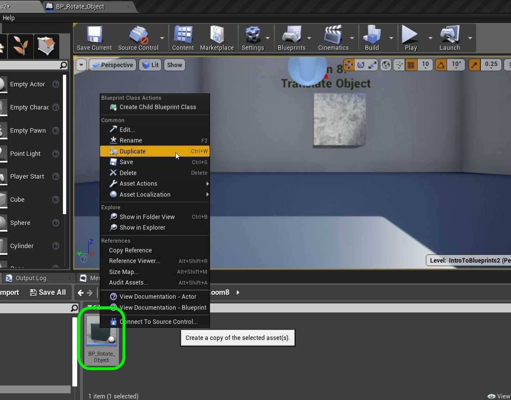

##### `Step 2.`\|`FHIU`|:small_blue_diamond: :small_blue_diamond: 

Rename it to `BP_Translate_Object`.

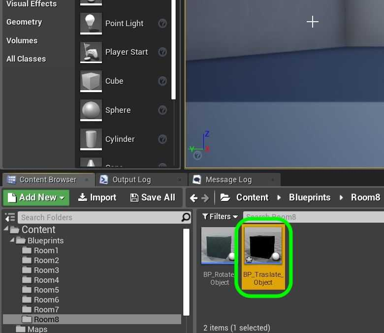

##### `Step 3.`\|`ITB`|:small_blue_diamond: :small_blue_diamond: :small_blue_diamond:

*Drag and drop* an instance of **BP_TranslateObject** into the game window on the right hand side of room 8.

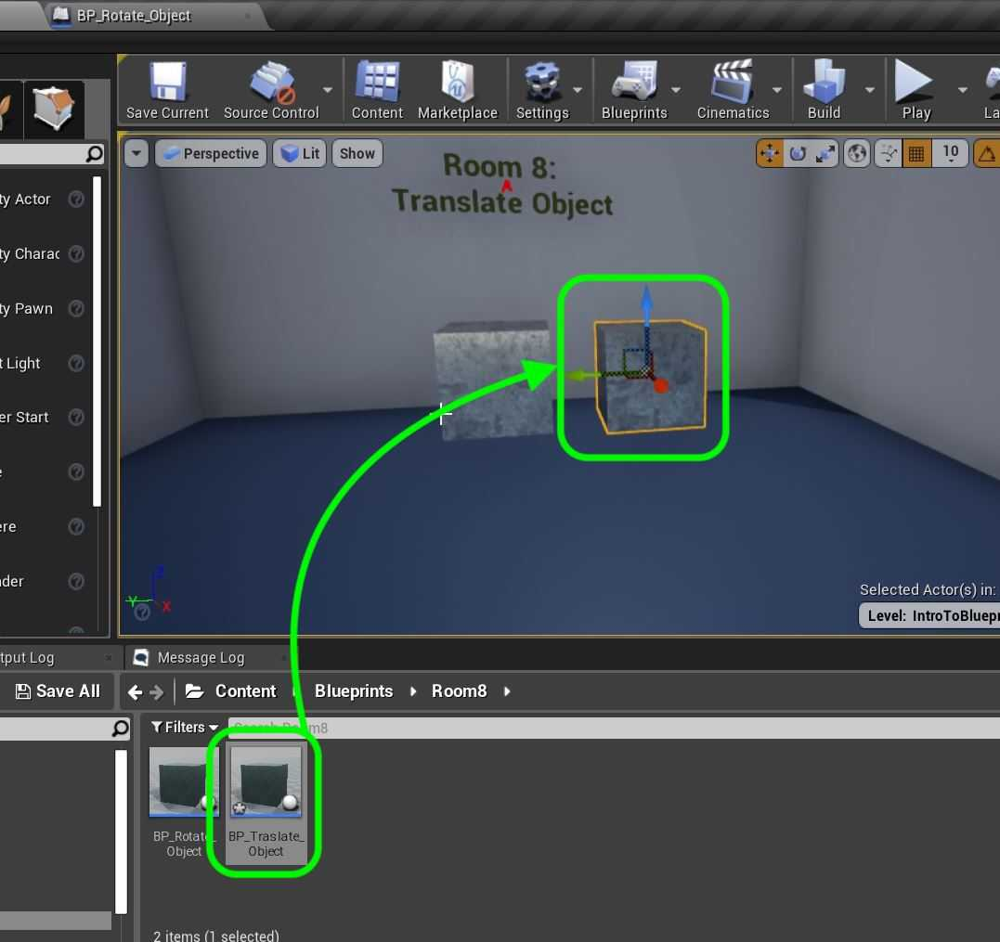

##### `Step 4.`\|`ITB`|:small_blue_diamond: :small_blue_diamond: :small_blue_diamond: :small_blue_diamond:

*Double click* **BP_Translate_Object** to enter the editor. We will not need the speed variable as we will not be adjusting the speed. *Delete* the **Degrees Per Second** variable.

*Change* **Degress Since Last Frame** to `Total Time`, **bRotateOnX** to `bTranslateOnX` and repeat for the **Y** and **Z** axis (change two remaining booleans to `bTranslateOnY` and `bTranslateOnZ`). *Change* the category from **Rotation** to `Translation`. Adjust the **tooltips**.

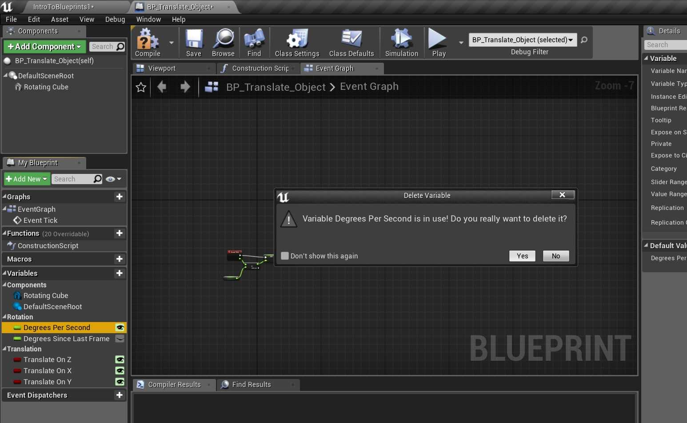

##### `Step 5.`\|`ITB`| :small_orange_diamond:

*Delete* all nodes on the chart that are attached to **Event Tick** (don't delte the tick event) and we will start over in the **Event Graph** tab. Drag the **Total Time** node onto the graph and select **Set**. Attach the execution pin to **Event Tick**.

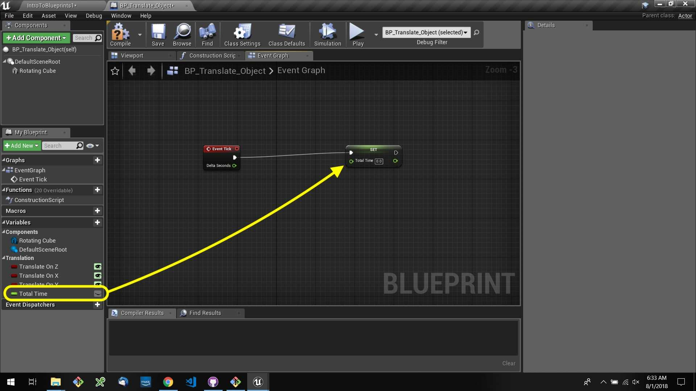

##### `Step 6.`\|`ITB`| :small_orange_diamond: :small_blue_diamond:

*Drag* a copy of the **Total Time** variable onto the graph and select **Get**. *Drag off* of the pin and find a **Float + Float** node to *add*:

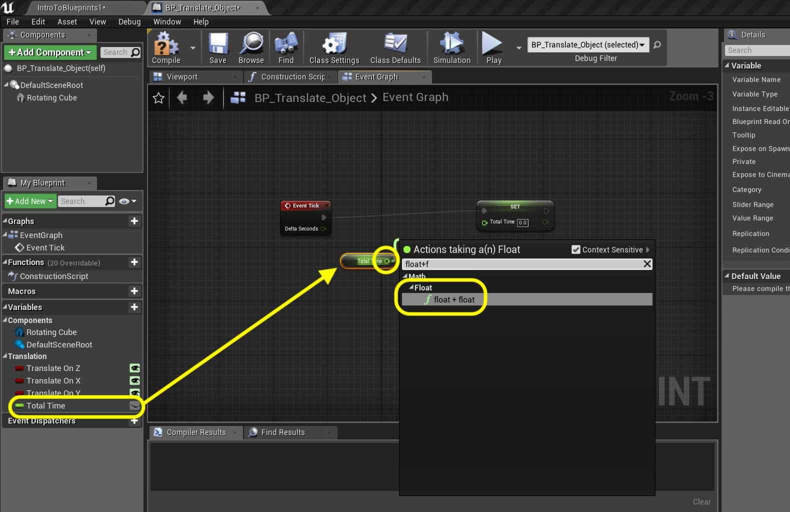

##### `Step 7.`\|`ITB`| :small_orange_diamond: :small_blue_diamond: :small_blue_diamond:

**Total Time** will just keep track of the room time in milliseconds. *Take* the **Delta Time** output of the **Event Tick** and add it to the other input of the **+** node. *Send* this addition to the **Set** node to cumulatively add the time together.

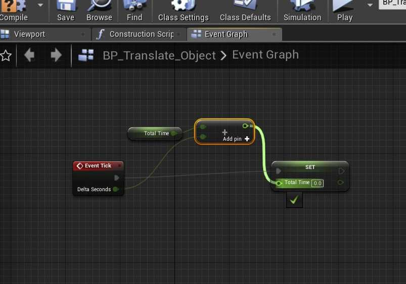

##### `Step 8.`\|`ITB`| :small_orange_diamond: :small_blue_diamond: :small_blue_diamond: :small_blue_diamond:

*Drag off* of this **Set** output pin and look for the **Sin (Radians)** node. We will use a sine wave to translate the object and you need to use radians to do math to it as opposed to angles (remember your trig?).

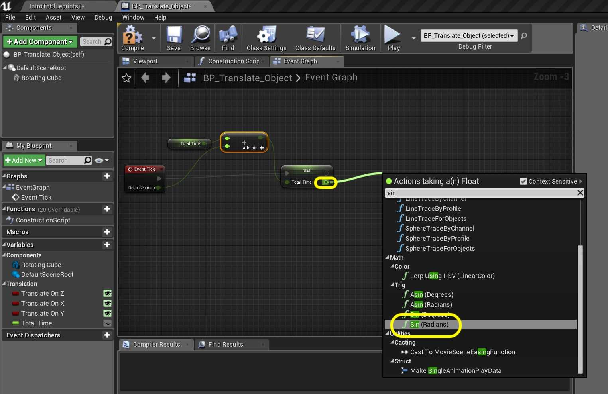

##### `Step 9.`\|`ITB`| :small_orange_diamond: :small_blue_diamond: :small_blue_diamond: :small_blue_diamond: :small_blue_diamond:

Now we will want to feed three translations. To keep the graph neat we will *add* a **Sequence** node and connect its execution pin to the *Set* node.

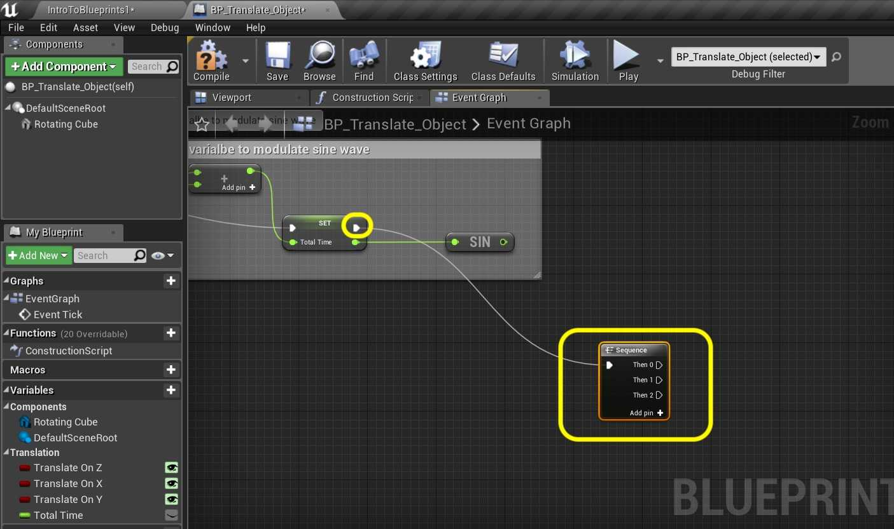

##### `Step 10.`\|`ITB`| :large_blue_diamond:

Drag a **Get** node from the **Translate On Z** boolean onto the graph:

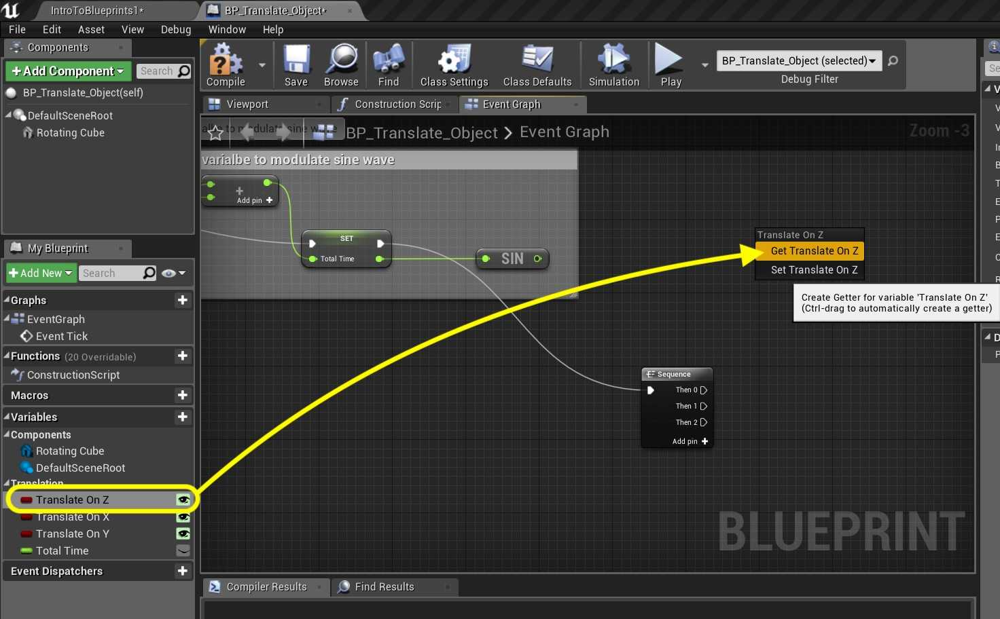

##### `Step 11.`\|`ITB`| :large_blue_diamond: :small_blue_diamond: 

*Drag* the pin off of the **Translate On Z** variable in the graph and *select* a **Branch** node (remember this is like an if() statement). *Connect* the execution pins from the **Sequence | Then 0** to **Branch** pin.

##### `Step 12.`\|`ITB`| :large_blue_diamond: :small_blue_diamond: :small_blue_diamond: 

*Drag and drop* a reference to the **Rotating Cube** mesh onto the graph.

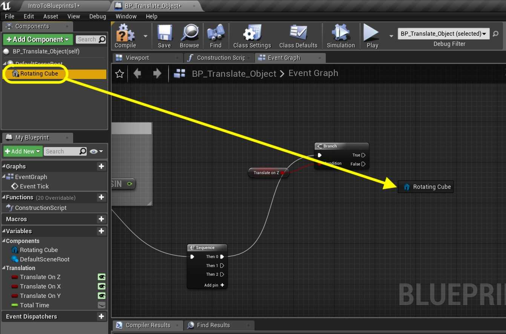

##### `Step 13.`\|`ITB`| :large_blue_diamond: :small_blue_diamond: :small_blue_diamond:  :small_blue_diamond: 

Now *add* a node called **Add Relative Location** to the scene graph by *right cliking* on a blank area and type the name of the node.

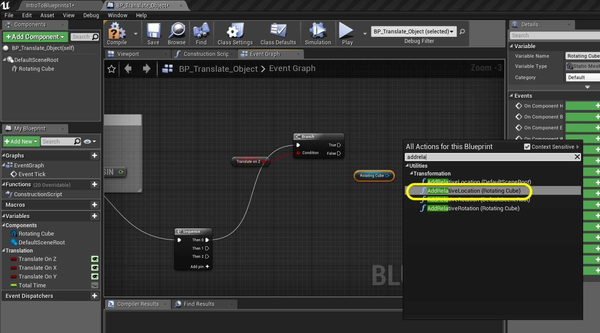

##### `Step 14.`\|`ITB`| :large_blue_diamond: :small_blue_diamond: :small_blue_diamond: :small_blue_diamond:  :small_blue_diamond: 

Now would be a good time to rename our static mesh. It is no longer part of a rotating cube. Go to the **Components** window and *rename* it to `Translating Cube`.

##### `Step 15.`\|`ITB`| :large_blue_diamond: :small_orange_diamond: 

Notice that it changes all references to it as well. So we have our renamed mesh hooked up to a **Add Relative Location** node:

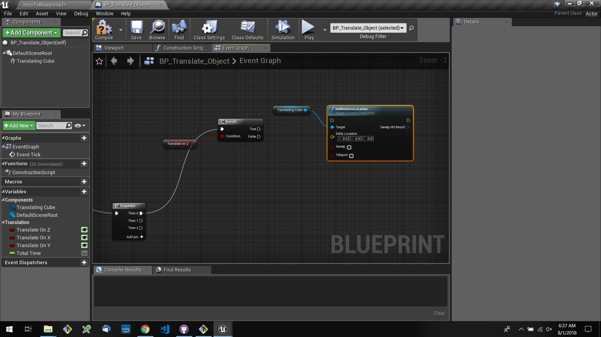

##### `Step 16.`\|`ITB`| :large_blue_diamond: :small_orange_diamond:   :small_blue_diamond: 

Hook up the execution pins from the **Branch** node to the **Add Relative Location** node.

##### `Step 17.`\|`ITB`| :large_blue_diamond: :small_orange_diamond: :small_blue_diamond: :small_blue_diamond:

*Right click* on **Delta Location** input pin on the **Add Relative Location** node and *select* **Split Struct Pin**.

##### `Step 18.`\|`ITB`| :large_blue_diamond: :small_orange_diamond: :small_blue_diamond: :small_blue_diamond: :small_blue_diamond:

Take the output pin of the **SIN** node and *plug* it into the **Delta Location Z** input pin on the **Add Relative Location** node.

##### `Step 19.`\|`ITB`| :large_blue_diamond: :small_orange_diamond: :small_blue_diamond: :small_blue_diamond: :small_blue_diamond: :small_blue_diamond:

Add a comment on all the nodes after the **Sequence** and type `Translate on Z`. This is the up and down axis in the room.

##### `Step 20.`\|`ITB`| :large_blue_diamond: :large_blue_diamond:

*Run* the game and make sure the **Translate On Z** boolean is set to `true` in the **Details Panel**. The cube should move up and down.

##### `Step 21.`\|`ITB`| :large_blue_diamond: :large_blue_diamond: :small_blue_diamond:

*Copy and paste* the entire section. Change the comment to `Translate On X`:

##### `Step 22.`\|`ITB`| :large_blue_diamond: :large_blue_diamond: :small_blue_diamond: :small_blue_diamond:

*Drag* the execution pin from **Sequence Then 1** to **Branch** input pin. Also *delete* the **Translate On Z** getter and drag and drop a **Get for Translate On X** and connect the output pin to the input pin on the **Branch** node.

##### `Step 23.`\|`ITB`| :large_blue_diamond: :large_blue_diamond: :small_blue_diamond: :small_blue_diamond: :small_blue_diamond:

Take the output of the **SIN** node and *plug* it into the input pin **Delta Location X** on the **Delta Relative Location** node

##### `Step 24.`\|`ITB`| :large_blue_diamond: :large_blue_diamond: :small_blue_diamond: :small_blue_diamond: :small_blue_diamond: :small_blue_diamond:

*Copy and paste* all the nodes from the **Translate On Z** section again.

##### `Step 25.`\|`ITB`| :large_blue_diamond: :large_blue_diamond: :small_orange_diamond:

Look at the **Sequence** node. If there is no **Then 2** pin *press* the **Add pin +** button to add it. Then *pull* of the **Then 2** execution pin and place it into the **Branch** node you just copied. Also *delete* the **Translate On Z** getter in the graph and drag and drop **Translate On Y**.

##### `Step 26.`\|`ITB`| :large_blue_diamond: :large_blue_diamond: :small_orange_diamond: :small_blue_diamond:

*Connect* the output of the **SIN** node to the **Delta Location Y** on the **Delta Relative Location** node:

##### `Step 27.`\|`ITB`| :large_blue_diamond: :large_blue_diamond: :small_orange_diamond: :small_blue_diamond: :small_blue_diamond:

Now this is what your final node graph should look like. *Press* the <kbd>Compile</kbd> button:

##### `Step 28.`\|`ITB`| :large_blue_diamond: :large_blue_diamond: :small_orange_diamond: :small_blue_diamond: :small_blue_diamond: :small_blue_diamond:

Go into the game and turhning each axis on and off. Also, look at your blueprint node chart as it runs to see how the booleans gate the operation flow.

##### `Step 29.`\|`ITB`| :large_blue_diamond: :large_blue_diamond: :small_orange_diamond: :small_blue_diamond: :small_blue_diamond: :small_blue_diamond: :small_blue_diamond:

That's it for **Room 8** and this entire map/level. Press **Save All** and update **Github** by **committing** and **pushing** all the changes made using **Unreal Source Control** and **GitHub Desktop**. 

___

| [previous](../rotation-ii/README.md#user-content-rotation-ii)| [home](../README.md#user-content-ue4-blueprints) | [next](../multiple-actors/README.md#user-content-dynamically-alter-multiple-classes)|
|---|---|---|
