### Translation

[previous](../rotation-ii/README.md#user-content-rotation-ii) • [home](../README.md#user-content-ue4-blueprints) • [next](../translation-ii/README.md#user-content-translation-ii)

We will be translating an object in 3-D space through blueprints. If rotation is moving along the origin of the model, translation is moving it **X,Y,Z** space in the game engine.  

---

##### `Step 1.`\|`ITB`|:small_blue_diamond:

Go to the **Blueprints** folder and *duplicate* the **BP_RotateObject** blueprint.

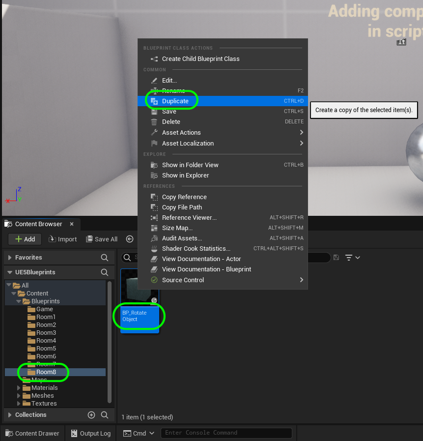

##### `Step 2.`\|`FHIU`|:small_blue_diamond: :small_blue_diamond: 

Rename it to `BP_TranslateObject`.

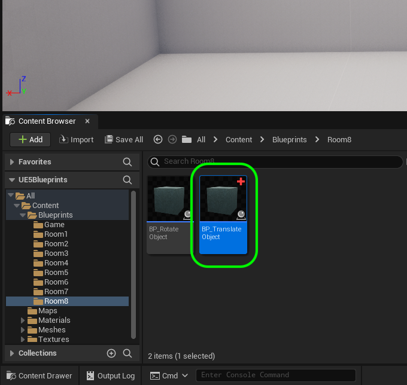

##### `Step 3.`\|`ITB`|:small_blue_diamond: :small_blue_diamond: :small_blue_diamond:

*Drag and drop* an instance of **BP_TranslateObject** into the game window on the right hand side of room 8.

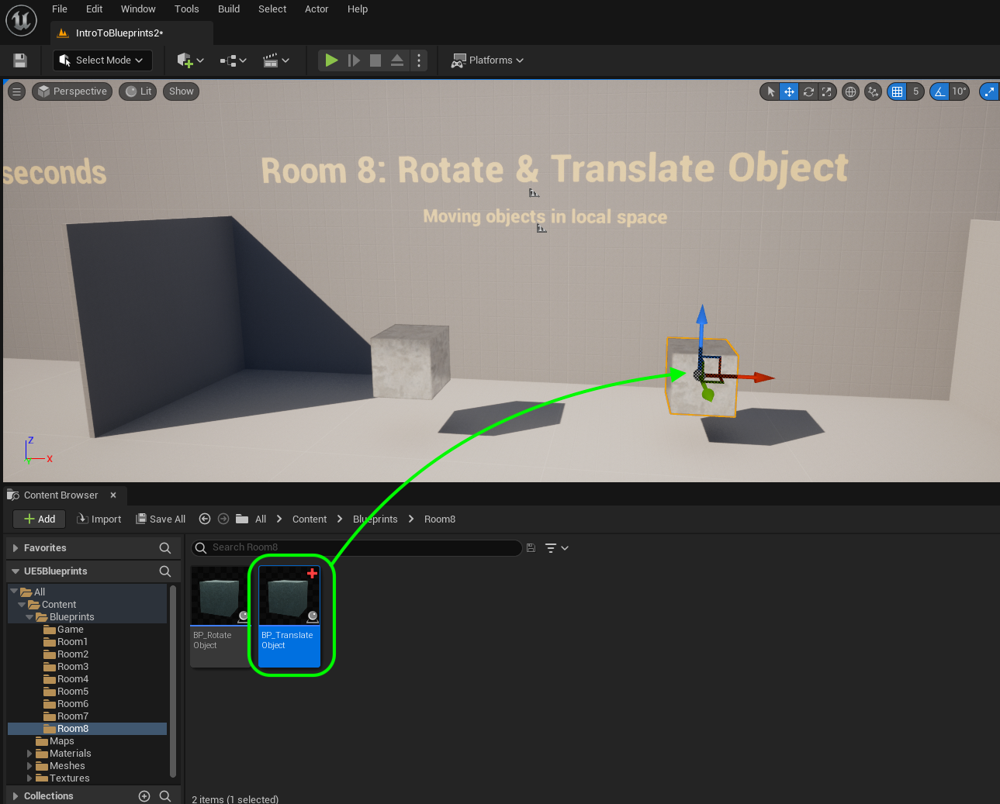

##### `Step 4.`\|`ITB`|:small_blue_diamond: :small_blue_diamond: :small_blue_diamond: :small_blue_diamond:

Change all the variable **Categories** to `Translation`.

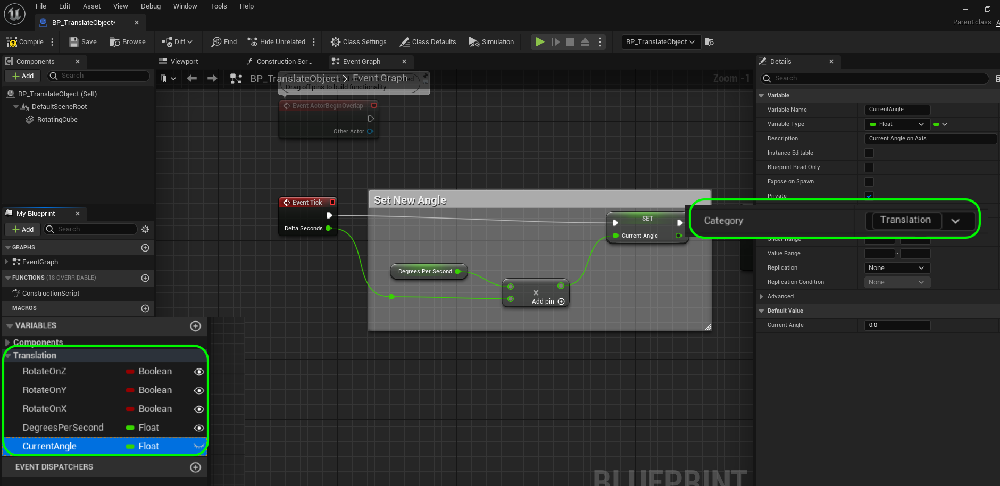

##### `Step 5.`\|`ITB`| :small_orange_diamond:

Since we are not rotating we are translating, we will be sending cumulative time through a trig function to give us an ease in and ease out motion back and forth.  So lets change the **Current Angle** variable to `TotalTime`.  Change the **Description** to `Total cumulative time`.

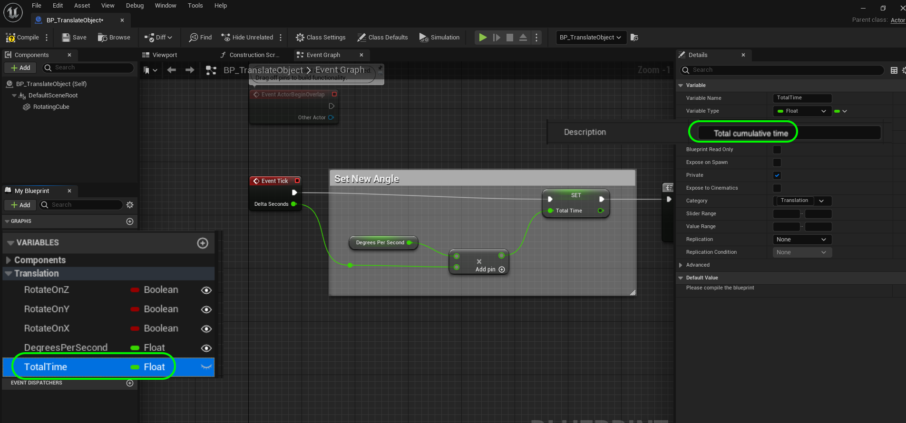

##### `Step 6.`\|`ITB`| :small_orange_diamond: :small_blue_diamond:

Go to the **Event Tick** node and delete the **Degree Per Second** and **Multiplication** nodes.  Drag a copy of **Total Time** and select a **Get** node.

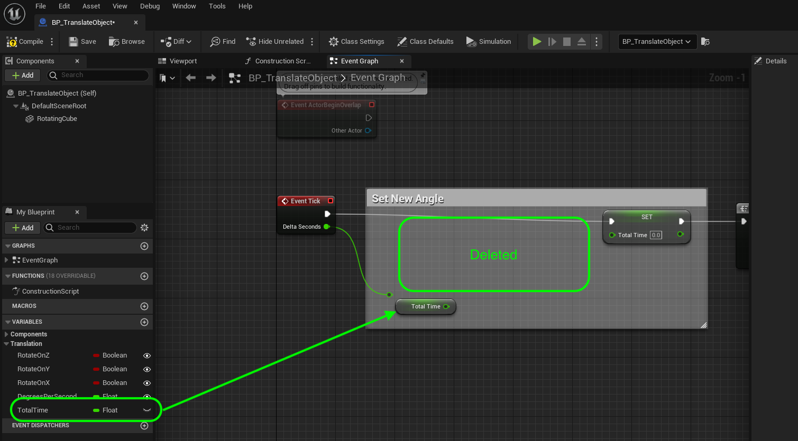

##### `Step 7.`\|`ITB`| :small_orange_diamond: :small_blue_diamond: :small_blue_diamond:

Place an **Add** node to the graph and add up **Tick | Delta Seconds** with **Total Tile**.  Send the output of the **Add** node to the **Set Total Time** node.

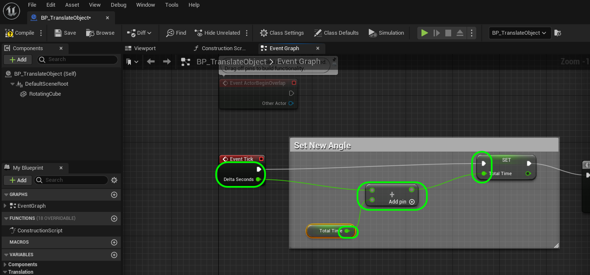

##### `Step 8.`\|`ITB`| :small_orange_diamond: :small_blue_diamond: :small_blue_diamond: :small_blue_diamond:

Update comment on nodes to `Updates Total Time`.

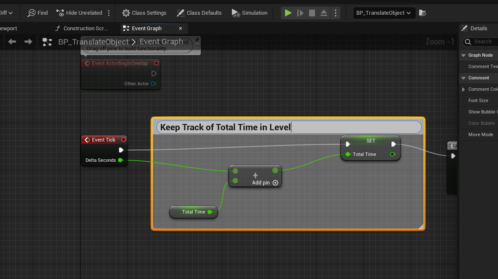

##### `Step 9.`\|`ITB`| :small_orange_diamond: :small_blue_diamond: :small_blue_diamond: :small_blue_diamond: :small_blue_diamond:

We are going to send this time period through a sign wave.  When we send the time through a SIN function we will get a smooth cureve going from 0 to 1 to -1 and back.  It has a nice ease in and ease out so the motion if very natural.  The two things we care about are the *period* (how long it takes to from 0 to 1 to -1 and back) and the *amplitude* which is the height of the curve (y axis values). When we take the `sin(x)` we get a period of 2π and an amplitude of 1.

##### `Step 10.`\|`ITB`| :large_blue_diamond:

We want to adjust the length the animation in seconds and not of units of π. So we want to normalize this to a *period* of 1 second.  We accomplish this by mutliplying the value we are sending to by by `2π`.  This gives us a period of `1.0`.

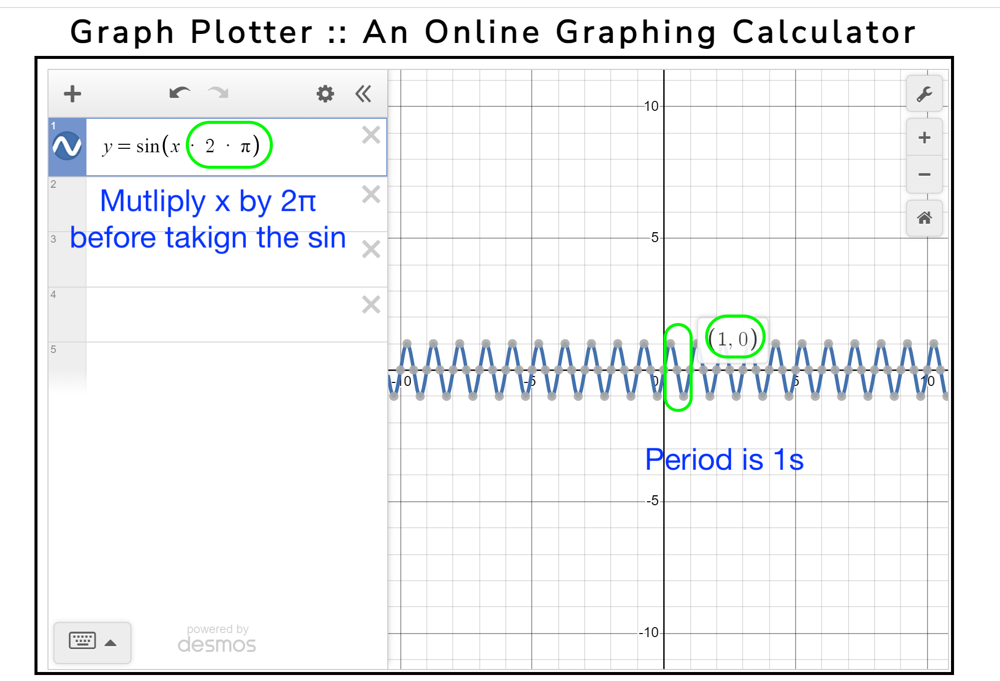

##### `Step 11.`\|`ITB`| :large_blue_diamond: :small_blue_diamond: 

Add a **Get PI** node to the chart.  Then add a **Multiplication** node and multiply **PI** by **Total Time**.  Then press the <kbd>+</kbd> button and add another mutliplication and enter a value of `2.0`.  This effectively will multiply **PI** by `2.0` giving us a period of `1`.

##### `Step 12.`\|`ITB`| :large_blue_diamond: :small_blue_diamond: :small_blue_diamond: 

Now add a new variable of **Type** `Float` with the name `SecondsPerPeriod`. Make **Instance Editable** and **Private** `true` and set the **Category** to `Translation`. Add a **Description** of `Number of Seconds for a full period`.

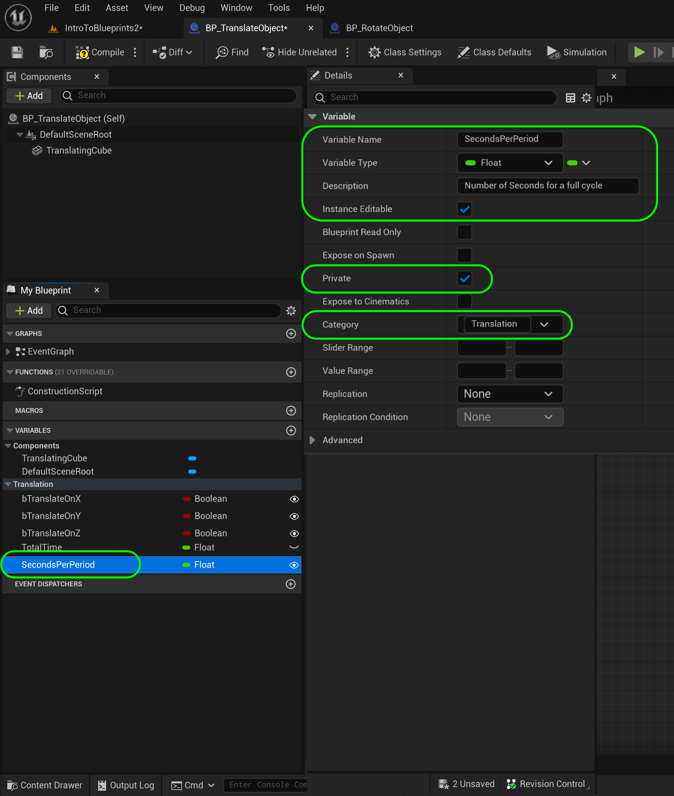

##### `Step 13.`\|`ITB`| :large_blue_diamond: :small_blue_diamond: :small_blue_diamond:  :small_blue_diamond: 

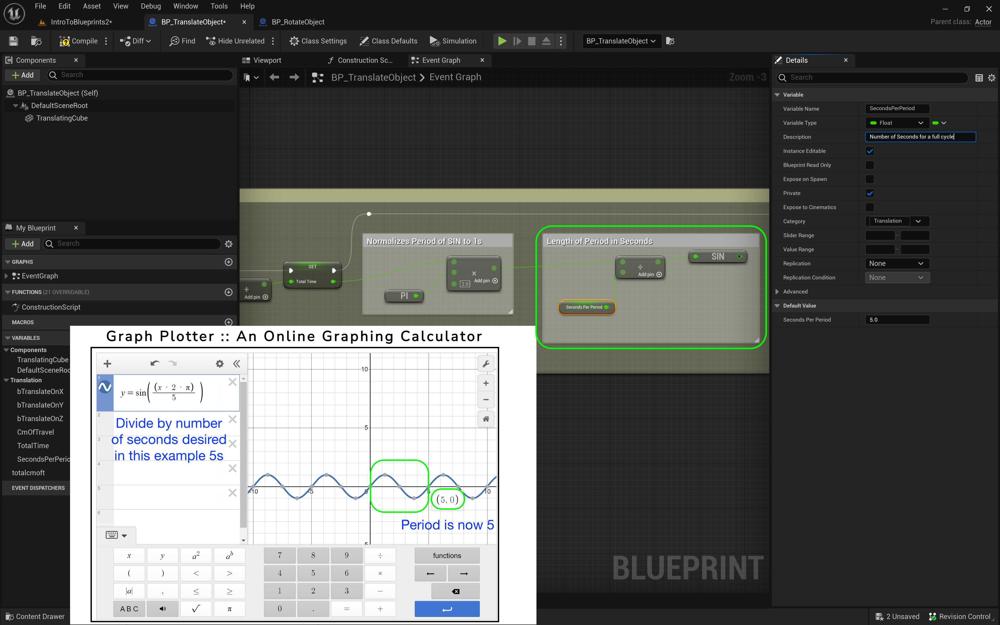

##### `Step 14.`\|`ITB`| :large_blue_diamond: :small_blue_diamond: :small_blue_diamond: :small_blue_diamond:  :small_blue_diamond: 

*Delete* all nodes on the chart to the right of the **Sequence** node. 

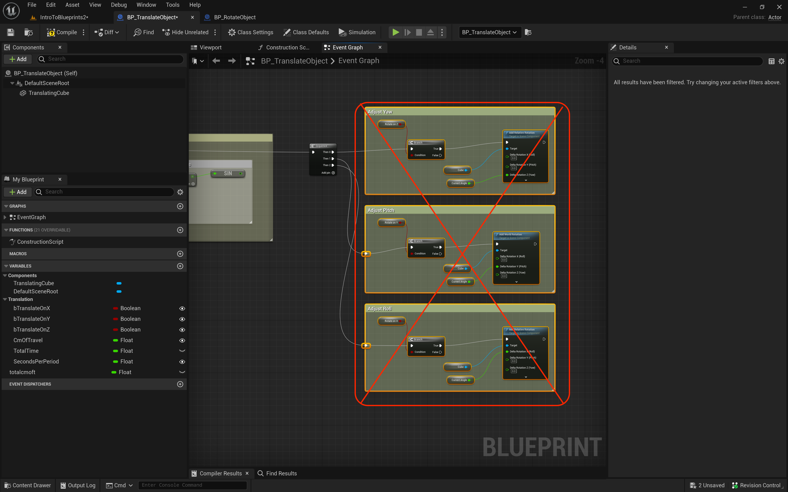

Change all the boolean names to `Translate on Z`, `Translate on X` and `Translate on Y`.

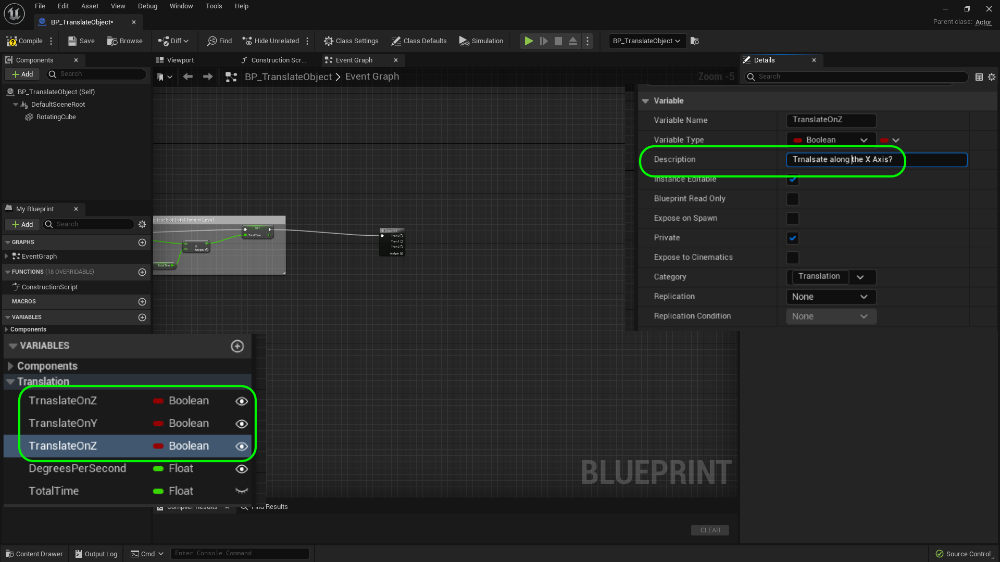
*Drag off* of this **Set** output pin and look for the **Sin (Radians)** node. We will use a sine wave to translate the object and you need to use radians to do math to it as opposed to angles (remember your trig?).

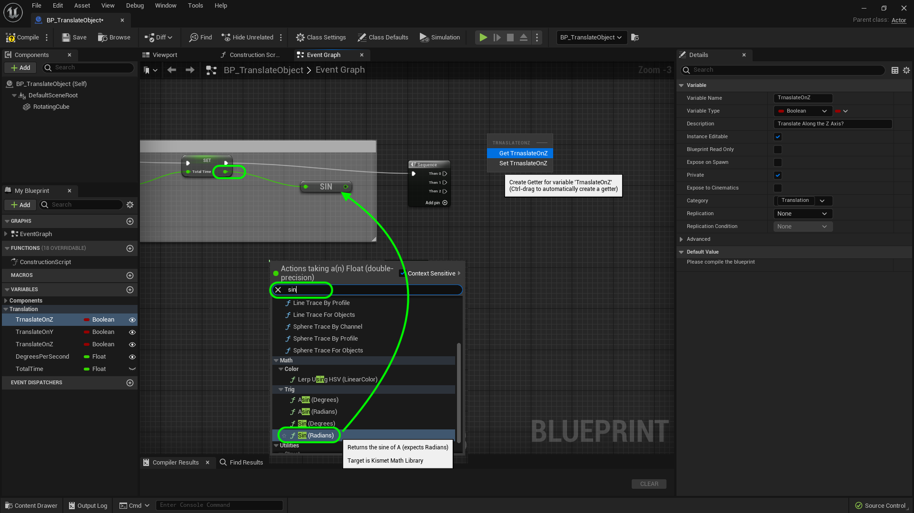

Drag a **Get** node from the **Translate On Z** boolean onto the graph. *Drag* the pin off of the **Translate On Z** variable in the graph and *select* a **Branch** node (remember this is like an if() statement). *Connect* the execution pins from the **Sequence | Then 0** to **Branch** pin.

*Drag and drop* a reference to the **Rotating Cube** mesh onto the graph. *Pull off* of the **Rotating Cube** pin and *add* a node called **Add Relative Location** to the scene graph.

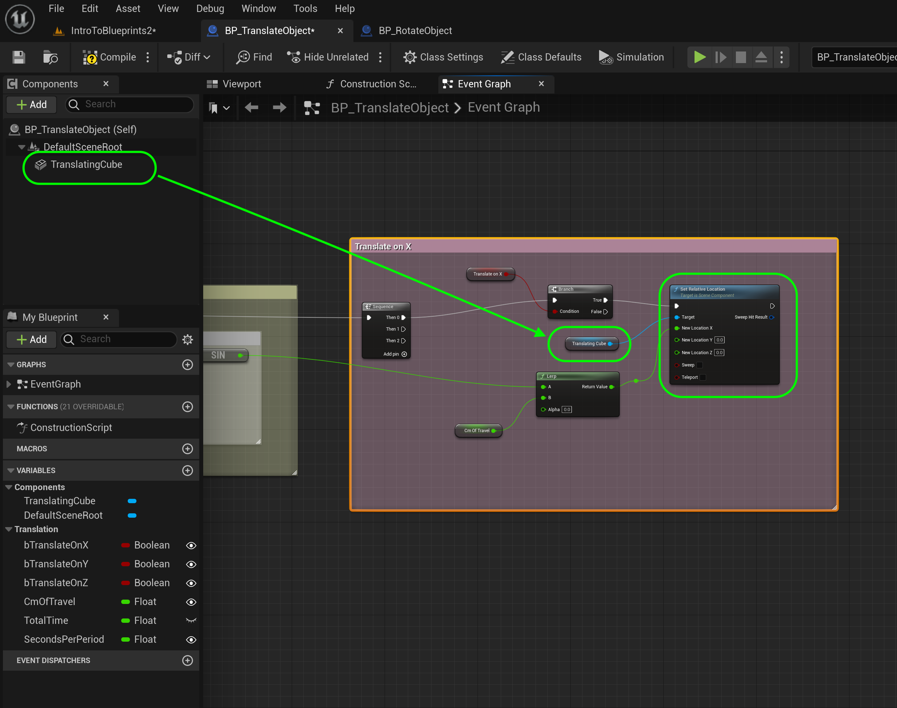

Now would be a good time to rename our static mesh. It is no longer part of a rotating cube. Go to the **Components** window and *rename* it to `Translating Cube`. Hook up the execution pins from the **Branch | True** node to the **Add Relative Location** node.

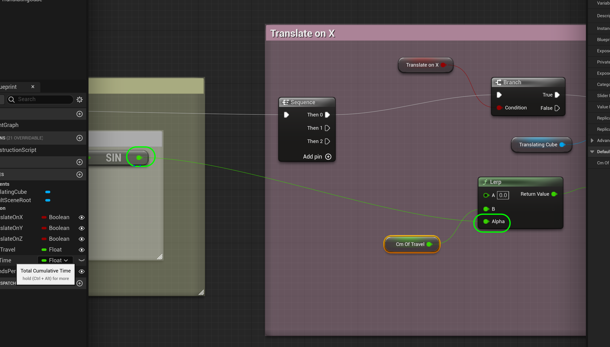

Change the name of **Degress per Second** variable to `CmOfTravel`.  Change the **Description** to indicate that this will be the length of displacement on either side of the cube in the level.

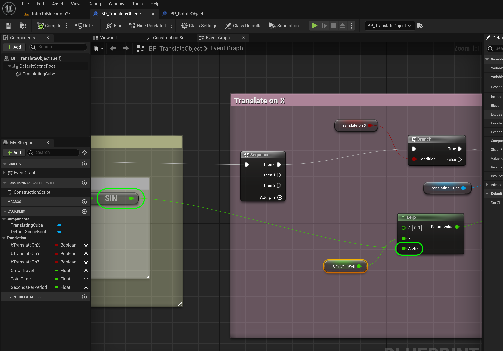

##### `Step 15.`\|`ITB`| :large_blue_diamond: :small_orange_diamond: 

*Right click* on **Delta Location** input pin on the **Add Relative Location** node and *select* **Split Struct Pin**.

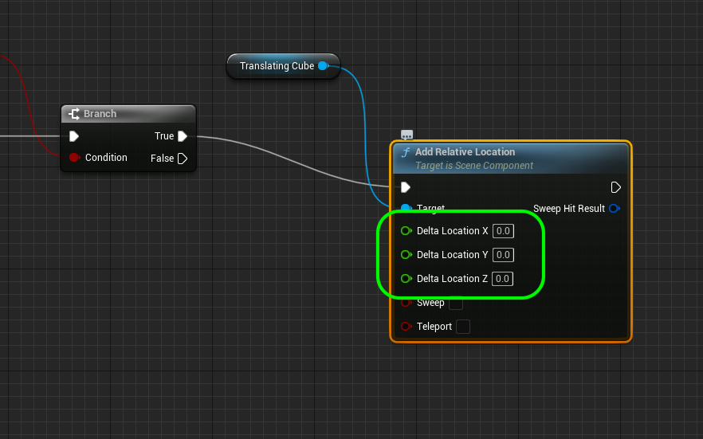

##### `Step 16.`\|`ITB`| :large_blue_diamond: :small_orange_diamond:   :small_blue_diamond: 

Add a **Multiplication** node to the graph.  Also add a **Get Cm Of Travel** node.  Multiply them together and send the output to the **Delta Location Z** input pin on the **Add Relative Location** node.

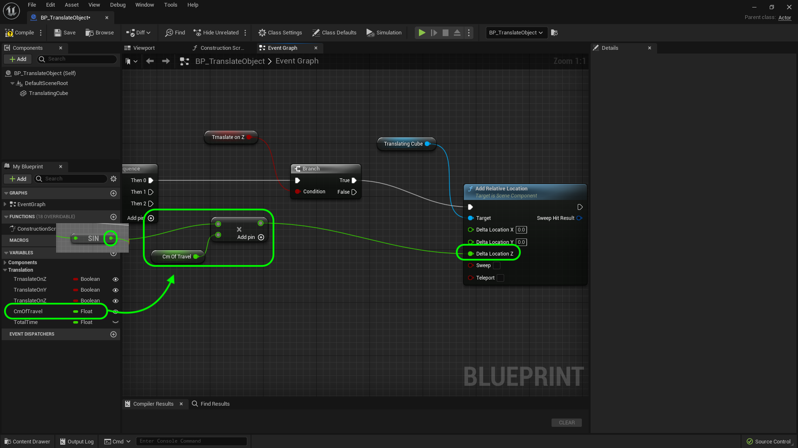

##### `Step 17.`\|`ITB`| :large_blue_diamond: :small_orange_diamond: :small_blue_diamond: :small_blue_diamond:

Add a comment on all the nodes after the **Sequence** and type `Translate on Z`. This is the up and down axis in the room.

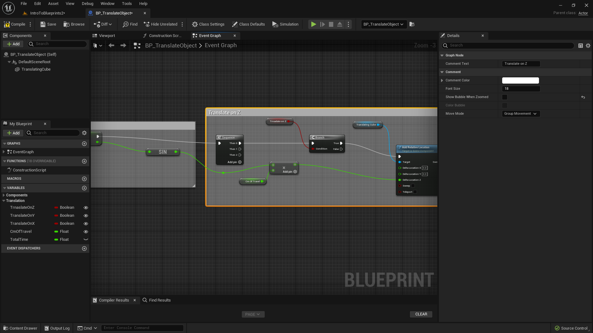

##### `Step 18.`\|`ITB`| :large_blue_diamond: :small_orange_diamond: :small_blue_diamond: :small_blue_diamond: :small_blue_diamond:

*Run* the game and make sure the **Translate On Z** boolean is set to `true` in the **Details Panel**. The cube should move up and down. Now play with the default values and ranges of **CmOfTravel**. We limit ranges to limit very large numbers that could introduce bugs and gameplay issues.

https://user-images.githubusercontent.com/5504953/193453110-b3e8fe58-81ff-42d2-a5ea-03d53467d894.mp4

##### `Step 19.`\|`ITB`| :large_blue_diamond: :small_orange_diamond: :small_blue_diamond: :small_blue_diamond: :small_blue_diamond: :small_blue_diamond:

*Copy and paste* the entire section.

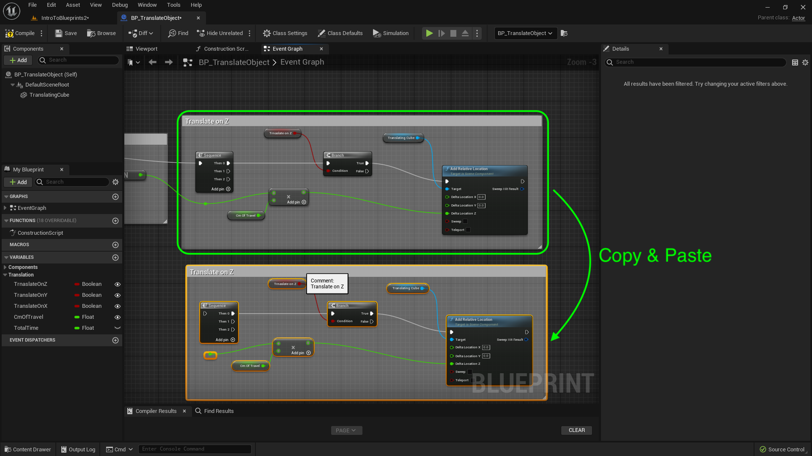

##### `Step 20.`\|`ITB`| :large_blue_diamond: :large_blue_diamond:

Change the **Comment** to `Translate on Y`.  Connect the output of the **Sin** node to the top **Multiplication** pin of the new translate on Y section.

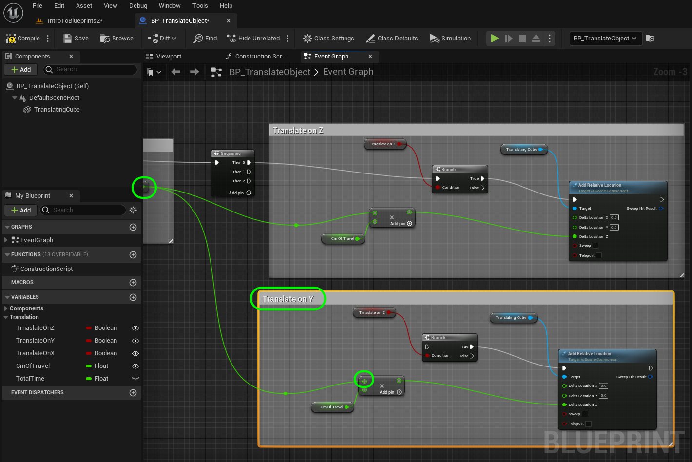

##### `Step 21.`\|`ITB`| :large_blue_diamond: :large_blue_diamond: :small_blue_diamond:

Change the **Translate on Z** node to the **Translate on Y** node.

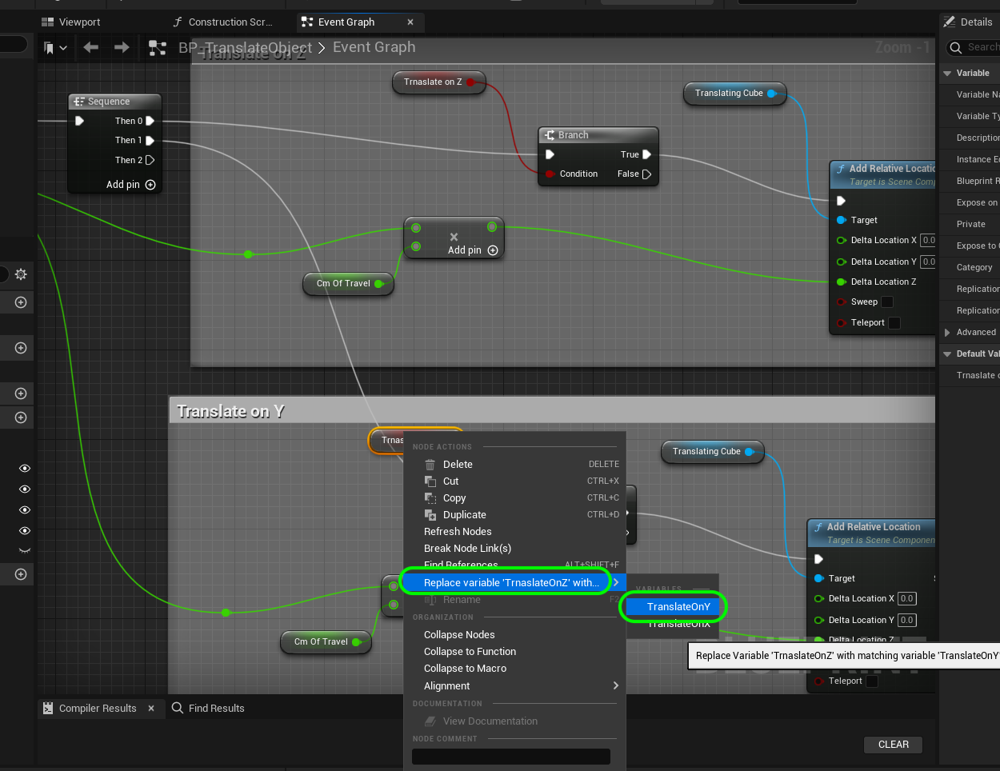

<!--  -->

| [previous](../rotation-ii/README.md#user-content-rotation-ii)| [home](../README.md#user-content-ue4-blueprints) | [next](../translation-ii/README.md#user-content-translation-ii)|
|---|---|---|
