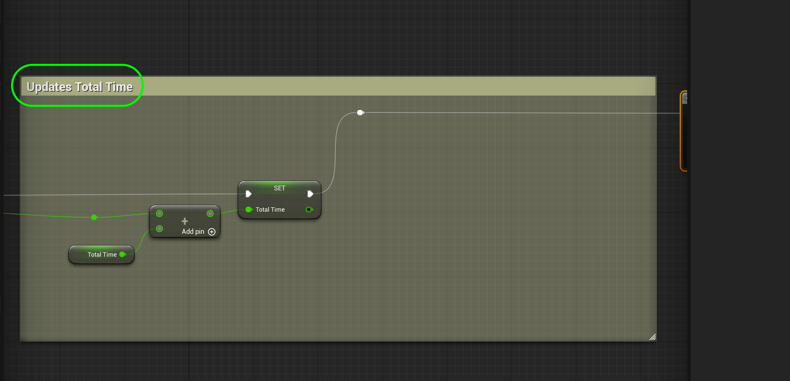
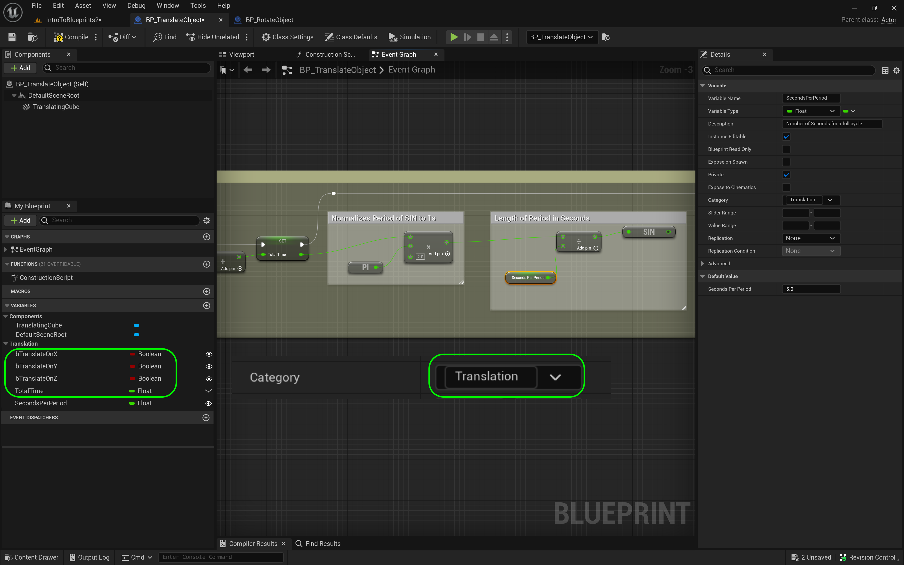
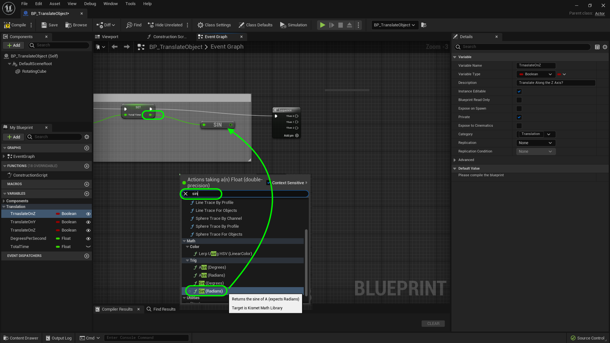

### Translation

[previous](../rotation-ii/README.md#user-content-rotation-ii) • [home](../README.md#user-content-ue4-blueprints) • [next](../multiple-actors/README.md#user-content-dynamically-alter-multiple-classes)

We will be translating an object in 3-D space through blueprints. If rotation is moving along the origin of the model, translation is moving it **X,Y,Z** space in the game engine.  

 

---

##### `Step 1.`\|`ITB`|:small_blue_diamond:

Go to the **Blueprints** folder and *duplicate* the **BP_RotateObject** blueprint.

##### `Step 2.`\|`FHIU`|:small_blue_diamond: :small_blue_diamond: 

Rename it to `BP_TranslateObject`.

##### `Step 3.`\|`ITB`|:small_blue_diamond: :small_blue_diamond: :small_blue_diamond:

*Drag and drop* an instance of **BP_TranslateObject** into the game window on the right hand side of room 8.

##### `Step 4.`\|`ITB`|:small_blue_diamond: :small_blue_diamond: :small_blue_diamond: :small_blue_diamond:

Change all the variable **Categories** to `Translation`.

##### `Step 5.`\|`ITB`| :small_orange_diamond:

Since we are not rotating we are translating, we will be sending cumulative time through a trig function to give us an ease in and ease out motion back and forth.  So lets change the **Current Angle** variable to `TotalTime`.  Change the **Description** to `Total cumulative time`.

##### `Step 6.`\|`ITB`| :small_orange_diamond: :small_blue_diamond:

Go to the **Event Tick** node and delete the **Degree Per Second** and **Multiplication** nodes.  Drag a copy of **Total Time** and select a **Get** node.

##### `Step 7.`\|`ITB`| :small_orange_diamond: :small_blue_diamond: :small_blue_diamond:

Place an **Add** node to the graph and add up **Tick | Delta Seconds** with **Total Tile**.  Send the output of the **Add** node to the **Set Total Time** node.

##### `Step 8.`\|`ITB`| :small_orange_diamond: :small_blue_diamond: :small_blue_diamond: :small_blue_diamond:

Update comment on nodes to `Keep Track of Total Time in Level`.

##### `Step 9.`\|`ITB`| :small_orange_diamond: :small_blue_diamond: :small_blue_diamond: :small_blue_diamond: :small_blue_diamond:

*Delete* all nodes on the chart to the right of the **Sequence** node.

##### `Step 10.`\|`ITB`| :large_blue_diamond:

Change all the boolean names to `Translate on Z`, `Translate on X` and `Translate on Y`.

##### `Step 11.`\|`ITB`| :large_blue_diamond: :small_blue_diamond: 

*Drag off* of this **Set** output pin and look for the **Sin (Radians)** node. We will use a sine wave to translate the object and you need to use radians to do math to it as opposed to angles (remember your trig?).

##### `Step 12.`\|`ITB`| :large_blue_diamond: :small_blue_diamond: :small_blue_diamond: 

Drag a **Get** node from the **Translate On Z** boolean onto the graph. *Drag* the pin off of the **Translate On Z** variable in the graph and *select* a **Branch** node (remember this is like an if() statement). *Connect* the execution pins from the **Sequence | Then 0** to **Branch** pin.

*Drag and drop* a reference to the **Rotating Cube** mesh onto the graph. *Pull off* of the **Rotating Cube** pin and *add* a node called **Add Relative Location** to the scene graph.

##### `Step 13.`\|`ITB`| :large_blue_diamond: :small_blue_diamond: :small_blue_diamond:  :small_blue_diamond: 

Now would be a good time to rename our static mesh. It is no longer part of a rotating cube. Go to the **Components** window and *rename* it to `Translating Cube`. Hook up the execution pins from the **Branch | True** node to the **Add Relative Location** node.

##### `Step 14.`\|`ITB`| :large_blue_diamond: :small_blue_diamond: :small_blue_diamond: :small_blue_diamond:  :small_blue_diamond: 

##### `Step 15.`\|`ITB`| :large_blue_diamond: :small_orange_diamond: 

##### `Step 16.`\|`ITB`| :large_blue_diamond: :small_orange_diamond:   :small_blue_diamond: 

##### `Step 17.`\|`ITB`| :large_blue_diamond: :small_orange_diamond: :small_blue_diamond: :small_blue_diamond:

*Right click* on **Delta Location** input pin on the **Add Relative Location** node and *select* **Split Struct Pin**.

##### `Step 18.`\|`ITB`| :large_blue_diamond: :small_orange_diamond: :small_blue_diamond: :small_blue_diamond: :small_blue_diamond:

Take the output pin of the **SIN** node and *plug* it into the **Delta Location Z** input pin on the **Add Relative Location** node.

##### `Step 19.`\|`ITB`| :large_blue_diamond: :small_orange_diamond: :small_blue_diamond: :small_blue_diamond: :small_blue_diamond: :small_blue_diamond:

Add a comment on all the nodes after the **Sequence** and type `Translate on Z`. This is the up and down axis in the room.

##### `Step 20.`\|`ITB`| :large_blue_diamond: :large_blue_diamond:

*Run* the game and make sure the **Translate On Z** boolean is set to `true` in the **Details Panel**. The cube should move up and down.

##### `Step 21.`\|`ITB`| :large_blue_diamond: :large_blue_diamond: :small_blue_diamond:

*Copy and paste* the entire section. Change the comment to `Translate On X`:

##### `Step 22.`\|`ITB`| :large_blue_diamond: :large_blue_diamond: :small_blue_diamond: :small_blue_diamond:

*Drag* the execution pin from **Sequence Then 1** to **Branch** input pin. Also *delete* the **Translate On Z** getter and drag and drop a **Get Translate On X** and connect the output pin to the input **Condition** pin on the **Branch** node.

##### `Step 23.`\|`ITB`| :large_blue_diamond: :large_blue_diamond: :small_blue_diamond: :small_blue_diamond: :small_blue_diamond:

Take the output of the **SIN** node and *plug* it into the input pin **Delta Location X** on the **Delta Relative Location** node

##### `Step 24.`\|`ITB`| :large_blue_diamond: :large_blue_diamond: :small_blue_diamond: :small_blue_diamond: :small_blue_diamond: :small_blue_diamond:

*Copy and paste* all the nodes from the **Translate On Z** section again.

##### `Step 25.`\|`ITB`| :large_blue_diamond: :large_blue_diamond: :small_orange_diamond:

Change the **Comment** to `Translate on Y`. Look at the **Sequence** node. If there is no **Then 2** pin *press* the **Add pin +** button to add it. Then *pull* of the **Then 2** execution pin and place it into the **Branch** node you just copied. Also *delete* the **Translate On Z** getter in the graph and drag and drop **Translate On Y**. Connet the output to the **Branch | Condition** pin.

##### `Step 26.`\|`ITB`| :large_blue_diamond: :large_blue_diamond: :small_orange_diamond: :small_blue_diamond:

*Connect* the output of the **SIN** node to the **Delta Location Y** on the **Delta Relative Location** node:

##### `Step 27.`\|`ITB`| :large_blue_diamond: :large_blue_diamond: :small_orange_diamond: :small_blue_diamond: :small_blue_diamond:

Now this is what your final node graph should look like. *Press* the <kbd>Compile</kbd> button:

##### `Step 28.`\|`ITB`| :large_blue_diamond: :large_blue_diamond: :small_orange_diamond: :small_blue_diamond: :small_blue_diamond: :small_blue_diamond:

Go into the game and turhning each axis on and off. Also, look at your blueprint node chart as it runs to see how the booleans gate the operation flow.

##### `Step 29.`\|`ITB`| :large_blue_diamond: :large_blue_diamond: :small_orange_diamond: :small_blue_diamond: :small_blue_diamond: :small_blue_diamond: :small_blue_diamond:

That's it for **Room 8** and this entire map/level. Press **Save All** and update **Github** by **committing** and **pushing** all the changes made using **Unreal Source Control** and **GitHub Desktop**. 

<!--  -->

| [previous](../rotation-ii/README.md#user-content-rotation-ii)| [home](../README.md#user-content-ue4-blueprints) | [next](../multiple-actors/README.md#user-content-dynamically-alter-multiple-classes)|
|---|---|---|
