### User Input II

[previous](../user-input/README.md#user-content-user-input) • [home](../README.md#user-content-ue4-blueprints) • [next](../user-input-iii/README.md#user-content-user-input-iii)

User input continued...

 

---

##### `Step 1.`\|`ITB`|:small_blue_diamond:

Now lets get an event that is called when the **L** key is pressed. *Right click* on the open graph and look for **Event | Keyboard Event | L**:

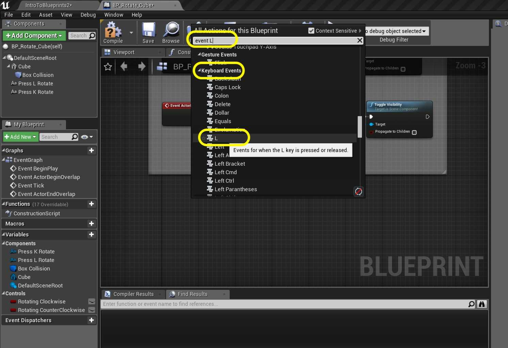

##### `Step 2.`\|`FHIU`|:small_blue_diamond: :small_blue_diamond: 

See that the event node has two execution pins. One for **Pressed** and one for **Released**. *Drag* off the **Pressed** key and add a **Set Rotating Clockwise** node:

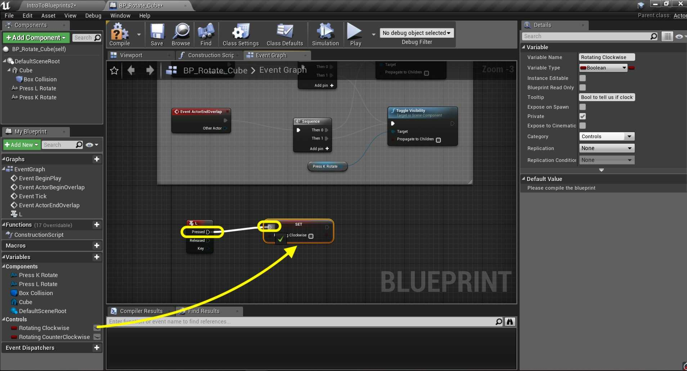

##### `Step 3.`\|`ITB`|:small_blue_diamond: :small_blue_diamond: :small_blue_diamond:

Set the **Rotating Clockwise** boolean to `true`.

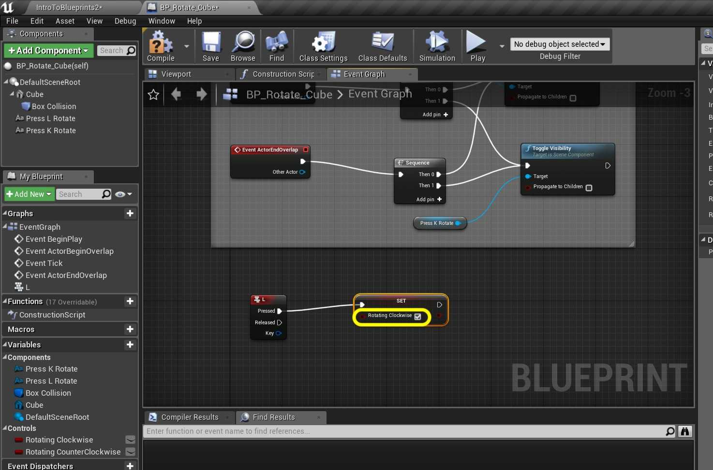

##### `Step 4.`\|`ITB`|:small_blue_diamond: :small_blue_diamond: :small_blue_diamond: :small_blue_diamond:

Repeat the same thing for the **Release** pin but set the **Rotating Clockwise** boolean to `false`.

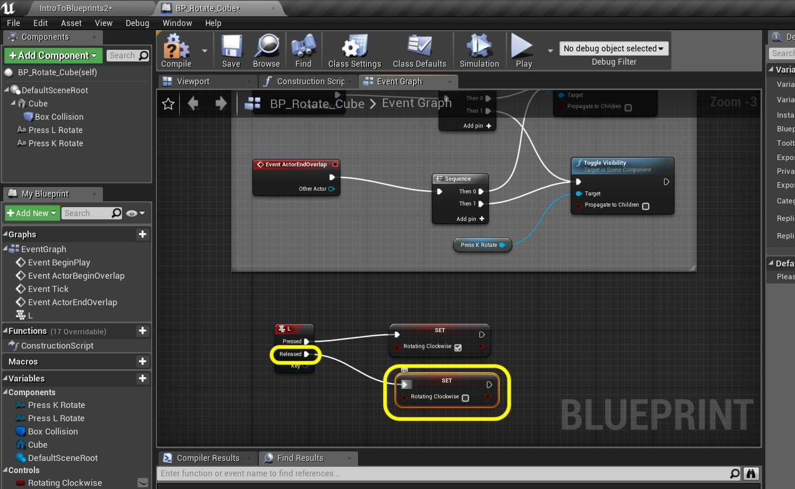

##### `Step 5.`\|`ITB`| :small_orange_diamond:

*Right click* on the open graph and look for **Event | Keyboard Event | K:**

##### `Step 6.`\|`ITB`| :small_orange_diamond: :small_blue_diamond:

Add two **Set Rotating CounterClockwise**. For the **Pressed** execution pin, set to true and the **Released** pin to false.

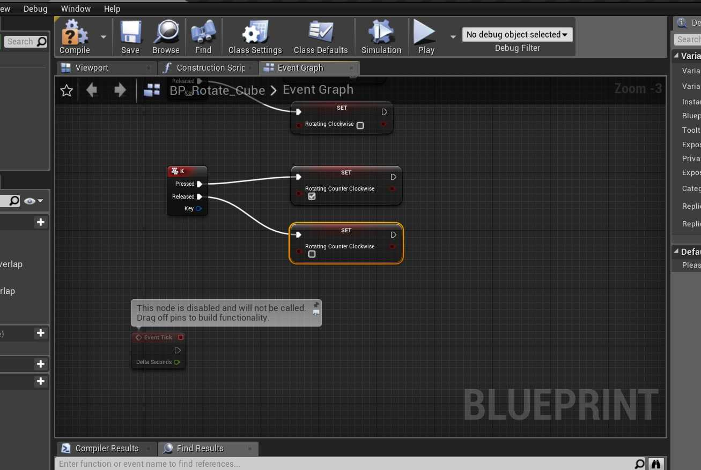

##### `Step 7.`\|`ITB`| :small_orange_diamond: :small_blue_diamond: :small_blue_diamond:

Add the comment `Button Pressed Booleans` to the neds around the **L** and *K* events:

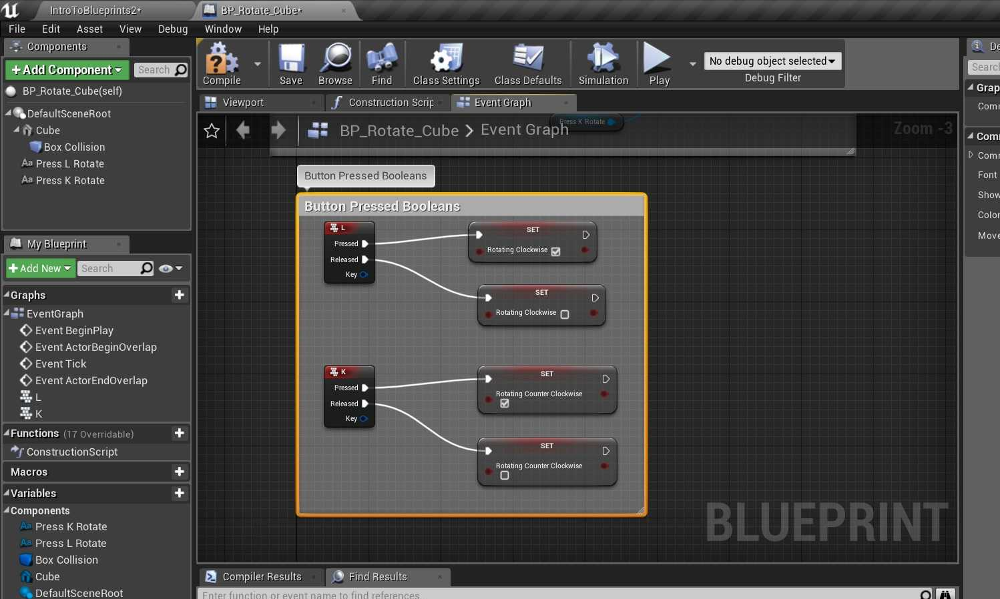

##### `Step 8.`\|`ITB`| :small_orange_diamond: :small_blue_diamond: :small_blue_diamond: :small_blue_diamond:

*Drag* the **Get Rotating Clockwise** node and *drop it* on the graph at the bottom. 

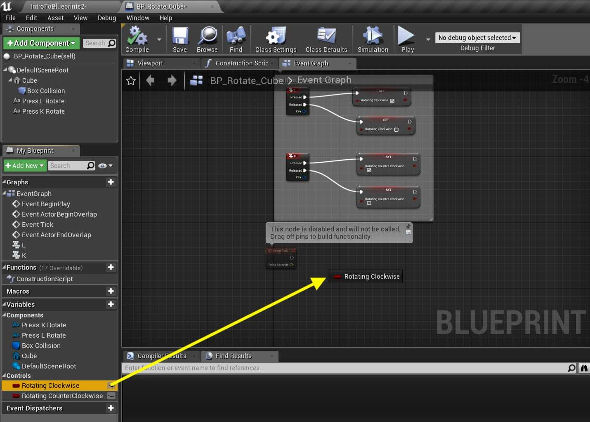

##### `Step 9.`\|`ITB`| :small_orange_diamond: :small_blue_diamond: :small_blue_diamond: :small_blue_diamond: :small_blue_diamond:

*Drag off* of the output pin and select a **Branch** node.

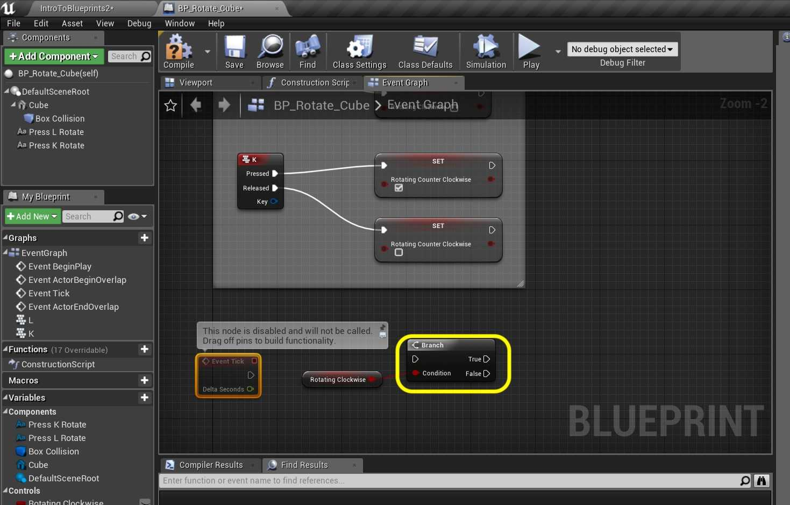

##### `Step 10.`\|`ITB`| :large_blue_diamond:

*Add* a **Sequence** node and attach it to the **Event Tick** output pin. Attach the output of the **Sequence Then 0** pin to the **Branch** input.

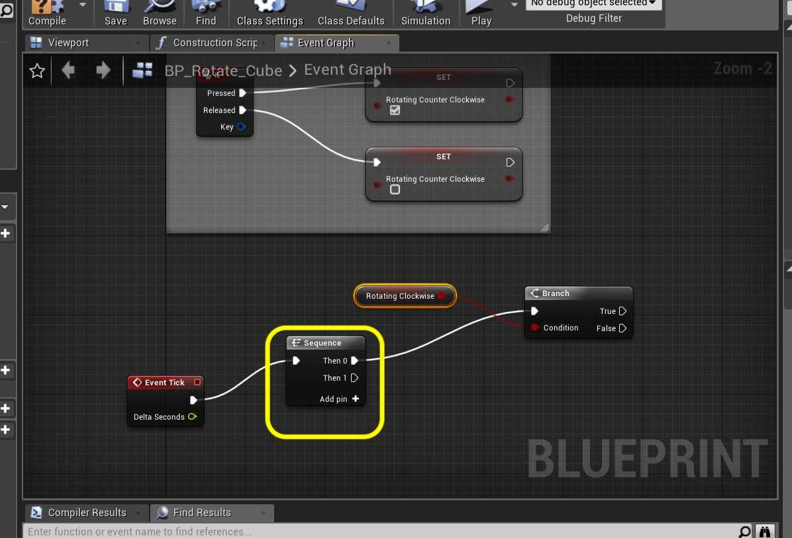

##### `Step 11.`\|`ITB`| :large_blue_diamond: :small_blue_diamond: 

We need a variable to adjust the speed of the rotation. *Add* a new variable called `Speed of Rotation` of Type **Float** and make it **Instance Editable** and **Private**. Set the Category to `Controls`. Set the Tooltip to `Set speed in degrees per second`.

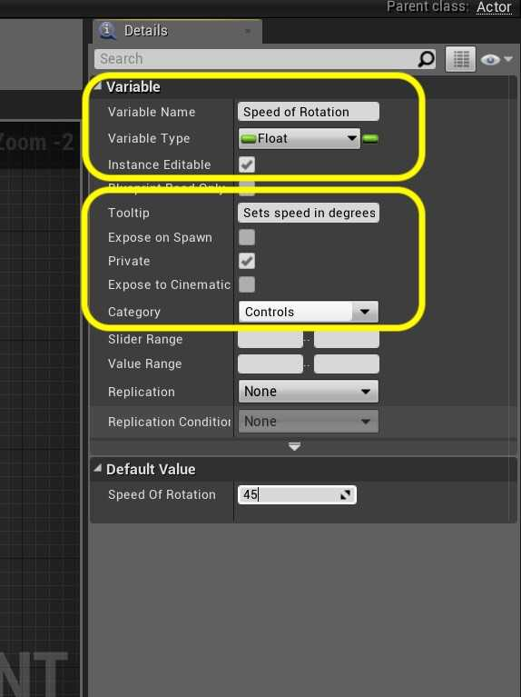

##### `Step 12.`\|`ITB`| :large_blue_diamond: :small_blue_diamond: :small_blue_diamond: 

We also need a variable to store the current angle of rotation. Add a new variable called `Current Angle Deg` of **Type Float** and make it **Private**. Set the **Category** to `Controls`. Set the **Tooltip** to `Holds current angle in degrees`.

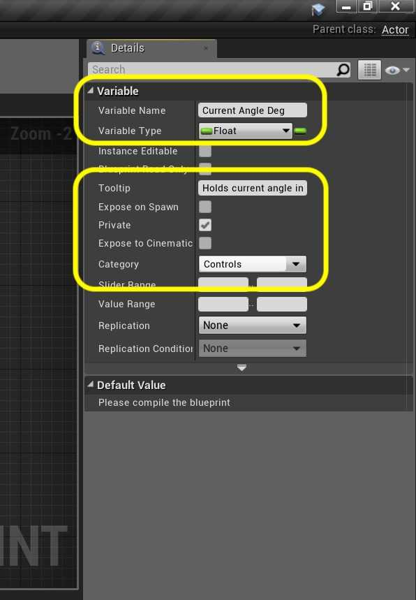

##### `Step 13.`\|`ITB`| :large_blue_diamond: :small_blue_diamond: :small_blue_diamond:  :small_blue_diamond: 

*Drag* the **Get Speed Of Rotation** node onto the graph.

##### `Step 14.`\|`ITB`| :large_blue_diamond: :small_blue_diamond: :small_blue_diamond: :small_blue_diamond:  :small_blue_diamond: 

*Add* a **Float * Float** multiplication node attached to the **Speed of Rotation** node:

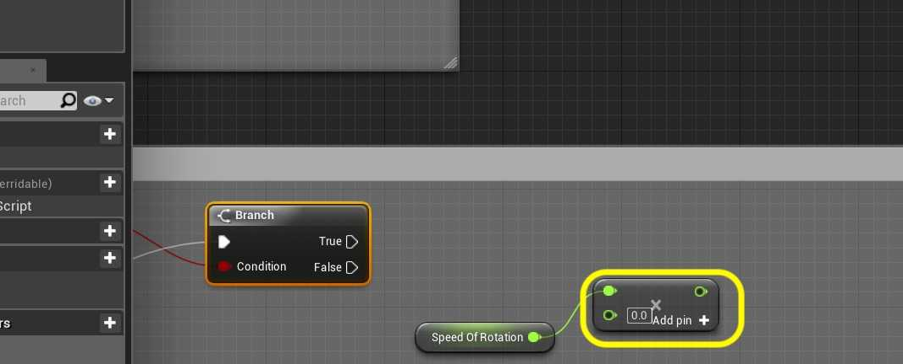

##### `Step 15.`\|`ITB`| :large_blue_diamond: :small_orange_diamond: 

Connect the output **Delta Seconds** from the **Event Tick** to the other end of the **Multiplication** node. This gives us the speed for this one frame.

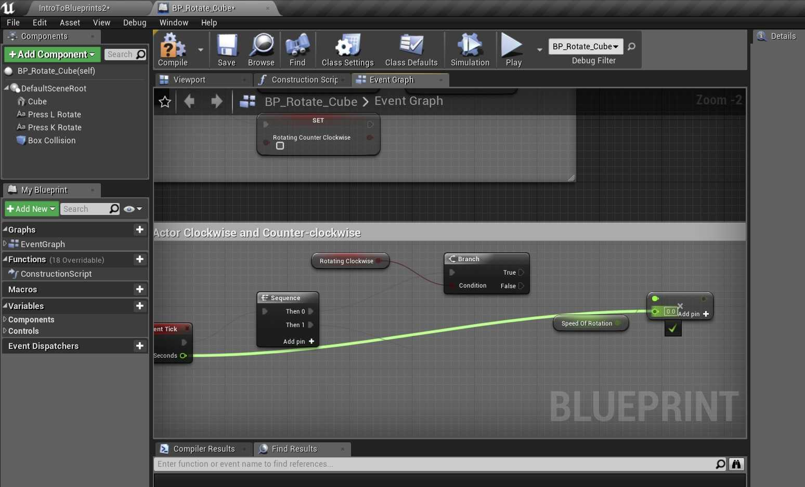

##### `Step 16.`\|`ITB`| :large_blue_diamond: :small_orange_diamond:   :small_blue_diamond: 

Then we need to add this to the existing angle. Place a **Get Current Angle Deg** node:

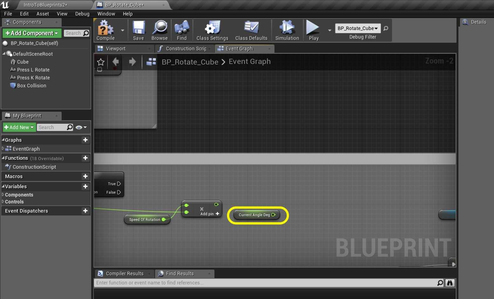

##### `Step 17.`\|`ITB`| :large_blue_diamond: :small_orange_diamond: :small_blue_diamond: :small_blue_diamond:

Then put a **Float + Float** node and add the output of the **Multiplication** node and the **Current Angle Deg** node:

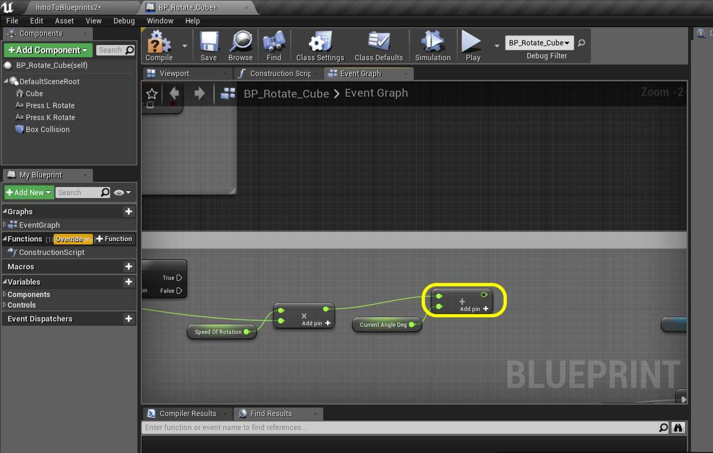

##### `Step 18.`\|`ITB`| :large_blue_diamond: :small_orange_diamond: :small_blue_diamond: :small_blue_diamond: :small_blue_diamond:

*Right click* and select a **Set Current Angle Deg** node:

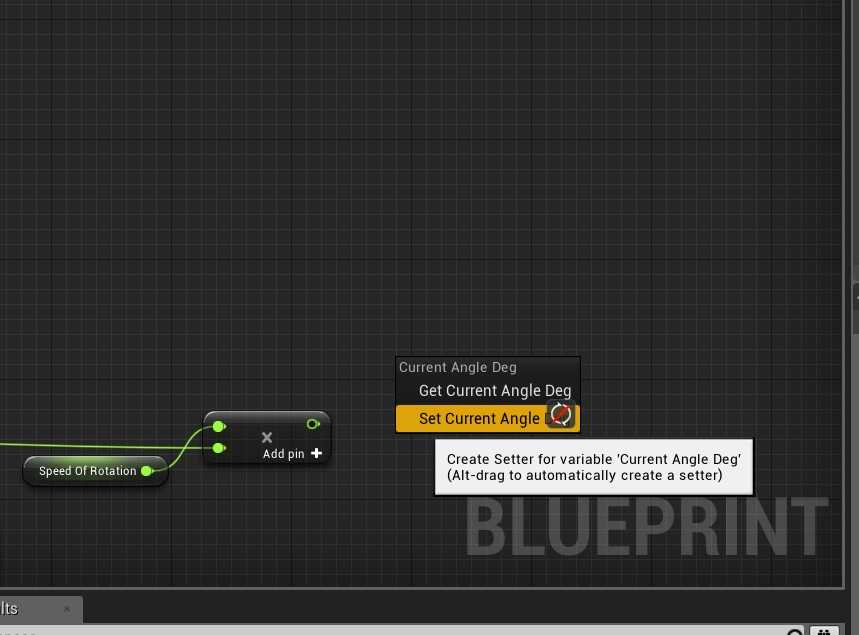

##### `Step 19.`\|`ITB`| :large_blue_diamond: :small_orange_diamond: :small_blue_diamond: :small_blue_diamond: :small_blue_diamond: :small_blue_diamond:

Pull of of the **Float + Float** output pin and add a **Set Current Angle Deg** node. Connect the execution pin of **Branch True** to the input execution pin:

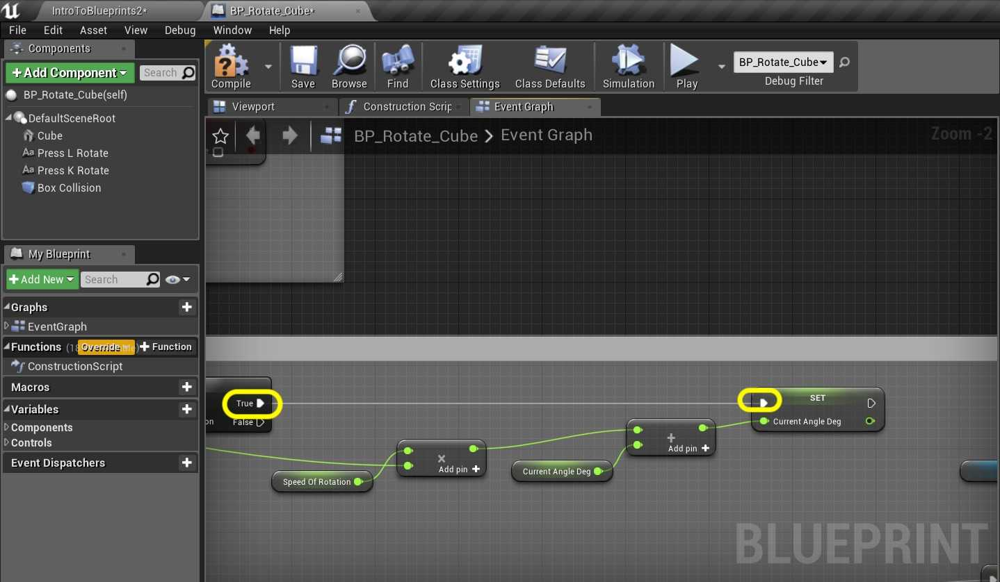

##### `Step 20.`\|`ITB`| :large_blue_diamond: :large_blue_diamond:

Now we don't want to use **Set Actor Rotation** or the entire actor which includes the text and the collision box will rotate. We just want the **Static Mesh** component mesh to rotate. *Drag* and drop a **Static Mesh** (or whatever you renamed the static mesh) node onto the graph. Pull off of the pin and select Set Relative Rotation node.

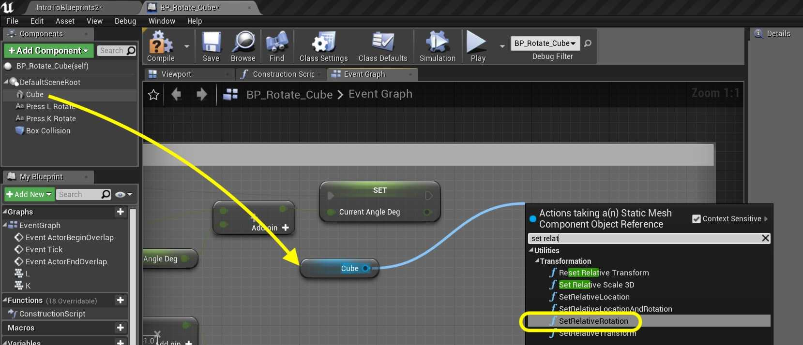

##### `Step 21.`\|`ITB`| :large_blue_diamond: :large_blue_diamond: :small_blue_diamond:

Now do not have an entire rotation on all axis. We have a float to rotate around the **Z** axis. So *right click* on the **Set Relative Rotation** node's **New Rotation** pin and *select*** Split Struct Pin**:

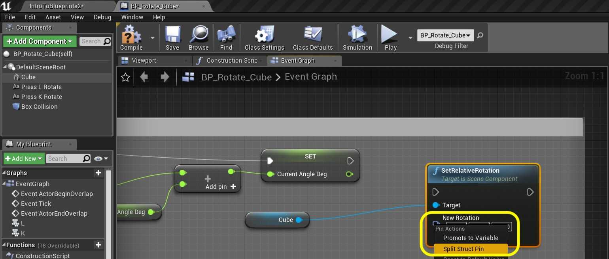

___

| [previous](../user-input/README.md#user-content-user-input)| [home](../README.md#user-content-ue4-blueprints) | [next](../user-input-iii/README.md#user-content-user-input-iii)|
|---|---|---|
