### User Input II

[previous](../user-input/README.md#user-content-user-input) • [home](../README.md#user-content-ue4-blueprints) • [next](../user-input-iii/README.md#user-content-user-input-iii)

User input continued...

 

---

##### `Step 1.`\|`ITB`|:small_blue_diamond:

Now we need to update the current angle.  Drag a **Get | CurrentAngleOfRotation** onto the graph.  Add its output with an **Addition** node to the output of the **Multiplication** node.  Send the output of the **Addition** node to a new **Set | CurrentOfRotation** node.

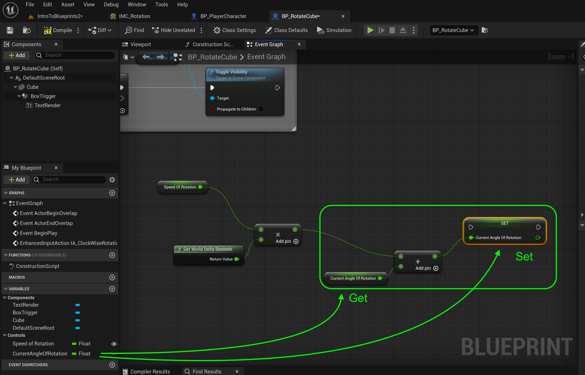

##### `Step 2.`\|`FHIU`|:small_blue_diamond: :small_blue_diamond: 

Connect the **Triggered** execution pin from the **IA_ClockwiseRotation** node to the **Set CurrentAngleOfRotation** node.  The trigger event will trigger as long as the button is pressed (essentially tick while the user pressed the **L** key).

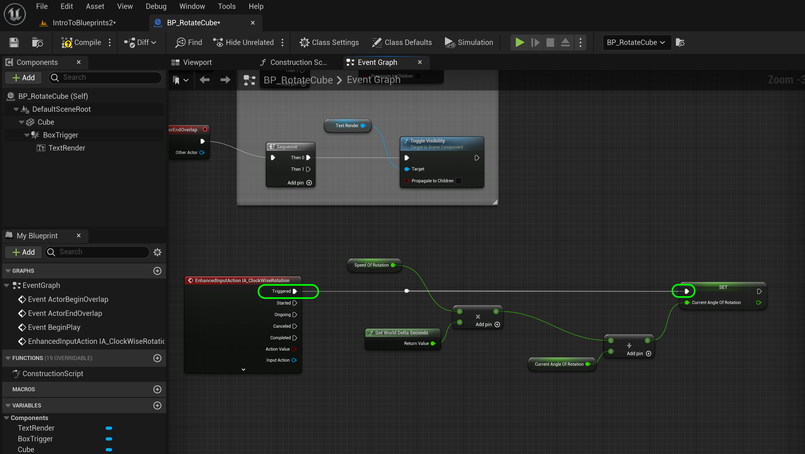

##### `Step 3.`\|`ITB`|:small_blue_diamond: :small_blue_diamond: :small_blue_diamond:

*Drag* a **Cube** component onto the graph.  Pull off of the **Cube** pin and select **Set Relative Rotation** node.  Right click on **New Rotation** and select **Split Struct Pins**. Connect the output of **Set CurrentAngleRotation** into the **Set Relative Rotation | New Rotation Z** pin as well as their respective execution pins.

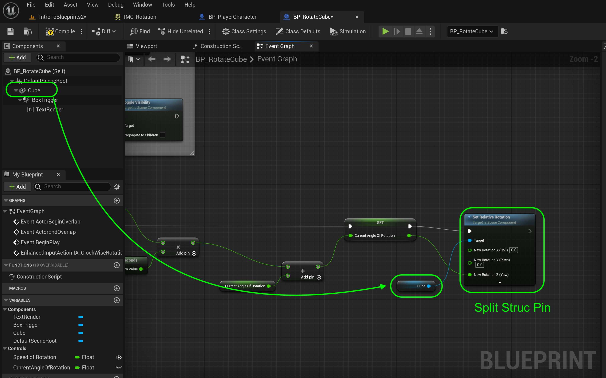

##### `Step 4.`\|`ITB`|:small_blue_diamond: :small_blue_diamond: :small_blue_diamond: :small_blue_diamond:

Press the <kbd>Play</kbd> button and press the <kbd>L</kbd> key.  Nothing happens, why is it not working?

##### `Step 5.`\|`ITB`| :small_orange_diamond:

Select the **BP_RotatingCube** in the level or in the Outliner and change the **Input | Auto Receive Input** from `disabled` to `Player0`.  Actors by default do not take in input events.  This rectifies this problem.

##### `Step 6.`\|`ITB`| :small_orange_diamond: :small_blue_diamond:

Now *run* it in game and the cube should rotate clockwise when you press the <kbd>L</kbd> key. The problem is the text rotates with it.  We want the text to stay still.

https://github.com/maubanel/UE5-Blueprints/assets/5504953/da923daa-9703-4c39-ad93-d3e4f54ccad0

##### `Step 7.`\|`ITB`| :small_orange_diamond: :small_blue_diamond: :small_blue_diamond:

Now we need to open up **BP_RotateCube** and flatten the hiearchy. Prior the **Box Trigger** and **TextRender** were under the **Cube** so they were inheriting its rotation.  Drag and drop the two child so they are all under the **Default Scene Root**. By having them at the same hiearchy, the static mesh will no longer affect the trigger volume or the text render node.

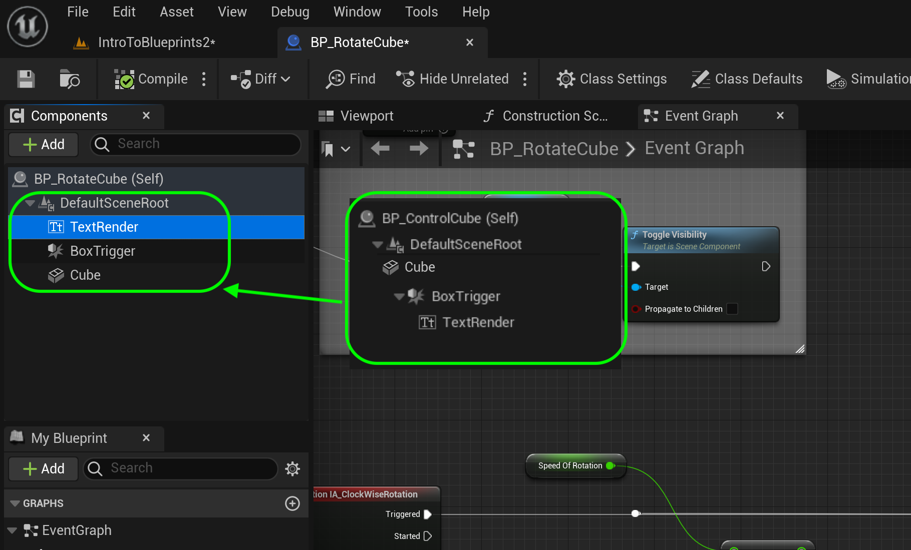

##### `Step 8.`\|`ITB`| :small_orange_diamond: :small_blue_diamond: :small_blue_diamond: :small_blue_diamond:

*Press* the <kbd>Play</kbd> button and go up and press the <kbd>L</kbd> key.  Now the cube rotates but the text stays in place.

https://user-images.githubusercontent.com/5504953/194178482-b022c172-e4fd-474a-b6c9-252ac1698e43.mp4

##### `Step 9.`\|`ITB`| :small_orange_diamond: :small_blue_diamond: :small_blue_diamond: :small_blue_diamond: :small_blue_diamond:

Go back to the blueprint and select all the nodes used to rotate and press the <kbd>C</kbd> key to add a comment box with the title `Rotate Clockwise`.

##### `Step 10.`\|`ITB`| :large_blue_diamond:

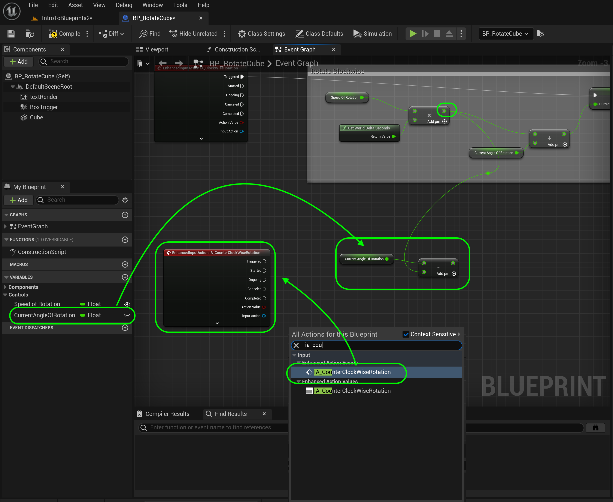

##### `Step 11.`\|`ITB`| :large_blue_diamond: :small_blue_diamond: 

Then put a **Addition** node and add the output of the **Multiplication** node and the **Current Angle Deg** node.  
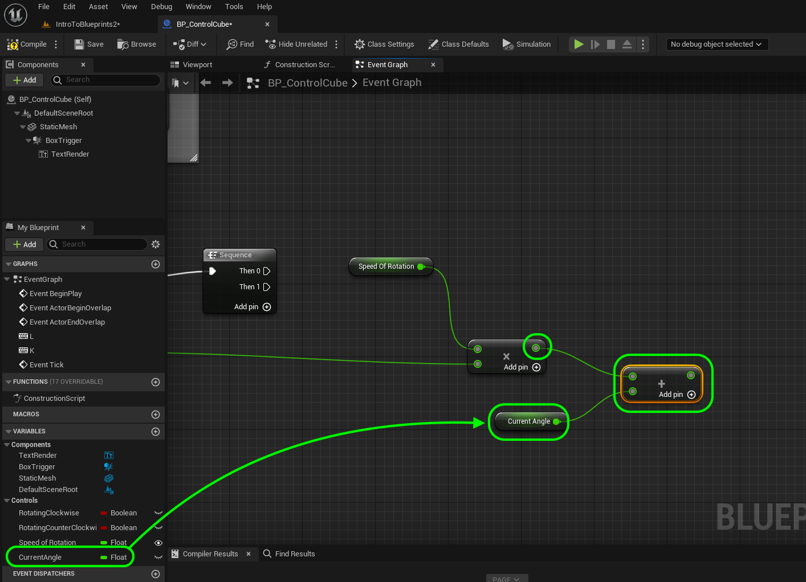

##### `Step 12.`\|`ITB`| :large_blue_diamond: :small_blue_diamond: :small_blue_diamond: 

*Right click* and select a **Set Current Angle** node. Send the output of the **Addition** node to the **Set | Current Angle** pin. Connect the execution pin of **Sequence | 0** to **Set Current Angle**.

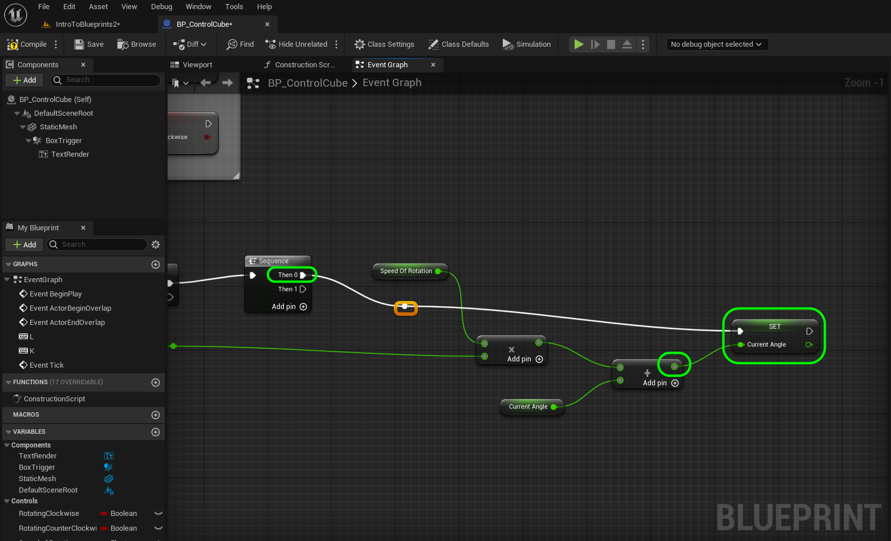

##### `Step 13.`\|`ITB`| :large_blue_diamond: :small_blue_diamond: :small_blue_diamond:  :small_blue_diamond: 

Now we don't want to use **Set Actor Rotation** or the entire actor which includes the text and the collision box will rotate. We just want the **Static Mesh** component mesh to rotate. *Drag* and drop a **Static Mesh** (or whatever you renamed the static mesh) node onto the graph. Pull off of the pin and select **Set Relative Rotation** node.

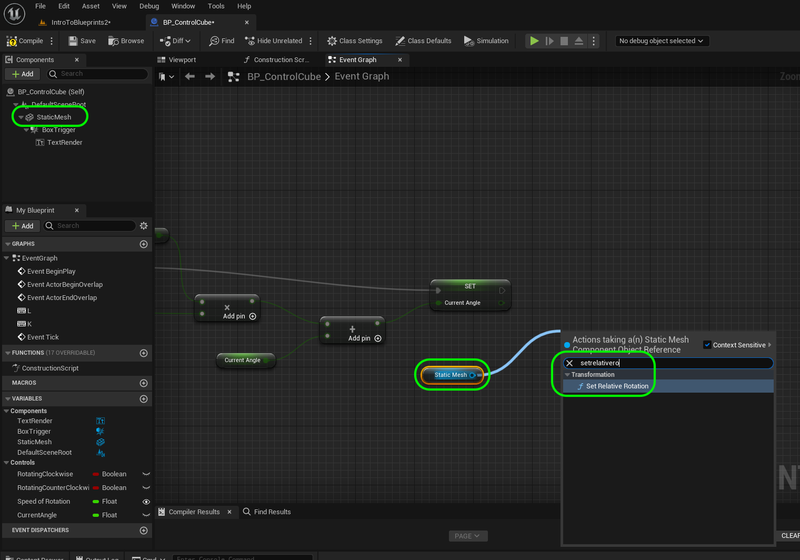

##### `Step 14.`\|`ITB`| :large_blue_diamond: :small_blue_diamond: :small_blue_diamond: :small_blue_diamond:  :small_blue_diamond: 

Now do not have an entire rotation on all axis. We have a float to rotate around the **Z** axis. So *right click* on the **Set Relative Rotation** node's **New Rotation** pin and *select* **Split Struct Pin**:

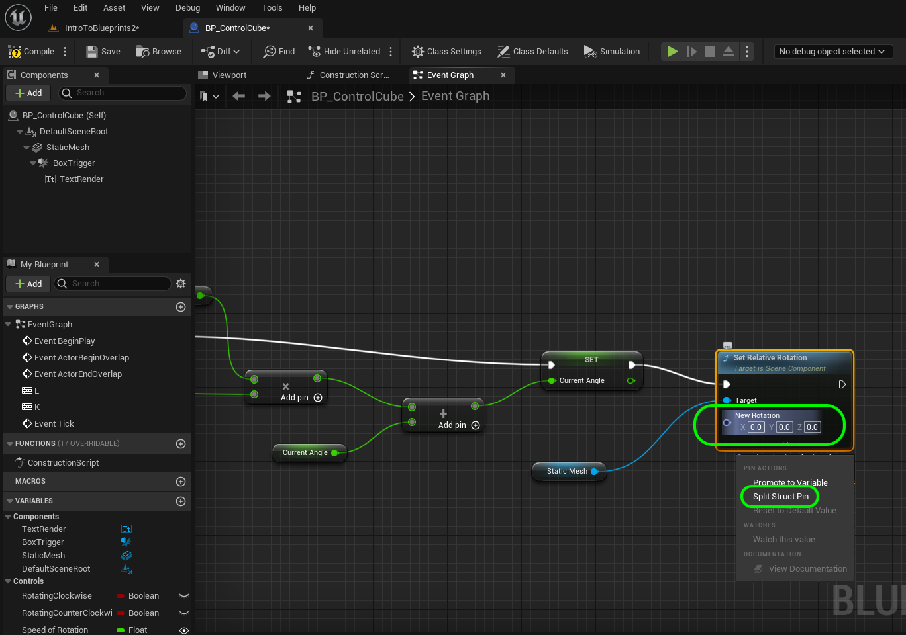

##### `Step 15.`\|`ITB`| :large_blue_diamond: :small_orange_diamond: 

Connect the output of the **Set Current Angle Deg** node to the input of the **Set Relative Rotation** node's **New Rotation Z (Yaw)** pin. Connect the execution pins. Adjust the default Speed of Rotation variable to 45.0 and press the <kbd>Compile</kbd> button. *Press* the <kbd>Compile</kbd> button.

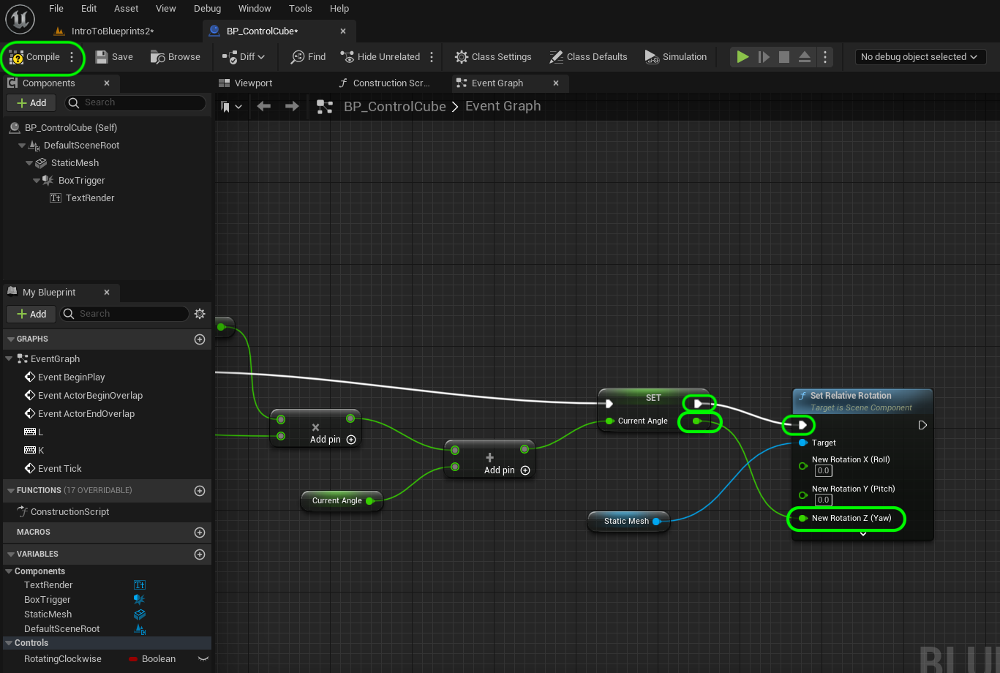

##### `Step 16.`\|`ITB`| :large_blue_diamond: :small_orange_diamond:   :small_blue_diamond: 

*Run* it in game to test if clockwise works. Run into the box and press L (or K for that matter). Hmmm nothing happens.

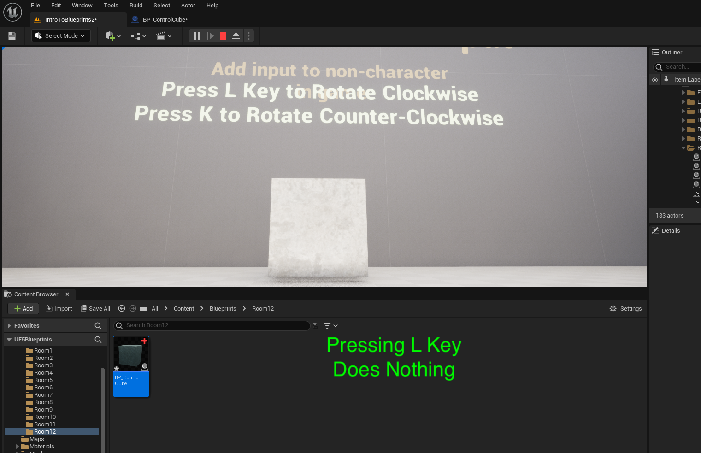

##### `Step 17.`\|`ITB`| :large_blue_diamond: :small_orange_diamond: :small_blue_diamond: :small_blue_diamond:

Now go to the game and select the **BP_RotateCube** instance in the level and change the **Auto Receive Input** to `Player 0`.

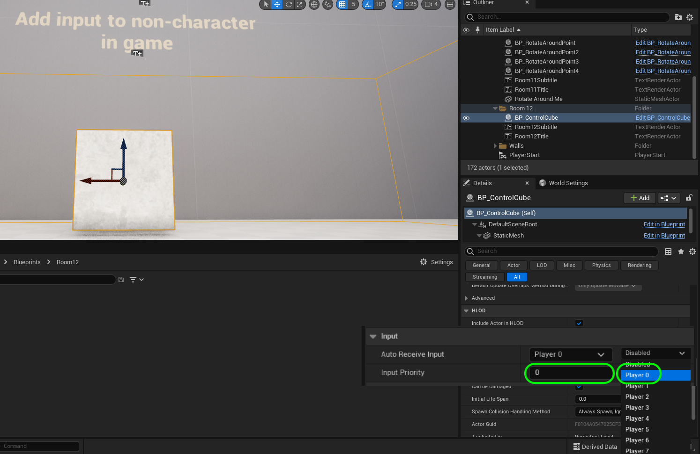

##### `Step 18.`\|`ITB`| :large_blue_diamond: :small_orange_diamond: :small_blue_diamond: :small_blue_diamond: :small_blue_diamond:

##### `Step 19.`\|`ITB`| :large_blue_diamond: :small_orange_diamond: :small_blue_diamond: :small_blue_diamond: :small_blue_diamond: :small_blue_diamond:

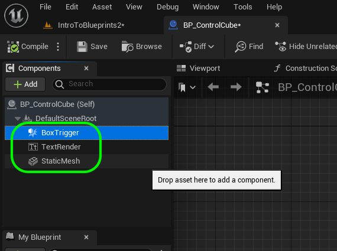

##### `Step 20.`\|`ITB`| :large_blue_diamond: :large_blue_diamond:

<!--  -->

| [previous](../user-input/README.md#user-content-user-input)| [home](../README.md#user-content-ue4-blueprints) | [next](../user-input-iii/README.md#user-content-user-input-iii)|
|---|---|---|
