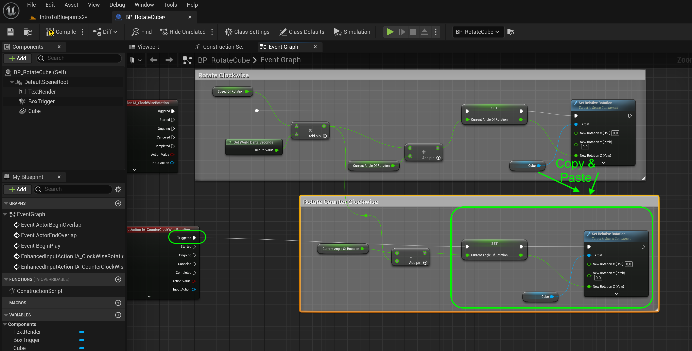

### User Input II

[previous](../user-input/README.md#user-content-user-input) • [home](../README.md#user-content-ue4-blueprints) • [next](../user-input-iii/README.md#user-content-user-input-iii)

User input continued...

 

---

##### `Step 1.`\|`ITB`|:small_blue_diamond:

Now we need to update the current angle.  Drag a **Get | CurrentAngleOfRotation** onto the graph.  Add its output with an **Addition** node to the output of the **Multiplication** node.  Send the output of the **Addition** node to a new **Set | CurrentOfRotation** node.

##### `Step 2.`\|`FHIU`|:small_blue_diamond: :small_blue_diamond: 

Connect the **Triggered** execution pin from the **IA_ClockwiseRotation** node to the **Set CurrentAngleOfRotation** node.  The trigger event will trigger as long as the button is pressed (essentially tick while the user pressed the **L** key).

##### `Step 3.`\|`ITB`|:small_blue_diamond: :small_blue_diamond: :small_blue_diamond:

*Drag* a **Cube** component onto the graph.  Pull off of the **Cube** pin and select **Set Relative Rotation** node.  Right click on **New Rotation** and select **Split Struct Pins**. Connect the output of **Set CurrentAngleRotation** into the **Set Relative Rotation | New Rotation Z** pin as well as their respective execution pins.

##### `Step 4.`\|`ITB`|:small_blue_diamond: :small_blue_diamond: :small_blue_diamond: :small_blue_diamond:

Press the <kbd>Play</kbd> button and press the <kbd>L</kbd> key.  Nothing happens, why is it not working?

##### `Step 5.`\|`ITB`| :small_orange_diamond:

Select the **BP_RotatingCube** in the level or in the Outliner and change the **Input | Auto Receive Input** from `disabled` to `Player0`.  Actors by default do not take in input events.  This rectifies this problem.

##### `Step 6.`\|`ITB`| :small_orange_diamond: :small_blue_diamond:

Now *run* it in game and the cube should rotate clockwise when you press the <kbd>L</kbd> key. The problem is the text rotates with it.  We want the text to stay still.

https://github.com/maubanel/UE5-Blueprints/assets/5504953/da923daa-9703-4c39-ad93-d3e4f54ccad0

##### `Step 7.`\|`ITB`| :small_orange_diamond: :small_blue_diamond: :small_blue_diamond:

Now we need to open up **BP_RotateCube** and flatten the hiearchy. Prior the **Box Trigger** and **TextRender** were under the **Cube** so they were inheriting its rotation.  Drag and drop the two child so they are all under the **Default Scene Root**. By having them at the same hiearchy, the static mesh will no longer affect the trigger volume or the text render node.

##### `Step 8.`\|`ITB`| :small_orange_diamond: :small_blue_diamond: :small_blue_diamond: :small_blue_diamond:

*Press* the <kbd>Play</kbd> button and go up and press the <kbd>L</kbd> key.  Now the cube rotates but the text stays in place.

https://user-images.githubusercontent.com/5504953/194178482-b022c172-e4fd-474a-b6c9-252ac1698e43.mp4

##### `Step 9.`\|`ITB`| :small_orange_diamond: :small_blue_diamond: :small_blue_diamond: :small_blue_diamond: :small_blue_diamond:

Go back to the blueprint and select all the nodes used to rotate and press the <kbd>C</kbd> key to add a comment box with the title `Rotate Clockwise`.

##### `Step 10.`\|`ITB`| :large_blue_diamond:

Lets now go in the counter clockwise direction.  Right click on the open graph and select a **IA_CounterClockwiseRotation** node. Drag a **Get | Current Angle of Rotation** node.  Now instead of adding to our current angle we will subtract.  Add a **Subtraction** ndoe and connect the **Current Angle of Rotation** to the top of the **Subtracdtion** pin.  Grab the output of the **Multiplication** node in the **Clockwise Nodes** to the bottom 0f the **Subtraction pin**.

##### `Step 11.`\|`ITB`| :large_blue_diamond: :small_blue_diamond: 

Add a **Set | Current Angle of Rotation** node and connect the output of the **Subtraction** poin to the **Current Angle of Rotation** pin.  Connect the **IA_CounterClockwiseRotation | Triggered** execution pin to the **Set | Current Angle of Rotation** pin. Copy an dpaster the **Cube** and **Set Rotation Node** from the clockwise nodes and connect th eoutput of the **Set | Current Angle of Rotation** pin to the
**Set Relative Rotation | New Rotation Z** pin. Add a comment box around all these nodes that says `Rotate Counter Clockwise`.

##### `Step 12.`\|`ITB`| :large_blue_diamond: :small_blue_diamond: :small_blue_diamond: 

*Run* the game and test it. Now it works OK as the <kbd>L</kbd> and <kbd>K</kbd> button both work. That is all for adding controls to an actor in Unreal!

##### `Step 13.`\|`ITB`| :large_blue_diamond: :small_blue_diamond: :small_blue_diamond:  :small_blue_diamond: 

Select the **File | Save All** then press the <kbd>Revision Control</kbd> button and select **Submit Content**.  If you are prompted, select **Check Out** for all items that are not checked out of source control. Update the **Changelist Description** message and with the latest changes. Make sure all the files are correct and press the <kbd>Submit</kbd> button. A confirmation will pop up on the bottom right with a message about a changelist was submitted with a commit number. Quit Unreal and make sure your **Pending** tab in **P4V** is empty. **Submit** any work that is still in the editor.

##### `Step 14.`\|`ITB`| :large_blue_diamond: :small_blue_diamond: :small_blue_diamond: :small_blue_diamond:  :small_blue_diamond: 

Sometimes not all files get submitted to Unreal especially for files that don't show up in the editor.  It is good practice one you submit in **Unreal** and quit the game to right click on the top most project folder and select **Reconcile Offline Work...**.

This will either give a message saying ther is nothing to reconcile or bring up a tab.  Make sure that these are **NOT** files in the **Intermediate** and **Saved** folders as these should be ignored from the `.p4ignore`.

If the files are in **Content** or **Configuration** then press the <kbd>Reconcile</kbd> button.  Then submit the changes with a message and press the <kbd>Submit</kbd> button.

 

<!--  -->

| [previous](../user-input/README.md#user-content-user-input)| [home](../README.md#user-content-ue4-blueprints) | [next](../user-input-iii/README.md#user-content-user-input-iii)|
|---|---|---|
