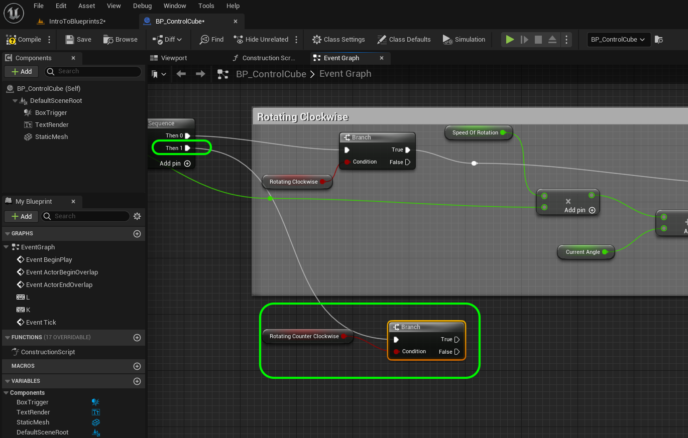
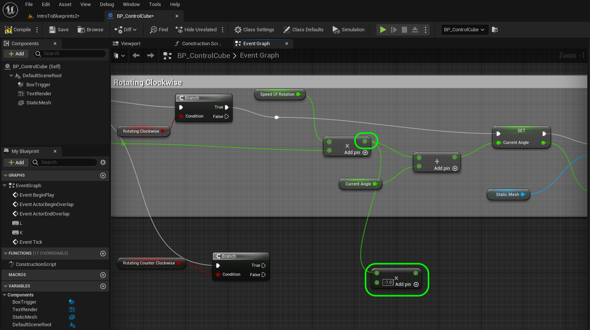
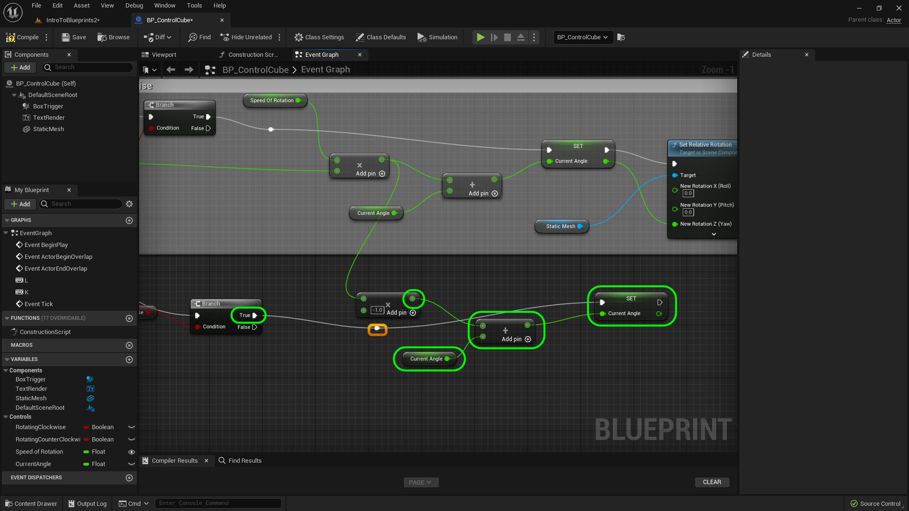
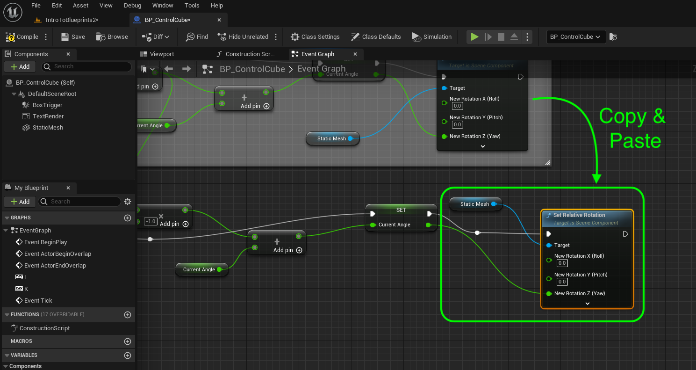
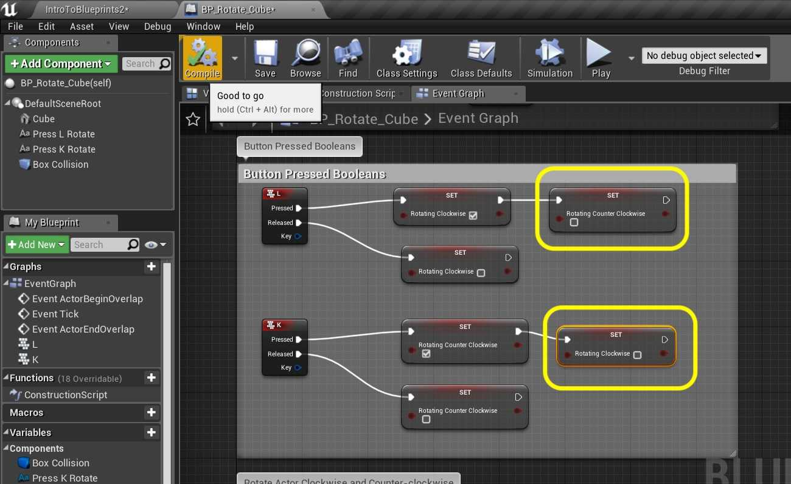
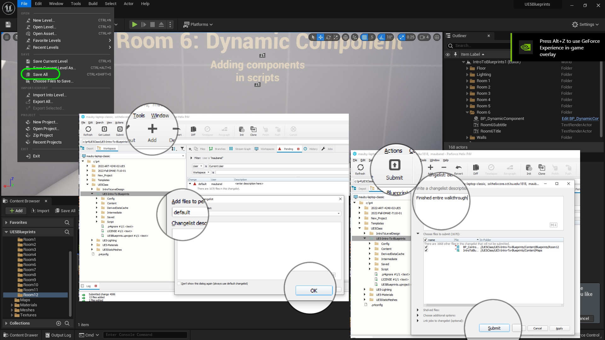

### User Input III

[previous](../user-input-ii/README.md#user-content-user-input-ii) • [home](../README.md#user-content-ue4-blueprints)

User input continued...

 

---

##### `Step 1.`\|`ITB`|:small_blue_diamond:

Lets add counter clockwise movement. Now we need to add two nodes a **Get Rotating Counter Clockwise** and **Branch** . This checks to see if the counter clockwise <kbd>K</kbd> button is pressed. Connect the execution pin from **Sequence | Then1** to the **Branch** node.  Connect the **RotatingCounterClockwise** pin to the **Branch | Condition** pin. 

##### `Step 2.`\|`FHIU`|:small_blue_diamond: :small_blue_diamond: 

Now the only difference for counter clockwise movement is that the rotation is negative. So *highjack* the output of the **Multiplication** output and add a **Multiplication** node beneath. Set the number you multiply this by to `-1` that will reverse the direction.

##### `Step 3.`\|`ITB`|:small_blue_diamond: :small_blue_diamond: :small_blue_diamond:

*Copy and paste* the Get **Current Angle Deg**, **Addition** and **Set Current Angle Deg** nodes and paste below. *Connect* the output of the **Multiplication** by -1 node to the input of the **+** node. *Connect* the **Execution** pin of the **Branch | True** node to the execution pin of the **Set Current Angle Deg** node.

##### `Step 4.`\|`ITB`|:small_blue_diamond: :small_blue_diamond: :small_blue_diamond: :small_blue_diamond:

Copy and paste the **Set Relative Rotation** and **Static Mesh** nodes and *connect* the output of the second **Set** node to the **New Rotation Z (Yaw)** pin of this node. *Press* the <kbd>Compile</kbd> button.

##### `Step 5.`\|`ITB`| :small_orange_diamond:

*Run* the game and test it. Now it works OK as the <kbd>L</kbd> and <kbd>K</kbd> button both work. But there is a design flaw. What I press the L button while pressing the K button without releasing it. Now two booleans are true and they cancel each other out. I want to cancel the other rotation as soon as a new one is detected.

https://user-images.githubusercontent.com/5504953/194180219-415c37d7-7225-4e02-bb7b-6381cb57a016.mp4

##### `Step 6.`\|`ITB`| :small_orange_diamond: :small_blue_diamond:

So in the Button Events add a **Set Rotating Counter Clockwise** to `false` after the <kbd>L</kbd> button is pressed and a **Set Rotating Clockwise** to `false` when the <kbd>K</kbd> button is pressed. *Press* the <kbd>Compile</kbd> button.

##### `Step 7.`\|`ITB`| :small_orange_diamond: :small_blue_diamond: :small_blue_diamond:

Now *run* the game and walk into the collision volume. This should finish up this room.

##### `Step 8.`\|`ITB`| :small_orange_diamond: :small_blue_diamond: :small_blue_diamond: :small_blue_diamond:

Select the **File | Save All** then quit UE5.   Go to **P4V** and go the top project folder (the one that holds the `.uproject` file and **Content** folder) and press the <kbd>+Add</kbd> then <kbd>OK</kbd> button.  This makes sure any files that Unreal didn't add get added to source control. Press the <kbd>Submit</kbd> button and enter a message explaining the work done.  Press <kbd>Submit</kbd>.

| `intro.blueprints`\|`THE END`| 
| :--- |
| **That's All Folks!** Thanks for sticking around. That's it for this lesson. |

<!--  -->

| [previous](../user-input-ii/README.md#user-content-user-input-ii)| [home](../README.md#user-content-ue4-blueprints) |
|---|---|
