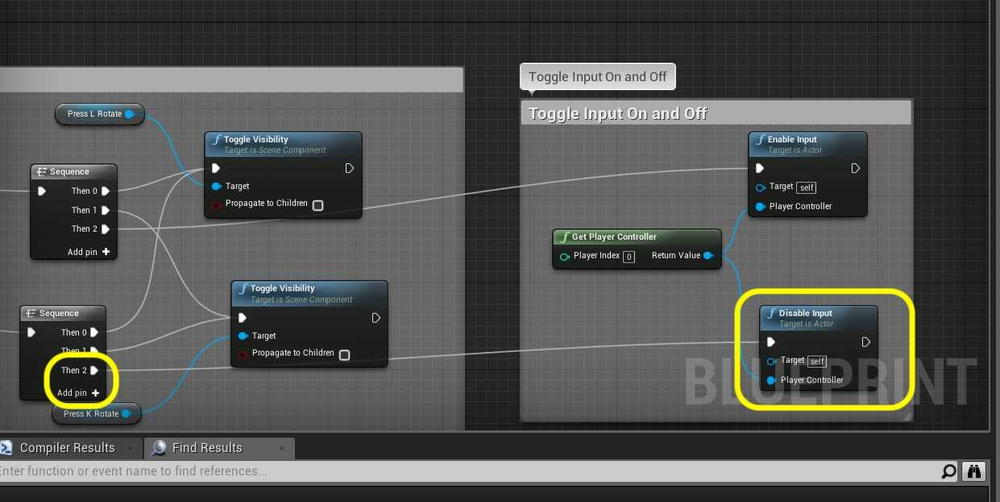

### User Input III

[previous](../user-input-ii/README.md#user-content-user-input-ii) • [home](../README.md#user-content-ue4-blueprints)

User input continued...

 

---

##### `Step 1.`\|`ITB`|:small_blue_diamond:

Connect the output of the **Set Current Angle Deg** node to the input of the **Set Relative Rotation** node's **New Rotation Z (Yaw)** pin:

##### `Step 2.`\|`FHIU`|:small_blue_diamond: :small_blue_diamond: 

Connect the execution pins.

##### `Step 3.`\|`ITB`|:small_blue_diamond: :small_blue_diamond: :small_blue_diamond:

Adjust the default Speed of Rotation variable to 45.0 and press the <kbd>Compile</kbd> button.

##### `Step 4.`\|`ITB`|:small_blue_diamond: :small_blue_diamond: :small_blue_diamond: :small_blue_diamond:

*Run* it in game to test if clockwise works. Run into the box and press L (or K for that matter). Hmmm nothing happens.

##### `Step 5.`\|`ITB`| :small_orange_diamond:

Now for an actor to read player controls (something normally reserved for a **Pawn** or **Character** blueprint we need to tell the game engine to add that ability to the actor). We also want it to not work when we are not in the collision volume. To the right of the two **Toggle Visibility** nodes *add* a **Get Player Controller** node.

##### `Step 6.`\|`ITB`| :small_orange_diamond: :small_blue_diamond:

This is a class that we have not customized but default is used in the game (you will see it in the **World Outliner** when running the game). Since this simulation of for a single player controller we will leave **Player Index** at `0`. If this was a multiplayer game we woudl have to indicate which player this action was associated with. Drag off of the **Return Value** pin and select an **Enable Input** node:

##### `Step 7.`\|`ITB`| :small_orange_diamond: :small_blue_diamond: :small_blue_diamond:

Now we don't want to pull off of the **Toggle Visibility** execution pins as this gets called every time and handles toggling on and off. This is an enable node and doesn't toggle. So go back to the **Sequence** node and *press* **Add pin** then take the Then 2 execution pin and attach it to the input execution of the Enable Input node. Add a comment to this new portion `Toggle Input On and Off`.

##### `Step 8.`\|`ITB`| :small_orange_diamond: :small_blue_diamond: :small_blue_diamond: :small_blue_diamond:

Repeat this process for an added Disable Input node for when the player leaves the collision volume:

##### `Step 9.`\|`ITB`| :small_orange_diamond: :small_blue_diamond: :small_blue_diamond: :small_blue_diamond: :small_blue_diamond:

Now go to the game and select the **BP_RotateCube** instance in the level and change the **Auto Receive Input** to `Player 0`.

##### `Step 10.`\|`ITB`| :large_blue_diamond:

Now *run* it in game and the cube should rotate clockwise when you press the <kbd>L</kbd> key.

##### `Step 11.`\|`ITB`| :large_blue_diamond: :small_blue_diamond: 

Lets add counter clockwise movement. Now we need to add two nodes a **Get Rotating Counter Clockwise** and **Branch** . This checks to see if the counter clockwise <kbd>K</kbd> button is pressed.

##### `Step 12.`\|`ITB`| :large_blue_diamond: :small_blue_diamond: :small_blue_diamond: 

##### `Step 13.`\|`ITB`| :large_blue_diamond: :small_blue_diamond: :small_blue_diamond:  :small_blue_diamond: 

##### `Step 14.`\|`ITB`| :large_blue_diamond: :small_blue_diamond: :small_blue_diamond: :small_blue_diamond:  :small_blue_diamond: 

##### `Step 15.`\|`ITB`| :large_blue_diamond: :small_orange_diamond: 

##### `Step 16.`\|`ITB`| :large_blue_diamond: :small_orange_diamond:   :small_blue_diamond: 

##### `Step 17.`\|`ITB`| :large_blue_diamond: :small_orange_diamond: :small_blue_diamond: :small_blue_diamond:

##### `Step 18.`\|`ITB`| :large_blue_diamond: :small_orange_diamond: :small_blue_diamond: :small_blue_diamond: :small_blue_diamond:

##### `Step 19.`\|`ITB`| :large_blue_diamond: :small_orange_diamond: :small_blue_diamond: :small_blue_diamond: :small_blue_diamond: :small_blue_diamond:

##### `Step 20.`\|`ITB`| :large_blue_diamond: :large_blue_diamond:

##### `Step 21.`\|`ITB`| :large_blue_diamond: :large_blue_diamond: :small_blue_diamond:

___

| [previous](../user-input-ii/README.md#user-content-user-input-ii)| [home](../README.md#user-content-ue4-blueprints) |
|---|---|
