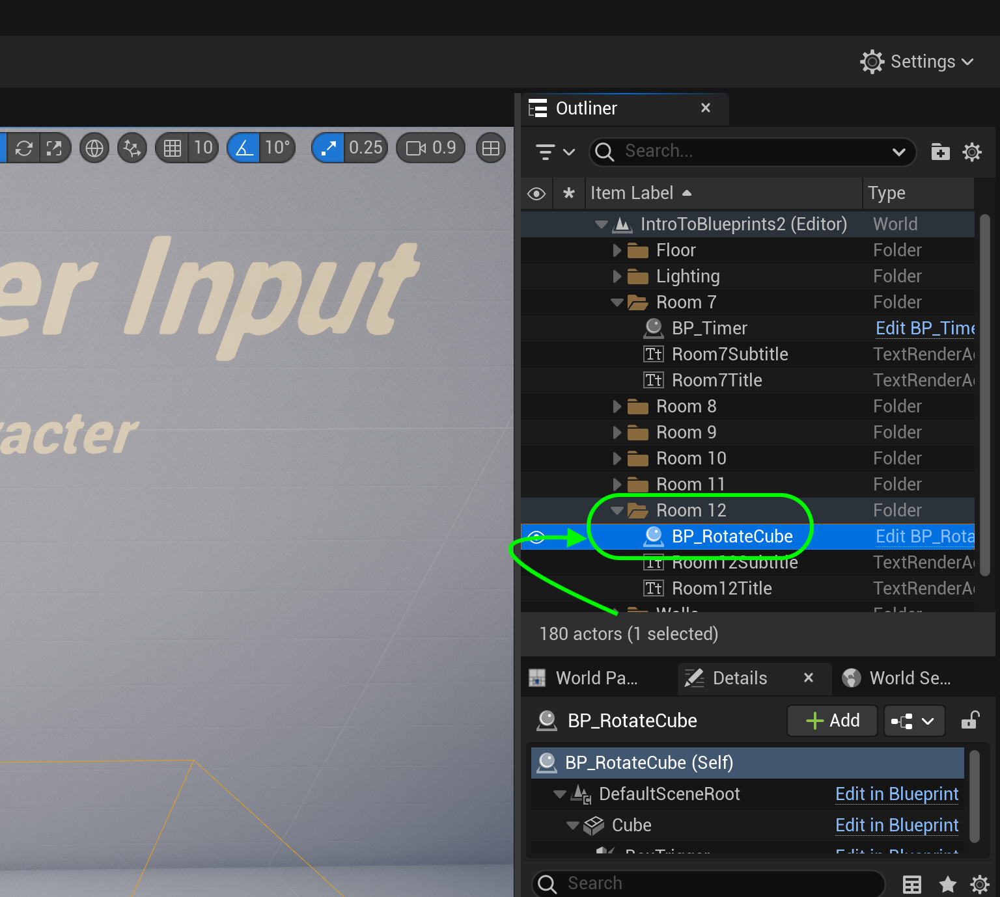
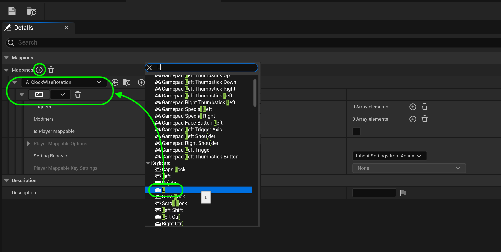
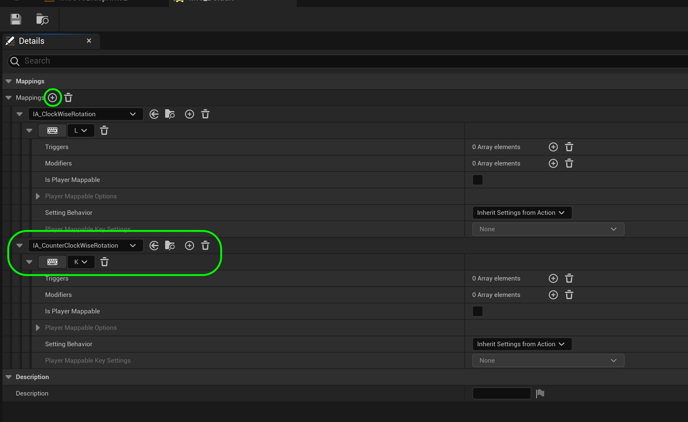
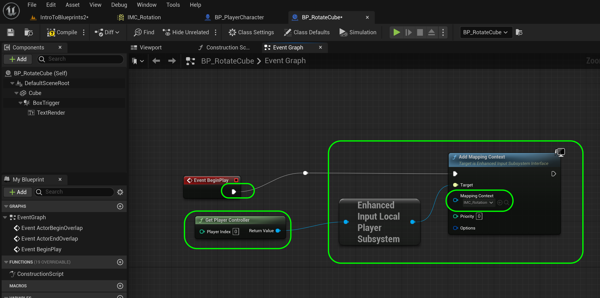
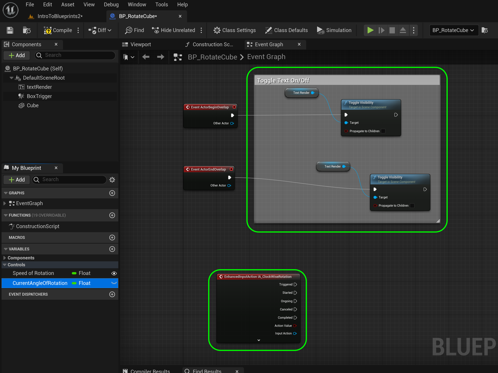
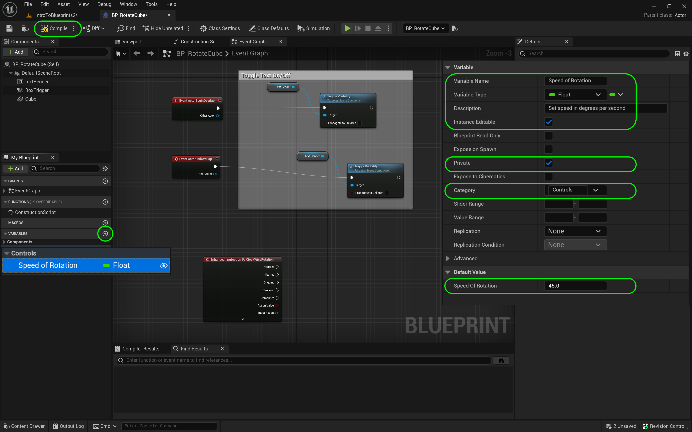
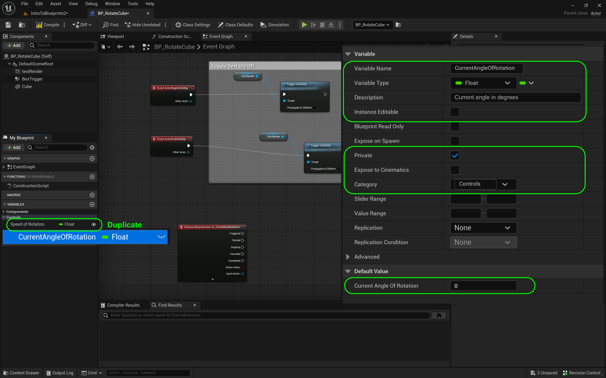
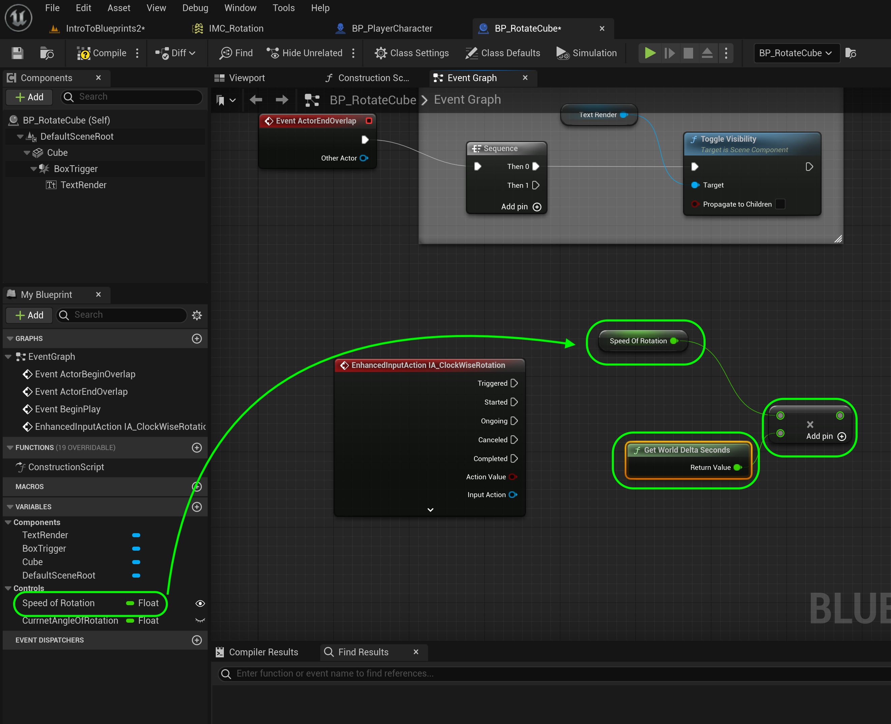

### User Input

[previous](../orbiting-actors-iv/README.md#user-content-orbiting-actors-iv) • [home](../README.md#user-content-ue4-blueprints) • [next](../)

Lets add user input to a basic **Actor** class. We will be using the **L** and **K** button to rotate a cube.

 

---

##### `Step 1.`\|`ITB`|:small_blue_diamond:

*Add* a new **Blueprints | Room12** folder. *Create* a new **Blueprint Class** of base **Actor**. Call it `BP_RotateCube.`

##### `Step 2.`\|`FHIU`|:small_blue_diamond: :small_blue_diamond: 

Add a **Static Mesh** component to the blueprint. Call it `Cube`. Assign the **Static Mesh** `Cube` (you need to turn on **Engine Assets**) and **Material** `M_Metal_Burnished_Steel`.

##### `Step 3.`\|`ITB`|:small_blue_diamond: :small_blue_diamond: :small_blue_diamond:

*Add* a **Box Collision** *Component* and make the **Box Extent** `700.0`, `700.0`, `200.0`. *Move* the collider in behind the box.

##### `Step 4.`\|`ITB`|:small_blue_diamond: :small_blue_diamond: :small_blue_diamond: :small_blue_diamond:

Add **BP_Rotate_Cube** to the **Room 12** and center it. Move the **Player Start** in front of the box.

##### `Step 5.`\|`ITB`| :small_orange_diamond:

For housekeeping move this game object into the **Room 12** folder:

##### `Step 6.`\|`ITB`| :small_orange_diamond: :small_blue_diamond:

*Add* a **Text Renderer** component to the blueprint. Change the **Text** to `Press L Key to Rotate Clockwise`. I had to rotate the component by `180` degrees on the **Z** axis to face forward. *Change* **Horizontal Alignment** to `Center` and **Vertical Aligneent** to `Text Center`. *Adjust* the **Text Render Color** to contrast with the background. *Select* a larger font size as well, I set mine to `72`. Move text above cube.

##### `Step 7.`\|`ITB`| :small_orange_diamond: :small_blue_diamond: :small_blue_diamond:

Go to the **Text Render** Component and alter the **Text** to `Press L Key to Rotate Clockwise Press K Key to Rotate Counter Clockwise`. Adjust the location of the text.  Remember the ` ` is html for new line that works as a carriage return here.

##### `Step 8.`\|`ITB`| :small_orange_diamond: :small_blue_diamond: :small_blue_diamond: :small_blue_diamond:

Go to the game and hit **run**. Look and see if you are happy with the position. Make any size adjustments you need to. 

##### `Step 9.`\|`ITB`| :small_orange_diamond: :small_blue_diamond: :small_blue_diamond: :small_blue_diamond: :small_blue_diamond:

Go to the **Event Graph** *drag* a copy of the **Text Render** component to the right of the **Event Actor Begin Overlap**. Pull off of the **Text Render** pin and select a **Toggle Visibility (Text Render)** node. Connect the execution pin from the **Event Actor Begin Overlap** to the **Toggle Visibility (Text Render)** pin.

##### `Step 10.`\|`ITB`| :large_blue_diamond:

*Right click* on the empty graph and select the **Event Actor End Overlap** node. *Copy & paste* the **Text Render** and **Toggle Visibility** nodes.  Connect the execution pin from the **Event Actor End Overlap** node to the copied **Toggle Visibility** node.

##### `Step 11.`\|`ITB`| :large_blue_diamond: :small_blue_diamond: 

*Run* the game and walk into the collision volume. You will see that the algorithm is backwards. When you are inside the volume the text is off and on when you are outside the volume.

https://user-images.githubusercontent.com/5504953/194055388-0d374746-5051-4092-9387-3a6f0bb89da1.mp4

##### `Step 12.`\|`ITB`| :large_blue_diamond: :small_blue_diamond: :small_blue_diamond: 

Just ensure that visibility is off when we start open the blueprint and make sure that **Visibility** is `False` on the **Text Render** component.  Run the game and confirm that the text is now turning on when you enter the volume.

https://user-images.githubusercontent.com/5504953/194058110-5654d6d0-f835-4d8c-aa5a-6a1df2fb989f.mp4

##### `Step 13.`\|`ITB`| :large_blue_diamond: :small_blue_diamond: :small_blue_diamond:  :small_blue_diamond: 

Now we need to add some controls to rotate the cube.  Go to **Content | Room 12** and add two **Input | Input Action** nodes with the names `IA_ClockwiseRotation` and `IA_CounterCLockwiseRotation`. These can stay in their default settings as a boolean button (on/off).

##### `Step 14.`\|`ITB`| :large_blue_diamond: :small_blue_diamond: :small_blue_diamond: :small_blue_diamond:  :small_blue_diamond: 

We need a mapping context for these controls.  Go back to **Content | Room 12** and add a **Input | Input Mapping Context** and call it `IMC_Rotation`.

##### `Step 15.`\|`ITB`| :large_blue_diamond: :small_orange_diamond: 

Open up **IMC_Rotation** and press the <kbd>+</kbd> button next to **Mappings** and select `IA_ClockwiseRotation` then assign the <kbd>L<kbd> key to the event.

##### `Step 16.`\|`ITB`| :large_blue_diamond: :small_orange_diamond:   :small_blue_diamond: 

Repeat this for the counter clockwise direction. Press the <kbd>+</kbd> button next to **Mappings** and select `IA_CounterClockwiseRotation` then assign the <kbd>K<kbd> key to the event.

##### `Step 17.`\|`ITB`| :large_blue_diamond: :small_orange_diamond: :small_blue_diamond: :small_blue_diamond:

Now we need to initialize this new control system.  Open up **BP_RotateCube** and after begin play add a **Get Player Controller** node.  Pull off the pin and select a **Enhanced Input Local Player Subsystem** node.  Pull off of this pin and select a **Add Mapping Context** node.  Change the **Mapping Content** to `IMC_Rotation`.  Connect the **BeginPlay** execution pin to the **Add Mapping Content**.

##### `Step 18.`\|`ITB`| :large_blue_diamond: :small_orange_diamond: :small_blue_diamond: :small_blue_diamond: :small_blue_diamond:

Add a comment box around the overlay triggers and title it `Toggle Text On/Off`.  Now lets get an event that is called when the **L** key is pressed. *Right click* on the open graph and look for **EnhancedInputAction IA_ClockwiseRotation** event node.

##### `Step 19.`\|`ITB`| :large_blue_diamond: :small_orange_diamond: :small_blue_diamond: :small_blue_diamond: :small_blue_diamond: :small_blue_diamond:

We need a variable to adjust the speed of the rotation. *Add* a new variable called `Speed of Rotation` of Type **Float** and make it **Instance Editable** and **Private**. Set the Category to `Controls`. Set the Tooltip to `Set speed in degrees per second`.

*Press* the <kbd>Compile</kbd> button.

Set the **Default Value** to `45.0`.

##### `Step 20.`\|`ITB`| :large_blue_diamond: :large_blue_diamond:

We also need a variable to store the current angle of rotation. Right click on **Speed of Rotation** and select **Duplicate**.  Call the dupe `CurrentAngleOfRotation` of **Type Float** and leave it **Private** and turn **Instance Editable** to `false`. Leave the **Category** at `Controls`. Set the **Tooltip** to `current angle in degrees`.

##### `Step 21.`\|`ITB`| :large_blue_diamond: :large_blue_diamond: :small_blue_diamond:

*Drag* a **Speed of Rotation** variable and *add* a **Multiplication** node. Take the output to the **Speed of Rotation** node and attach it to the top multiplication pin. Connect the output **Delta Seconds** from the **Event Tick** to the other end of the **Multiplication** node. This gives us the speed for this one frame.

<!--  -->

| [previous](../orbiting-actors-iv/README.md#user-content-orbiting-actors-iv)| [home](../README.md#user-content-ue4-blueprints) | [next](../user-input-ii/README.md#user-content-user-input-ii)|
|---|---|---|
