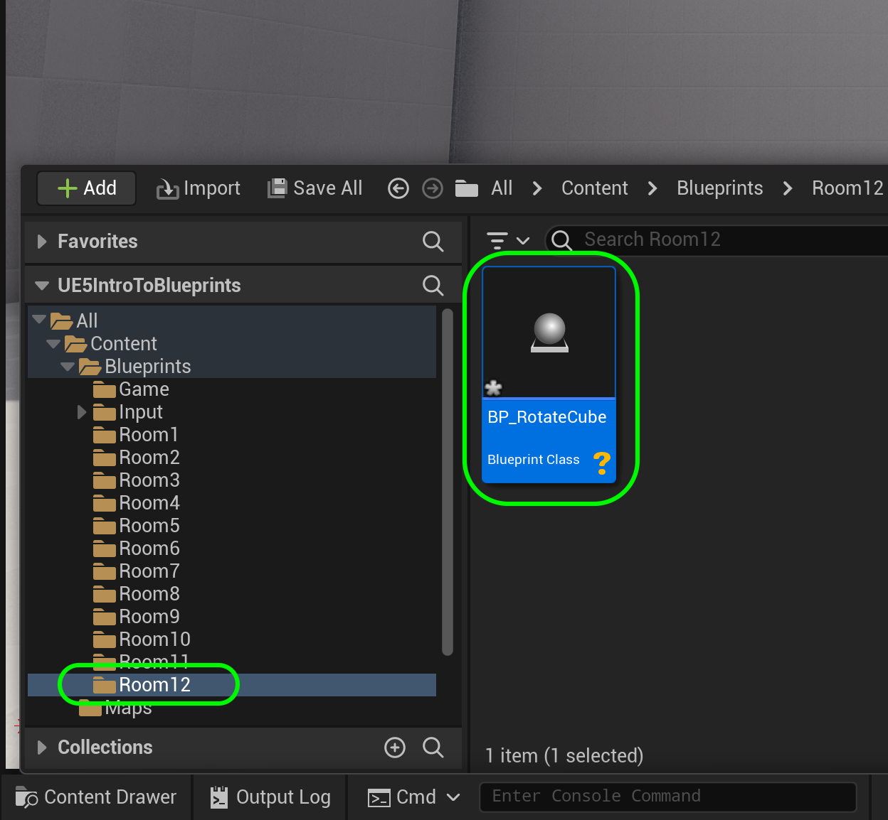
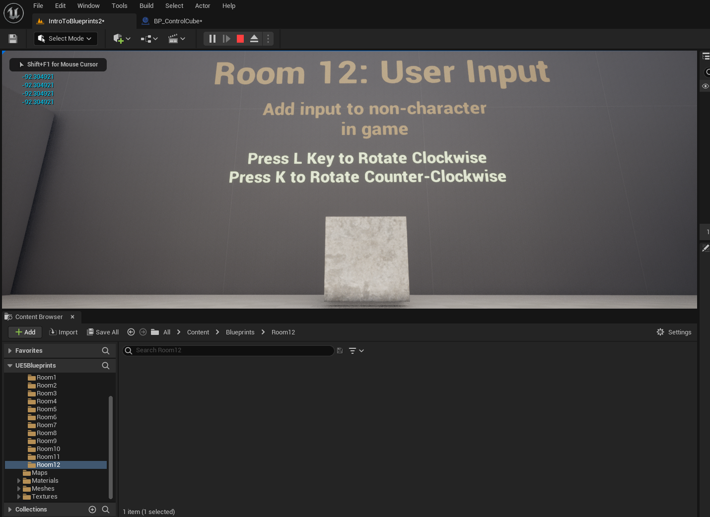
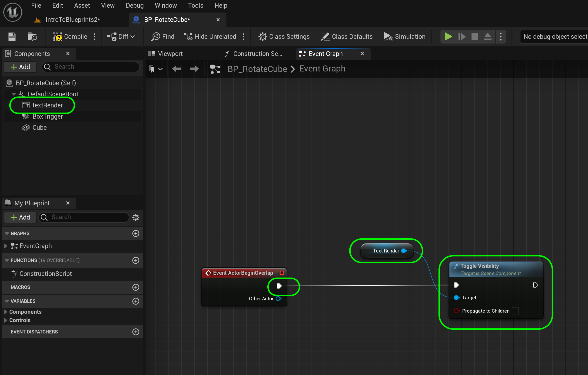
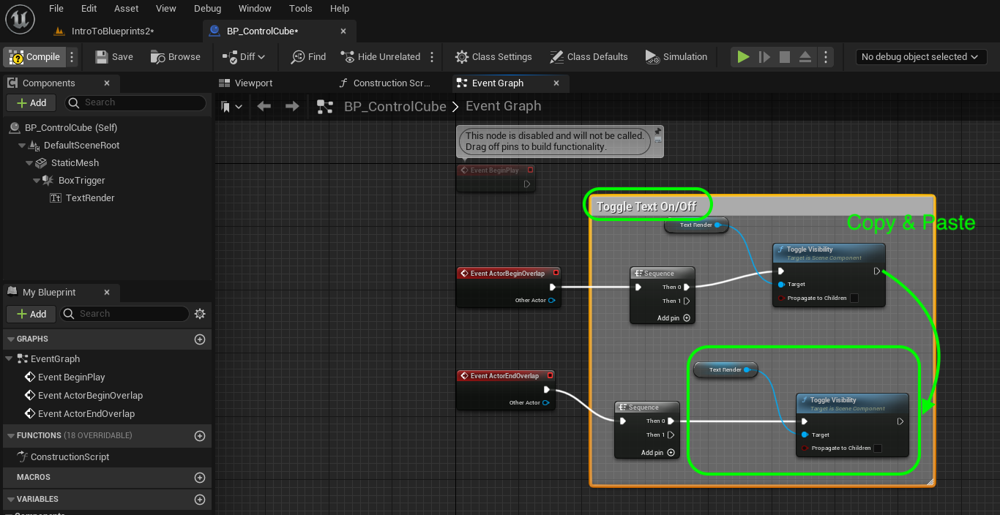
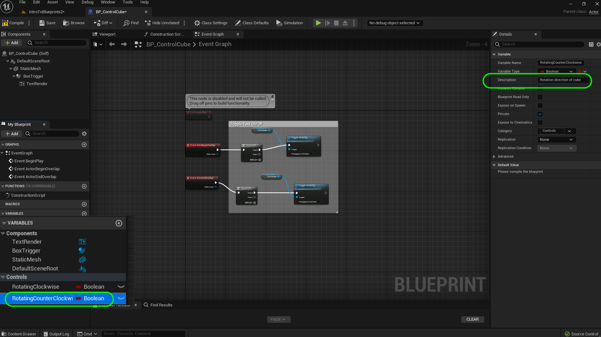
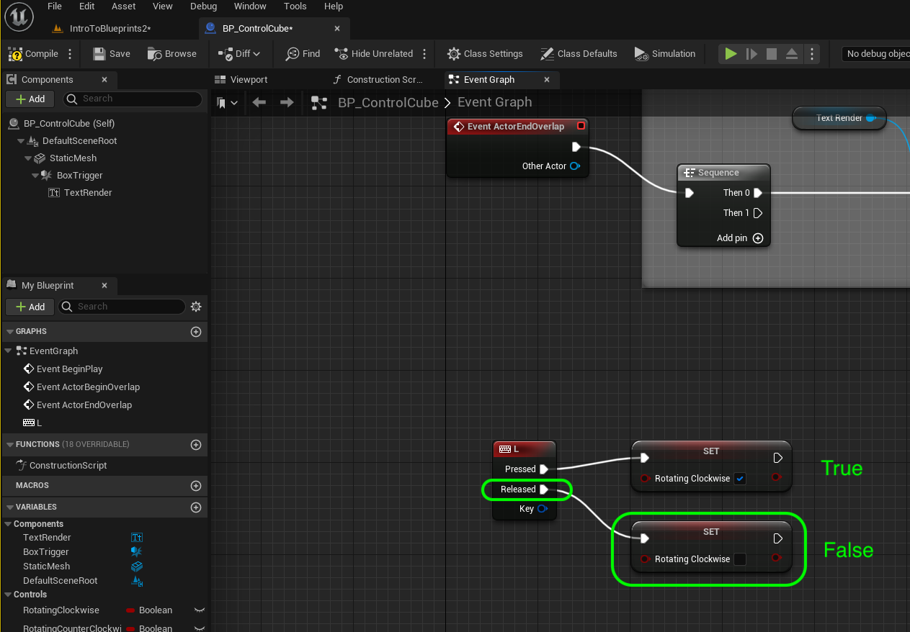

### User Input

[previous](../orbiting-actors-iv/README.md#user-content-orbiting-actors-iv) • [home](../README.md#user-content-ue4-blueprints) • [next](../)

Lets add user input to a basic **Actor** class. We will be using the **L** and **K** button to rotate a cube.

 

---

##### `Step 1.`\|`ITB`|:small_blue_diamond:

*Add* a new **Blueprints | Room12** folder. *Create* a new **Blueprint Class** of base **Actor**. Call it `BP_RotateCube.`

##### `Step 2.`\|`FHIU`|:small_blue_diamond: :small_blue_diamond: 

Add a **Static Mesh** component to the blueprint. Call it `Cube`. Assign the **Static Mesh** `Cube` (you need to turn on **Engine Assets**) and **Material** `M_Metal_Burnished_Steel`.

##### `Step 3.`\|`ITB`|:small_blue_diamond: :small_blue_diamond: :small_blue_diamond:

*Add* a **Box Collision** *Component* and make the **Box Extent** `700.0`, `700.0`, `200.0`. *Move* the collider in behind the box.

##### `Step 4.`\|`ITB`|:small_blue_diamond: :small_blue_diamond: :small_blue_diamond: :small_blue_diamond:

Add **BP_Rotate_Cube** to the **Room 12** and center it. Move the **Player Start** in front of the box.

##### `Step 5.`\|`ITB`| :small_orange_diamond:

For housekeeping move this game object into the **Room 12** folder:

##### `Step 6.`\|`ITB`| :small_orange_diamond: :small_blue_diamond:

*Add* a **Text Renderer** component to the blueprint. Change the **Text** to `Press L Key to Rotate Clockwise`. I had to rotate the component by `180` degrees on the **Z** axis to face forward. *Change* **Horizontal Alignment** to `Center` and **Vertical Aligneent** to `Text Center`. *Adjust* the **Text Render Color** to contrast with the background. *Select* a larger font size as well, I set mine to `72`. Move text above cube.

##### `Step 7.`\|`ITB`| :small_orange_diamond: :small_blue_diamond: :small_blue_diamond:

Go to the **Text Render** Component and alter the **Text** to `Press L Key to Rotate Clockwise Press K Key to Rotate Counter Clockwise`. Adjust the location of the text.  Remember the ` ` is html for new line that works as a carriage return here.

##### `Step 8.`\|`ITB`| :small_orange_diamond: :small_blue_diamond: :small_blue_diamond: :small_blue_diamond:

Go to the game and hit **run**. Look and see if you are happy with the position. Make any size adjustments you need to. 

##### `Step 9.`\|`ITB`| :small_orange_diamond: :small_blue_diamond: :small_blue_diamond: :small_blue_diamond: :small_blue_diamond:

##### `Step 10.`\|`ITB`| :large_blue_diamond:

Go to the **Event Graph** and *pull off* of the **Event Actor Begin Overlap** and *drag off* off the execution pin. *Select* a **Sequence** node:

##### `Step 11.`\|`ITB`| :large_blue_diamond: :small_blue_diamond: 

*Drag* off of the execution pin from the **Sequence | Then 0** pin and select **Toggle Visibility (Text Render)**.

##### `Step 12.`\|`ITB`| :large_blue_diamond: :small_blue_diamond: :small_blue_diamond: 

*Right click* on the empty graph and select the **Event Actor End Overlap** node. *Pull off* the execution pin and select another **Sequence** node.

##### `Step 13.`\|`ITB`| :large_blue_diamond: :small_blue_diamond: :small_blue_diamond:  :small_blue_diamond: 

Copy and paste the **Toggle Visibility (Text Render)** and **j** nodes and attach to the second **Sequence** pin. Add a comment to this group of nodes called `Toggle Text On and Off`.

##### `Step 14.`\|`ITB`| :large_blue_diamond: :small_blue_diamond: :small_blue_diamond: :small_blue_diamond:  :small_blue_diamond: 

*Run* the game and walk into the collision volume. You will see that the algorithm is backwards. When you are inside the volume the text is off and on when you are outside the volume.

https://user-images.githubusercontent.com/5504953/194055388-0d374746-5051-4092-9387-3a6f0bb89da1.mp4

##### `Step 15.`\|`ITB`| :large_blue_diamond: :small_orange_diamond: 

Just ensure that visibility is off when we start open the blueprint and make sure that **Visibility** is `False` on the **Text Render** component.  Run the game and confirm that the text is now turning on when you enter the volume.

https://user-images.githubusercontent.com/5504953/194058110-5654d6d0-f835-4d8c-aa5a-6a1df2fb989f.mp4

##### `Step 16.`\|`ITB`| :large_blue_diamond: :small_orange_diamond:   :small_blue_diamond: 

Now there is an event trigger for when a button is pressed and released. There is not a trigger for a button being held. So we will create a boolean that sets when a key is held. We need to add two booleans. 

*Add* a new **Boolean** variable called `bRotatingClockwise`, make it **Private** and set the **Category** to `Controls`. *Add* a **Tooltip** that says `Bool to tell us if clockwise button is pressed`.

##### `Step 17.`\|`ITB`| :large_blue_diamond: :small_orange_diamond: :small_blue_diamond: :small_blue_diamond:

Go to the **My Blueprints** panel and select the **bRotatingClockwise** with the *right mouse button* and select **Duplicate**:

##### `Step 18.`\|`ITB`| :large_blue_diamond: :small_orange_diamond: :small_blue_diamond: :small_blue_diamond: :small_blue_diamond:

*Rename* the **Variable** to `bRotatingCounterClockwise` and update the **Tooltip**:

##### `Step 19.`\|`ITB`| :large_blue_diamond: :small_orange_diamond: :small_blue_diamond: :small_blue_diamond: :small_blue_diamond: :small_blue_diamond:

Now lets get an event that is called when the **L** key is pressed. *Right click* on the open graph and look for **Event | Keyboard Event | L**:

##### `Step 20.`\|`ITB`| :large_blue_diamond: :large_blue_diamond:

See that the event node has two execution pins. One for **Pressed** and one for **Released**. *Drag* off the **Pressed** key and add a **Set Rotating Clockwise** node. Set the **Rotating Clockwise** boolean to `true`.

##### `Step 21.`\|`ITB`| :large_blue_diamond: :large_blue_diamond: :small_blue_diamond:

Repeat the same thing for the **Release** pin but set the **Rotating Clockwise** boolean to `false`.

<!--  -->

| [previous](../orbiting-actors-iv/README.md#user-content-orbiting-actors-iv)| [home](../README.md#user-content-ue4-blueprints) | [next](../user-input-ii/README.md#user-content-user-input-ii)|
|---|---|---|
